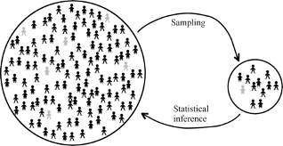
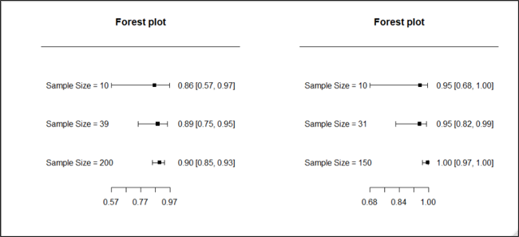
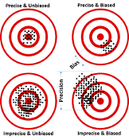
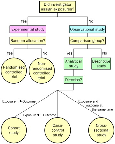
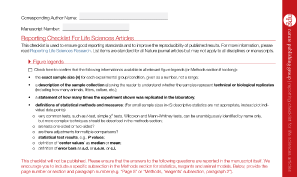

# Lecture 1 

## Introduction

### What is Statistics?

*Statistics is a collection of procedures and principles for gathering data and analyzing information in order to help people make decisions when faced with uncertainty*\
- [Utts & Heckard](https://www.amazon.ca/Statistical-Methods-Internet-Companion-Statistics/dp/0495122505) in 'Statistical Ideas & Methods'

### A Motivating Example

```{r 1_9, echo=FALSE,out.width='50%'}

```

[News Clip](http://www.bbc.com/news/av/technology-41114587/selfie-app-spots-early-signs-of-pancreatic-cancer) [Manuscript](https://ubicomplab.cs.washington.edu/pdfs/biliscreen.pdf)

-   Pancreatic cancer has a very poor survival rate because it is often detected too late
-   A new app promises to detect early symptoms of jaundice that may go unnoticed typically
-   Should this "test" be adopted into routine practice?

### What was the evidence behind this optimistic headline?

-   In an initial study the app detected cases of "concern" correctly 89.7% of the time, and classified "negative" cases correctly 96.8% of the time
-   The reference test was based on the total serum bilirubin level

### What would a data detective ask?

```{r 1_11, echo=FALSE,out.width='50%'}

```

1.  Are the statistical methods appropriate?
2.  Is the study design appropriate?
3.  Is there information external to the study that affects its interpretation?

### Results reported in the study

```{r, echo=FALSE}
library(knitr)
df<- data.frame(z = c("BiliScreen Positive", "BiliScreen Negative", "Total"), BorderlinezorzElevatedzBilirubin = c("35 (89.7%)", 4, 39), NormalzBilirubin= c(1,"30 (96.8%)",31))
df2=head(df)
knitr::kable(df2, col.names = gsub("[z]", " ", names(df)))
```

-   The statistics of interest when evaluating a diagnostic test are
    -   Sensitivity = Probability(Positive result \| Reference test positive) = 89.7%
    -   Specificity = Probability(Negative result \| Reference test negative) = 96.8%
-   Do these data provide good estimates of BiliScreen accuracy?

### Evaluating the quality of the statistical methods

```{r 1_13, echo=FALSE,out.width='50%'}

```

-   Is the study large enough?
-   What is the uncertainty around the reported results?
-   Were relevant statistics recorded?
-   Do the statistics provided help make a decision about the next step?

### What if the sample size were smaller?

```{r, echo=FALSE}
library(knitr)
df<- data.frame(z = c("BiliScreen Positive", "BiliScreen Negative", "Total"), BorderlinezorzElevatedzBilirubin = c("9 (90%)", 1, 10), NormalzBilirubin= c(0,"10 (100%)",10))
df2=head(df)
knitr::kable(df2, col.names = gsub("[z]", " ", names(df)))
```

### What if the sample size were larger?

```{r, echo=FALSE}
library(knitr)
df<- data.frame(z = c("BiliScreen Positive", "BiliScreen Negative", "Total"), BorderlinezorzElevatedzBilirubin = c("180 (90%)", 20, 200), NormalzBilirubin= c(0,"150 (100%)",150))
df2=head(df)
knitr::kable(df2, col.names = gsub("[z]", " ", names(df)))
```

### Sample Size and Precision

```{r 1_16, echo=FALSE,out.width='100%'}

```

### Evaluating the quality of the statistical methods

-   Notice that **the certainty we have in our conclusions depends on the sample size**. The extreme results were less convincing when the sample size was reduced.
-   What sample size is needed to draw a definitive conclusion? That needs to be determined using appropriate statistical methods to obtain the desired precision. We will study this in Lectures 3 and 6

### Evaluating the quality of the study design

-   Are the subjects in the study representative?
-   Is the reference standard relevant?
-   Are the subjects in the study representative?
    -   Healthy volunteers and patients from a medical centre were used
    -   If the test accuracy is systematically better or worse in these patients than in patients on whom the test will be used, then the results are biased\
-   Is the reference standard relevant?
    -   Bilirubin level is a measure of jaundice, but not all cases of jaundice have pancreatic cancer
    -   If the accuracy of the test with respect to bilirubin level is systematically different from the accuracy with respect to pancreatic cancer, then our results may be biased

### The role of external (or prior) information

-   Besides the sample size and study design, our conclusions may also be affected by information external to the observed results, for example from a previous study
-   Statistical analyses should take into account the impact of this prior information. We will study how to do so in Lecture 6

## Reducing Bias in Research Studies

### Bias vs. Precision

```{r 1_23, echo=FALSE,out.width='30%'}

```

-   Precision results in a random departure from the true value
-   Bias is a systematic departure from the true value
-   A large sample size can improve precision but not bias. Study design and analysis could reduce bias

### Common study designs used in clinical research

```{r 1_24, echo=FALSE,out.width='30%'}

```

-   An analytical or experimental study can study the relation between an intervention and an outcome
-   A descriptive study, with no control group, cannot

### Randomized Controlled Trial

-   Advantages:
    -   unbiased distribution of confounders;
    -   blinding more likely;
    -   randomisation facilitates statistical analysis.
-   Disadvantages
    -   expensive: time and money;
    -   study subjects not representative;
    -   ethically problematic at times.

### Reducing bias in research studies

-   Different types of bias common in research studies have been enumerated

```{r, echo=FALSE}
library(knitr)
df<- data.frame(Type_of_bias = c("Selection bias", "Measurement bias", "Detection bias","Confounding"), Description = c("Sampling method results in sample not representative of the population", "Measurement method records outcome with systematic error", "Measurement method differs between groups being compared","Risk factors distributed unequally in groups being compared"), Possible_Remedial_Measures= c("Random sampling Statistical modeling","Statistical modeling","Blinding","Randomization Statistical modeling"))
df2=head(df)
knitr::kable(df2, col.names = gsub("[_]", " ", names(df)))
```

-   Statistical methods are often used to reduce bias, either at the planning stage of a study or at the analysis stage
-   In this lecture, we will look at random sampling and randomization. In Lecture 12 we will look at adjustment via regression

### A second motivating example: Renal Denervation

```{r 1_28, echo=FALSE,out.width='50%'}
knitr::include_graphics('./1_28.png')
```

[Image Source](https://www.terumo.com/about/pressrelease/2013/20130408.html)

-   A surgical procedure called "renal denervation" was developed to help people with hypertension who do not respond to medication.

### Example 4a: Results from a cohort study of renal denervation$^*$

```{r, echo=FALSE}
library(knitr)
library(kableExtra)
df<- data.frame(Number_of_patients = c(153), Blood_pressure = c("176/98 [systolic/diastolic (mmHg) Mean]"),Number_of_Patients = c(135),Change_in_blood_pressure=c("-25/-11 [systolic/diastolic (mmHg) Mean]"))
df2=head(df)
knitr::kable(df2, col.names = gsub("[_]", " ", names(df))) %>%
  kable_styling("striped") %>%
  add_header_above(c("Baseline" = 2, "3-month follow-up"=2))
```

$^*$Investigators Symplicity HTN-1. Catheter-based renal sympathetic denervation for resistant hypertension: durability of blood pressure reduction out to 24 months. Hypertension 2011;57(5):911-917.

-   Can the large observed change be interpreted as being caused by renal denervation?
-   This is an example of a before-after design that reports on change over a period of time, typically the change after an intervention.
-   The primary drawback of this design is the lack of a control group.
-   The observed change may simply be attributable to the participation in the study ('Hawthorne effect'). If so, then the same magnitude of change in the blood pressure would be observed in the control group. This would mean that the change was not due to renal denervation at all.
-   Therefore this study cannot provide proof that renal denervation causes a decline in blood pressure.
-   Another issue in the data presented here is that the variability around the mean change is not available. So we don't know if all patients experienced this benefit.

### Example 4b: Results compared to a control group$^*$

```{r 1_31, echo=FALSE,out.width='100%'}
knitr::include_graphics('./1_31.png')
```

```{r, echo=FALSE}
library(knitr)
library(kableExtra)
df<- data.frame(z = c("Renal Denervation", "Control group*"),Numberzofzpatients = c(45,5), Bloodzpressure = c("176/98 [systolic/diastolic (mmHg) Mean]","173/98 [systolic/diastolic (mmHg) Mean]"),NumberzofzPatients = c(39,3),Changezinzbloodzpressure=c("-21/-10 [systolic/diastolic (mmHg) Mean]","+2/+3 [systolic/diastolic (mmHg) Mean]"))
df2=head(df)
knitr::kable(df2, col.names = gsub("[z]", " ", names(df))) %>%
  kable_styling("striped") %>%
  add_header_above(c(" "=1,"Baseline" = 2, "3-month follow-up"=2))
```

$^*$Patients excluded from renal denervation arm for anatomical reasons

[$^*$Catheter-based renal sympathetic denervation for resistant hypertension: a multicentre safety and proof-of-principle cohort study](https://www-sciencedirect-com.proxy3.library.mcgill.ca/science/article/pii/S0140673609605663)

-   The control group was of patients who were excluded for anatomical reasons.
-   It is possible that, the control group may not have had the same risk of resistant hypertension as the treatment group, i.e. the 'anatomical reasons' were a confounding factor. This may explain why the control group had a worse mean change in blood pressure than the renal denervation group
-   Therefore, once again, we don't have a conclusive result.
-   Of course, the small size of the control group also does not help. Other concerns in this study include loss to follow-up. Only 18 patients completed the follow-up of 24 months.

### Example 4c: Results from a randomized controlled trial (RCT) of renal denervation$^*$

```{r, echo=FALSE}
library(knitr)
library(kableExtra)
df<- data.frame(z = c("Renal Denervation", "Control*"),Numberzofzpatients = c(49,51), Bloodzpressure = c("178/96 [systolic/diastolic (mmHg) Mean]","178/97 [systolic/diastolic (mmHg) Mean]"),NumberzofzPatients = c(49,51),Changezinzbloodzpressure=c("-32/-12 [systolic/diastolic (mmHg) Mean]","+1/0 [systolic/diastolic (mmHg) Mean]"))
df2=head(df)
knitr::kable(df2, col.names = gsub("[z]", " ", names(df))) %>%
  kable_styling("striped") %>%
  add_header_above(c(" "=1,"Baseline" = 2, "6-month follow-up"=2))
```

$^*$\*Esler MD, Krum H, Sobotka PA, Schlaich MP, Schmieder RE, Bohm M. Renal sympathetic denervation in patients with treatment-resistant hypertension (The Symplicity HTN-2 Trial): a randomised controlled trial. Lancet 2010;376(9756):1903-1909

-   The study concluded there was a statistically significant (p\<0.001) difference between the intervention and control groups
-   The randomization procedure gives us greater confidence in these results as patients had the same risk of a change in BP at the time of randomization
-   However, the study was not perfect. Importantly, it was not blinded and the main outcome was office BP rather than ambulatory BP. Therefore, it is possible that the patients in the renal denervation arm reacted differently owing to the greater attention they received.
-   Also, the follow-up of 6-months is very short and it is unknown whether the observed drop in BP is sustained in the long term.

### Example 4d: Results from a second randomized controlled trial of renal denervation$^*$

```{r 1_36, echo=FALSE,out.width='50%'}
knitr::include_graphics('./1_36.png')
```

-   "A significant change from baseline to 6 months in office systolic blood pressure was observed in both study groups.

The between-group difference (the primary efficacy end point) did not meet a test of superiority with a margin of 5 mm Hg.

The bars indicate standard deviations."

-   The second RCT improved on the first one by using a sham procedure in the control group. This removed the concern about blinding.
-   They found that there was no significant difference between the renal denervation and control groups.

$^*$Bhatt et al. A controlled trial of renal denervation for resistant hypertension. N Engl J Med 2014;370:1393-401. DOI: 10.1056/NEJMoa1402670

### Example 4: Renal Denervation as a treatment for resistant hypertension

-   An early study suggested that renal denervation (which uses radiotherapy to destroy some nerves in arteries feeding the kidney) reduces blood pressure. In that experiment, patients who received surgery had an average improvement in systolic blood pressure of 33 mmHg more than did control patients who received no surgery.
-   Later an experiment was conducted in which patients were randomly assigned to one of two groups. Patients in the treatment group received the renal denervation surgery. Patients in the control group received a sham operation in which a catheter was inserted, as in the real operation, but 20 minutes later the catheter was removed without radiotherapy being used. These patients had no way of knowing that their operation was a sham. The rates of improvement in the two groups of patients were nearly identical.(Samuels 10-11)

### Lessons learnt from renal denervation example

-   A control group is necessary to draw conclusions about the effect of a variable
-   However, a randomized design is necessary to make a cause-effect conclusion
-   A randomized, controlled trial is not automatically unbiased. Blinding is necessary

### Health Technology Assessment of Renal Denervation

-   The MUHC's Technology Assessment Unit evaluated Renal Denervation in 2013. The full report is available [here](https://www.mcgill.ca/tau/files/tau/muhc_tau_2013_72_renald.pdf)
-   We concluded:\
    "... There is evidence, based mainly on observational data that this procedure results in a clinically significant reduction in blood pressure at 6 months. Weaker evidence suggests that the effect is sustained up to 2 years of follow-up. Some side-effects, none unmanageable or permanent, are reported.

It is recommended that this technology receive temporary (two-year) and conditional approval for use only in the context of a formal research study to be supported by the manufacturer as specified."

## Random sampling and Randomization

### Sample surveys

-   A sample survey is a type of observational study
-   In a **sample survey** a subgroup of a larger population is studied. Ideally, we wish to use methods to draw a representative sample to avoid bias
-   **Surveys** are preferred because they are less expensive and time consuming than a census (or complete enumeration of a population)

### Simple random sample

-   A **simple random sample** is a sample of n items in which
    -   every member of the population has an equal chance of being included,
    -   members are chosen independently from each other
-   The word random does not mean haphazard. Rather, it refers to a well-defined process whose outcomes are not fixed but are determined by a probability distribution

### Sample surveys\*

-   Interestingly, if you use commonly accepted methods, a sample of size 1500 would be adequate to gauge the percentage of a population who have a certain trait or opinion to within ±3%
-   Further, this result does not depend on the size of the population. A sample size of 1500 is adequate whether the population size is 10 million or 4 billion, as long as a proper sampling technique has been used

### Margin of error

-   An obvious question is: how close is a sample estimate to the true value?
-   The central limit theorem (which we will study in Lecture 3) we know that the margin of error around the sample mean is proportional to $\frac{\sigma}{\sqrt n}$, where $\sigma$ is the standard deviation and n is the sample size

### How to choose a simple random sample

-   Create a sampling frame by listing all members of the population
-   Find a method to randomly select from among these
    -   e.g. a physical method, e.g. placing the names of members of the population in an opaque bowl and drawing the required number
    -   e.g. a virtual method with a computer, e.g. using the sample() function in R
-   The chosen members constitute the sample

### Example: Drawing a random sample

```{r 1_48, echo=FALSE,out.width='50%'}
knitr::include_graphics('./1_48.png')
```

-   A respiratory researcher wants to estimate the amount of inflammation in the parenchyma of a mouse lung.
-   She takes an image of a histological slide of the lungs of the mouse with staining of the inflammatory cells of interest.
-   She divides the images in a grid of 100 rectangular areas, but excludes 10 areas because they include airways.
-   She then counts the number of inflammatory cells in 40 areas randomly selected out of the remaining 90 areas
-   What was the sampling frame in this study, and how did it differ from the population of interest?
-   Explain why "using the wrong sampling frame" might lead to a biased estimate.
-   Use R to propose to the researcher which rectangular areas she needs to study.

### Practical concerns when random sampling

-   For practical reasons, it may not be possible to obtain a simple random sample because it may not be possible to enumerate the entire population
    -   e.g. how would we enumerate the population of people who need to be screened by Biliscreen?
-   Then, it would be important to identify the population, and scrutinize the method of selection to ensure that the resulting sample satisfies the definition of a simple random sample
-   Other sampling techniques such as **cluster sampling** or **stratified random sampling** may be easier to implement

### Some typical biases that can arise during a survey

-   **Selection bias**: Due to selecting non-representative sample
-   **Non-response (or missingness bias)**: Arises when a representative sample was chosen but a subset could not or did not provide responses, e.g. a survey conducted during the evening would miss individuals who were working at that time
-   **Response bias**: Occurs when participants respond differently from how they feel, e.g. response to sensitive questions such as smoking habits

### Randomization

-   Random sampling can also be used in the context of an experiment, such that each subject has the same probability of receiving the different treatments under study
-   Randomization ensures that any observed or unobserved confounding variables have a similar distribution in each treatment group

### Simple randomization

-   Like with random sampling, there are different techniques we can use to carry out randomization to a treatment group
-   In **simple randomization**, subjects are assigned to groups based on a single sequence of random assignments
    -   e.g. If there are two treatments, we can toss a coin to determine how to assign each patient recruited into the study (Heads -- Treatment, Tails -- Control)
    -   Instead of a coin you can use a computer to generate the random sequence
-   This method is suitable when the planned sample size is relatively large and the subjects to be sampled are relatively homogenous

### Relevance of statistical methods to researchers in the life sciences

```{r 1_53, echo=FALSE,out.width='50%'}
knitr::include_graphics('./1_53.png')
```

[Nandini Dendukuri, McGill University](https://www.nature.com/news/poorly-designed-animal-experiments-in-the-spotlight-1.18559)

-   Medical research is increasingly quantitative. Simultaneously, there is a move towards evidence-based medicine
-   Statistical methods are necessary for designing and analyzing research studies that can answer relevant questions
-   Knowledge of statistics is necessary for interpreting research publications

### Organizations supporting transparent reporting of biomedical research & evidence-based decision making

```{r 1_54a, echo=FALSE,out.width='100%'}
knitr::include_graphics('./1_54a.png')
```

```{r 1_54b, echo=FALSE,out.width='30%'}

```

```{r 1_54c, echo=FALSE,out.width='30%'}
knitr::include_graphics('./1_54c.png')
```

### Biomedical journals are insisting on appropriate statistical methods

```{r 1_55, echo=FALSE,out.width='100%'}

knitr::include_graphics('./1_56.png')
```

### FEV Example: Dataset

```{r, echo=FALSE}
library(knitr)
library(kableExtra)
df<- data.frame(id = c(1,2,3,4,5,6),age=c(9,8,7,9,9,8),fev=c(1.708,1.724,1.72,1.558,1.895,2.336),ht=c(57,67.5,54.5,53,57,61),sex=c(0,0,0,1,1,0),smoke=c(0,0,0,0,0,0))
df2=head(df)
knitr::kable(df2) %>%
  kable_styling("striped") %>%
  add_header_above(c("First few rows of FEV dataset"=6))
```

-   The variables in the dataset include the following:
    -   fev (in liters)
    -   age (in years)
    -   height (in inches)
    -   gender (M/F)
    -   smoke (Y/N)
