# Lecture 2: Types of Variables, Probability and Probability Distributions
## Types of variables 
* A variable is a characteristic of a person or a thing that can be assigned a number or a category
    + Age and sex are two variables that can be measured on a person
* Variables can be of different types

```{r, echo=FALSE}
library(knitr)
df<- data.frame(Qualitative = c("Nominal","Ordinal"),Quantitative=c("Continuous","Discrete/Ordinal"))
kable(df)
```

* We need to distinguish between different types of variables because the statistical methods employed – whether descriptive or inferential - to study them depend on the type of variable we have studied

### Some questions on types of variables
* Click on this [link](https://forms.office.com/Pages/ResponsePage.aspx?id=cZYxzedSaEqvqfz4-J8J6vtaSwoU68FCgvKfzwN_XcBURFJJUTFWN05JRTJGRzU0WUw3MzIwMlJEUy4u) to answer a few questions on types of variables 

### Qualitative variables
* Qualitative variables are categorical and not measured on a numerical scale
    + Nominal variables do not have a particular ordering
        - Blood type of a person: A, B, AB, O
        - Sex of a fish: male, female
        - Research interest of students in EXMD 634: 
                 Cell Biology, Immunology, Cancer, ...
* Qualitative variables are categorical and not measured on a numerical scale
    + Ordinal variables do have a particular ordering, but the gap between successive categories is not measureable and may not be equal
        - Likert-type scale:
```{r 2_6, echo=FALSE,out.width='50%'}
knitr::include_graphics('./2_6.png')
```
        - Age in categories:
            + Infants, Toddlers, Gradeschoolers, Adolescents
* Quantitative variables are measured on a numerical scale that allows us to measure the interval between any two observations
    + Continuous variables can take decimal values
        - Age of a patient
        - Cholesterol concentration in a blood specimen
        - Optical density of a solution
    + Discrete/Ordinal variables are reported as integers
        - Number of bacteria colonies in a petri dish
        - Number of cancerous lymph nodes detected in a patient
        - Length of a DNA segment in basepairs
* The distinction between continuous and discrete variables is not a rigid one as measurements can be rounded off.
    e.g. age or birth weight can be reported as integers 
* In practice, if the number of unique integer values observed is small (say <10), then we would treat the quantitative variable as discrete/ordinal

## Probability
* The conclusions of a statistical data analysis are often stated in terms of probability
* Probability models allow us to quantify how likely, or unlikely, an experimental result is, given certain modeling assumptions
* We will first look at probability and probability distributions for dichotomous and discrete variables, before proceeding to continuous variables

### Definitions
* A probability is a numerical quantity that expresses the likelihood of an event
* The probability of an event E may be written as P(E) 
* P(E) is always a number between 0 and 1, inclusive. May also be expressed as a percentage 
* The higher the probability, the more certain we are that the event will occur
* We can speak meaningfully about a probability P(E) only in the context of a **chance operation** or a **chance experiment**—that is, an operation whose outcome is not pre-determined
* The chance operation must be defined in such a way that each time the chance operation is performed, the event E either occurs or does not occur. We refer to the event that E does not occur as E complement ($E^c$)
* The sample space enumerates all the possible events that a chance experiment gives rise to. The sum of their probabilities is 1

### Example 1: Coin Tossing    
* Consider the familiar chance operation of tossing a coin. The sample space is {Heads, Tails}. That means each time the coin is tossed, either it falls heads or Tails 
* Define the event E:Heads. If the coin is fair (i.e. equally likely to fall heads or tails), then P(E) = 1/2 = 0.5 
* If the coin is not fair (perhaps because it is slightly bent), then P(E) will be some value other than 0.5, e.g. P(E) = 0.6, suggesting it is more likely to see a head than a tail

### Example 2: Coin Tossing again
* Consider the event
		E: 3 heads in a row 
* The chance operation that could give rise to this event is “Toss a coin 3 times”
* Notice that the sample space is now larger than when the operation was made of a single toss
* The sample space is now
{HHH, HHT, HTH, HTT, THH, THT, TTH, TTT}
where H denotes Heads and T denotes Tails
* Assuming we have a fair coin, the probability of each of the 8 outcomes in the sample space is equally likely
* Therefore, P(E) = 1/8

### Interpretation of probability
* How do we know P(Heads)=0.5 for a fair coin?
* For one, we know that there are two possible events resulting from a coin toss both of which are equally likely
* Another interpretation arises when a chance operation can be observed repeatedly. Then P(E) can be interpreted as the relative frequency of occurrence of E in an indefinitely long series of repetitions of the chance operation

### Relative frequency interpretation of probability
```{r 2_16, echo=FALSE,out.width='50%'}
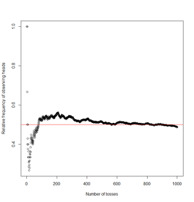
```

```{r, echo=FALSE}
library(knitr)
df<- data.frame(Number_of_tosses = c(1,2,3,4,5,10,200,500,750,1000),Outcome=c("H","H","T","T","T","H","H","H","H","T"),Cumulative_number_of_heads=c(1,2,2,2,2,4,111,257,378,487),Relative_frequency_of_heads=c(1,1,0.67,0.5,0.4,0.4,0.555,0.514,0.504,0.487))
knitr::kable(df, col.names = gsub("[_]", " ", names(df)))
```

### Subjective interpretation of probability
* It is not always possible to observe events repeatedly. In such cases, probability may be used to represent a subjective or personal degree of belief  

e.g. There is an 80% chance it will rain tomorrow  

e.g. It is believed that culture for  M. tuberculosis in children has a <2% chance of being falsely positive 

* There are very few restrictions place on personal probabilities besides that they must be coherent
    + e.g. If you say there is an 80% chance it will rain tomorrow, then you should also agree that there is a 20% chance it will not rain tomorrow
* Different individuals can have different personal probabilities, and may not necessarily agree, 
    + e.g. members on a job interview committee may different views on the probability of a client being suitable

### Compound events
* A compound event is defined by the joint occurrence of three simple events
    + e.g.  Obtaining three heads on three successive tosses of a coin
    + e.g.  Obtaining a true positive diagnostic test result for tuberculosis
* The different simple events may be independent or dependent
    + Each toss of a coin is independent of the previous toss
    + The probability of a positive result on a diagnostic test is dependent on whether the patient has the disease

### Some questions on probability
* Click on this [link](https://forms.office.com/Pages/ResponsePage.aspx?id=cZYxzedSaEqvqfz4-J8J6vtaSwoU68FCgvKfzwN_XcBUQTRINzBERUowMVJVRjVTVzVXNzdFUUY1Ti4u) to answer a few questions on probability 

###  Combining probabilities: Addition rules
```{r 2_21, echo=FALSE,out.width='50%'}
knitr::include_graphics('./2_21a.png')
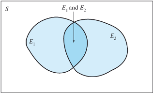
```

* When two events are independent (top panel) then 

\[P\{E1 \space or \space E2\} = P\{E1\} + P\{E2\}\]

* When two events are dependent (bottom panel)

\[P\{E1 \space or \space E2\}  = P\{E1\} + P\{E2\} - P\{E1 \space and \space E2\}\]

### Combining probabilities: Multiplication rules
```{r 2_22, echo=FALSE,out.width='50%'}
knitr::include_graphics('./2_22a.png')
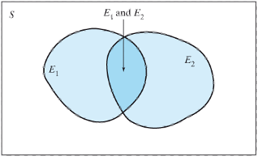
```

* When two events are independent (top panel) then 

\[P\{E1 \space and \space E2\} = P\{E1\} × P\{E2\}\]

* When two events are dependent (bottom panel)

    \[P\{E1 \space and \space E2\} = P\{E1\} × P\{E2|E1\} = P\{E2\} × P\{E1|E2\}\]

### Conditional probability
* P(E2|E1) is the conditional probability of E2 given E1, it is interpreted as the probability of observing E2 given that E1 has occurred

\[P(E2|E1) = \frac{P(E_1 \space and \space E_2)}{P(E_1)}\]

### Probability Trees
* Often it is useful to depict a probability problem using a probability tree
* The following slides depict how we can enumerate the events in the sample space that arises from independent events, and how we can then calculate the corresponding probabilities of each event using probability rules

### Example 3: Independent events
* If two carriers of the gene for albinism marry, each of their children has probability 1/4 of being albino. 
* The chance that the second child is albino is the same (1/4) whether or not the first child is albino; similarly, the outcome for the third child is independent of the first two, and so on.
* We can use a probability tree to enumerate the sample space and corresponding probabilities

### Albinism example
```{r 2_26, echo=FALSE,out.width='50%'}
knitr::include_graphics('./2_26.png')
```

* Suppose two carriers of the gene for albinism marry and have two children. Then the probability that both of their children are albino is

\[P\{AA\} 
    = 0.25 × 0.25
    = 0.0625\]
    
### Albinism example: Sample space and probabilities
```{r, echo=FALSE}
library(knitr)
df<- data.frame(Number_of_Albino_children=c(2,1,0,"Total"),Probability=c("$0.25^2 = 0.0625$","$2 \\times 0.25 \\times 0.75 = 0.375$","$0.75^2 = 0.5625$",1))
df2=head(df)
knitr::kable(df2, col.names = gsub("[_]", " ", names(df)))
```

### Example 4: Medical testing
* The following is based on a scenario a statistician, David Eddy, (1982) posed to a 100 physicians* (see full text [here](http://personal.lse.ac.uk/robert49/teaching/mm/articles/Eddy1982_ProbReasoningInClinicalMedicine.pdf)):
* One of your patients has a lump in her breast. You are almost certain that it is benign, and believe there is only a 1% chance that it is malignant. Just to be sure you have the patient undergo a mammogram. Sadly for your patient the mammogram is positive. 
* Suppose that the mammogram has the following characteristics 
    + P{Testing positive | Person has disease} = Sensitivity = 80%
    + P{Testing negative | Person does not have disease} = Specificity = 90% 
* What is the probability that a randomly chosen woman will test positive on a mammogram? What are the chances the lump is truly malignant?

### Medical testing example
```{r 2_29, echo=FALSE,out.width='50%'}
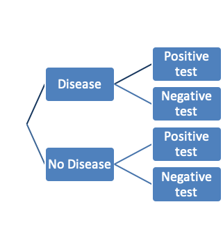
```

* The sample space is {D+T+, D+T-, D-T+, D-T-}
* The probability of a positive test  

= P{true positive} + P{false positive}

= Pr{D+T+} + P{D-T+}

= 0.01 × 0.8 + 0.99 × 0.1

= 0.107

* Probability that a person truly has the disease given they are positive

= P{D+ | T+}

= P{D+ and T+}/P{T+}

= (0.01 × 0.8)/(0.01 × 0.8 + 0.99 × 0.1)

= 0.075

The above expression is formally referred to as Bayes Theorem

## Probability Distributions
* A **probability distribution** is a mathematical function that provides the probabilities of occurrence of different possible values of a random variable
    + It follows the probability rules we studied earlier, e.g. the sum of the probabilities of all possible values of a random variable is 1
* A very large number(100s?) of probability distributions have been described – but we tend to use a much smaller number in common applications

### Population and sample$^*$
```{r 2_33, echo=FALSE,out.width='50%'}
knitr::include_graphics('./2_33.png')
```

$^*$From text by Ekstrom and Sorensen

### Notation
```{r 2_34, echo=FALSE,out.width='50%'}
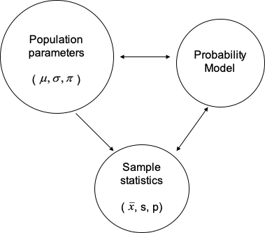
```

### Parameters, Statistics, Probability Distributions
* A **parameter** is a number that describes the **population**. A parameter is a fixed number; but in practice we do not know its value.
* A **statistic** is a number that describes a **sample**. The value of a statistic is known when we have taken a sample, but it can change from sample to sample. We often use a statistic to estimate an unknown parameter
* The **probability distributions** we will study in this lecture are examples of **probability models** that help us to make inference about the population based on observed statistics

### Binomial Distribution
* Both the coin toss and the albinism examples were examples of random variables following a Binomial distribution. These variables are characterized by:
    + **Binary outcomes**: There are two possible outcomes for each trial (success and failure).
    + **Independent trials**: The outcomes of the trials are independent of each other.
    + **n is fixed**: The number of trials, n, is fixed in advance.
    + **Same value of $\pi$**: The probability of a success on a single trial is the same for all trials.

### Binomial Distribution Function
Whereas both examples we looked at had n=2 trials, and were easy to illustrate with a probability tree, we can write a more general expression for the probability of k successes in n independent trials as follows

\[Pr\{k|n,\pi\} = \frac{n!}{k!(n-k)!}\pi^k(1-\pi)^{n-k}\]

### Albinism example for a couple with 5 children: Sample space and probabilities 
```{r, echo=FALSE}
library(knitr)
df<- data.frame(Number_of_Albino_children=c(0,1,2,3,4,5),Probability_expression=c("$(1-\\pi)^5$","$5\\pi(1-\\pi)^4$","$10\\pi^2(1-\\pi)^3$","$10\\pi^3(1-\\pi)^2$","$5\\pi^4(1-\\pi)$","$\\pi^5$"),Probability_rounded_value=c(0.24,0.40,0.26,0.09,0.01,0))
df2=head(df)
knitr::kable(df2, col.names = gsub("[_]", " ", names(df)))
```

These probabilities may be obtained from R with the following command:

dbinom(x=seq(0,5),size=5,prob=0.25)

### Probability distributions in R
* One of the main advantages of R is that it has several functions related to statistical probability distributions that can be used to:
    + Obtain a random sample from a distribution
    + Calculate the density function
    + Calculate the cumulative probability
    + Obtain quantiles of the distribution
    
```{r, echo=FALSE}
library(knitr)
df<- data.frame(Distribution=c("Binomial","Gamma","Poisson","Normal"),Random_Sample=c("rbinom","rgamma","rpois","rnorm"),Density_function = c("dbinom","dgamma","dpois","dnorm"), Cumulative_probability_function = c("pbinom","pgamma","ppois","pnorm"),Quantiles=c("qbinom","qgamma","qpois","qnorm"))
df2=head(df)
knitr::kable(df2, col.names = gsub("[_]", " ", names(df)))
```    

### Example: Binomial distribution in practice$^*$
* The assumptions behind the use of the Binomial distribution may not always be satisfied in practice. For example:
* Let X represent the number of females in four children, among all couples in Canada with exactly four children
* The “Real World” data and the data predicted by a Binomial distribution model with n=4 and $\pi=0.5$ are given on the following page, i.e. the predicted proportion was given by

\[Pr\{X=k\} = \frac{4!}{k!(4-k)!}\pi^k(1-\pi)^{4-k}\]

```{r, echo=FALSE}
library(knitr)
df<- data.frame(X=c(0,1,2,3,4),Predicted_proportion_obtained_using_dbinom_in_R=c(0.0625,0.25,0.375,0.25,0.0625),Observed_proportion=c(0.08,0.26,0.31,0.27,0.08))
df2=head(df)
knitr::kable(df2, col.names = gsub("[_]", " ", names(df)))
```   

* Why do you think the observed values differ (slightly) from those predicted by a Binomial model?
* Which assumptions of the Binomial model may be violated here?

$^*$From Lawrence Joseph’s notes

### Mean and variance of random variables
Let X be a discrete random variable taking values $\{x_1, x_2, …, x_n\}$ with probabilities $\{p_1, p_2, …, p_n\}$, respectively

* Population mean (or expectation) of a discrete random variable $=E(X)=\sum_{i=1}^nx_ip_i$
* Population variance of a discrete random variable $=\sum_{i=1}^n(x_i-E(X))^2p_i$

### Mean and variance for a Binomial distribution
```{r 2_44, echo=FALSE,out.width='50%'}
knitr::include_graphics('./2_44.png')
```

* Let X be a Binomial variable with n trials and probability of success $\pi$
* $E(X)=n\pi=5\times 0.25=1.25$
* $Var(X)=n\pi(1-\pi)=5\times 0.25\times 0.75 = 0.9375$

Therefore, standard deviation of X = 0.968

### Probability of a continuous variable
```{r 2_45, echo=FALSE,out.width='50%'}
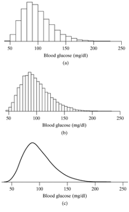
```

* We can think of the relative frequency histogram of a continuous variable as an approximation of the underlying true population distribution from which the data came.
* A smooth curve representing a frequency distribution is called a probability density function
* On the x-axis we have different possible values of the variable (i.e. the sample space). On the y-axis we have the probability density corresponding to each value of the variable.

### Probability density function for a continuous variable
```{r 2_46, echo=FALSE,out.width='50%'}
knitr::include_graphics('./2_46a.png')
knitr::include_graphics('./2_46b.png')
```

* If a variable is continuous, then we find probabilities by using the density curve for the variable. 
* The probability that a continuous variable lies in a certain range equals the area under the density curve for the variable between two points
* This means the probability of a single value, say Pr{Y=a}=0. But the $Pr\{a-\delta<Y<a+\delta\}$, where $\delta$ is an infinitesimal quantity is non-zero and equal to the height of the density function at Y=a.
* The area under the entire curve is 1

### Normal Distribution
* The most well know continuous distribution is the Normal (or Gaussian) distribution that is recognizable by its characteristic bell shape
* Probability density function of a continuous variable Y that follows a normal distribution with mean $\mu$ and variance $\sigma^2$

\[f(y|\mu,\sigma^2)=\frac{1}{\sigma\sqrt{2\pi}}exp\left(-\frac{(y-\mu)^2}{2\sigma^2}\right),-\infty<y<\infty\]

### Normal probability density function
```{r 2_48, echo=FALSE,out.width='50%'}
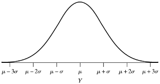
```

* The density function is symmetric about the mean $\mu$ (which also happens to be the median and mode of this distribution
* Though it is defined all the way from $-\infty$ to $\infty$, most of the probability lies in the range $\mu\pm3\sigma$

### Three normal curves with different means and standard deviations
```{r 2_49, echo=FALSE,out.width='50%'}
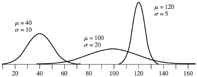
```

### Area under the normal curve
```{r 2_50, echo=FALSE,out.width='50%'}
knitr::include_graphics('./2_50.png')
```

* $Pr\{a<Y<b\}=\int_a^b\frac{1}{\sigma\sqrt{2\pi}}exp\left(-\frac{(y-\mu)^2}{2\sigma^2}\right)$
* The values of the areas under the standard normal distribution (denoted $N(\mu=0, \sigma^2=1))$ were typically published as tables in statistics books
* Today you can use a program like R to calculate this integral

### Example: Distribution of serum cholesterol values
* The serum cholesterol levels of 12- to 14-year-olds follow a normal distribution with mean 155 mg/dl and standard deviation 27 mg/dl. What percentage of 12 to 14-year-olds have serum cholesterol values

a) 137 or less?

b) 186 or less?

c) 164 or more?

d) 100 or more?

e) between 159 and 186?

f) between 100 and 132?

g) between 132 and 159?

```{r 2_52, echo=FALSE,out.width='50%'}
knitr::include_graphics('./2_52.png')
```

Let Y denote the variable serum cholesterol. 

We know the distribution is symmetric about 155mg/dl and that most values of Y will lie between (74, 236)

a) P(Y ≤ 137) = pnorm(q=137,mean=155,sd=27) = 0.252

b) P(Y≥164) = 1 – Pr(Y < 164) = 1 – pnorm(q=164,mean=155,sd=27) = 0.369

c) P(Y≤186) = 0.875

d) P (Y ≥100) = 1 – 0.02 = 0.98

```{r 2_54, echo=FALSE,out.width='50%'}
knitr::include_graphics('./2_54.png')
```

e) between 159 and 186?

P(159 ≤ Y ≤ 186)
= P(Y ≤ 186) – Pr(Y ≤ 159)
= pnorm(186,155,27) 
        - pnorm(159,155,27)

= 0.875 – 0.559
= 0.316

Another way to answer this question is via the z-transformation of Y into a standard normal variable with mean=0 and standard deviation=1

P(159 ≤ Y ≤ 186)
= P( (159-155)/27 ≤ (Y-155)/27 ≤ (186-155)/27 )

= Pr(0.148 ≤ Z  ≤ 1.148)
= Pr(Z  ≤ 1.148) – Pr(Z  ≤ 0.148)

= pnorm(1.148) - pnorm(0.148)
= 0.875 – 0.559
= 0.316

e) between 100 and 132?

P(100 ≤ Y ≤ 132) = 0.176


f) between 132 and 159?

P(132 ≤ Y ≤ 159) = 0.362

### Area under the normal curve
```{r 2_57, echo=FALSE,out.width='50%'}
knitr::include_graphics('./2_57.png')
```

* We can show that the probability of lying within 1 standard deviation of the mean is 0.68, within 2 standard deviations is 95% and within 3 standard deviations is 99.7%

### Mean and variance of the normal distribution
* The expressions for the mean and variance are similar to those for discrete variables, except that the summation sign is replaced by an integral sign
* $Expectation(Y)=\int_{-\infty}^\infty\frac{y}{\sigma\sqrt{2\pi}}exp\left(-\frac{(y-\mu)^2}{2\sigma^2}\right)dy = \mu$
* $Variance(Y)=\int_{-\infty}^\infty\frac{(y-\mu)^2}{\sigma\sqrt{2\pi}}exp\left(-\frac{(y-\mu)^2}{2\sigma^2}\right)dy = \sigma^2$

### Examples of discrete distributions
* Bernoulli distribution
* Binomial distribution
* Poisson distribution
* Negative binomial distribution

### Bernoulli distribution
```{r 2_60, echo=FALSE,out.width='50%'}
knitr::include_graphics('./2_60.png')
```

* X is dichotomous
* Examples: 
    + Single coin toss
    + Observation on an individual patient in a longitudinal study of survival following a treatment
    
Probability density function

\[f(x|\pi)=\pi^x(1-\pi)^{1-x},x=0,1\]

Mean = $\pi$

Variance = $\pi(1-\pi)$

### Binomial distribution
```{r 2_61, echo=FALSE,out.width='50%'}
knitr::include_graphics('./2_61.png')
```

* X is the sum of successes in n independent Bernoulli trials
* Examples: 
    + three coin tosses
    + number of patients who will survive 1 year following a treatment

Probability density function

\[f(x|n,\pi)={n\choose x}\pi^x(1-\pi)^{1-x},x=0,1,...,n\]

Mean = $n\pi$

Variance = $n\pi(1-\pi)$

### Poisson distribution
```{r 2_62, echo=FALSE,out.width='50%'}
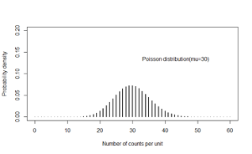
```

* X takes discrete taking values 0, 1, to $\infty$  within a unit of time or space
* Examples
    + Number of downloads of an app in 1 minute
    + Number of cases of cancer reported in a square kilometre

Probability density function

\[f(x\space events|time=t,rate=\lambda)=\frac{exp^{-\mu}\mu^x}{x!},x=0,1,...,\infty\]

Mean = $\mu$

Variance = $\mu$

### Example: Transcriptomic Analyses$^*$
```{r 2_63, echo=FALSE,out.width='50%'}

```

* RNA sequencing is a powerful and commonly used tool to analysis expression data
* The goal of most sequencing experiments is to identify differences in gene expression between biological conditions such as the influence of a disease-linked genetic mutation or drug treatment.

### Underlying statistical principles of commonly used packages
```{r 2_64, echo=FALSE,out.width='50%'}
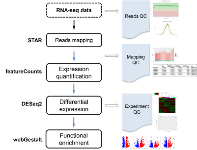
```

### How it works
* In a standard sequencing experiment (RNA-Seq), we map the sequencing reads to the reference genome and count how many reads fall within a given gene (or exon). 
```{r 2_65, echo=FALSE,out.width='50%'}
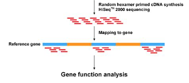
```

=> This means that the input for the statistical analysis are discrete non-negative integers (“counts”) for each gene in each sample. 

### What would be a suitable probability distribution?
* The total number of reads for each sample tends to be in the millions, while the counts per gene vary considerably but tend to be in the tens, hundreds or thousands. 
* The chance of a given read to be mapped to any specific gene is rather small. 
* Discrete events that are sampled out of a large pool with low probability - sounds like a Poisson distribution would be suitable

Problem: The **variability of read counts** in sequencing experiments tends to be **larger than the Poisson distribution allows**.

```{r 2_67, echo=FALSE,out.width='50%'}
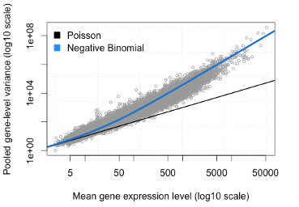
```

* It is obvious that the variance of counts is generally greater than their mean, especially for genes expressed at a higher level. This phenomenon is called “**overdispersion**“. 
* The negative binomial distribution can model the greater variance

### Poisson Distribution is limiting
* The Poisson distribution makes the restrictive assumption that the mean of the distribution is equal to its variance
* In terms of RNA-seq, Poisson distribution implies that for a certain gene, its expression profile follows a distribution with a mean expression equal to the variance in expression
* Empirical observations show that for highly expressed genes at least, this is not the case even in biological replicates
* Another degree of variation that removes this restriction

### Negative Binomial Distribution
* The NB distribution is similar to a Poisson distribution but has an extra parameter (α) called the “clumping” or “dispersion” parameter => **More variance**

\[\sigma^2=\mu+\alpha\mu^2\]

* The NB distribution can be defined as a **Poisson-Gamma mixture distribution**
* This means that the NB distribution is a weighted mixture of Poisson distributions where the rate parameter (i.e. the expected counts) is itself associated with uncertainty following a Gamma distribution

### Conceptual Justification
* When comparing samples of different conditions we usually have multiple independent replicates of each condition.
* Such replicates are called **“biological”** replicates because they come from independent animals, dishes, or cultures. 
* Splitting a sample in two and running it through the sequencer twice would be a **“technical”** replicate.
* In general, there is more variance associated with biological replicates than technical replicates. 
* As a result, the Poisson process in each biological replicate has a slightly different expected count parameter. 

### Additional Notes and Practical Implications
* In a standard sequencing experiments, we have to be content with few biological replicates per condition due to the high costs associated with sequencing experiments and the large amount of time that goes into library preparations.
* Modern RNA-Seq analysis tools such as [DESeq2](https://bioconductor.org/packages/release/bioc/html/DESeq2.html) and [edgeR](https://bioconductor.org/packages/release/bioc/html/edgeR.html) combine the gene-wise dispersion estimate with an estimate of the expected dispersion rate based on all genes. 
* This **Bayesian “shrinkage”** of the variance has emerged as a powerful technique to mitigate the shortcomings of having few replicates.

### Examples of continuous distributions
* Normal distribution
* Uniform distribution
* Student’s t-distribution
* Gamma distribution
* Beta distribution

### Normal distribution
```{r 2_73, echo=FALSE,out.width='50%'}
knitr::include_graphics('./2_73.png')
```

* X is continuous and symmetrically distributed over a range that lies between $-\infty$ to $\infty$
* Example: 
    + blood pressure
    + body mass index
    
Probability density function

$f(x|\mu,\sigma^2)=\frac{1}{\sigma\sqrt{2\pi}}exp\left(-\frac{(x-\mu)^2}{2\sigma^2}\right),-\infty<x<\infty$

Mean = $\mu$

Variance = $\sigma^2$

### Uniform distribution
```{r 2_74, echo=FALSE,out.width='50%'}
knitr::include_graphics('./2_74.png')
```

* X is continuous and equally likely to take values in the range (a,b)
* In the standard Uniform distribution, a=0, b=1
* Example: 
    + X is a probability, such as disease prevalence or sensitivity of a test
