# Lecture 3: Central Limit Theorem and Inference for Means
## Mean and Standard Deviation 
### Descriptive statistics vs. Inferential Statistics
```{r 3_3, echo=FALSE,out.width='50%'}
knitr::include_graphics('./3_3.png')
```

* Descriptive statistics help to describe the characteristics of the sample gathered
* Inferential statistics help to use these characteristics to draw conclusions about the target population

### Some commonly encountered shapes of distributions of a variable
```{r 3_4, echo=FALSE,out.width='50%'}
knitr::include_graphics('./3_4.png')
```

### Descriptive statistics: Notation
* We use capital letters to denote a variable, and small letters to denote the values it takes. For example,
    + X = FEV (the variable),
    + x = 0.793 litres (an observed value)
* $\sum_{i=1}^nx_i$ means the sum of the observed values x on a sample of size n. $x_i$ is the observed value for the $i^{th}$ subject in the sample
* The next few slides list common measures of central tendency and spread

### Histogram of FEV
```{r 3_6, echo=FALSE,out.width='50%'}
knitr::include_graphics('./3_6.png')
```

### Measures of central tendency
```{r 3_7, echo=FALSE,out.width='100%'}
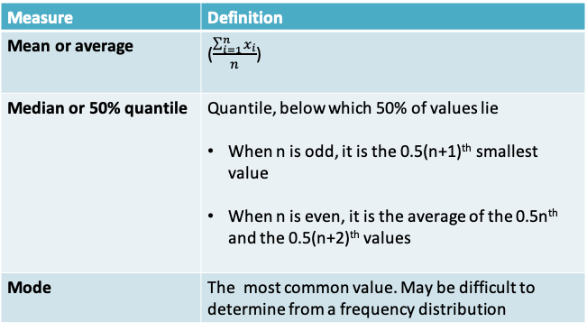
```

### Summary of FEV variable
```{r 3_8, echo=FALSE,out.width='100%'}
knitr::include_graphics('./3_8.png')
```

For a symmetric distribution, the median=mean. 

The values above suggest that the distribution of FEV may be slightly skewed to the right as the mean is higher than the mode

### Robustness
* A statistic is said to be **robust** if the value of the statistic is relatively unaffected by changes in a small portion of the data, even if the changes are dramatic ones. The median is a robust statistic, but the mean is not robust because it can be greatly shifted by changes in even one
* **Example:**  In the FEV dataset, I replaced the last observation in the dataset of 3.211 by 6.211, an extreme value. This resulted in increasing the mean from 2.637 to 2.641 but the median remained at 2.548
* If the frequency distribution is skewed, both measures are pulled toward the longer tail, but the mean is usually pulled farther than the median 

### Mean vs. Median
* In some situations the mean makes very little sense. Suppose, for example, that the observations are survival times of cancer patients on a certain treatment protocol, and that most patients survive less than 1 year, while a few respond well and survive for 5 or even 10 years. In this case, the mean survival time might be greater than the survival time of most patients; the median would more nearly represent the experience of a “typical” patient. Note also that the mean survival time cannot be computed until the last patient has died; the median does not share this disadvantage. Situations in which the median can readily be computed, but the mean cannot, are not uncommon in bioassay, survival, and toxicity studies
* An advantage of the mean is that in some circumstances it is more efficient than the median. Efficiency is a technical notion in statistical theory; roughly speaking, a method is efficient if it takes full advantage of all the information in the data. Partly because of its efficiency, the mean has played a major role in classical methods in statistics

### Quantiles
* Quantiles (also known as percentiles) help to demarcate different points of the distribution of a continuous variable
* The q% quantile is the number below which q% of observed values lie
* For example
    + The 10% quantile of FEV is the value below which 10% of FEV values lie = 1.612  
    = $0.1n^{th}$ lowest value of FEV

### Measures of spread
```{r 3_12, echo=FALSE,out.width='100%'}
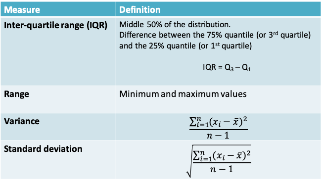
```

### Summary of FEV variable
```{r 3_13, echo=FALSE,out.width='100%'}
knitr::include_graphics('./3_13.png')
```

### Comparison of measures of spread
```{r 3_14, echo=FALSE,out.width='100%'}
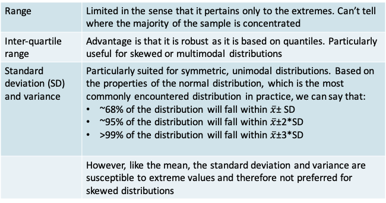
```

### Variance and Standard Deviation
* The standard deviation is more commonly reported than the variance because it is in the same units as the variable X and the mean of X
* Notice that we use the sum of the squared deviations. This is because the sum of the deviations themselves will always be 0. We need a way to get rid of the signs of the deviations. Alternatives to taking the squares include taking the absolute value. But squares are more popular because of their mathematical properties
* Why do we divide by n-1 rather than n? We do so because we are measuring the deviation from a quantity that is also defined using the sample, i.e. $\bar x$. It is as if we must penalize the sample size to correct for this. If we knew the true population mean (µ), then we would divide by n instead:

\[Population\space variance = \frac{\sum_{i=1}^n(x_i-\mu)^2}{n}\]

### Why n-1 rather than n?$^*$
* Suppose the population has only 4 members {1,2,3,4}
    + The true mean is $\frac{1+2+3+4}{4} = 2.5$
    + The true variance is $\frac{(1−2.5)^2+(2−2.5)^2+(3−2.5)^2+(4−2.5)^2}{4}=1.25$
* Now suppose we cannot view the whole population, but instead take a sample of size two. On the next slide, all possible samples are listed together with mean, the correct calculation for the sample variance dividing by n-1 and the incorrect calculation dividing by n. Each sample is equally likely to occur, assuming we are sampling with replacement from the population
* Notice that the incorrect expression for the sample variance results in an underestimate on the average across samples

```{r, echo=FALSE}
library(knitr)
df<- data.frame(Sample=c("(1,2)","(1,3)","(1,4)","(2,3)","(2,4)","(3,4)","(2,1)","(3,1)","(4,1)","(3,2)","(4,2)","(4,3)","(1,1)","(2,2)","(3,3)","(4,4)","Average across samples"),Sample.mean=c(1.5,2,2.5,2.5,3,3.5,1.5,2,2.5,2.5,3,3.5,1,2,3,4,2.5),Correct.Sample.variance=c(0.5,2,4.5,0.5,2,0.5,0.5,2,4.5,0.5,2,0.5,0,0,0,0,1.25),Underestimated.Sample.variance=c(0.25,1,2.25,0.25,1,0.25,0.25,1,2.25,0.25,1,0.25,0,0,0,0,0.625))
knitr::kable(df, col.names = gsub("[.]", " ", names(df)))
```

$^*$Lawrence Joseph’s notes

## Central Limit Theorem
### Example 1: Serum cholesterol in children
* Though we are more conscious of the relationship between cholesterol level and heart disease in adults, high levels of cholesterol are also a concern in children, particularly if they have risk factors like family history or obesity
* The American Academy of Pediatrics now recommends cholesterol testing in certain age groups
* To determine if a child is at risk of heart disease, we would need to compare the observed cholesterol level with the standard expected in a normal child. How large a sample size do we need to determine the normal level?
* The serum cholesterol levels (Y) of 12- to 14-year-olds follow a normal distribution with mean μ=155mg/dl and standard deviation σ=27 mg/dl
* You wish to estimate the true mean serum cholesterol in this population by using a sample of observations:
    + Should you prefer a sample of n=10, 30 or 100 observations?
    
```{r 3_21, echo=FALSE,out.width='100%'}
knitr::include_graphics('./3_21.png')
```

### The sampling distribution of $\bar Y$
* The sample mean can be used, not only as a description of the data in the sample, but also as an estimate of the population mean μ. 
* It is natural to ask, “How close to μ is $\bar y$?” We cannot answer this question for the mean $\bar y$ of a particular sample, but we can answer it if we think in terms of the random sampling model and regard the sample mean as a random variable $\bar Y$.
* The question then becomes: “How close to μ is $\bar Y$ likely to be?” and the answer is provided by the **sampling distribution of $\bar Y$** - that is, the probability distribution that describes sampling variability in $\bar Y$
* In order to visualize the sampling distribution of $\bar Y$, imagine repeated samples of size n are drawn from a population with fixed mean µ and standard deviation σ. The variation of the $\bar y's$ among the samples is specified by the sampling distribution of $\bar Y$

```{r 3_23, echo=FALSE,out.width='50%'}
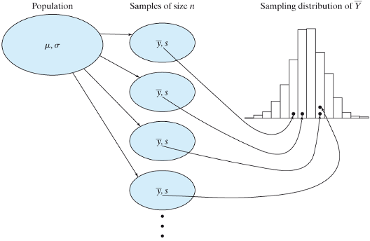
```

###  Example: Sampling distribution of $\bar Y$ when n=10
```{r 3_24, echo=FALSE,out.width='50%'}
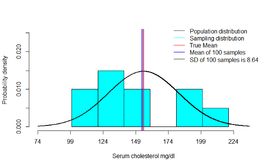
```

### Example: Sampling distribution of $\bar Y$ when n=30
```{r 3_25, echo=FALSE,out.width='50%'}
knitr::include_graphics('./3_25.png')
```

### Example: Sampling distribution of $\bar Y$ when n=100
```{r 3_26, echo=FALSE,out.width='50%'}
knitr::include_graphics('./3_26.png')
```

### Example: Sampling distribution of $\bar Y$ when n=1000
```{r 3_27, echo=FALSE,out.width='50%'}
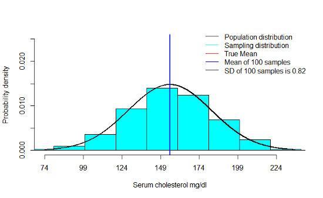
```

### Example 1
* We notice that the mean of the sampling distribution gets very close to µ even with smaller sample sizes. This only improves as n increases
* As n increases, there is a very clear decrease in the standard deviation of the means across a 100 samples
* Finally, we notice that the shape of the sampling distribution is increasingly like a normal distribution as n increases

### The sampling distribution of $\bar Y$
* **Mean**: The mean of the sampling distribution of $\bar Y$ is equal to the population mean, i.e. $E(\bar Y)=\mu_{\bar Y}=\mu$
* **Standard deviation**: The standard deviation of the sampling distribution is equal to the population standard deviation divided by the square root of the sample size, i.e. $SD(\bar Y)=\sigma_{\bar Y}=\frac{\sigma}{\sqrt n}$. Note that this implies the $Variance(\bar Y)=\sigma^2_{\bar Y}=\frac{\sigma^2}{n}$
* **Shape** 
    + If the population distribution of Y is normal, then the sampling distribution is normal, regardless of the sample size n. 
    + *Central Limit Theorem*: If n is large, then the sampling distribution is approximately normal, even if the population distribution of Y is not normal

### Central Limit Theorem
* From the text by Moore and McCabe:

“The sampling distribution of $\bar Y$ is normal if the underlying population itself is normal. 

What happens when the population distribution is not normal? It turns out that as the *sample size increases, the distribution of $\bar Y$ becomes closer to a normal distribution*. This is true no matter what the population distribution may be, as long as the population has a finite standard deviation σ. This famous fact of probability theory is called the *central limit theorem*. For large sample size n, we can regard $\bar Y$ as having the $N\left(\mu,\frac{\sigma}{\sqrt n}\right)$ distribution”

### Example 1
* Applying the Central Limit Theorem, we can say that the sampling distribution of the mean serum cholesterol is:
    + $N\left(\mu_{\bar Y}=155,\sigma_{\bar Y}=\frac{27}{\sqrt {10}}=8.54\right)$ when n=10
    + $N\left(\mu_{\bar Y}=155,\sigma_{\bar Y}=\frac{27}{\sqrt {30}}=4.93\right)$ when n=30
    + $N\left(\mu_{\bar Y}=155,\sigma_{\bar Y}=\frac{27}{\sqrt {100}}=2.7\right)$ when n=100
    + $N\left(\mu_{\bar Y}=155,\sigma_{\bar Y}=\frac{27}{\sqrt {1000}}=0.85\right)$ when n=1000

Therefore, applying the rules pertaining to the normal distribution, we know that roughly 95% of the sampling distribution lies in the following ranges depending on the size of n:

```{r 3_32, echo=FALSE,out.width='50%'}
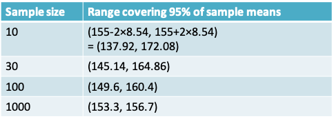
```

### Theory related to the sums of random variables
* These two slides help to see how $\frac{\sigma}{\sqrt n}$ arises. 
* Let X and Y be two arbitrary, independent random variables. Then from probability theory we know that: 
    + E(X+Y) = E(X) + E(Y)
    + Var(X + Y) = Var(X) + Var(Y)
    + E(aX+bY) = aE(X) + bE(Y), where a and b are constants
    + $Var(aX+bY) = a^2 Var(X) + b^2 Var(Y)$
    + If X ~ $N(\mu_X,\sigma_X^2)$ and Y ~ $N(\mu_Y,\sigma_Y^2)$ then (X+Y) ~ $N(\mu_X+\mu_Y,\sigma_X^2+\sigma_Y^2)$

### Some examples related to the sums of independent random variables
1. If X ~ $N(\mu_X=0,\sigma_X^2=1)$ and Y ~ $N(\mu_Y=3,\sigma_Y^2=4)$,  
then X+Y ~ N(mean=3, variance=5)

2. If $X_1,X_2,...,X_n$ ~ N(0,1), then $\sum_{i=1}^nX_i$ ~ N(0,n)

3. ... and then, $\frac{1}{n}\sum_{i=1}^nX_i$ ~ $N(0,\frac{1}{n})$

4. If $X_1,X_2,...,X_n$ ~ $N(\mu,\sigma^2)$, then $\sum_{i=1}^nX_i$ ~ $N(n\mu,n\sigma^2)$

5. ... and then, $\frac{1}{n}\sum_{i=1}^nX_i$ ~ $N(\mu,\frac{\sigma^2}{n})$

#### Excerpt from Lawrence Joseph’s notes
```{r 3_35, echo=FALSE,out.width='50%'}
knitr::include_graphics('./3_35.png')
```

### Example 2: Central Limit Theorem in action
* What is the average time taken across the 50 students in the class?
* R code to replicate

x1 = rnorm(50,4,1) # walk to bus stop
x2 = runif(50,4,16) # wait for bus 
x3 = rnorm(50,20,2) # bus ride
x4 = rgamma(50,shape=3/2,scale=2) # trudge up hill

par(mfrow=c(2,3))
hist(x1);hist(x2);hist(x3);hist(x4)
hist(x1+x2+x3+x4,xlab="Sum for 50 students",main="")
hist((x1+x2+x3+x4)/4,xlab="Mean for 50 students",main="")

## Confidence intervals for means
### Confidence interval estimation for a single mean
```{r 3_38, echo=FALSE,out.width='50%'}
knitr::include_graphics('./3_38.png')
```

* The construction of a confidence interval relies on the principal of the central limit theorem
* If, we can reasonably assume that the sample mean follows a normal distribution with mean µ and standard deviation $\frac{\sigma}{\sqrt n}$
* Then, across repeated samples, 95% of samples’ means $(\bar x's)$ lie in the interval $\left(\mu-2\frac{\sigma}{\sqrt n},\mu+2\frac{\sigma}{\sqrt n}\right)$
* This implies that 95% of the intervals $\left(\bar x-2\frac{\sigma}{\sqrt n},\bar x+2\frac{\sigma}{\sqrt n}\right)$ will include $\mu$. This interval is called the 95% confidence interval for µ
* More generally, $(1-\alpha)$% of the intervals $\left(\bar x-Z_{(1-\frac{\alpha}{2})}\frac{\sigma}{\sqrt n},\bar x+Z_{(1-\frac{\alpha}{2})}\frac{\sigma}{\sqrt n}\right)$ will include $\mu$.
* This interval is called the (1-α)% equal-tailed confidence interval for µ, where $Z_{(1-\frac{\alpha}{2})}$ is the (1- α/2) quantile of the standard normal distribution
* Equal-tailed refers to the fact that the probability of (1-α) is divided equally in the two tails of the distribution
* Notice that the 95% or (1-α)% in the definition refers to a percentage across repeated experiments
* We cannot say whether the 95% confidence interval estimated from the sample at hand is one of the ones that captured the true value of µ or not
* The population standard deviation (σ) is seldom known and must be substituted by the sample standard deviation (s)
* Does the assumption of 95% confidence still hold? It turns out that it does but we must replace the quantile $Z_{(1-\frac{\alpha}{2})}$ from the normal distribution by the $t_{(1-\frac{\alpha}{2})}$  quantile from the Student’s t-distribution (or t-distribution for short)
* The resulting expression for the confidence interval is given by:

\[\left(\bar x-t_{(1-\frac{\alpha}{2}),n-1}\frac{s}{\sqrt n},\bar x+t_{(1-\frac{\alpha}{2}),n-1}\frac{s}{\sqrt n}\right)\]

where $t_{(1-\frac{\alpha}{2}),n-1}$ is the (1- α/2) quantile of the t-distribution with n-1 degrees of freedom

### t-distribution
```{r 3_41, echo=FALSE,out.width='50%'}
knitr::include_graphics('./3_41.png')
```

Image from Wikipedia

* The t-distribution was discovered by the British scientist W. S. Gossett who was employed by the Guiness Brewery. 
    + He published his work in 1908 under the pseudonym Student
* The t-distribution is a bell-shaped, symmetrically distribution over the range -∞ to ∞. It resembles the normal distribution, but has a higher standard deviation. 
* The exact shape of the distribution depends on a quantity called the degrees of freedom (ν in the illustration). The higher the value of ν the closer it is to a normal distribution

Probability density function centred at 0

\[f(x|v) = \frac{\Gamma\left(\frac{v+1}{2}\right)}{\sqrt {v\pi}\Gamma\left(\frac{v}{2}\right)}\left(1+\frac{x^2}{v}\right)^{-\frac{v+1}{2}},-\infty<x<\infty\]

Mean=0

Variance=$\frac{v}{v-2}$

### Example 1: Serum Potassium Concentration
```{r 3_42, echo=FALSE,out.width='50%'}
knitr::include_graphics('./3_42.png')
```

* As part of a study of natural variation in blood chemistry, serum potassium concentrations were measured in 84 healthy women. 
* The mean concentration was 4.36 mEq/l, and the standard deviation was 0.42 mEq/l. 
* The table presents a frequency distribution of the data
* Calculate the standard error of the mean
* Construct a histogram of the data and indicate the intervals mean ± SD and mean ± SE
* Construct a 95% confidence interval for the population mean. Interpret this confidence interval
* Would this interval be suitable to define “reference limits” for serum potassium in healthy women, i.e. the limits within which we would expect to find 95% of healthy people?
* Suppose a similar study is to be conducted the following year among 200 women. What would you predict would be
    + the SD of the new measurements?
    + the SE of the new measurements?

### Example 1: Histogram of the data
```{r 3_44, echo=FALSE,out.width='50%'}
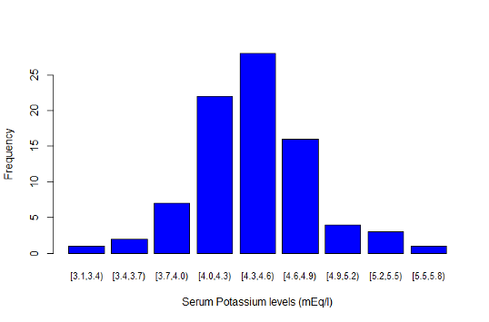
```

### Verifying assumptions behind the t-distribution confidence interval
* Does the central limit theorem hold? 
* In other words, do at least one of the following conditions hold 
    + the data follow an approximately normal distribution? 
    + the sample size is large
* For the serum potassium example both conditions appear to hold

### Example 1: Standard Error and 95% confidence interval 
* The standard error of the mean (SE)  
$=\frac{SD}{\sqrt n}=\frac{0.42}{\sqrt {84}}=0.05$ mEq/l, after rounding
* The 95% confidence interval  
$=\left(\bar x-t_{(1-\frac{\alpha}{2}),n-1}\frac{s}{\sqrt n},\bar x+t_{(1-\frac{\alpha}{2}),n-1}\frac{s}{\sqrt n}\right)$  
$=(4.36 – t_{0.975,84-1} 0.05, 4.36 + t_{0.975,84-1} 0.05)$  
= (4.36 – 1.98 × 0.05, 4.36 + 1.98 × 0.05)  
= (4.26, 4.46) mEq/l

### Interpretation of the 95% confidence interval
* Assuming that the sample at hand is a random sample, there is a 95% probability that the procedure used to calculate the interval (4.26, 4.46) will capture the population mean serum potassium concentration
* It would **not** be correct to say: There is a 95% probability that the population mean serum concentration lies between 4.26 and 4.46 mEq/l

### Confidence level
* The higher the confidence level, the wider the confidence interval would be
```{r 3_48, echo=FALSE,out.width='100%'}
knitr::include_graphics('./3_48.png')
```

* qt(prob,df) is the R function that returns the t-distribution quantile 
    + Arguments provided are the cumulative probability and the degrees of freedom

### Example 1: Distribution of the data (with intervals)
```{r 3_49, echo=FALSE,out.width='50%'}
knitr::include_graphics('./3_49.png')
```

### Interpreting the confidence interval
* *Would the 95% confidence interval be suitable to define “reference limits” for serum potassium in healthy women, i.e. the limits within which we would expect to find 95% of healthy people?*
* No. The 95% interval attempts to captures the uncertainty in the **mean** of the distribution. 
* In the expression for the confidence interval, if we replaced the standard error by the standard deviation, we would get the desired reference limits

### Standard error vs Standard deviation
* *Suppose a similar study is to be conducted the following year among 200 women. What would you predict would be*
    + *the SD of the new measurements?*
    + *the SE of the new measurements?*
* Our best prediction for the SD would be the value in the smaller sample of 84, namely 0.42 mEq/l 
* However, the SE of the new measurements would decrease from 0.05 to $\frac{0.42}{\sqrt {200}}$ = 0.03 mEq/l

## Confidence interval for the difference between two means
### Example 2: Nck1 deficiency and adipogenesis
```{r 3_53, echo=FALSE,out.width='50%'}
knitr::include_graphics('./3_53.png')
```

* Obesity results from an excessive expansion of white adipose tissue (WAT), which is still poorly understood from an etiologic-mechanistic perspective
* A study from the MUHC-RI reported on the role of the Nck1 adaptor protein during WAT expansion and in vitro adipogenesis
* Two outcomes of interest were body weight and adipose weight

```{r 3_54, echo=FALSE,out.width='50%'}
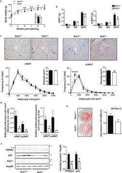
```

* Nck1 wild type (Nck1+/+) and knock-out mice (Nck1-/-) were compared at baseline and at 16 weeks
* Two research questions of interest: Is there a difference in wild-type and knock-out mice in terms of 
    + Body weight
    + Adipose weight
* What would be considered a meaningful change on these two outcomes?
* In order to apply the Central Limit Theorem we would ask:
    + Is it reasonable to assume that body weight and adipose weight follow an approximately normal distribution?
    + If not, is the sample size sufficiently large?
* The sample size is not large, so the approximate normality must hold to construct a t-distribution-based confidence interval

```{r 3_55, echo=FALSE,out.width='100%'}
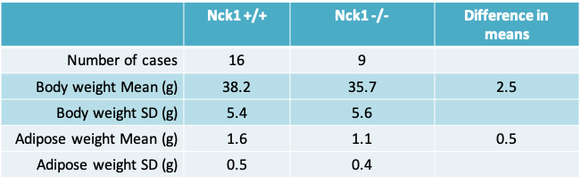
```

### Confidence interval for the difference between means from two independent samples
The (1-α)% confidence interval comparing two means from independent samples is given by

\[\bar x_1-\bar x_2-t_{(1-\alpha/2),df}s_{diff},\bar x_1-\bar x_2+t_{(1-\alpha/2),df}s_{diff}\]

where 

```{r 3_56, echo=FALSE,out.width='50%'}
knitr::include_graphics('./3_56.png')
```

### Variance of the difference in means 
```{r 3_57, echo=FALSE,out.width='50%'}
knitr::include_graphics('./3_57.png')
```

### Calculating degrees of freedom of the t-distribution when variances are not equal
* The degrees of freedom can be set to min(n1-1, n2-1), which is a conservative value. This is a useful approach if you are doing the t-test by hand
* Alternatively, a computer program may use a more complex method called the Welch’s method or Satterthwaite’s method to calculate the degrees of freedom as follows:

\[\frac{(se_1^2+se_2^2)^2}{\frac{se_1^4}{n1-1}+\frac{se_2^4}{n2-1}},\]

where $se_1 = se_1/\sqrt{n1}$ and $se_2 = se_2/\sqrt{n1}$

### Example 2: Nck1 deficiency and adipogenesis
* Based on the sample estimates, and perhaps from information gathered previously, it may be reasonable to assume that the variance is the same in both groups being compared
* Since we are assuming that the variance is the same, it is reasonable to calculate a pooled variance that averages across both groups. 

### Calculating the pooled variance for body weight
* The pooled variance is given by 

\[s_p^2=\frac{(n1-1)s_1^2+(n2-1)s_2^2}{n1+n2-2}=\frac{15*5.4*5.4+8*5.6*5.6}{16+9-2}=29.9\]

* Therefore the pooled standard deviation is given by the square root of 29.9 or $s_p=5.5$
* The value of $s_{diff}=s_p\sqrt{\frac{1}{n1}+\frac{1}{n2}}=5.5\sqrt{\frac{1}{16}+\frac{1}{9}}=2.3$

### Confidence interval for difference in body weight
* The difference in mean body weight between Nck1+/+ and Nck1-/- mice is $\bar y_1-\bar y_2=38.2-35.7=2.5$
* 95% confidence interval for the difference in means is

$\bar y_1-\bar y_2-t_{(1-\alpha/2),n1+n2-2}s_{diff},\bar y_1-\bar y_2+t_{(1-\alpha/2),n1+n2-2}s_{diff}$

= (2.5 – 2.07 × 2.3, 2.5 + 2.07 × 2.3)

= (-2.3, 7.3)

### Confidence intervals comparing the two groups
```{r 3_62, echo=FALSE,out.width='100%'}
knitr::include_graphics('./3_62.png')
```

* The assumption of unequal variance results in a lower value for the degrees of freedom and would typically be more conservative

### Interpreting the confidence interval
* As in the case of a single mean, we have 95% confidence in the procedure used to construct the interval. 
    + We cannot say if this interval based on our sample includes the true mean difference between Nck1 +/+ and Nck1 -/- mice
* Say we consider 5g to be a meaningful difference in body weight
    + This implies, though the confidence interval includes 0, the upper limit crosses 5g suggesting we cannot eliminate the possibility there is a meaningful difference. Ideally, the study should be repeated to obtain a more precise estimate 
* Say we consider a 0.5g to be a clinically meaningful difference in adipose weight
    + The interval provides evidence for a statistically significant difference, but does eliminate the possibility that the difference may not be clinically meaningful difference as the lower limit lies below 0.5g

## Sample size calculations
* Before collecting data for a research study, it is wise to consider in advance whether the estimates generated from the data will be sufficiently precise. 
* It can be painful indeed to discover after a long and expensive study that the standard errors are so large that the primary questions addressed by the study cannot be answered.

### An illustration
```{r 3_66, echo=FALSE,out.width='50%'}

```

* https://www.youtube.com/watch?v=PbODigCZqL8

### Sample size calculation
* The method one uses for the sample size calculation depends on the plan for the statistical inference
* Accordingly, depending on whether you intend to report a hypothesis test, or a confidence interval or a Bayesian analysis, your method for sample size calculation may change

### Sample size calculation for reporting a confidence interval
* This approach is relevant when we want to estimate a parameter within a certain precision, with a high level of confidence. 
* For example, we might want to estimate
    + mean change in body weight in mice within ± 2.5g of the true value with 99% confidence 
    + mean serum cholesterol in middle-aged men within ± 6mg/dL of its true value with 90% confidence

### Example: Method for a single mean
* A medical researcher proposes to estimate the mean serum cholesterol level of a certain population of middle-aged men, based on a random sample of the population. 
* He asks a statistician for advice. The ensuing discussion reveals that the researcher wants to estimate the population mean to within δ = ±6 mg/dl or less, with 95% confidence. 
* Also, the researcher believes that the standard deviation of serum cholesterol in the population is probably about s=40 mg/dl. 
* How large a sample does the researcher need to take?

### The desired precision is much smaller than the standard deviation of the variable
```{r 3_70, echo=FALSE,out.width='50%'}
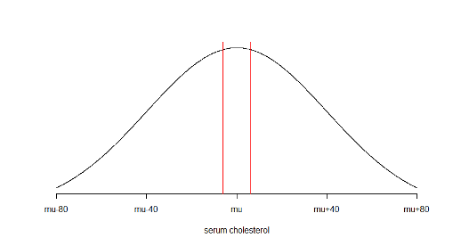
```

### Example: Method for a single mean
* The research question can be re-expressed as

“What is the sample size required to calculate a 95% confidence interval for the mean serum cholesterol which has half-width 6mg / dL?”

* Recall that the general expression for the (1- α)% confidence interval is

\[\bar x-t_{(1-\alpha/2),n-1}\frac{s}{\sqrt n},\bar x+t_{(1-\alpha/2),n-1}\frac{s}{\sqrt n}\]

* In other words, we need to find out how large n should be so that

\[t_{(1-\alpha/2),n-1}\frac{s}{\sqrt n}=\delta=6\]

* To solve this expression for n, we need to know the values of $t_{(1-\alpha/2),n-1}$ and the value of s, the standard deviation
* Since $t_{(1-\alpha/2),n-1}$ itself depends on n, we cannot know its value without n! We therefore, replace it by the normal quantile $Z_{(1-\alpha/2)}$. In our example, $Z_{(1-\alpha/2)}=1.96$ 
* The value of s could be a guess value or determined from the literature or an earlier pilot study. In our example, s=40
* Therefore, we wish to solve

\[Z_{(1-\alpha/2)}\frac{s}{\sqrt n}=1.96\frac{40}{\sqrt n}=\delta=6\]

* This implies $\sqrt n = Z_{(1-\alpha/2)}\frac{s}{\delta}=1.96\frac{40}{6}$
* Or $n = (1.96\frac{40}{6})^2 \approx 171$

### Alternative values of α, s and δ 
```{r, echo=FALSE}
library(knitr)
df<- data.frame(alpha = c(0.05,0.01,0.05,0.01,0.05,0.01,0.05,0.01),s=c(40,40,30,30,40,40,30,30),delta=c(6,6,6,6,12,12,12,12),n=c(171,240,96,135,43,60,24,24))
kable(df)
```

* By varying the values of α, s and δ we can see how they impact the sample size
* n increases if:  
α decreases, s increases or δ decreases   
* In practice, the sample size may be constrained by feasibility or cost. Using a table like this allows us to see how much precision we can ‘buy’ with the available sample size

### Example: Sample size calculation for comparing two means
* Consider the study on body weight in Nck+/+ vs Nck-/- mice
* Lets say we wish to repeat the earlier study so that we can show more convincingly that there is a clinically meaningful difference 
* Earlier in the lecture we found that the **pooled** standard deviation of the difference was $s_p=5.5g$
* We desire to ensure that the observed mean change lies within δ = ± 2.5 g of the true mean change with 95% confidence. 
* What is the sample size required in each group (assuming the sample size is equal in both groups)? 

### Example: Comparison of two means
* To calculate the sample size required to estimate a 95% CI with adequate precision we need to solve  
$Z_{(1-\alpha/2)}s_{diff}=Z_{(1-\alpha/2)}s_p\sqrt{\frac{1}{n}+\frac{1}{n}}=\delta$  
or $1.96\times 5.5\times \sqrt{\frac{1}{n}+\frac{1}{n}}=2.5$
* This implies $\sqrt n =1.96\frac{5.5\times\sqrt 2}{2.5}$
* Or $n = 2(1.96\frac{5.5}{2.5})^2 \approx 37$ mice in each group
