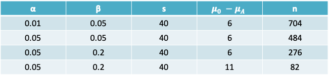
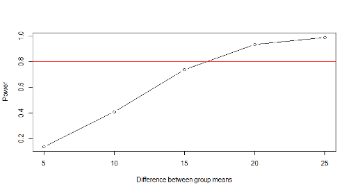
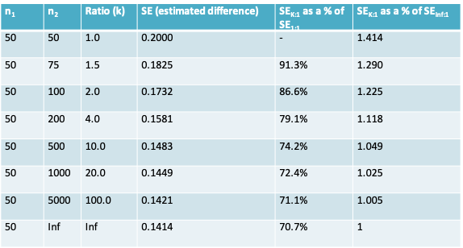

# Lecture 5: Sample size calculations to plan for hypothesis tests of means
## Sample size calculation 
* The method one uses for the sample size calculation depends on the plan for the statistical inference
* Accordingly, depending on whether you intend to report a hypothesis test, or a confidence interval or a Bayesian analysis, your method for sample size calculation may change

### Type I and Type II errors

```{r 5_3, echo=FALSE,out.width='50%'}
knitr::include_graphics('./5_3.png')
```

* When carrying out a hypothesis test we can in fact make two types of errors
    + Type I error (α): We reject $H_0$ when it is true
    + Type II error (β): We fail to reject $H_0$ when it is not true (i.e. when $H_A$ is true)

### Similarity between diagnostic testing and  hypothesis testing
```{r 5_4a, echo=FALSE,out.width='50%'}

```

* Sensitivity = A / (A+C)
* Specificity = D / (B+D)
* A, B, C and D are numbers of individuals in the study

```{r 5_4b, echo=FALSE,out.width='50%'}
knitr::include_graphics('./5_4b.png')
```

* 1-Type II error (Power) = A / (A+C)
* 1-Type I error = D / (B+D)
* A, B, C and D are number of repetitions of the study

### Example
* In the United States, appropriate levels of serum cholesterol in adults have been defined by the National Heart, Lung, and Blood Institute as follows:
    + **Good:** 200 mg/dL or lower
    + **Borderline:** 200 to 239 mg/dL
    + **High:** 240 mg/dL or higher
    
* Let’s say the researcher in our earlier example posed the question differently. 
* He or she wants to test the hypothesis that the mean cholesterol level in the population has fallen to 195 mg/dL such that it is now within the “Good” range

\[H_0: µ ≤ 195\space\space vs.\space H_a: µ > 195\]

* How large a sample size is required to test this hypothesis such that 
    + Type I error (α)= $P(Rejecting\space H_0 | H_0\space is\space true)$ = 1%, and 
    + Type II error (β)= $P(Not\space rejecting\space H_0 | H_A\space is\space true)$ = 5%
* The researcher wishes to design the study such that the test is sufficiently sensitive to detect difference of 6 mg/dL or more (i.e. when µ=201 or more)

### We are interested in detecting a shift in the mean of the distribution
```{r, echo=FALSE,out.width='50%'}
knitr::include_graphics('./4_55.png')
```

### Sample size required for a hypothesis test of a single mean
* Again, we rely on the quantiles of the normal distribution rather than the t-distribution
* The required sample size for a two-sided test is given by this expression:

\[n = \frac{s^2(Z_{1-\alpha/2}+Z_{1-\beta})^2}{(\mu_0-\mu_A)^2}\]

* The required sample size for a one-sided test is given by this expression:

\[n = \frac{s^2(Z_{1-\alpha}+Z_{1-\beta})^2}{(\mu_0-\mu_A)^2}\]

* From the expressions on the previous slide we can see that n increases as:
    + s increases
    + α decreases or β decreases
    + $\mu_0-\mu_A$ decreases
* Once again, you may wish to calculate sample size under several different scenarios

### Sample size required under different scenarios for a one-sided test
```{r, echo=FALSE,out.width='100%'}

```

### Example: Serum cholesterol
* The sample size required for a one-sided test is

\[n = \frac{s^2(Z_{1-0.01}+Z_{1-0.05})^2}{(\mu_0-\mu_A)^2}=\frac{40^2(2.33+1.65)^2}{(195-201)^2}=704\]

* **Impact of increasing α to 0.05:**
    + If the type I error was increased to 0.05, we would replace $Z_{1-0.01} = 2.33$ by $Z_{1-0.05} = 1.65$. 
    + $n = \frac{s^2(Z_{1-0.05}+Z_{1-0.05})^2}{(\mu_0-\mu_A)^2}=\frac{40^2(1.65+1.65)^2}{(195-201)^2}=484$
* **Impact of increasing β:**
    + If in addition to the above change, the type II error was increased to 0.2, as is commonly done in practice. Then, $Z_{1-0.2} = 1.65$ in the expression above would be replace by $Z_{1-0.2} = 0.84$
    + $n = \frac{s^2(Z_{1-0.01}+Z_{1-0.2})^2}{(\mu_0-\mu_A)^2}=\frac{40^2(1.65+0.84)^2}{(195-201)^2}=276$
* **Impact of increasing $\mu_0-\mu_A$**
    + If $µ_0$ were set to 190, then the difference between the two groups increases to 11
    + $n = \frac{s^2(Z_{1-0.01}+Z_{1-0.05})^2}{(\mu_0-\mu_A)^2}=\frac{40^2(1.65+0.84)^2}{(190-201)^2}=82$

### Summary: Input needed to calculate sample size for single mean
```{r, echo=FALSE}
library(knitr)
df<- data.frame(Confidence.interval=c("Confidence level 1-α"," ","Guess value for standard deviation (s)","Desired precision (or half-width of interval) (δ)
"),Hypothesis.test=c("Type I error α","Type II error β","Guess value for standard deviation (s)","The minimum important difference to detect $(\\mu_0-\\mu_A)$"))
df2=head(df)
knitr::kable(df2, col.names = gsub("[.]", " ", names(df)))
```

### Example: Planning a study to compare means using a hypothesis test
* Lets say we wish to repeat the earlier study on the association of adapter protein Nck1 with body weight and that we wish to carry out a one-sided hypothesis test of the difference between the two groups stated as follows:

\[H_0:\mu_{WT}-\mu_{KO}\geq 5\space vs. \space H_a:\mu_{WT}-\mu_{KO}<5\]

* The authors reported that the mean difference in body weight at 16 weeks between the two groups was 2.5g and we estimated that the pooled standard deviation of this difference was $s_p=5.5g$
* We desire to ensure that the test is sensitive enough to detect a difference greater than $µ_1 - µ_2 = 6g$ with Type II error = 20%. The Type I error is fixed at the traditional value of 5%.
* What is the sample size required in each arm of the RCT (assuming the sample size is equal in both arms)? 

### Sample size required to compare means
* In the expressions below n = total sample size. If the sample size is the same in both groups, it is n/2 in each group
* The required sample size for a two-sided test is given by this expression:

\[n = \frac{4s_p^2(Z_{1-\alpha/2}+Z_{1-\beta})^2}{(\mu_1-\mu_2)^2}\]

* The required sample size for a one-sided test is given by this expression:

\[n = \frac{4s_p^2(Z_{1-\alpha}+Z_{1-\beta})^2}{(\mu_1-\mu_2)^2}\]

### Example: Sample size required to compare Nck1 WT and KO mice
* The sample size required for a one-sided test is 

\[n = \frac{4s_p^2(Z_{1-0.05}+Z_{1-0.2})^2}{(\mu_1-\mu_2)^2}=\frac{4\times 5.5^2(1.65+0.84)^2}{(6)^2}\]

~ **21 mice (or 11 mice in each group)**

* If the standard deviation was 10 mg/dL instead, then 

\[n = \frac{4s_p^2(Z_{1-0.05}+Z_{1-0.2})^2}{(\mu_1-\mu_2)^2}=\frac{4\times 10^2(1.65+0.84)^2}{(6)^2}\]

~ **69 (or 35 mice in each group)**

* If we used a calculation for a two-sided test instead (with the standard deviation of 5.5), then  

\[n = \frac{4s_p^2(Z_{1-0.05/2}+Z_{1-0.2})^2}{(\mu_1-\mu_2)^2}=\frac{4\times 5.5^2(1.96+0.84)^2}{(6)^2}\]

~ **26 (or 13 mice per group)**

### Power
* The expressions for sample size can be rearranged to calculate the power for a given sample size
* For a single mean

\[Z_{1-\beta}=\frac{\sqrt N|\mu_0-\mu_A|-s\times z_{1-\alpha/2}}{s}\]

* For comparing two means

\[Z_{1-\beta}=\frac{\sqrt N|\mu_1-\mu_2|-2s_pz_{1-\alpha/2}}{2s_p}\]

### Calculating the power in R

```
power.t.test(n = NULL, delta = NULL, sd = 1, sig.level = 0.05,
             power = NULL,
             type = c("two.sample", "one.sample", "paired"),
             alternative = c("two.sided", "one.sided"),
             strict = FALSE)
```

* The power.t.test function can be used to either take the sample size in each group (n) as an input and return the power, or vice-versa
* Whereas the expressions we studied so far were based on normal quantiles, this R function uses the t-distribution quantiles and should therefore provide a more precise answer

### Example: Power function
* A proposed study wishes to investigate the effects of a new hypertensive drug (experimental group) compared to a conventional treatment (control group). 
* The outcome of interest is the difference in the mean blood pressure in each group. Previous studies show that the pooled standard deviation (SD) across the two groups is 20mmHg
* Assuming that the desired Type I error is 5% and that the feasible sample size is 25 in each group, and that the minimum clinically important difference is 15mmHg. 
* What is the power of a two-sided test to detect the minimum important difference? Plot the function relating the difference between the two groups to the power of the test

* First, we will calculate the power using the expression in your notes
* Then we will use the power.t.test function to plot the power function
* Using the expression for calculating the normal distribution quantile corresponding to the power we have

\[Z_{1-\beta}=\frac{\sqrt N|\mu_1-\mu_2|-2s_pz_{1-\alpha/2}}{2s_p}=\frac{\sqrt{50}|15|-2\times 20\times 1.96}{2\times 20}=0.6916504\]

* The power of the test is given by  
$P(Z\leq Z_{1-\beta})$ = pnorm(0.6916504) = 0.754216
* Using the function in R instead we would obtain the following result  

power.t.test(n = 25, delta = 15, sd = 20, sig.level = 0.05)
= 0.7383646

which is slightly lower than the result based on the approximation using the normal quantile
* To find the power for a series of different values for the minimum difference we can use the following R code (<span style="color: red;">in red</span>) 

$\#$ a vector of possible values for the difference  
<span style="color: red;">min.diff = c(5, 10, 15, 20, 25)</span>

$\#$ create an object for the result of the power function  
<span style="color: red;">result = power.t.test(n = 25, delta = min.diff, sd = 20, sig.level = 0.05)</span>

<span style="color: red;">names(result)</span>	# to examine the contents of the object  
[1] "n"           "delta"       "sd"          "sig.level"   "power"      
[6] "alternative" "note"        "method" 

<span style="color: red;">output=result$power</span>	# create another object to extract the power

$\#$ scatter and line plot  
<span style="color: red;">plot(min.diff,output,type="b",xlab="Difference between group means",ylab="Power")</span>

$\#$ red reference line at Power=80%  
<span style="color: red;">abline(h=0.8,col=2)</span>

Notice that with 25 patients in each group, we would have 80% or higher power to detect differences greater than about 17mmHg

```{r, echo=FALSE,out.width='70%'}

```

### What is the impact of equal or unequal group sizes on the precision?$^*$
* **If costs and other factors (including unit variability) are equal, and if both types of units are equally scarce or equally plentiful**, then for a given total sample size of $n = n_1 + n_2$ , an equal division of n i.e. $n_1 = n_2$ is preferable since it yields a smaller standard error than any non-symmetric division. 
* **If one type of unit is much scarcer, and thus the limiting factor**, then it makes sense to choose all (say $n_1$) of the available scarcer units, and some $n_2 \geq n_1$ of the other type. The greater is $n_2$, the smaller the standard error of the estimated difference. 
* These principles apply to both means and proportions

$^*$[From James Hanley’s notes](http://www.medicine.mcgill.ca/epidemiology/hanley/bios601/Mean-Quantile/2%20MeansQuantitativeVariable.pdf)

#### Effect of different numbers in each sample on precision, when both groups are equally difficult to sample from
* Let the standard error of an estimated difference in mean responses as $SE\sqrt{\frac{1}{n_1}+\frac{1}{n_2}}$ where SE is the standard deviation and n1 and n2 are the sample size in each group.
* The following table gives the value of the standard error (SE) for various combinations of $n_1$ and $n_2$ adding to 100 and assuming SE=1 
* Notice that, the standard error is relatively unaffected until the ratio exceeds 70:30

```{r, echo=FALSE,out.width='50%'}
knitr::include_graphics('./4_75.png')
```

$^*$if sample sizes are $\pi:(1-\pi)$, the % increase is $50/\sqrt{\pi(1-\pi)}$

#### Effect of different numbers in each sample on precision, when group 1 is more scarce than group 2
There is a 'law of diminishing returns' once $n_2$ is more than a few multiples of $n_1$ as seen in the following table where $n_1$ is fixed (arbitrarily) at 100 and $n_2$ ranges from $kn=1 \times n_1$ to $kn=100 \times n_1$; again, we assume SE=1

```{r, echo=FALSE,out.width='100%'}

```

### An R package for sample size and power calculations
* There are a number of user-contributed packages that can be added to R
* Once such package is the pwr package for sample size calculations for hypothesis testing
* It includes functions for calculating the sample size required for a hypothesis test when the two groups being compared have unequal sample size

### Installing a package in R
* User-contributed packages are not part of the base R installation. 
* They can be installed by clicking on the Install tab in R Studio. Once installed, they must be read into R using the library() function  
> library(pwr)
* Click on the name of the library in the list of libraries within R Studio to access the help file

### Sample size for comparing two means
The function pwr.t2n.test() can be used

pwr.t2n.test(n1 = NULL, n2= NULL, d = NULL, sig.level = 0.05, power = NULL,  
 alternative = c("two.sided", "less","greater"))

Notice that it takes the effect size $d=\frac{|\mu_1-\mu_2|}{s_p}$ as an argument, whereas the power.t.test() function we saw earlier takes arguments delta and sd instead

This function can be used to calculate either the power or the sample size

#### Example 1:
Calculate the sample size in group 2 when:  
effect size=15/20=0.75, Type I error=0.05, Power=0.8, and feasible sample size in group 1 is 25

> pwr.t2n.test(n1=25,d=0.75,power=0.8)

     t test power calculation 

             n1 = 25
             n2 = 34.17153
              d = 0.75
      sig.level = 0.05
          power = 0.8
    alternative = two.sided

#### Example 2:
Calculate the power available when:  
effect size=15/20=0.75, Type I error=0.05, Sample size = 25 in both groups

Notice we now have the same result we obtained previously with power.t.test

> pwr.t2n.test(n1=25,n2=25,d=0.75)

     t test power calculation 

            n1 = 25
            n2 = 25
            d = 0.75
            sig.level = 0.05
            power = 0.7383671
            alternative = two.sided
