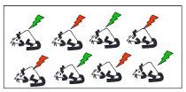
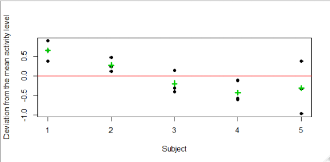
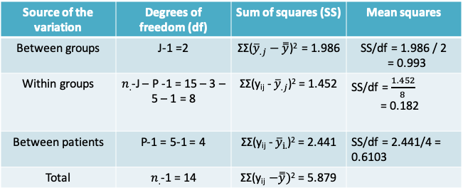
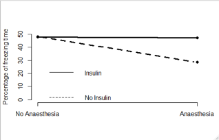
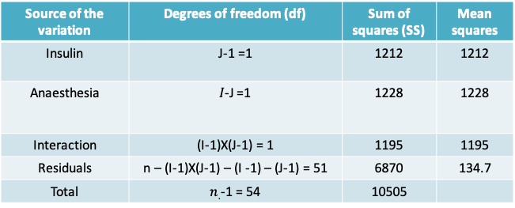
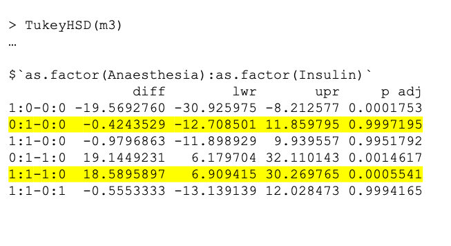
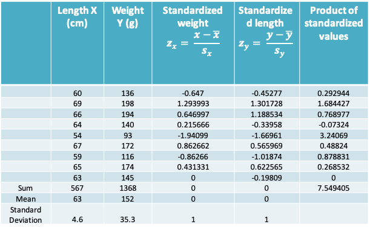

# Lecture 11: Analysis of Variance (ANOVA) 2 
## 1-way ANOVA model
* Previously we studied methods for 1-way ANOVA focusing on the division of the total variance into between-group and within-group variances
* It can also be helpful to think of 1-way ANOVA in terms of the following model

\[y_{ij}=\mu+\tau_j+\epsilon_{ij}\]

where µ is the true mean in the population and $\tau_j$ is the deviation of the mean in the $j^{th}$ group from µ

* The $\tau_j$'s are referred to as the group effects. Notice that $H_0: μ_1 = μ_2 = … = μ_J$ is equivalent to $H_0: τ_1 = \tau_2 = … = τ_J = 0$
* The unknown parameters in the model on the previous slide are estimated as follows  
$y_{ij}=\hat{\mu}+\hat{\tau_j}+\hat{\epsilon_{ij}}$, or  
$y_{ij}=\bar{\bar y}+(\bar y_j-\bar{\bar y})+(y_{ij}-\bar y_j)$
* We can see now why the within-group sum of squares may be referred to as the residual sum of squares. 

### Extending the 1-way ANOVA model
* We would like to reduce the residual term $(y_{ij}-\bar y_j)$ to be as small as possible
* This may be achieved by including other sources of variation in the model besides the J groups
* In the simplest case we consider one more source of variation resulting in a 2-way ANOVA model
    + the $2^{nd}$ source of variation could be a variable of interest, e.g. an experimental intervention, or an extraneous variable, e.g. a subject or design characteristic

### Study designs handled with 2-way ANOVA models
* **Randomized block design**: Experimental subjects are first divided into homogeneous blocks before they are randomly assigned to a treatment group. 
* **Factorial design**: Two variables (factors) of interest are measured on each unit of observation
* **Repeated measures design**: Multiple observations are made on the same subject, e.g. over time or by different observers

### Example: Repeated Measures Design
* A study was designed to examine if the plasma concentration of a hormone was affected by the activity level of subjects 
* Measurements were obtained on each of 5 subjects while they were resting, exercising or sleeping

```{r, echo=FALSE}
library(knitr)
df<- data.frame(z=c("Subject 1","Subject 2","Subject 3","Subject 4","Subject 5","Mean"),zSleeping=c(1.3,1.15,0.5,0.3,1.3,0.910),zResting=c(1.78,1.25,1.27,0.55,0.80,1.130),zExercisingz=c(2.67,2.25,1.46,1.66,0.80,1.768),zzzSubjectzMean=c(1.917,1.550,1.077,0.837,0.967," "))
knitr::kable(df, col.names = gsub("[z]", " ", names(df)))
```

### Number of study units (from 3rs website of Michael Festing$^*$)

```{r, echo=FALSE,out.width='50%'}

```

* In this study the animals are all housed in one cage and the treatment is given by injection.
* Any two animals can receive different treatments, so the animal is the experimental unit and N (the number of experimental units) is 8

```{r, echo=FALSE,out.width='50%'}
knitr::include_graphics('./11_08b.png')
```

* In this study the animals are housed two per cage and the treatment is given in the food or water.
* Both animals in a cage receive the same treatment. So N (the number of experimental units) is 4

$^*$[website](http://www.3rs-reduction.co.uk/)

### Example: Repeated Measures Design
* Though the study has 15 unique observations, measurements on the same patient are more similar than measurements on different patients
* Like in the paired t-test, the statistical analysis must remove the effect of variability across patients in order to compare the three activity levels 
* The number of units is in fact 5. This can be recognized using a two-way ANOVA 

### Example: 2-way ANOVA model
* Our goal is to test the null hypothesis  
$H_0:\mu_{sleeping}=\mu_{resting}=\mu_{exercising}$, vs.  
Ha: At least two of the means are not equal
* The 2-way ANOVA model may be expressed as  
$y_{ijk}=\mu+\tau_j+\beta_i+\epsilon_{ijk}$, where  
$\mu$ is the population mean  
$\tau_j$ is the group effect  
$\beta_i$ is the patient effect, and  
$\epsilon_{ijk}$ is the error term

### Example: Visualizing the patient-effects
* To visualize the impact of the patient effects, we can reorganize our model as follows

\[y_{ijk}-\tau_j=\mu+\beta_i+\epsilon_{ijk}\]

The left-hand-side describes the data after the group effects have been removed. It can be estimated as follows:

\[y_{ijk}-\hat{\tau_j}=y_{ijk}-(\bar y_{.j}-\bar{\bar y})=residual+grand\space mean\]

```{r, echo=FALSE,out.width='60%'}

```

* The above shows that even after removing the group (or activity) effects, there is variability in the data due to the patient-effects
* In order to measure the relative importance of this variability we will need to calculate the means squares for patient-effects

```{r, echo=FALSE,out.width='60%'}
knitr::include_graphics('./11_14.png')
```

* On the above we see that 
    + The variability among the group means is unchanged between the plots
    + The within-group variability reduced after adjusting for the patient-effects
    + As a result, the difference between the three group means is more pronounced
* Recall that the F-test statistic is the ratio of the between-group to the within-group variance. As the within-group variance decreases, the F-test is more likely to be statistically significant

### Example: 1-way ANOVA model
```{r, echo=FALSE,out.width='100%'}
knitr::include_graphics('./11_16.png')
```

* When we ignore the patient effects, the F-statistic is 0.993/0.3244 = 3.061 and the corresponding p-value is 0.0843 when comparing to the $F_{2,12}$ distribution
* Therefore, at the Type I error level of 0.05 we would conclude that there is insufficient evidence to reject the null hypothesis that the mean plasma concentration of the hormone is the same at all three activity levels

### Example: 2-way ANOVA model
```{r, echo=FALSE,out.width='100%'}

```

* By comparing the 1-way and the 2-way ANOVA models, we can see that the previously estimated within-groups variance is now split further into the between-patient variance and the within-group variance (or the residual)

```{r, echo=FALSE,out.width='100%'}
knitr::include_graphics('./11_18.png')
```

* After adjusting for the patient effects (i.e. the between patient variability), we find that there is now a statistically significant difference between the three activity levels. F-statistic = 0.993/0.182 = 5.471. The corresponding p-value is 0.0318
* This example illustrates how ignoring the dependence between multiple observations on the same patient could lead us to an incorrect conclusion 

### 2-way ANOVA in R
```
> m1=aov(y~as.factor(group),data=repmd)
> summary(m1)
                 Df Sum Sq Mean Sq F value Pr(>F)  
as.factor(group)  2  1.986  0.9930   3.061 0.0843 .
Residuals        12  3.893  0.3244                 
---
Signif. codes:  0 ‘***’ 0.001 ‘**’ 0.01 ‘*’ 0.05 ‘.’ 0.1 ‘ ’ 1
```

```
> m2=aov(y~as.factor(group)+as.factor(id),data=repmd)
> summary(m2)
                 Df Sum Sq Mean Sq F value Pr(>F)
as.factor(group)  2  1.986  0.9930   5.471 0.0318
as.factor(id)     4  2.441  0.6103   3.362 0.0679
Residuals         8  1.452  0.1815               
                  
as.factor(group) *
as.factor(id)    .
Residuals         
---
Signif. codes:  
0 ‘***’ 0.001 ‘**’ 0.01 ‘*’ 0.05 ‘.’ 0.1 ‘ ’ 1
```

### Example: Factorial Design$^*$
* Researchers wished to study the neuroprotective effect of insulin in preventing memory impairments due to exposure to anaesthesia
* In one experiment they recorded the “percentage of freezing time” in mice following an adverse stimulus (an electric shock) under 4 different exposures determined by insulin level and anaesthesia level  

```{r, echo=FALSE,out.width='60%'}
knitr::include_graphics('./11_21.png')
```

$^*$From project report by Preeti Bhatt based on 'Unpublished data, Dr. Patricia Roque, Khoutorsky Lab, McGill University’

```{r, echo=FALSE,out.width='50%'}

```

* The four combinations of the exposure levels are:
    + Neither Anaesthesia nor insulin
    + Anaesthesia only
    + Insulin only
    + Anaesthesia and insulin
* The adjacent graph plots the mean percentage of freezing time in the four groups
* We can see that when the mice were exposed to insulin, the impact of anaesthesia was reduced

### Example: 2-way ANOVA model
* When we suspect that the two factors interact, we can extend the ANOVA model to include an interaction term as follows

\[y_{ijk}=\mu+\tau_j+\beta_i+\gamma_{ij}+\epsilon_{ijk}\]

* The term $\gamma_{ij}$ is the effect of the interaction between level j of the first factor (anaesthesia) and level I of the second factor (insulin)
* If there are I levels of factor i and J levels of factor j, then the number of degrees of freedom associated with the interaction terms are (I-1) X (J-1)
* The first hypothesis test of interest for is whether the interaction terms are non-zero, i.e.  
$H_0:\gamma_{11}=\gamma_{12}=...=\gamma_{1J}=0$, vs.  
Ha: At least one interaction term is non-zero
* The F-test statistic is once again obtained by dividing the mean interaction sum of squares by the mean residual sum of squares

### Example: 2-way ANOVA table
```{r, echo=FALSE,out.width='100%'}

```

* The F-test statistic for the interaction terms is 8.875. When compared to the $F_{1,95}$ distribution,  the p-value is 0.00442, which leads us to conclude that the there is an interaction between Insulin and Anaesthesia
* The remaining p-values for the effects of Insulin and Anaesthesia are not useful in this context. Instead, we have to carry out pairwise comparisons of each factor conditional on the other

### Example: 2-way ANOVA table in R
```
m3=aov(Freezing~Anaesthesia+Insulin+Anaesthesia*Insulin,data=freezing)

> summary(m3)
                    Df Sum Sq Mean Sq F value  Pr(>F)   
Anaesthesia          1   1228  1228.4   9.119 0.00395 **
Insulin              1   1212  1212.3   9.000 0.00417 **
Anaesthesia:Insulin  1   1195  1195.5   8.875 0.00442 **
Residuals           51   6870   134.7                   
---
Signif. codes:  0 ‘***’ 0.001 ‘**’ 0.01 ‘*’ 0.05 ‘.’ 0.1 ‘ ’ 1
```

### Example: Pairwise comparisons
```{r, echo=FALSE,out.width='100%'}

```

### Assumptions behind 2-way ANOVA
* Independence of the residuals
* Equality of the variances
* Normality of the residuals
* As in the case of 1-way ANOVA, we may use plots of the residuals to check if these assumptions are met

## Correlation
* What can we conclude from the following two graphs regarding the **association** between age and blood pressure?

```{r, echo=FALSE,out.width='70%'}
knitr::include_graphics('./11_30.png')
```

### Association between age & BP
* The two plots on the previous page are based on the same data! 
* Changing the scale on the “Age” axis could falsely lead us to believing that the relation in the second graph was stronger than the first. 
* Therefore we need a more objective measure that we can use to supplement the information from a scatter plot. 
* The estimate of the Pearson correlation coefficient between age and blood pressure in our example is r=0.718.

### The correlation coefficient
* The **correlation** is a numerical measure of the **direction** and **strength** of the **linear relation** between two quantitative variables 
* The most commonly used approach for measuring correlation is the **product-moment** or **Pearson’s** correlation coefficient 
* There are other methods for calculating the correlation, e.g. the **Spearman’s** correlation coefficient, is a **non-parametric** equivalent that is based on the ranks of the observations rather than on the observations themselves

### Pearson’s correlation coefficient
* This coefficient is based on the assumption of a **bivariate random sampling model**, i.e.:
    + A model under which each pair $(x_i, y_i)$ is regarded as having been randomly sampled from a population of (X, Y) pairs
    + This implies that the observed x's are a random sample, and the observed y's are also a random sample
* This assumption makes the correlation coefficient unsuitable for settings where the values of one of the variables is pre-determined, 
    + e.g. where X is the fixed value of the analyte concentrations defined by a researcher to fit a standard curve for an ELISA and Y is the observed optical densities
* As with other statistics we have studied we make a distinction between the population (or true) correlation coefficient and the sample correlation coefficient that we are able to observe
* **Population correlation($\rho$)**

\[\rho=\frac{\sum_{all\space population}(X_i-\mu_x)(Y_i-\mu_y)}{\sqrt{\sum_{all\space population}(X_i-\mu_x)^2\sum_{all\space population}(Y_i-\mu_y)^2}},-1\leq\rho\leq1\]

* **Sample correlation (r)** is an estimate of the population correlation

\[r=\frac{\sum_{i=1}^n(x_i-\bar x)(y_i-\bar y)}{\sqrt{\sum_{i=1}^n(x_i-\bar x)^2\sum_{i=1}^n(y_i-\bar y)^2}},-1\leq r\leq 1\]

### Properties of $\rho$
* Notice that the terms in the denominator can be expressed in terms of the sample standard deviations of x and y, namely   
$r=\frac{1}{(n-1)}\sum_{i=1}^n\frac{(x_i-\bar x)}{s_x}\frac{(y_i-\bar y)}{s_y}$, where $s_x=\sqrt{\frac{\sum_{i=1}^n(x_i- \bar x)^2}{n-1}}$ and $s_y=\sqrt{\frac{\sum_{i=1}^n(y_i-\bar y)^2}{n-1}}$
* In other words, the correlation can be expressed in terms of the standardized values of X and Y
* This implies that the correlation does not change when we change the units of measurement of X or Y or both. Hence, it is unitless, unlike the covariance.
* The correlation always lies between –1 and +1. Values close to zero indicate a weak linear relationship. Values close to +1 indicate a strong, positive linear relationship, i.e. X values tend to increase with Y values. Values close to –1 indicate a strong negative relationship, i.e. as X values increase, Y values tend to decrease and vice-versa. The extreme values of –1 and +1 occur only when the points in a scatter plot lie on a perfect straight line.
* Correlation only describes the strength of the linear relationship between two variables. It cannot detect non-linear relationships no matter how strong they are.
* Like the mean and standard deviation, correlation is affected by outliers and must be used with caution.

### Scatterplots of data with a variety of sample correlation values
```{r, echo=FALSE,out.width='50%'}
knitr::include_graphics('./11_37.png')
```

### Example: Length and weight of snakes
* In a study of a free-living population of the snake *Vipera bertis*, researchers caught and measured nine adult females. Their body lengths and weights are shown in the following table

```{r, echo=FALSE}
library(knitr)
df<- data.frame(z=c(" "," "," "," "," "," "," "," "," ","Mean","Standard Deviation"),zLengthzXzinzcm=c(60,69,66,64,54,67,59,65,63,63,4.6),zWeightzYzinzg=c(136,198,194,140,93,172,116,174,145,152,35.3))
knitr::kable(df, col.names = gsub("[z]", " ", names(df)))
```

### Scatterplot of weight vs. length of snakes 
```{r, echo=FALSE,out.width='50%'}
knitr::include_graphics('./11_39.png')
```

* The scatterplot shows a clear upward trend. We say that weight shows a positive association with length, indicating that greater lengths are associated with greater weights. 
* Thus, snakes that are longer than the average length of $\overline x=63$ tend to be heavier than the average weight of $\overline y=152$
* Note that the line superimposed on the plot is called the least-squares line or fitted regression line of Y on X. We will learn how to compute and interpret the regression line later on

### How strong is the linear relationship between snake length and weight?
* To understand how the correlation coefficient works, rather than plotting the original data the following figure plots the standardized values of x and y (commonly referred to as z-scores) 
* Note that this plot looks identical to the earlier scatterplot except the scales are unit-less.

### Scatterplot of standardized values of weight vs. length of snakes
```{r, echo=FALSE,out.width='50%'}
knitr::include_graphics('./11_42.png')
```

* Dividing the plot into quadrants based on the sign of the standardized score, we see that most of these points fall into the upper-right and lower-left quadrants. 
* Points falling in these quadrants will have standardized scores whose products are positive. Likewise, points falling in the upper-left and lower-right quadrants will have standardized score products that are negative. Computing the sum of these products provides a numeric measure of where our points fall (i.e., which quadrants are dominant). 
* In our case, since there is a positive association between length and weight, most points fall in the positive product quadrants; thus, the sum of the products of standardized scores is positive. If a negative relationship were present, most of the points would fall in the negative quadrants and the sum would be negative. And, if there were no linear relationship, the points would fall in evenly in all four quadrants so that the positive and negative products would balance and their sum would be zero.

### Example: Calculating the correlation coefficient
```{r, echo=FALSE,out.width='100%'}

```

* The correlation coefficient is therefore given by $r=\frac{7.549405}{9-1}\approx 0.94$ for our example

### Inference about $\rho$ : Test For A Zero Population Correlation
* In a sample of n (x,y) pairs we would like to know “Is there evidence of a non-zero correlation between X and Y?” 
* To test this, we can set up a null hypothesis $H_0$ that  the correlation in the population is zero and measure whether our observed r is too discrepant from $\rho=0$ to be just sampling fluctuation
* To set up this test we assume that (X,Y) follow a bivariate normal distribution
* We will need to: i) define the alternative hypothesis, ii) calculate the test statistic, iii) define the rejection region, iv) calculate a p-value
* The test-statistic is measured as $s_r=\frac{r\sqrt{n-2}}{\sqrt{1-r^2}}$
* The test statistic follows a t-distribution with n-2 degrees of freedom. Accordingly, the rejection region and p-value are obtained using this distribution
* The following table summarizes the rejection region and the expression for the p-value for three different possibilities for the alternative hypothesis. $t_{n-2, α}$ refers to the quantile of the t-distribution with n-2 degrees of freedom. $T_{n-2}$ refers to the t-distribution with n-2 degrees of freedom

```{r, echo=FALSE,out.width='70%'}
knitr::include_graphics('./11_47.png')
```

### Example: Blood pressure and platelet calcium
```{r, echo=FALSE,out.width='50%'}
knitr::include_graphics('./11_48.png')
```

* It is suspected that calcium in blood platelets may be related to blood pressure. 
* As part of a study of this relationship, researchers recruited 38 subjects whose blood pressure was normal (i.e., not abnormally elevated).
* The data appear in the adjoining scatter plot, and are suggestive of a positive relationship
* The observed correlation coefficient is r=0.5832
* To determine if the observed correlation provides evidence of a linear relationship we will carry out a two-sided hypothesis test
* The null and alternative hypotheses may be expressed verbally as

\[H_0:Platelet\space calcium\space is\space not\space linearly\space related\space to\space blood\space pressure\]
\[vs\]
\[H_A: Platelet\space calcium\space is\space linearly\space related\space to\space blood\space pressure\]

* The test statistic for our example is

\[s_r=\frac{r\sqrt{n-2}}{\sqrt{1-r^2}}=\frac{0.5832\sqrt{38-2}}{\sqrt{1-0.5832^2}}=4.308\]

* Setting the Type I error to α=0.05, the rejection region is the region below $t_{38-2,0.05/2} = t_{36,0.025}$  or the region above $t_{36,0.975}$
* These quantiles can be determined using R as follows

```
qt(0.025,36)
[1] -2.028094

qt(0.975,36)
[1] 2.028094
```

* Since the test statistic falls in the rejection region we can say reject the null hypothesis that the population correlation coefficient is 0
* We can also report a p-value together with this conclusion
* Using R we can calculate $2P(T_{n-2} ≥ |s_r|)$ as follows

```
> 2*(1-pt(4.308,36))
[1] 0.0001215702
```

* As expected the p-value, falls below our predetermined Type I error value of 0.05 
* Notice that to carry out the test or calculate the p-value we only used the value or r and the sample size. The actual values of x and y were not used

### Inferences on $\rho$: (1-α)% confidence interval
* In order to derive the test-statistic in the previous example it was important to be able to assume that $H_0:\rho=0$
* We will now cover a method that is relevant if this null hypothesis is not of interest of if you prefer to report a confidence interval instead
* This method relies on the additional assumption that the sample size is large
* The confidence interval is based on the Fisher transformation of the sample correlation coefficient, r, which is defined as

\[z_r=\frac{1}{2}ln\left[\frac{1+r}{1-r}\right]\]

where ln is the natural logarithm

* We apply this transformation because the sampling distribution of r is skewed, but that of $z_r$ is approximately normal when the sample size is large
* The expected (or mean) value of $z_r$ is $\frac{1}{2}ln\left[\frac{1+\rho}{1-\rho}\right]$ and its standard deviation is $\sqrt{\frac{1}{n-3}}$
* A (1-α)% confidence interval for r is obtained by solving the following inequalities

\[z_r-Z_{1-\alpha/2}\sqrt{\frac{1}{n-3}}\leq\frac{1}{2}ln\left[\frac{1+\rho}{1-\rho}\right]\leq z_r+Z_{1-\alpha/2}\sqrt{\frac{1}{n-3}}\]

### Example: Blood pressure and platelet calcium
* The Fisher transformation of the sample correlation coefficient is

\[z_r=\frac{1}{2}ln\left[\frac{1+r}{1-r}\right]=\frac{1}{2}ln\left[\frac{1+0.5832}{1-0.5832}\right]=0.6673\]

* A 95% confidence interval for $z_r$ is given by

\[0.6673 \pm 1.96\sqrt{\frac{1}{38-3}}=0.6673\pm0.3313\]

which is (0.3360, 0.9986)

* Setting  
$\frac{1}{2}ln\left[\frac{1+\rho}{1-\rho}\right]=0.3360$ gives $\rho=\frac{e^{2(0.3360)}-1}{e^{2(0.3360)}+1}=0.32$   
$\frac{1}{2}ln\left[\frac{1+\rho}{1-\rho}\right]=0.9986$ gives $\rho=\frac{e^{2(0.9986)}-1}{e^{2(0.9986)}+1}=0.76$  

* Thus 95% confidence interval for $\rho$ is (0.32, 0.76)

### Correlation coefficient in R
* You may wish to use a software program to calculate the correlation coefficient, particularly when the sample size is very large
* The cor.test function in R can be used for obtaining the value of the correlation and also for carrying out a hypothesis test or obtaining a confidence interval

```
cor.test(x, ...)

## Default S3 method:
cor.test(x, y,
         alternative = c("two.sided", "less", "greater"),
         method = c("pearson", "kendall", "spearman"),
         exact = NULL, conf.level = 0.95, continuity = FALSE, ...)
```

In the following section on simple linear regression we will see an example where this function is used


