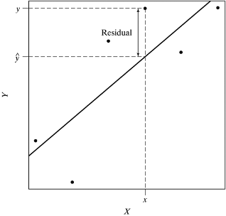
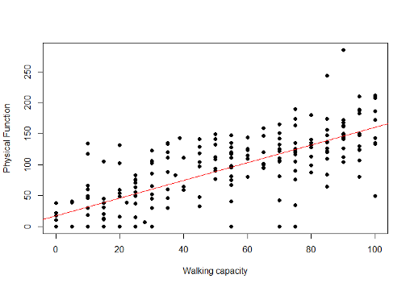

# Lecture 12: Simple and Multiple Linear Regression 
## Correlation and Simple Linear Regression
* Both are methods used for studying the association between two continuous variables
    + Correlation provides a measure of the strength of the association
    + In addition, simple linear regression allows us to predict the ‘outcome’ using the ‘predictor’ variable

### Simple and Multiple Linear Regression
* This lecture will cover methods for
    + Estimation and inference for the best fitting straight line involving either one or two predictors
    + Checking the assumptions of the linear regression model
    + Using the linear regression model for prediction

### Research question
Is walking capacity at 3 months post-stroke associated with physical function at 3 months post-stroke?

```{r, echo=FALSE,out.width='50%'}
knitr::include_graphics('./12_4.png')
```

This question could be answered by calculating a correlation coefficient or fitting a simple linear regression model

Defining a theoretical model prior to setting up a statistical model can help determine which statistic is more appropriate

### Terminologies
```{r, echo=FALSE}
library(knitr)
df<- data.frame(Discipline=c("Epidemiology","Medical/clinical","Statistics","Psychology","Mathematical"),Cause=c("Exposure","Risk factor","Independent","Stimulus","X"),Effect=c("Outcomes","Disease","Dependent","Response","Y"))
knitr::kable(df)
```

### Finch-Mayo Dataset
* We will use the data from the Finch-Mayo study on rehabilitation after stroke
* Who are these people: 
    + Recruited within 72 hours of confirmed stroke using WHO definition
    + Excluded: TIA, not confirmed stroke or non-vascular causes
    + Cognitive or comprehension impairments (MMSE)
    + Altered consciousness 
* Data collection (time points)
    + Baseline (within 3 days): observed performance on specific tasks and rate their difficulty on those tasks
    + Follow-up (at three months): same tasks + rating on activities and participation

### Knowing the type of outcome measure can help specify the theoretical model
```{r, echo=FALSE,out.width='50%'}
knitr::include_graphics('./12_7.png')
```

Ref:  Terminology proposed to Measure What Matters in Health: Journal of Clin Rehab. Mayo NE et. al (2017)

### Research question
Is walking capacity at 3 months post-stroke associated with physical function at 3 months post-stroke?

```{r, echo=FALSE,out.width='50%'}
knitr::include_graphics('./12_4.png')
```

This question could be answered by calculating a correlation coefficient or fitting a simple linear regression model

The variables X and Y are interchangeable when calculating the correlation. But they have specific roles in a regression model
* X is the **independent** or **predictor** or **explanatory** variable	
* Y is the **dependent* or **outcome** or **response** variable

### Measurement scale
* Physical Function (X): Physical Function Index of SF-36. Self-report questionnaire that asks limitations on certain activities (walking a block, climbing stairs etc.)

```{r, echo=FALSE,out.width='70%'}
knitr::include_graphics('./12_9.png')
```

* Walking Capacity (Y): Distance covered in 2 minutes

### Walking capacity <- Physical Function?
a) Draw a rough scatter plot to visually examine the relation between Walking Capacity and Physical Function

b) Calculate the regression line of Walking Capacity on Physical Function

c) What is the estimate of $\sigma$, the residual standard deviation? Calculate a 95% confidence interval for the slope, $\beta$ of the line in (b).

d) What  difference in Walking Capacity do we expect between patients who differ by 1 standard deviation of Physical Function? Provide a 95% confidence interval for this estimate. 

e) Give your prediction for the average Walking Capacity in a group of stroke patients with Physical Function = 50.

f) What is the 95% confidence interval around your answer in (e)?

g) What would be 95% confidence interval for the predicted Walking Capacity of an individual stroke patient with Physical Function = 50?

h) Examine the graph of the residuals. Does a linear regression seem appropriate?

### Descriptive statistics and graphs
* We will begin by looking at the descriptive statistics and some descriptive graphs 
* 225 patients have observations on both variables 

```{r, echo=FALSE,out.width='100%'}
knitr::include_graphics('./12_12.png')
```

### Histogram of walking capacity
```{r, echo=FALSE,out.width='100%'}
knitr::include_graphics('./12_13.png')
```

### Walking capacity vs. Physical Function
```{r, echo=FALSE,out.width='100%'}

```

### Correlation between physical function and walking capacity
```
>a=read.csv("FinchMayoStrokeData.csv",header=T)
> cor.test(a$PFI,a$s3tmwt)

Pearson's product-moment correlation

data:  a$PFI and a$s3tmwt
t = 18.7, df = 223, p-value < 2.2e-16
alternative hypothesis: true correlation is not equal to 0
95 percent confidence interval:
 0.7246944 0.8276250
sample estimates:
      cor 
0.7814195 
```

* The sample correlation is approximately 0.78, implying there is a positive, linear relationship between physical function and walking capacity
* The very low p-value tells us there is enough evidence to reject the null hypothesis that the population correlation coefficient is 0
* The 95% confidence interval ranges from 0.72 to 0.83, approximately

### Results of simple linear regression: Walking capacity <- PFI
#### Output from R
```
Residuals:
     Min       1Q   Median       3Q      Max 
-124.630  -17.474   -3.306   21.877  138.863 

Coefficients:
                  Estimate   Std. Error t value Pr(>|t|)    
(Intercept)       17.09534    4.52145   3.781   0.000201 ***
a$PFI             1.43379     0.07667   18.700  < 2e-16 ***
---
Signif. codes:  0 ‘***’ 0.001 ‘**’ 0.01 ‘*’ 0.05 ‘.’ 0.1 ‘ ’ 1 

Residual standard error: 37.61 on 223 degrees of freedom
  (10 observations deleted due to missingness)
Multiple R-squared: 0.6106,     Adjusted R-squared: 0.6089 
F-statistic: 349.7 on 1 and 223 DF,  p-value: < 2.2e-16
```

### Simple Linear Regression
* Regression analysis is a statistical methodology for studying the relationship between a response variable, Y, and one or more explanatory variables
* Simple linear regression is the special case when we have a single explanatory variable, X, and the functional relation between X and Y is linear.
    + When X is categorical, we have an ANOVA model
* A simple linear regression equation has a form:

\[Y_i=\alpha+\beta X_i+\epsilon_i\]

* model: the intercept ($\alpha$) and the slope ($\beta$).
* The intercept ($\alpha$) is the value of the response variable when the predictor variable is exactly equal to zero. This parameter is of interest only when zero lies in the range of the predictor variable. 
* The slope ($\beta$) measures the increase in the response variable corresponding to a unit increase in the predictor variable.

### Comparison of Regression Lines
```{r, echo=FALSE,out.width='70%'}

```

### Simple Linear Regression Model
* In the simple linear regression model the response variable, $Y_i$, is expressed as the sum of two components: 

1. the **constant** term $\alpha+\beta X_i$, and   
2. the **random** error $\epsilon_i$, where $\epsilon_i$ ~ $N(0,\sigma^2)$

* Hence $Y_i$ is a random variable. We express this as  
$Y_i | X_i$ ~ $N(\alpha+\beta X_i,\sigma^2)$

In words, we say $Y_i$ given $X_i$ follows a normal distribution with  
$E(Y_i | X_i ) =\alpha+\beta X_i$ and  $Variance(Y_i|X_i)=\sigma^2$

### Illustration of assumptions behind Simple Linear Regression
```{r, echo=FALSE,out.width='100%'}
knitr::include_graphics('./12_21.png')
```

### Assumptions involved in Simple Linear Regression
1. Each observed value of the response variable Y is independent of the other values of the response variable

2. There is an approximate linear relationship between the response variable and the explanatory variable

3. The standard deviation of the error random variable is exactly the same for each value of the explanatory variable

4. The probability distribution of the error random variable is normally distributed with mean 0 and standard deviation σ

5. The observed values of the explanatory variable X are measured without error

### Simple Linear Regression
* As usual we represent the “population” and “sample” regression lines using Greek and ordinary alphabets as follows  
  True values: $Y_i=\alpha+\beta X_i+\epsilon_i$   
  Fitted values: $\hat{Y_i}=a+bX_i+e_i$
* By what criterion do we judge what is the best estimated line, i.e. the best values for “a” and “b”?
* The $i^{th}$ residual is $e_i = Y_i-\hat{Y_i}$. If the line was a perfect fit all the residuals would be 0. Clearly, the best “a” and “b” would approach a line of perfect fit as far as possible.
* Which of the following three criteria would be suitable for defining the “best” regression line?

(a) Line which minimizes $\sum_{all\space points}(perpendicular\space distance\space to\space line)$

(b) Line which minimizes $\sum_{all\space points}(vertical\space distance\space to\space line)$

(c) Line which minimizes $\sum_{all\space points}(vertical\space distance\space to\space line)^2$

Method (c) is known as the **Method of Least Squares** and is widely used to estimate “a” and “b”.

### Residual
```{r, echo=FALSE,out.width='50%'}

```

* The figure above illustrates that the residual is the vertical distance between $Y_i$ and the best fitting straight line
* We do not use the perpendicular distance between $Y_i$ and the line because that would be a function of X, and X is fixed
* The sum of the vertical distances would give a line with a=1 and b=0, i.e. a line where there is no association between x and y
* Therefore, we work with the criterion that minimizes the sum of the squared vertical distances or residuals 

### Simple Linear Regression
* The following slides provide mathematical expressions for estimating the slope, intercept, the predicted value of the outcome. 
* Expressions for their confidence intervals are also provided
* You can also obtain these results directly from R without performing any calculation by hand

### Estimating a and b using the method of least squares
* Using calculus and algebra we can find “a” and “b” which minimize the residual sum of squares $\sum_{i=1}^n(Y_i-a-bX_i)^2$ the solutions are as follows:   

$a=\bar Y-b\bar X$  

where  

$b = \frac{\sum_{i=1}^n(x_i-\bar x)(y_i-\bar y)}{\sum_{i=1}^n(x_i-\bar x)^2}$ OR $\frac{n\sum_{i=1}^nx_iy_i-(\sum_{i=1}^nx_i)(\sum_{i=1}^ny_i)}{n\sum_{i=1}^nx_i^2-(\sum_{i=1}^nx_i)^2}$

### Relation between slope and correlation coefficient
* Notice that the slope b can be expressed in terms of the correlation coefficient, $r=b\frac{s_x}{s_y}$
* This implies that the sign of the slope is the same as that of the correlation

### Estimating the error variance
* Having estimated “a” and “b” we can now estimate 2,the assumed common variance, as follows

\[\hat{\sigma}^2=\frac{Residual\space sum\space of\space squares}{n-2}=\frac{\sum_{i=1}^n(Y_i-a-bX_i)^2}{n-2}\]

* Standard errors of a and b are functions of $\hat{\sigma}^2$. They can be used to define confidence intervals and hypothesis tests for the intercept and slope parameters, respectively

### Expressions for standard errors and confidence intervals for parameter estimates
```{r, echo=FALSE}
library(knitr)
df<- data.frame(Standardzerror=c("$se(a)=\\hat{\\sigma}\\sqrt{\\frac{1}{n}+\\frac{\\bar x^2}{\\sum_{i=1}^n(x_i-\\bar x)^2}}$","$se(b)=\\frac{\\hat{\\sigma}}{\\sqrt{\\sum_{i=1}^n(x_i-\\bar x)^2}}$","se(expected value of y at x)$=\\hat{\\sigma}\\sqrt{\\frac{1}{n}+\\frac{(x-\\bar x)^2}{\\sum_{i=1}^n(x_i-\\bar x)^2}}$","se(value of y at x)$=\\hat{\\sigma}\\sqrt{1+\\frac{1}{n}+\\frac{(x-\\bar x)^2}{\\sum_{i=1}^n(x_i-\\bar x)^2}}$"),Confidencezinterval=c("$a\\pm t_{1-\\alpha/2,n-2}\\times se(a)$","$b\\pm t_{1-\\alpha/2,n-2}\\times se(b)$","$\\hat{y}_i\\pm t_{1-\\alpha/2,n-2}$se(expected value of y at x)","$\\hat{y}_i\\pm t_{1-\\alpha/2,n-2}$se(value of y at x)"))
knitr::kable(df, col.names = gsub("[z]", " ", names(df)))
```

### Hypothesis tests for regression coefficients
* To test $H_0:\alpha=\alpha_0$, use the fact that $\frac{\alpha-\alpha_0}{se(a)}$ ~ $t_{n-2}$
* Similarly for $\beta$, to test $H_0:\beta=\beta_0$, use the fact that $\frac{\beta-\beta_0}{se(b)}$ ~ $t_{n-2}$

### Estimating the regression line
Let X = PFI and Y = Walking Capacity  
$b=\frac{\sum_{i=1}^{225}(x_i-\bar x)(y_i-\bar y)}{\sum_{i=1}^{225}(x_i-\bar x)^2}=$ 1.43m/unit change in PFI

* $\bar y = 49.07$ and $\bar x = 87.46$  
$\therefore a=\bar Y-b\bar X=49.07-1.43(87.46)=17.10\space m$
* Thus the regression line is:  Walking Capacity = 17.10 + 1.43 Physical Function
* An increase of 1 unit in Physical Function is associated with an increase of 1.43 metres in walking capacity

### Best fitting straight line
```{r, echo=FALSE,out.width='100%'}

```

### Confidence interval for b
\[\hat{\sigma}^2=\frac{\sum_{i=1}^{225}(Y_i-a-bX_i)^2}{n-2}=1414.51\space m^2\]
\[\rightarrow \hat{\sigma}=37.61\space m\]

95% CI for the slope b is given by: $b\pm t_{0.975,223}\times\frac{\hat{\sigma}}{\sqrt{\sum_{i=1}^n(x_i-\bar x)^2}}$

$=1.43\pm(1.97)\frac{37.61}{\sqrt{240626.7}}$

$=1.43\pm0.15=$ (1.27m/PF-unit, 1.58m/PF-unit)

### Change in walking capacity for a 1 SD change in physical function
* The expected difference in Walking Capacity between individuals whose physical function differs by 32.49 (i.e. a difference of 1 standard deviation)   
  = 1.43 × 32.49 = 46.46
* Standard Error of this estimate     
  = SE(b) × 32.49 = 0.08 × 32.49 = 2.60
* The 95% confidence interval for the difference is  
  46.46 ± 1.97(2.60) = (41.34, 51.58)
  
### Estimating average Walking Capacity for patients with Physical Function=50
* The average Walking Capacity among stroke patients with a Physical Function value of 50 can be estimated from the regression equation as:  

\[Walking\space Capacity_{50}=17.10+1.43(50)=88.60\space m\]

### 95% CI for average Walking Capacity among patients with PF=50
The 95% CI for $BP_{50}$ is given by:

\[\hat{y}_i\pm t_{1-\alpha/2,n-2}\times\sigma\sqrt{\frac{1}{n}+\frac{(x-\bar x)^2}{\sum_{i=1}^n(x_i-\bar x)^2}}\]
\[=88.60\pm t_{0.975,223}\times 37.61\sqrt{\frac{1}{225}+\frac{(50-49.03)^2}{240626.7}}\]
\[=88.60\pm4.94\]
\[=(83.66,93.54)\]

### 95% CI for predicted Walking Capacity in an individual patient with PF=50
The 95% CI for $BP_{50}$ is given by:

\[\hat{y}_i\pm t_{1-\alpha/2,n-2}\times\sigma\sqrt{1+\frac{1}{n}+\frac{(x-\bar x)^2}{\sum_{i=1}^n(x_i-\bar x)^2}}\]
\[=88.60\pm t_{0.975,223}\times 37.61\sqrt{1+\frac{1}{225}+\frac{(50-49.03)^2}{240626.7}}\]
\[=88.60\pm74.25\]
\[=(14.34,162.86)\]

### Regression diagnostics using residuals
* The appropriateness of the linear regression function can be checked informally using diagnostic plots of the residuals against X or the fitted values $(\hat{y})$. These plots can be used to see if  
a) the residuals are randomly distributed about zero,   
b) the error variance is constant for all observations,   
c) an additional non-linear term would improve the fit of the model, and   
d) there are any outliers.

### Plot of residuals vs. predicted value $(\hat{y})$ or exposure (X)
* If the assumptions of the simple linear regression model are met, the residual should be completely independent of X or of the predicted value. 
* If we see a pattern then it is an indication of a problem

### Residual plot: Prototype (a), Ideal Situation: No apparent pattern
```{r, echo=FALSE,out.width='100%'}
knitr::include_graphics('./12_41.png')
```

### Residual plot: Prototype (b), Suggests that the linear model is inappropriate. Quadratic model (with $x^2$) may be needed 
```{r, echo=FALSE,out.width='100%'}

```

### How does the non-linear pattern arise?
* If the true model is non-linear, for example:
    + True model: $y_i=\alpha+\beta x_i+\gamma x_i^2+\epsilon_i$
    + Fitted (incorrect) model: $\hat{y}_i=a+bx_i$
* $Residual=y_i-\hat{y}_i=(\alpha-a)+(\beta-b)x+\gamma x_i^2+\epsilon_i$
* Therefore, the residual is a non-linear function of x as can be seen from prototype (b).

### Residual plot: Prototype (c), Plot suggests variance is not constant. Transformation may help. 
```{r, echo=FALSE,out.width='100%'}
knitr::include_graphics('./12_44.png')
```

### Residual plot for Walking Capacity vs. Physical Function model
```{r, echo=FALSE,out.width='100%'}
knitr::include_graphics('./12_45.png')
```

* From the residual plot we can see that the residuals are randomly dispersed around zero. The absence of any pattern here indicates that the linear regression is an appropriate fit.
* However, a plot of the standardized residuals indicates there may be a few outliers.

### What is the impact of an outlier? 
* The influence exerted by an outlier depends both on its X and Y values. As the sample size increases, its influence decreases
* When an outlier has an X value far from the mean it primarily influences the slope. Outliers close to the mean of X influence the intercept

### What should we do with an outlier?
* Check if it is a recording error
* Fit model with and without it and examine its impact on intercept and slope estimates
    + If they do not change, the outlier is of no consequence
    + If they do change, more must be done to resolve the problem
* E.g. Refit model of Walking Capacity <- Physical Function after removing observations

### QQ-plot to see if residuals are normally distributed
* To see if the residuals are normally distributed we use a quantile-quantile (Q-Q) plot to compare the quantiles of the standardized residuals to those of the standard normal distribution
    + If the points lie along the reference line then we can reasonably assume that the residuals are normally distributed
    + This is important to ensure validity of all inferences based on the model (confidence intervals, hypothesis tests, prediction intervals)
* A concave or convex pattern suggests the residuals follow a skewed distribution
* An S-shaped pattern suggests that the residuals have either shorter tails of longer tails than the normal distribution
* If there appears to be a severe deviation from normality:
    + A statistical test may be needed to test whether there is a statistically significant deviation
    + a transformation may be required
    
### Q-Q plot for Walking Capacity vs. Physical Function model
```{r, echo=FALSE,out.width='100%'}
knitr::include_graphics('./12_51.png')
```

### What does the QQ plot tell us?
* For the model of Walking Capacity vs. PFI model the QQ plot suggests that the tails of the residual distribution are wider than those of a standard normal distribution. 
    + Due to the relatively large sample size we would not expect this to have much impact
    
### Goodness of fit
```{r, echo=FALSE,out.width='100%'}

```

* Let’s say that instead of estimating “a” and “b” we simply estimated Yi by $\bar y$. This would be equivalent to assuming a=$\bar y$ and b=0. In other words, there is no information gained from X on the distribution of Y. In that case the residual sum of squares would reduce to 

\[\sum_{i=1}^n(Y_i-\hat{y})^2=\sum_{i=1}^n(Y_i-\bar{y})^2\]

which is called the **Total Sum of Squares**. This is the maximum possible value of the residual sum of squares.

* A commonly used method to estimate the utility of our linear regression line is to estimate the proportion of the total variation in Y that is “explained” by X. This can be estimated as follows:

\[R^2=1-\frac{Residual\space sum\space of\space squares}{Total\space sum\space of\space squares}\]

* If the Total Sum of Squares is much larger than the Residual Sum of Squares then we can say we have a “Good Fit”. Note that Pearson’s correlation (r) is related to $R^2$ as follows: $r=\pm\sqrt{R^2}$
* For our example we can find the value of $R^2$ in the R output to be 0.6106
* We can verify that the square root of 0.6106 is roughly 0.78 or the correlation coefficient

### Multiple Linear Regression: Conceptual Model
```{r, echo=FALSE,out.width='100%'}
knitr::include_graphics('./12_56.png')
```

### Self-Perceived Health <- Physical Function + covariates
* **Outcome**: Self-Perceived Health
* **Principle explanatory variable**: Physical Function
* **Confounding variables**: Walking capacity, Gender
* **Effect modifier**: Mental Health
* **Possibly Collinear variables**: Physical Function and Walking Capacity

### Exploratory analyses
* Increasing, linear relation between Self-perceived health and Physical function
* Possible confounding variable: Walking capacity
* Possible effect modifier: Mental function
* Possible multicollinearity problems: (physical function, walking capacity), (physical function, mental function), (walking capacity, mental function)

### Multiple Linear Regression Model
```
Call:
lm(formula = a$eqtherm ~ PFI + MHI + PFI * MHI + s3tmwt + gender, 
    data = a, subset = -155)

Residuals:
    Min      1Q  Median      3Q     Max 
-54.524 -12.119   2.276  10.261  39.790 

Coefficients:
             Estimate Std. Error t value Pr(>|t|)    
(Intercept) 64.890092   6.342228  10.231  < 2e-16 ***
PFI         -0.291713   0.141446  -2.062  0.04045 *  
MHI          0.008999   0.092106   0.098  0.92227    
s3tmwt       0.024943   0.030055   0.830  0.40757    
gender      -2.797760   2.461413  -1.137  0.25703    
PFI:MHI      0.005343   0.001757   3.040  0.00267 ** 
---
Signif. codes:  0 ‘***’ 0.001 ‘**’ 0.01 ‘*’ 0.05 ‘.’ 0.1 ‘ ’ 1 

Residual standard error: 16.49 on 203 degrees of freedom
  (25 observations deleted due to missingness)
Multiple R-squared: 0.2171,     Adjusted R-squared: 0.1978 
F-statistic: 11.26 on 5 and 203 DF,  p-value: 1.358e-09 
```

### Results$^*$ of simple and multiple linear regression models
```{r, echo=FALSE}
library(knitr)
df<- data.frame(Variable=c("Physical Function","Mental Health","Walking Capacity","Gender","Stroke Severity","Physical Function $^*$ Mental Health"),SimplezLinearzRegression=c("0.2 (0.1, 0.3)","0.3 (0.2, 0.4)","0.1 (0.05, 0.13)","-3.9 (-9.5, 0.5)","1.0 (0.03, 1.0)","--"),MultiplezLinearzRegression=c("-0.29 (-0.57, -0.12)","0.008 (-0.17, 0.19)","0.02 (-0.03, 0.1)","-2.8 (-7.7, 2.1)","--","0.005 (0, 0.008)"))
knitr::kable(df, col.names = gsub("[z]", " ", names(df)))
```

$^*$Slope and 95% confidence interval

### Interpretation of regression coefficients in a model with interaction terms
* Y = b0 + b1$^*$X1 + b2$^*$X2 + b3$^*$X1$^*$X2 + b4$^*$X3  
      = b0 + (b1 + b3$^*$X2)$^*$X1 + b2$^*$X2 + b4$^*$X3   
      = b0 + b1$^*$X1 + (b2 + b3$^*$X1)$^*$X2 + b4$^*$X3

Change in Y for unit change in X3 = b4

Change in Y for unit change in X1 = b1 + b3$^*$X2

Change in Y for unit change in X2 = b2 + b3$^*$X1

* Intercept is meaningful if all covariates can be simultaneously 0. If not, it only plays a role in calculating the predicted values
* Slope = Change in outcome for a unit change in explanatory variable, while all other variables remain constant
    + e.g.  Increase in 1m on walking capacity test results in increase in 0.02 units in self-perceived health, holding other variables constant
    + e.g. Women score -2.8 units lower on the self-perceived health scale than men, holding other variables constant

### Interpretation of coefficients of interaction terms
* Interaction terms appear as products between explanatory variables. Needed when one explanatory variable modifies the effect of the other.
    + e.g. Mental Health modifies the relation between Physical Function and Self-Perceived Health
* Therefore, we **cannot** say an increase in 1 unit of PFI results in a decrease in Self-Perceived Health of 0.29 units, all other variables remaining fixed
* Instead, we talk of the slope of PFI at a given MHI
e.g. When MHI=10, self-perceived health changes by -0.29 + 0.005*10 = -0.24 when PFI increases by 1 unit
e.g. When MHI=90, self-perceived health changes by -0.29 + 0.005*90  = 0.16 when PFI increases by 1 unit 

### Model checking
* Once again, we use plots and statistics based on the residuals, i.e. Observed – Predicted values
* Your software program may produce the following statistics:
    + **Variance Inflation Factor (VIF)**: Values greater than 10 indicate multicollinearity
    + **DFFITS**: Indicates how much an observation influences predicted values
    + **DFBETAS**: Indicates how much an observation influences the regression coefficients
    + **Cook’s distance**: Detects multivariate outliers that may not show up on scatter plot of a single explanatory variable. Values greater than 1 are problematic. 

### Residuals vs. Fitted values for our example
```{r, echo=FALSE,out.width='100%'}
knitr::include_graphics('./12_66.png')
```

### Standardized Residuals vs. Fitted Values
```{r, echo=FALSE,out.width='100%'}
knitr::include_graphics('./12_67.png')
```

### QQ (normal)-plot of standardized residuals
```{r, echo=FALSE,out.width='30%'}
knitr::include_graphics('./12_68.png')
```

### VIF for our example
```
> vif(m2)
      PFI                MHI      s3tmwt    gender      PFI:MHI 
15.756764  2.997654  2.437211  1.105772 19.009896
```

* A remedy for multicollinearity, particularly for models with interaction or quadratic terms, is to centre the explanatory variables. For our example this helps:

```
> vif(m2)
     PFI      MHI a$s3tmwt a$gender  PFI:MHI 
2.711766 1.248527 2.437211 1.105772 1.066550 
```

### Model with centred PFI and MHI (notice change in slopes of these variables!)
```
Call:
lm(formula = a$eqtherm ~ PFI + MHI + PFI * MHI + a$s3tmwt + a$gender, 
    subset = -155)

Residuals:
    Min      1Q  Median      3Q     Max 
-54.524 -12.119   2.276  10.261  39.790 

Coefficients:
             Estimate Std. Error t value Pr(>|t|)    
(Intercept) 69.403873   3.100819  22.382  < 2e-16 ***
PFI          0.079324   0.058679   1.352  0.17793    
MHI          0.270968   0.059443   4.558  8.9e-06 ***
a$s3tmwt     0.024943   0.030055   0.830  0.40757    
a$gender    -2.797760   2.461413  -1.137  0.25703    
PFI:MHI      0.005343   0.001757   3.040  0.00267 ** 
---
Signif. codes:  0 ‘***’ 0.001 ‘**’ 0.01 ‘*’ 0.05 ‘.’ 0.1 ‘ ’ 1 

Residual standard error: 16.49 on 203 degrees of freedom
  (25 observations deleted due to missingness)
Multiple R-squared: 0.2171,     Adjusted R-squared: 0.1978 
F-statistic: 11.26 on 5 and 203 DF,  p-value: 1.358e-09 
```

NOTE: Residual plots were not much affected. Results not shown.

### Results$^*$ of multiple linear regression model before and after centering
```{r, echo=FALSE}
library(knitr)
df<- data.frame(Variable=c("Physical Function","Mental Health","Walking Capacity","Gender","Stroke Severity","Physical Function $^*$ Mental Health"),MultiplezLinearzRegressionzbeforezcentering=c("-0.29 (-0.57, -0.12)","0.008 (-0.17, 0.19)","0.02 (-0.03, 0.1)","-2.8 (-7.7, 2.1)","--","0.005 (0, 0.008)"),MultiplezLinearzRegressionzafterzcentering=c("0.08 (-0.04, 0.19)","0.27 (0.15, 0.39)","0.02 (-0.03, 0.1)","-2.8 (-7.7, 2.1)","--","0.005 (0.002, 0.009)"))
knitr::kable(df, col.names = gsub("[z]", " ", names(df)))
```

$^*$Slope and 95% confidence interval

### Revised interpretation of interaction terms
* e.g. When MHI=10, self-perceived health changes by 0.079324  + (10-mean(MHI))*0.005 = -0.24 when PFI increases by 1 unit
* e.g. When MHI=90, self-perceived health changes 0.079324 + (90-mean(MHI))*0.005 = 0.19 when PFI increases by 1 unit 
* Notice that our interpretation has not changed much, though the regression coefficients did change.
* Multicollinearity does not affect predictions made by the model or $R^2$ but it can bias the standard errors of regression coefficients, affecting p-values and CIs

### Interpretation of regression coefficients in a model with centred explanatory variables
* $Y=b0+b1^*(X1-\overline{X1})+b2^*(X2-\overline{X2})+b3^*(X1-\overline{X1})^*(X2-\overline{X2})+b4^*X3$  
$=b0+(b1+b3^*(X2-\overline{X2}))^*X1+b2^*(X2-\overline{X2})+b4^*X3-b1^*\overline{X1}$  
$=b0+(b2+b3^*(X1-\overline{X1}))^*X2+b1^*(X1-\overline{X1})+b4^*X3-b2^*\overline{X2}$

Change in Y for unit change in X3 = b4

Change in Y for unit change in $X1 = b1 + b3^*(X2-\overline{X1})$ 

Change in Y for unit change in $X2 = b2 + b3^*(X1-\overline{X2})$

Notice that when X2 is at its mean value, the slope of X1 is exactly equal to b1. Similarly, when X1 is at its mean value, the slope of X2 is b2.

### Inference for slopes
* As in the case of simple linear regression, we can estimate the standard error of each regression coefficients.
* For those variables that are not involved in an interaction term, confidence intervals or hypothesis tests can be constructed as we saw previously based on the t-distribution (with n-p-1 degrees of freedom, n=209 & p=5 in our example)
* For variables that include interaction terms calculations may need to be done by hand

### Example: Inference for slope of PFI when MHI=90
* Obtain the variance-covariance matrix for the regression coefficients
* se = Stderror of slope of PFI when MHI = 90   
$= sqrt(variance(b_{PFI}) + variance((90-mean(MHI))*b_{PFI:MHI})$  
$+2*covariance(b_{PFI},(90-mean(MHI))*b_{PFI:MHI}))$    
$= sqrt(3.443211e-03 +(90-mean(MHI))^2* 3.088759e-06$  
$+2*(90-mean(MHI)) * (-1.203307e-05))$  
$=  0.06522543$  
(Note that the $variance(b_{PFI})$ can also be obtained as the square of its standard error)

Where:  
$b_{PFI}=$ regression coefficient of PFI  
$b_{PFI:MHI} =$ regression coefficient of interaction term

The 95% CI is given by $b_{PFI} + (90-mean(MHI))*b_{PFI:MHI}± t_{203,1-α/2}se$  
= (0.06, 0.31)

### ANOVA table for Multiple Linear Regression Model$^*$
```
> summary(aov(b6))
                      Df Sum Sq   Mean Sq F value    Pr(>F)    
PFI                 1   8304      8304.5   30.5534 9.905e-08 ***
MHI               1   4110      4110.1   15.1216 0.0001365 ***
a$s3tmwt     1    139      139.3      0.5126 0.4748392    
a$gender      1    234      234.2      0.8616 0.3543937    
PFI:MHI         1   2513    2512.6    9.2441 0.0026738 ** 
Residuals   203  55176  271.8                      
---
Signif. codes:  0 ‘***’ 0.001 ‘**’ 0.01 ‘*’ 0.05 ‘.’ 0.1 ‘ ’ 1 
25 observations deleted due to missingness
```

$^*$sequential analysis of variance table comparable to linear regression models adding each variable one at a time. Hence, PFI is statistically significant here. The F-value is the square of the t-value from a model including PFI as the only covariate. The F-value for MHI is the square of the t-value from a model including both PFI and MHI and so on.

### Adjusted R-squared
* $R^2$ will increase steadily as p (the number of explanatory variables in the model) increases.  
  For our example, $R^2 =1-55175.77/70476 = 0.2171$
* Therefore, we need to penalize the model fit for variables that do not improve prediction. This is achieved by:

	$R^2$ adjusted = 1 – MSE/MSTOT   
                 = 1-(16.49*16.49)/(70476/(208)) = 0.1975,   
  for our example

$R^2$ adjusted can be negative. Higher values indicate better fit.
