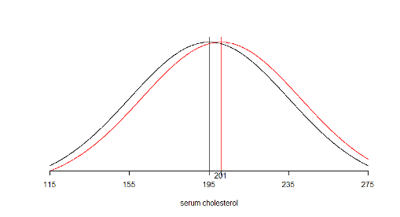

# Lecture 4: Inference for means continued
## Hypothesis testing 
### Example 1: Nck1 and adipogenesis continued
* Whereas in the previous lecture we saw how to carry out statistical inference about the differences between Nck1 wild type and Nck1 knock out mice using confidence intervals, the manuscript relied on hypothesis testing

### Hypothesis testing
* Hypothesis testing is an alternative approach to statistical inference that also relies on the Central Limit Theorem
* The research question takes the form of a decision making problem, e.g. 
    + Does mobility improve 3-months after a stroke?
    + Is there a difference in the improvement in mobility between men and women after a stroke?
    + Does Treatment A improve life-expectancy compared to Treatment B?
* Each of these questions can be answered yes or no. Each response can be expressed as a specific statement
* We can view the response to the stroke mobility problem as a choice between the following two statements or hypotheses
    + $H_0$: There is no improvement in mobility 3 months after stroke
    + $H_A$: There is improvement in mobility 3 months after stroke
* In general, a decision-making problem can be framed in terms of a null hypothesis $(H_0)$ and an alternative hypothesis $(H_A)$. The $H_A$ is the complement of the null hypothesis
* We typically focus on the null hypothesis, which is usually simpler than the alternative hypothesis, and decide whether or not to reject it. 
* To this end, we examine the evidence that the observed data provide against the null hypothesis $H_0$
* If the evidence against $H_0$ is strong, **we reject $H_0$** 
* If not, we state that the evidence provided by the data is not strong enough, and **we fail to reject $H_0$**.

### Hypothesis testing for a single mean
* The hypothesis test may be set up with 
    + a two-sided alternative 
    + or a one-sided alternative
* resulting in 3 different possibilities mentioned in 
the following slides

### Mobility after stroke: two-sided alternative hypothesis
```{r, echo=FALSE}
library(knitr)
df<- data.frame(Null_Hypothesis = c("$H_0$: The **true mean** change in the STREAM score between 3-days and 3 months post stroke **is 0 units**"),Alternative_Hypothesis=c("$H_A$: The **true mean** change in the STREAM score between 3-days and 3 months post stroke **is not 0 units**"))
df2=head(df)
knitr::kable(df2, col.names = gsub("[_]", " ", names(df)))
```

### Mobility after stroke: one-sided alternative hypothesis I
```{r, echo=FALSE}
library(knitr)
df<- data.frame(Null_Hypothesis = c("$H_0$: The **true mean** change in the STREAM score between 3-days and 3 months post stroke **is less than or equal to 0 units**"),Alternative_Hypothesis=c("$H_A$: The **true mean** change in the STREAM score between 3-days and 3 months post stroke **is greater than 0 units**"))
df2=head(df)
knitr::kable(df2, col.names = gsub("[_]", " ", names(df)))
```

### Mobility after stroke: one-sided alternative hypothesis II
```{r, echo=FALSE}
library(knitr)
df<- data.frame(Null_Hypothesis = c("$H_0$: The **true mean** change in the STREAM score between 3-days and 3 months post stroke **is greater than or equal to 0 units**"),Alternative_Hypothesis=c("$H_A$: The **true mean** change in the STREAM score between 3-days and 3 months post stroke **is less than 0 units**"))
df2=head(df)
knitr::kable(df2, col.names = gsub("[_]", " ", names(df)))
```

### More generally, the hypothesis test for a single mean may be stated as follows
* The null and alternative hypotheses for a two-sided test may be stated as

$H_0: µ = µ_0\space\space\space\space\space vs \space\space\space\space\space H_A: µ ≠ µ_0$

where µ denotes the true population mean $µ_0$ is a known constant

* The null and alternative hypotheses for a one-sided test can be stated as follows

$H_0: µ ≤ µ_0 \space\space\space\space\space vs \space\space\space\space\space H_A: µ > µ_0$

OR

$H_0: µ ≥ µ_0\space\space\space\space\space vs \space\space\space\space\space H_A: µ < µ_0$

### Example: Mobility after stroke

```{r, echo=FALSE}
library(knitr)
df<- data.frame(z = c("Number of cases","Minimum","Maximum","Mean","Standard deviation"),Threezdayszafterzstroke=c(235,0,100,68.30,30.12),Threezmonthszafterzstroke=c(235,0,100,83.75,22.74),Difference=c(235,-22.22,91.67,"$\\bar y = 15.45$","s = 18.97"))
df2=head(df)
knitr::kable(df2, col.names = gsub("[z]", " ", names(df)))
```

### Defining the test statistic and the rejection region
* Recall that based on the Central Limit Theorem,  
$\bar Y$ ~ $N(\mu,\sigma^2/n)$ or $\bar Y$ ~ $N(\mu,\sigma^2/235)$

* We can also express this as $\frac{\bar Y-\mu}{\frac{\sigma}{\sqrt n}}$ follow a standard normal distribution
* We can use our knowledge of the sampling distribution of $\frac{\bar Y-\mu}{\frac{\sigma}{\sqrt n}}$ (the test statistic) to determine which values are likely under the null hypothesis
* We define a rejection region such that if test statistic falls in this region we reject the null hypothesis

### Defining the t-test statistic
* As in the case of the construction of a confidence interval, we are faced, with the problem that we seldom know the true standard deviation. 
* We can **estimate** the value of the unknown population standard deviation using the sample standard deviation $\hat{\sigma}=s=18.97$
* The standardized test statistic is then $\frac{\bar Y-\mu}{\frac{\sigma}{\sqrt n}}=\frac{15.45}{\frac{18.97}{\sqrt{235}}}=12.49$
* This statistic is referred to as the **t-statistic** as it follows a t-distribution with n-1 degrees of freedom
* The corresponding hypothesis test is called the **t-test**. 

### Rejection region for the t-test
```{r 4_15, echo=FALSE,out.width='50%'}
knitr::include_graphics('./4_15.png')
```

* Our goal is to select a rejection region such that it covers values that are unlikely under the null hypothesis
* The form of rejection region depends on the statement of the alternative hypothesis. * We first consider the two-sided alternative. Under this alternative hypothesis, the rejection region covers the extremes of the distribution on both sides
* The two areas each covering with 0.025 probability in the extremes are unlikely under the null hypothesis as illustrated by the diagram. They correspond to a **Type I error of 0.025+0.025 = 0.05**, which we will define shortly
* Under the t-distribution with degrees of freedom = n-1 = 234, these areas may be identified by the quantiles $Q_{0.025} = -1.97$ and $Q_{0.975} = 1.97$
    + Therefore, if the t-statistic is above 1.97 or less than -1.97 we reject the null hypothesis
* In our example, 12.49 is well above 1.97 so we **reject the null hypothesis**

### Comparison to confidence interval
* The hypothesis testing approach resulted in a similar conclusion to the equal-tailed confidence interval derived earlier in that we concluded that mobility improves 3 months after stroke
* In fact, the equal-tailed 95% confidence interval derived previously gives the range of possible values of the null hypothesis that cannot be rejected. 
    + All values outside that interval will be rejected
    + That happens to include the value of 5 units which defines a clinically meaningful improvement

### Determining the rejection region using R
We use the qt() function to obtain the quantiles of a t-distribution corresponding to the desired tail-area probability

> qt(0.025,234)  
[1] -1.970154

> qt(0.975,234)  
[1] 1.970154


The sample size is very large. Therefore, for all practical purposes the t-distribution with degrees of freedom n-1 = 234 is like a normal distribution

> qnorm(0.025)  
[1] -1.959964

> qnorm(0.975)  
[1] 1.959964

### Type I and Type II errors
* With respect to our decision regarding the null hypothesis we can make two types of errors
    + Type I error (α): We reject $H_0$ when it is true
    + Type II error (β): We fail to reject $H_0$ when it is not true (i.e. when $H_A$ is true)
* Clearly, we wish to minimize the chance of these errors. Typical values are α=0.05 and β=0.2 

### Hypothesis testing: A summary
1. Define null and alternative hypotheses
2. Define test statistic
3. Define rejection region with suitably selected Type I error α 
4. If test statistic lies in the rejection region then reject null hypothesis, otherwise conclude that you do not have enough evidence to reject the null hypothesis

### Similarity between diagnostic testing and  hypothesis testing
```{r 4_21a, echo=FALSE,out.width='50%'}
knitr::include_graphics('./4_21a.png')
```

* Sensitivity = A / (A+C)
* Specificity = D / (B+D)
* A, B, C and D are numbers of individuals tested

```{r 4_21b, echo=FALSE,out.width='50%'}
knitr::include_graphics('./4_21b.png')
```

* 1-Type II error (Power) = A / (A+C)
* 1-Type I error = D / (B+D)
* A, B, C and D are values of the test statistic observed across repeated experiments

### Defining the t-test statistic, for a one-sided test
* Consider the situation where we pose the null and alternative hypotheses as follows  
$H_0: µ ≤ µ_0 \space\space\space\space\space vs \space\space\space\space\space H_A: µ > µ_0$ 

* The test statistic is still evaluated at $µ = µ_0 = 0$ as before
* However, the rejection region is one-sided. In order to ensure that the rejection region has a 5% probability as in our previous example, we will define it as the region above $Q_{0.95} = 1.65$
* For our example, the t-statistic would remain unchanged at 12.49 and therefore would lie in the rejection region once again, leading to the same conclusion as before

### Why did the test statistic not change for the one-sided hypothesis test?
* Notice that though our null hypothesis was $H_0: µ ≤ 0$, we calculated the test-statistic at µ=0
* This is because we know that rejection region under smaller values of µ below zero will be shifted to the left compared to $Q_{0.95} = 1.65$
* Therefore, if our test statistic results in rejecting µ=0, it will certainly result in rejecting values of µ less than 0 

### What is statistical significance?
* As mentioned earlier, the rejection region is selected so that it is unlikely under the null hypothesis
* Therefore, when the test-statistic falls in the rejection region, we say it is statistically significant
* Traditionally, this region is selected to have 5% probability under the null hypothesis. However, 5% is arbitrary
* Note that in setting up the test statistic, only the null hypothesis came into play. The alternative hypothesis did not matter

### What is a p-value?
* The p-value is defined as the probability of being more extreme than the test statistic under the null hypothesis  
	= **P(Test statistic is more extreme than its observed value | H0)**
* In our example, involving a **one-sided** test  
$p-value = P(T_{234} > 12.49 |H_0) = 1-pt(12.49,234) = 0$
* Clearly, when the test statistic is statistically significant, the p-value is less than 5% or more generally it is less than the Type I error
* This explains why the p-value is often compared to 5% to determine statistical significance

### p-value illustrated
```{r 4_26, echo=FALSE,out.width='50%'}
knitr::include_graphics('./4_26.png')
```

* Notice the difference between the p-value and the rejection region for a **two-sided** test
    + The red lines mark off the rejection region of α=0.05 at ±1.97
    + The blue line is a hypothetical observed t-statistic=2.3
    + The shaded area marks off the p-value
    + The green line is at -2.3, was not observed. Yet, we use the area beyond it to obtain a two-sided p-value 

```{r 4_27, echo=FALSE,out.width='50%'}
knitr::include_graphics('./4_27.png')
```

* This figure illustrates the p-value for a one-sided test with $H_A: µ > µ_0$
    + Once again, the red line marks off the rejection region of α=0.05 at 1.65
    + The blue line is the observed t-statistic=2.3 in this illustration
    + The shaded area marks off the p-value. Note that the p-value is half that of the one-sided test by definition

```{r 4_28, echo=FALSE,out.width='50%'}
knitr::include_graphics('./4_28.png')
```

* Finally, this figure illustrates the p-value for a one-sided test with $H_A: µ < µ_0$
    + This time, the red line marks off the rejection region of α=0.05 at -1.65
    + The blue line is the observed t-statistic=-2.3 in this illustration
    + The shaded area marks off the p-value

### Type I and Type II errors
```{r 4_29, echo=FALSE,out.width='50%'}
knitr::include_graphics('./4_29.png')
```

* Recall
    + Type I error is the probability of rejecting the null hypothesis when it is true
    + Type II error is the probability of not rejecting the null hypothesis when the alternative is true

### t-test
```{r 4_30, echo=FALSE,out.width='50%'}

```

* The t.test function in R tells us that that we can reject the null hypothesis of no difference in the mean log10 interleukin levels in the two groups at the Type I error level of 0.05

### A bit of history: Pearson vs. Fisher
* The hypothesis test and p-value were proposed by Karl Pearson and Ronald Fisher, respectively, who were contemporaries who strongly disagreed with each other
* It is ironic that today we use these two techniques together!
* As we will discuss in greater detail in later lectures, there has been a backlash against both these approaches and a move towards usage of confidence intervals or Bayesian methods

### Inference for comparing two means
* The hypothesis test for comparing two means resembles the structure of the hypothesis test for a single mean
    + it can be two-sided or one-sided
    + the form of the test-statistics depends on the study design and assumptions, e.g.
        - Whether the study design involves paired or unpaired means
        - Assuming the variance in the two groups is equal or not
        - Assuming the variance is known or not

### Stroke study: Question 2, two-sided alternative hypothesis
```{r, echo=FALSE}
library(knitr)
df<- data.frame(Null_Hypothesis = c("$H_0$: The true mean change in the STREAM score between 3-days and 3 months post stroke **is the same for men and women**"),Alternative_Hypothesis=c("$H_A$: The true mean change in the STREAM score between 3-days and 3 months post stroke **is not the same for men and women**"))
df2=head(df)
knitr::kable(df2, col.names = gsub("[_]", " ", names(df)))
```

### Stroke study: Question 2, one-sided hypothesis I
```{r, echo=FALSE}
library(knitr)
df<- data.frame(Null_Hypothesis = c("$H_0$: The true mean change in the STREAM score between 3-days and 3 months post stroke **is at most as great in men as in women**"),Alternative_Hypothesis=c("$H_A$: The **true mean change** in the STREAM score between 3-days and 3 months post stroke **is greater in men than in women**"))
df2=head(df)
knitr::kable(df2, col.names = gsub("[_]", " ", names(df)))
```

### Stroke study: Question 2, one-sided hypothesis II
```{r, echo=FALSE}
library(knitr)
df<- data.frame(Null_Hypothesis = c("$H_0$: The true mean change in the STREAM score between 3-days and 3 months post stroke **is at least as great in men as in women**"),Alternative_Hypothesis=c("$H_A$: The **true mean change** in the STREAM score between 3-days and 3 months post stroke **is lesser in men than in women**"))
df2=head(df)
knitr::kable(df2, col.names = gsub("[_]", " ", names(df)))
```

### Example: One-sided or two-sided test?
* We return to the second research question based on the stroke dataset. It is of interest to compare the change in mobility (from baseline to 3 months) between men and women
* One way to do this is to carry out a hypothesis test.
* We will begin with a two-sided hypothesis test:  

$H_0: \mu_1=\mu_2\space\space\space\space\space vs. \space\space\space\space\space H_A:\mu_1\neq\mu_2$

where $µ_1$ is the true mean change in mobility in men and $µ_2$ is the true mean change in women

### Difference in change in mobility between men and women

```{r, echo=FALSE}
library(knitr)
df<- data.frame(z=c("Number of cases","Mean","Standard deviation"),ChangezinzMen=c(144,"$\\bar y_1 = 17.09$","$s_1 = 19.25$"),ChangezinzWomen=c(91,"$\\bar y_2 = 12.86$","$s_2 = 18.31$"))
df2=head(df)
knitr::kable(df2, col.names = gsub("[z]", " ", names(df)))
```

* Recall that we had assumed that the variance is the same in both groups being compared and calculate a pooled variance that averages across both groups of $s_{diff}=2.53$

### Comparing change in mobility between men and women
* The t-statistic is given by 

\[\frac{\bar Y_1-\bar Y_2-(\mu_1-\mu_2)}{s_{diff}}=\frac{\bar Y_1-\bar Y_2}{s_{diff}}=\frac{17.09-12.86}{2.53}=1.67\]

* Since we are working under the assumption that the variances are equal, the t-distribution used to define the rejection region has degrees of freedom n1+n2-2 (as we saw previously when defining a confidence interval for comparing two means)
* If we use a Type I error value of α=0.05, we **would** reject the null hypothesis if it lies below -1.96 or above 1.96
* In our case, the t-statistic falls within this **region** so we say “we do not have enough evidence to reject the null hypothesis”
* The p-value is 0.09, which exceeds 0.05 
* The p-value can be calculated as follows in R  

> 2*(1-pt((17.09-12.86)/2.53,233))  
[1] 0.09587913

### What if our alternative hypothesis was one-sided instead?
* It is to be expected that men may experience a greater improvement in mobility than women. Therefore, we can restate our hypothesis test as:

$H_0: µ_1 ≤ µ_2 \space\space\space\space\space vs \space\space\space\space\space H_A: µ_1 > µ_2$ 

where µ1 is the true mean change in men and µ2 is the true mean change in women

* As in the case of hypothesis testing for a single mean, the test statistic remains the same
* However the rejection region is one-sided. Using the quantiles of the t-distribution with n1+n2-2=233 degrees of freedom, we can determine that the rejection region includes the region above $Q_{0.95} = 1.65$. Therefore, our test statistic of 1.67 lies in the rejection region
* In comparison with this rejection region, we would conclude that we have enough evidence to reject the null hypothesis that the mean change in mobility in men is less than or equal to that of women

### What if our alternative hypothesis was one-sided in the other direction?
* Only for the purpose of illustrating how the rejection region is defined, let us restate our hypothesis test as:

$H_0: µ_1 \geq µ_2 \space\space\space\space\space vs \space\space\space\space\space H_A: µ_1 < µ_2$ 

where µ1 is the true mean change in men and µ2 is the true mean change in women

* Once again, the test statistic remains the same
* However the rejection region is now the region below $Q_{0.95} = -1.65$. Therefore, our test statistic of 1.67 does not lie in the rejection region
* This would lead us to conclude we do not have enough evidence to reject the null hypothesis that the mean change in mobility men is less than or equal to that in women

### What if our null hypothesis was one-sided instead?
* The p-value for this situation is  
P(Test statistic > 1.67| H0)
* In R this can be calculated as (1-pt((17.09-12.86)/2.53,233)) = 0.04793956,
which falls below the Type I error level of α=0.05

### Why did our conclusion change when we moved from a two-sided to a one-sided hypothesis?
* The two-sided test is a more stringent test, which makes it more difficult to reject the null hypothesis 
* Under a two-sided alternative we have to consider the probability of being more extreme than the observed value on both sides of the null 
* This would be relevant only if we thought that it were possible that the difference $\bar Y_1-\bar Y_2$ could be either positive or negative
* If we have reason to believe that men are unlikely to have worse mobility than women, the one-sided test would make more sense in the context of our example

## Hypothesis testing vs. confidence interval estimation
### What is statistics?
*Statistics is a collection of procedures and principles for gathering data and analyzing information in order to help people make decisions when faced with uncertainty*  
[Utts & Heckard](https://www.amazon.ca/Statistical-Methods-Internet-Companion-Statistics/dp/0495122505) in ‘Statistical Ideas & Methods’

### Quantifying uncertainty vs. decision making
* The hypothesis testing framework is designed to support decision making, e.g. 
    + Whether to take an umbrella to work
    + Whether the observed association between a predictor and an outcome is real
* Confidence interval estimation, on the other hand, conveys the uncertainty in our knowledge about a statistic, e.g.
    + There is a 60%-80% chance it will rain today
    + The difference in survival associated with treatment A vs. treatment B is 60%-80%

### Interpreting Confidence Intervals vs. Hypothesis Tests$^*$
* Suppose that you have just calculated a confidence interval for a certain parameter. There are five possible conclusions that can be drawn, depending on where the upper and lower confidence interval limits fall in relation to the upper and lower limits of the region of clinical equivalence. 
* The region of clinical equivalence, sometimes called the region of indifference, is the region inside of which both treatments would be considered to be the same for all practical purposes.  

$^*$From Lawrence Joseph’s notes

#### Interpreting confidence intervals: 5 possible conclusions
```{r 4_48, echo=FALSE,out.width='50%'}

```

### Notes on significance tests$^*$
* We saw that there are two ways of reporting the results of a hypothesis test – either we can report **the decision** (reject vs. not reject which is the same thing as significant vs. not significant) or **the p-value**
* Reporting the p-value is more informative than merely reporting whether a test was “significant” or “not significant”.
* The level of significance, $\alpha$, is often set to 0.05, but it should be chosen according to the problem. There is nothing magical about $\alpha$ = 0.05. There is no practical difference if p = 0.049 or p = 0.051.
* Even a very small p-value does not guarantee $H_0$ is false. Repeating the study is usually necessary for further proof, or to vary the conditions or population.
* Statistical significance (small p-value) is not the same as practical significance. 
* The p-value is not everything. Must also examine your data carefully, data cleaning for outliers, etc. Remember – all tests carry assumptions that can be thrown off by outliers.
* Reporting a confidence interval for an effect is more informative than reporting a p-value.
* P-values are often misinterpreted. A p-value is not the probability of the null hypothesis.
* It is also not the probability that a result occurred by chance. . . . 
* The p-value only tells you something about the probability of seeing your results given a particular hypothesis—it cannot tell you the probability that the results are true or whether they’re due to random chance.

$^*$From Lawrence Joseph’s notes

## Sample size calculations for studies of one or two means
### Sample size for hypothesis tests
* This approach is relevant when we want to test a certain hypothesis 
* For example, we might want to test
    + $H_0$: mean change in stroke mobility ≤ 10 points vs.  
    + $H_a$: mean change in stroke mobility > 10 points
    
    + $H_0$: mean serum cholesterol ≤ 200 vs.
    + $H_a$: mean serum cholesterol > 200

### Example
* In the United States, appropriate levels of serum cholesterol in adults have been defined by the National Heart, Lung, and Blood Institute as follows:
    + **Good:** 200 mg/dL or lower
    + **Borderline:** 200 to 239 mg/dL
    + **High:** 240 mg/dL or higher
    
* Let’s say the researcher in our earlier example posed the question differently. 
* He or she wants to test the hypothesis that the mean cholesterol level in the population has fallen to 195 mg/dL such that it is now within the “Good” range

\[H_0: µ ≤ 195\space\space vs.\space H_a: µ > 195\]

* How large a sample size is required to test this hypothesis such that 
    + Type I error (α)= $P(Rejecting\space H_0 | H_0\space is\space true)$ = 1%, and 
    + Type II error (β)= $P(Not\space rejecting\space H_0 | H_A\space is\space true)$ = 5%
* The researcher wishes to design the study such that the test is sufficiently sensitive to detect difference of 6 mg/dL or more (i.e. when µ=201 or more)

### We are interested in detecting a shift in the mean of the distribution
```{r 4_55, echo=FALSE,out.width='50%'}

```

### Sample size required for a hypothesis test of a single mean
* Again, we rely on the quantiles of the normal distribution rather than the t-distribution
* The required sample size for a two-sided test is given by this expression:

\[n = \frac{s^2(Z_{1-\alpha/2}+Z_{1-\beta})^2}{(\mu_0-\mu_A)^2}\]

* The required sample size for a one-sided test is given by this expression:

\[n = \frac{s^2(Z_{1-\alpha}+Z_{1-\beta})^2}{(\mu_0-\mu_A)^2}\]

* From the expressions on the previous slide we can see that n increases as:
    + s increases
    + α decreases or β decreases
    + $\mu_0-\mu_A$ decreases
* Once again, you may wish to calculate sample size under several different scenarios

### Sample size required under different scenarios
```{r 4_58, echo=FALSE,out.width='100%'}
knitr::include_graphics('./4_58.png')
```

### Example: Serum cholesterol
* The sample size required for a one-sided test is

\[n = \frac{s^2(Z_{1-0.01}+Z_{1-0.05})^2}{(\mu_0-\mu_A)^2}=\frac{40^2(2.33+1.65)^2}{(195-201)^2}=704\]

* **Impact of increasing α to 0.05:**
    + If the type I error was increased to 0.05, we would replace $Z_{1-0.01} = 2.33$ by $Z_{1-0.05} = 1.65$. 
    + $n = \frac{s^2(Z_{1-0.05}+Z_{1-0.05})^2}{(\mu_0-\mu_A)^2}=\frac{40^2(1.65+1.65)^2}{(195-201)^2}=484$
* **Impact of increasing β:**
    + If in addition to the above change, the type II error was increased to 0.2, as is commonly done in practice. Then, $Z_{1-0.2} = 1.65$ in the expression above would be replace by $Z_{1-0.2} = 0.84$
    + $n = \frac{s^2(Z_{1-0.01}+Z_{1-0.2})^2}{(\mu_0-\mu_A)^2}=\frac{40^2(1.65+0.84)^2}{(195-201)^2}=276$
* **Impact of increasing $\mu_0-\mu_A$**
    + If $µ_0$ were set to 190, then the difference between the two groups increases to 11
    + $n = \frac{s^2(Z_{1-0.01}+Z_{1-0.05})^2}{(\mu_0-\mu_A)^2}=\frac{40^2(1.65+0.84)^2}{(190-201)^2}=82$

### Summary: What do you need to calculate the sample size required?
```{r, echo=FALSE}
library(knitr)
df<- data.frame(Confidence.interval=c("Confidence level 1-α"," ","Guess value for standard deviation (s)","Desired precision (or half-width of interval) (δ)
"),Hypothesis.test=c("Type I error α","Type II error β","Guess value for standard deviation (s)","The minimum important difference to detect $(\\mu_0-\\mu_A)$"))
df2=head(df)
knitr::kable(df2, col.names = gsub("[.]", " ", names(df)))
```

### Sample size calculation: Comparing two means
* Once again, we can define different methods depending on whether we plan to report confidence intervals or hypothesis tests

### Example
* Consider the study on in-vivo efficacy of the single domain antibody P1.40 in Tg+ mice
* Lets say we wish to repeat the earlier randomized controlled trial. 
* The authors reported that the mean change in cholesterol at 4 days after the intervention was 20 mg/dL and I guessed that the **pooled** standard deviation of the difference was $s_p$=9 mg/dL
* We desire to ensure that the observed mean change lies within δ = ±5  mg/dL of the true mean change with 95% confidence. 
* What is the sample size required in each arm of the RCT (assuming the sample size is equal in both arms)? 

* Alternatively, we may wish to carry out a one-sided hypothesis test of the difference between the two groups

\[H_0: µ_{P1.40} - µ_{PBS} ≤ 0\space vs. H_a:  µ_{P1.40} - µ_{PBS} > 0\]

* Recall, that the previous study reported that the mean change in cholesterol at 4 days after the intervention was 20 mg/dL and that the standard deviation was assumed to be $s_p$=9 mg/dL
* We desire to ensure that the test is sensitive enough to detect a difference greater than $µ_1 - µ_2 =15$ mg/dL with Type II error = 20%. The Type I error is fixed at the traditional value of 5%.
* What is the sample size required in each arm of the RCT (assuming the sample size is equal in both arms)? 

### Sample size required to test $H_0:\mu_1=\mu_2$
* In the expressions below n = total sample size. If the sample size is the same in both groups, it is n/2 in each group
* The required sample size for a two-sided test is given by this expression:

\[n = \frac{4s_p^2(Z_{1-\alpha/2}+Z_{1-\beta})^2}{(\mu_1-\mu_2)^2}\]

* The required sample size for a one-sided test is given by this expression:

\[n = \frac{4s_p^2(Z_{1-\alpha}+Z_{1-\beta})^2}{(\mu_1-\mu_2)^2}\]

### Example: In-vivo efficacy of P1.40
* The sample size required for a one-sided test is 

\[n = \frac{4s_p^2(Z_{1-0.05}+Z_{1-0.2})^2}{(\mu_1-\mu_2)^2}=\frac{4\times 9^2(1.65+0.84)^2}{(15)^2}\]

~ **80 mice (or 40 mice in each group)**

* If the standard deviation was 4 mg /dL instead, then 

\[n = \frac{4s_p^2(Z_{1-0.05}+Z_{1-0.2})^2}{(\mu_1-\mu_2)^2}=\frac{4\times 4^2(1.65+0.84)^2}{(15)^2}\]

~ **16 (or 8 mice in each group)**

* If we used a calculation for a two-sided test instead (with the standard deviation of 9), then  

\[n = \frac{4s_p^2(Z_{1-0.05}+Z_{1-0.2})^2}{(\mu_1-\mu_2)^2}=\frac{4\times 9^2(1.96+0.84)^2}{(15)^2}\]

~ **102 (or 51 mice per group)**

### Power
* The expressions for sample size can be rearranged to calculate the power for a given sample size
* For a single mean

\[Z_{1-\beta}=\frac{\sqrt N|\mu_0-\mu_A|-s\times z_{1-\alpha/2}}{s}\]

* For comparing two means

\[Z_{1-\beta}=\frac{\sqrt N|\mu_1-\mu_2|-2s_pz_{1-\alpha/2}}{2s_p}\]

### Calculating the power in R

```
power.t.test(n = NULL, delta = NULL, sd = 1, sig.level = 0.05,
             power = NULL,
             type = c("two.sample", "one.sample", "paired"),
             alternative = c("two.sided", "one.sided"),
             strict = FALSE)
```

* The power.t.test function can be used to either take the sample size in each group (n) as an input and return the power, or vice-versa
* Whereas the expressions we studied so far were based on normal quantiles, this R function uses the t-distribution quantiles and should therefore provide a more precise answer

### Example: Power function
* A proposed study wishes to investigate the effects of a new hypertensive drug (experimental group) compared to a conventional treatment (control group). 
* The outcome of interest is the difference in the mean blood pressure in each group. Previous studies show that the pooled standard deviation (SD) across the two groups is 20mmHg
* Assuming that the desired Type I error is 5% and that the feasible sample size is 25 in each group, and that the minimum clinically important difference is 15mmHg. 
* What is the power of a two-sided test to detect the minimum important difference? Plot the function relating the difference between the two groups to the power of the test

* First, we will calculate the power using the expression in your notes
* Then we will use the power.t.test function to plot the power function
* Using the expression for calculating the normal distribution quantile corresponding to the power we have

\[Z_{1-\beta}=\frac{\sqrt N|\mu_1-\mu_2|-2s_pz_{1-\alpha/2}}{2s_p}=\frac{\sqrt{50}|15|-2\times 20\times 1.96}{2\times 20}=0.6916504\]

* The power of the test is given by  
$P(Z\leq Z_{1-\beta})$ = pnorm(0.6916504) = 0.754216
* Using the function in R instead we would obtain the following result  

```
power.t.test(n = 25, delta = 15, sd = 20, sig.level = 0.05)
= 0.7383646
```

which is slightly lower than the result based on the approximation using the normal quantile
* To find the power for a series of different values for the minimum difference we can use the following R code (<span style="color: red;">in red</span>) 

$\#$ a vector of possible values for the difference  
<span style="color: red;">min.diff = c(5, 10, 15, 20, 25)</span>

$\#$ create an object for the result of the power function  
<span style="color: red;">result = power.t.test(n = 25, delta = min.diff, sd = 20, sig.level = 0.05)</span>

<span style="color: red;">names(result)</span>	# to examine the contents of the object  
[1] "n"           "delta"       "sd"          "sig.level"   "power"      
[6] "alternative" "note"        "method" 

<span style="color: red;">output=result$power</span>	# create another object to extract the power

$\#$ scatter and line plot  
<span style="color: red;">plot(min.diff,output,type="b",xlab="Difference between group means",ylab="Power")</span>

$\#$ red reference line at Power=80%  
<span style="color: red;">abline(h=0.8,col=2)</span>

Notice that with 25 patients in each group, we would have 80% or higher power to detect differences greater than about 17mmHg

```{r 4_73, echo=FALSE,out.width='70%'}
knitr::include_graphics('./4_73.png')
```

### What is the impact of equal or unequal group sizes on the precision?
* If we write the standard error of an estimated difference in mean responses as $\sigma\sqrt{\frac{1}{n_1}+\frac{1}{n_2}}$ where $\sigma$ is the standard deviation and n1 and n2 are the sample size in each group, then we can establish the following principles (which would apply to both means and proportions:
    + **If costs and other factors (including unit variability) are equal, and if both types of units are equally scarce or equally plentiful**, then for a given total sample size of $n = n_1 + n_2$ , an equal division of n i.e. $n_1 = n_2$ is preferable since it yields a smaller standard error than any non-symmetric division. 
    + **If one type of unit is much scarcer, and thus the limiting factor**, then it makes sense to choose all (say $n_1$) of the available scarcer units, and some $n_2 \geq n_1$ of the other type. The greater is $n_2$, the smaller the standard error of the estimated difference. 

#### Effect of different numbers in each sample on precision, when both groups are equally difficult to sample from
The following table gives the value of the standard error (SE) for various combinations of $n_1$ and $n_2$ adding to 100 and assuming $\sigma = 1$ (the values of $n_1 + n_2 =100$ and $\sigma = 1$ also arbitrary). Notice that, the standard error is relatively unaffected until the ratio exceeds 70:30. 

```{r 4_75, echo=FALSE,out.width='50%'}
knitr::include_graphics('./4_75.png')
```

$^*$if sample sizes are $\pi:(1-\pi)$, the % increase is $50/\sqrt{\pi(1-\pi)}$

#### Effect of different numbers in each sample on precision, when group 1 is more scarce than group 2
There is a 'law of diminishing returns' once $n_2$ is more than a few multiples of $n_1$ as seen in the following table where $n_1$ is fixed (arbitrarily) at 100 and $n_2$ ranges from $kn=1 \times n_1$ to $kn=100 \times n_1$; again, we assume $\sigma=1$.

```{r 4_76, echo=FALSE,out.width='100%'}
knitr::include_graphics('./4_76.png')
```

### An R package for sample size and power calculations
* There are a number of user-contributed packages that can be added to R
* Once such package is the pwr package that includes functions for calculating the sample size required for a hypothesis test when the two groups being compared have unequal sample size

### Installing a package in R
User-contributed packages are not part of the base R installation. They need to be installed with the install.packages() function and then read into R with the library() function as below:

> install.packages("pwr")
> library(pwr)
> help(package="pwr")

### Sample size for comparing two means
The function pwr.t2n.test() can be used

```
pwr.t2n.test(n1 = NULL, n2= NULL, d = NULL, sig.level = 0.05, power = NULL,  
 alternative = c("two.sided", "less","greater"))
```

Notice that it takes the effect size $d=\frac{|\mu_1-\mu_2|}{s_p}$ as an argument, whereas the power.t.test() function we saw earlier takes arguments delta and sd instead

This function can be used to calculate either the power or the sample size

#### Example 1:
Calculate the sample size in group 2 when:  
effect size=15/20=0.75, Type I error=0.05, Power=0.8, and feasible sample size in group 1 is 25

> pwr.t2n.test(n1=25,d=0.75,power=0.8)

     t test power calculation 

             n1 = 25
             n2 = 34.17153
              d = 0.75
      sig.level = 0.05
          power = 0.8
    alternative = two.sided

#### Example 2:
Calculate the power available when:  
effect size=15/20=0.75, Type I error=0.05, Sample size = 25 in both groups

Notice we now have the same result we obtained previously with power.t.test

> pwr.t2n.test(n1=25,n2=25,d=0.75)

     t test power calculation 

            n1 = 25
            n2 = 25
            d = 0.75
            sig.level = 0.05
            power = 0.7383671
            alternative = two.sided

## Extra Problems
### 1.	
During a weight loss study, each of nine subjects was given (1) the active drug m-chlorophenylpiperazine (mCPP) for 2 weeks and then a placebo for another 2 weeks, or (2) the placebo for the first 2 weeks and then mCPP for the second 2 weeks. The following table shows the amount of weight loss (kg) for the nine subjects when taking the drug mCPP and when taking placebo (Note that if a subject gained weight, then the recorded weight loss is negative, as is the case for the subject 2, who gained 0.3 kg when on the placebo.) Use a t-test to investigate the claim that mCPP affects weight loss. Let $H_A$ be non-directional, and let α=0.01. 

```{r, echo=FALSE}
library(knitr)
library(kableExtra)
df<- data.frame(Subject=c(1,2,3,4,5,6,7,8,9,"Mean","SD"),mcPP=c(1.1,1.3,1.0,1.7,1.4,0.1,0.5,1.6,-0.5,0.91,0.74),Placebo=c(0.0,-0.3,0.6,0.3,-0.7,-0.2,0.6,0.9,-2.0,-0.09,0.88),Difference_in_kg=c(1.1,1.6,0.4,1.4,2.1,0.3,-0.1,0.7,1.5,1.00,0.72))
knitr::kable(df, col.names = gsub("[_]", " ", names(df))) %>%
  kable_styling("striped") %>%
  add_header_above(c(" " = 1, "Weight Change (kg)"=2," "=1))
```

a)	What is the value of the t-test statistic for assessing whether weight change when taking mCPP is different from a placebo?  
b)	In the context of this study, state the null and alternative hypotheses.  
c)	The p-value for the t-test is 0.003. If α=0.10, what is your conclusion regarding the hypothesis in (b)?  
d)	Construct a 99% confidence interval for the mean difference.  
e)	Assume that a 1kg difference in weight loss between the two regimens is considered important. Interpret the confidence interval in the context of this assumption.

### 2. 
A study was undertaken to compare the respiratory responses of hypnotized and non-hypnotized subjects to certain instructions. The 16 male volunteers were allocated at random to an experimental group to be hypnotized or to a control group. Baseline measurements were taken at the start of the experiment. In analyzing the data, the baseline breathing patterns of the two groups were different; this was surprising, since all the subjects had been treated the same up to that time. One explanation proposed for this unexpected difference was that the experimental group were more excited in anticipation of the experience of being hypnotized. The accompanying table presents a summary of the baseline measurements of total ventilation (liters of air per minute per square meter of body area).

```{r, echo=FALSE}
library(knitr)
df<- data.frame(z = c(1,2,3,4,5,6,7,8,"N","Mean","SD"),Experimental=c(5.32,5.60,5.74,6.06,6.32,6.34,6.79,7.18,8,6.169,0.621),Control=c(4.50,4.78,4.79,4.86,5.41,5.70,6.08,6.21,8,5.291,0.652))
knitr::kable(df, col.names = gsub("[z]", " ", names(df)))
```

a)	Create a dotplot to illustrate the distribution of observations in the two groups.  
b)	Use a t-test to test the hypothesis of no difference against a non-directional alternative. Let α=0.05  
c)	Use a t-test to test the hypothesis of no difference against the alternative that the experimental conditions produce a larger mean than the control conditions. Let α=0.05.  
d)	Which of the two tests ((b) or (c)) is more appropriate? Explain  
