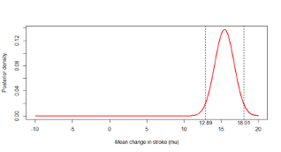
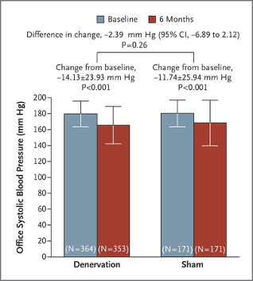

# Lecture 6: Bayesian inference for means 
## Example: Beach Water Quality
```{r, echo=FALSE,out.width='50%'}
knitr::include_graphics('./6_3.png')
```

Image from: http://www.ottawapublichealth.ca/en/public-health-services/beach-water-quality-results.aspx

* The city health inspector wishes to determine the mean number of E. coli colonies (counts) per 100mL of water at a popular city beach. 
* Assume the number of bacteria per liter of water follows a normal distribution with mean µ and standard deviation is known to be σ = 15. 
* She collects 10 water samples and finds the bacteria counts to be: 185 200 225 208 194 217 220 203 206 190.
* If the true mean count exceeds 200, the beach is considered unsafe for swimming

### Descriptive Statistics
```{r, echo=FALSE,out.width='50%'}

```

* Sample mean = 204.8 counts/100mL
* Sample standard deviation = 13.14 counts/100mL

### Frequentist inference
* To make inferences about the true population mean *E. coli* count, we could rely on a t-test of the following null hypothesis

\[H_0: µ ≤ 200\space  vs. H_A: µ > 200\]

* Or, we could calculate a confidence interval

### p-value

> x=c(185,200,225,208,194,217,220,203,206,190)

> t.test(x,mu=200,alternative="greater")

	One Sample t-test

data:  x  
t = 1.1553, df = 9, p-value = <span style="color: red;">0.1389</span>  
alternative hypothesis: true mean is greater than 200  
95 percent confidence interval:  
 <span style="color: red;">197.1838</span>       <span style="color: red;">Inf</span>  
sample estimates:  
mean of x   
    204.8 

```{r, echo=FALSE,out.width='50%'}

```

* The p-value of the one-sided t-test is 0.1389
* This is typically interpreted as insufficient evidence to reject the null hypothesis $H_0: µ ≤ 200$ 
* The p-value is the probability of observing results more extreme than the data under the null hypothesis

### 95% confidence interval

> x=c(185,200,225,208,194,217,220,203,206,190)

> t.test(x,mu=200)

	One Sample t-test  
data:  x  
t = 1.1553, df = 9, p-value = 0.2777  
alternative hypothesis: true mean is not equal to 200  
95 percent confidence interval:  
 <span style="color: red;">195.4012 214.1988</span>  
sample estimates:  
mean of x   
    204.8 
    
* A one-sided 95% confidence interval has a lower limit of 197.18 counts/100mL
* A two-sided 95% confidence interval would be between 195.40 to 214.20 counts/100mL
* In both cases, the value 200 counts /100mL falls within the confidence interval

### Bayesian analysis
* Bayesian statistical inference is based on Bayes Theorem of conditional probability
    + It is an alternative to the predominant ‘frequentist’ (or classical) approach to statistical inference
* It can be used for any statistical problem
    + Simple problems, e.g. comparing two means or logistic regression
    + Complex problems, e.g. network meta-analysis, cost-effectiveness analysis
    + Study design, e.g. design of adaptive randomized controlled trials
* Bayesian methods involve specific computational skills
* In this class we will make simplifying assumptions to limit ourselves to problems where the calculations can be done easily. None the less, we will be able to see the advantages of the Bayesian approach when it comes to interpreting results

### What is the true mean E. coli count (µ)?
* **Frequentist approach:**
    + Treat the unknown parameter µ as a **fixed** quantity
    + Assume that the data at hand is one of several datasets that could be observed
    + Make inferential statements of the form P(data | Hypothesis about µ), e.g.   P(Observed mean > 204.8 | H0: µ ≤ 200)
* Bayesian approach:
    + Treat the unknown parameter µ is a **random** variable
    + Update the subjective prior information about the parameter using the observed data via Bayes Theorem 
    + Inferential statements of the form P(Hypothesis about µ | data), 
     e.g. P(µ > 200 | Observed mean = 204.8 )

### Bayesian (inductive) vs. Frequentist (deductive) thinking
```{r, echo=FALSE,out.width='50%'}

```

From Goodman S, Ann Intern Med. 1999;130:995-1004

### Principal elements of a Bayesian analysis
1. Specify the **likelihood function**, i.e. the probability distribution of the observed data (x) in terms of the unknown parameter (µ).
    + This step remains the same whether one uses a Bayesian or a frequentist approach
2. Specify a **prior distribution** f(µ) over the unknown parameter(s)
3. Use Bayes Theorem to update the prior distribution with the data and obtain the **posterior distribution** of f(µ|x)

### The prior distribution
* A distinguishing feature of a Bayesian analysis is the use of a prior distribution
* A prior probability distribution on the unknown parameters, is a summary of information about them from sources external to (but not necessarily collected before) the observed experiment
* It could be based on:
    + a subjective prior belief: e.g. “it is highly unlikely that the true mean is greater than 400 counts/100mL”
    + a subjective prior based on previously observed data: e.g. the 95% confidence interval of the mean count from earlier pilot study
    + It may be ‘objective’ or ‘non-informative’, e.g. assuming a uniform prior distribution over the possible range (0, 1000) of the number of counts

### Beach Water Quality: Bayesian analysis
Let X = Number E. coli counts in a sample

1. **Likelihood function**: X ~ N(µ, σ=15)
2. **Prior distribution** summarizes information we have on the mean number of counts
    + e.g. µ ~ N(mean=θ=200, standard deviation=τ=100)  
    Applying Bayes Theorem we obtain the  
3. **Posterior distribution**  
e.g.  µ | X ~ N(mean=204.79, standard deviation=4.74)

### Two possible prior distributions
```{r, echo=FALSE,out.width='100%'}
knitr::include_graphics('./6_14.png')
```

* Both priors were selected to be Normal distributions because
    + The mean count is continuous and the standard deviation of the normal prior distribution can be adjusted so that it is concentrated over plausible values
    + There is also a mathematical advantage. The normal distribution is a **conjugate** prior distribution. This means the form of both prior and posterior are the same. Therefore, by choosing a normal prior distribution for a normal likelihood, we ensure that the posterior distribution is also normal  
* Notice that the non-informative prior has a very high standard deviation. This was chosen so that our normal prior distribution translates into an approximately uniform distribution over the range from 150 to 250 
* On the other hand, the informative prior distribution has a much smaller standard deviation, comparable to the standard deviation of the observed data
    + Note however that the standard error of the data is smaller still at 
15/sqrt(10)

### Illustration of the two prior distributions 
```{r, echo=FALSE,out.width='50%'}
knitr::include_graphics('./6_16.png')
```

### Applying Bayes Theorem
* To update the information in the prior with the data we use Bayes Theorem. 
* It is based on the same principle that we saw before, but modified by the fact that the distribution is continuous. If you compare with the expressions we had previously, you will notice that the only difference is that the summation is replaced by an integral.
* We have

\[f(\mu|X)=\frac{f(X|\mu)f(\mu)}{\int f(X|\mu)f(\mu)dx}\]

* The integral in the denominator can be very challenging to solve. To get around this computationally intensive methods have been developed, e.g. Monte Carlo Markov Chain (MCMC) methods. These methods are more easily accessible today because of the rapid evolution of computers in the last two decades
* Before the personal computer era, one way to simplify the integral was to use a conjugate prior 
* In our example, we have a normal likelihood and a conjugate normal prior distribution with mean θ and standard deviation τ
* This results in the following normal posterior distribution

$\mu$|X ~ $N(mean=A\times\theta+B\times\bar x,standard\space deviation=\sqrt{\frac{1}{\frac{n}{\sigma^2}+\frac{1}{\tau^2}}}$

where A and B are constants defined on the next slide

### The normal posterior distribution
* A is the weight given to the prior mean, and B is the weight given to the posterior mean

$A=\frac{\sigma^2/n}{\tau^2+\sigma^2/n}$ and $B = \frac{\tau^2}{\tau^2+\sigma^2/n}$

* Notice that A and B add up to 1 
* Also notice 
    + A will be higher than B if the standard deviation of the sample mean is higher than the prior standard deviation, and vice versa
    + If A is higher than B, the posterior mean is weighted more towards the prior mean θ.  
* Thus the posterior distribution is a compromise between the prior distribution and the observed data, taking into account their relative ‘informativeness’ as defined by their variance
* The posterior distribution’s standard deviation is given by

\[\sqrt{\frac{1}{\frac{n}{\sigma^2}+\frac{1}{\tau^2}}}\]

* If the prior standard deviation is very high, e.g. τ=100, then the posterior standard deviation is well approximated by the sample standard deviation
* Thus once again we see that the standard deviation of the posterior is a compromise between that of the prior and the likelihood (or data)

### Beach Water Quality Example: Non-informative prior
* Our non-informative N(θ=200, τ=100) prior implies that prior to observing the data, we would say that the true mean (µ) is equally likely to be below or above 200 counts/mL 
* In our example, when using the non-informative prior distribution

\[A=\frac{\sigma^2/n}{\tau^2+\sigma^2/n}=\frac{15^2/10}{100^2+15^2/10}\approx 0\]
\[B = \frac{\tau^2}{\tau^2+\sigma^2/n}=\frac{100^2}{100^2+15^2/10}\approx 1\]
\[Posterior\space mean=A\times\theta+B\times\bar x\approx0\times 200+1\times204.8=204.79\]

the observed data completely dominated the posterior, and the prior had no influence. This illustrates why non-informative priors are widely used if want to ensure there is no influence of 'subjective' opinion

* Posterior standard deviation

\[\sqrt{\frac{1}{\frac{n}{\sigma^2}+\frac{1}{\tau^2}}}=\sqrt{\frac{1}{\frac{10}{15^2}+\frac{1}{100^2}}}=4.74,\]

which shows that the posterior standard deviation also was essentially the same as that based on the data alone

### Bayesian analysis using R
```
> x=c(185,200,225,208,194,217,220,203,206,190)

> mean(x)
[1] 204.8

> normnp(x,m.x=200,s.x=100,sigma.x=15)
Known standard deviation :15
Posterior mean           : 204.7892242
Posterior std. deviation : 4.7380891

Prob.	Quantile 
------	----------
0.005	192.5847154
0.010	193.7667807
0.025	195.5027402
0.050	196.9957611
0.500	204.7892242
0.950	212.5826873
0.975	214.0757083
0.990	215.8116678
0.995	216.9937331
```

* Download the R package [Bolstad](https://cran.r-project.org/web/packages/Bolstad/index.html)
* It was developed based on material from an [introductory Bayesian textbook](https://mcgill.worldcat.org/title/introduction-to-bayesian-statistics/oclc/957525550&referer=brief_results) 
* The function that is relevant for our problem is normnp()

### Posterior distribution compared to likelihood and non-informative prior
```{r, echo=FALSE,out.width='50%'}
knitr::include_graphics('./6_24.png')
```

### Prior and posterior distribution plot from R
```{r, echo=FALSE,out.width='50%'}

```

### Statistics typically reported in a Bayesian analysis
```{r, echo=FALSE,out.width='100%'}
knitr::include_graphics('./6_26.png')
```

$^*$The credible interval is the Bayesian equivalent of the frequentist confidence interval

### Interpretation of the Bayesian credible interval (CrI)
```{r, echo=FALSE,out.width='50%'}

```

* A 95% credible interval is an interval that has a 0.95 probability of including the true parameter (µ)
    + There are several such credible intervals, e.g.
        - $(Q_{0.025}, Q_{0.975})$ is called the equal-tailed 95% CrI and is most commonly reported
        - $(Q_{0.03}, Q_{0.98})$ or $(Q_{0.01}, Q_{0.96})$ are also 95% credible intervals
* Notice the 95% refers to the interval we have observed and not to a procedure or to repeated experiments

### Mean E. coli counts: Hypothesis testing vs. confidence interval vs. Bayesian inference
```{r, echo=FALSE,out.width='100%'}

```

* The hypothesis test would lead us to conclude that we do not have enough evidence to reject the null hypothesis. But the Bayesian analysis allows to calculate that the probability of the alternative is in fact highly likely given the observed data
* Notice that numerically the Bayesian interval resulting from a non-informative prior and a frequentist 95% CI are very similar. However, their interpretation is different

### Beach Water Quality: Informative prior distribution
```{r, echo=FALSE,out.width='100%'}

```

### Expressing the 95% CI from earlier data as a normal distribution
* To obtain the parameters of the informative prior distribution we matched the lower and upper limit of the 95% CI to the 2.5% and 97.5% quantiles of the prior distribution
* Since we are assuming the that prior distribution is normal we know that
    + The 97.5% quantile = θ + 2τ = 230
    + The 2.5% quantile = θ - 2τ = 160
* Solving these two equations give us θ=195 and τ=17.5

### Beach Water Quality Example: Informative prior
* In our example, for the informative prior

\[A=\frac{\sigma^2/n}{\tau^2+\sigma^2/n}=\frac{15^2/10}{17.5^2+15^2/10}\approx 0.07\]
\[B = \frac{\tau^2}{\tau^2+\sigma^2/n}=\frac{17.5^2}{17.5^2+15^2/10}\approx 0.93\]
\[Posterior\space mean=A\times\theta+B\times\bar x\approx0.07\times 195+0.93\times204.8=204.13\]

Which shows the observed data were more dominant than the prior, though the prior did have some influence

### Non-informative prior
* Posterior standard deviation

\[\sqrt{\frac{1}{\frac{n}{\sigma^2}+\frac{1}{\tau^2}}}=\sqrt{\frac{1}{\frac{10}{15^2}+\frac{1}{17.5^2}}}=4.58,\]

which shows that the posterior standard deviation deviation was lower than the standard deviation based on the observed data alone (4.74). 

* So there was some gain in informativeness by using the prior information

### Results with non-informative vs. informative prior
```{r, echo=FALSE,out.width='100%'}
knitr::include_graphics('./6_33.png')
```

#### Non-informative prior
```{r, echo=FALSE,out.width='50%'}
knitr::include_graphics('./6_34a.png')
```

#### Informative prior
```{r, echo=FALSE,out.width='50%'}

```

### R code for Bayesian analysis
```
library(Bolstad)

x=c(185,200,225,208,194,217,220,203,206,190)

result=normnp(x,m.x=200,s.x=100,sigma.x=15)
plot(result,xlim=c(0,400))

result=normnp(x,m.x=195,s.x=17.5,sigma.x=15)
plot(result,xlim=c(0,400))
```

### Beach Water Quality Example
* What is the impact of using other prior distributions?
    + Non-informative prior with a different mean, wider or narrower variance
    + Informative prior with a smaller variance
    + Informative prior with a different mean

### Example: Renal Denervation
* A surgical procedure called “renal denervation” was developed to help people with hypertension who do not respond to medication. 
* In a randomized , blinded, controlled trial ([Bhatt et al., NEJM, 2014](https://www.nejm.org/doi/full/10.1056/NEJMoa1402670)) concluded there was no significant difference between patients who received renal denervation and those who received a sham procedure

```{r, echo=FALSE,out.width='50%'}

```

“A significant change from baseline to 6 months in office systolic blood pressure was observed in both study groups. 

The between-group difference (the primary efficacy end point) did not meet a test of superiority with a margin of 5 mm Hg. 

The bars indicate standard deviations.”

### Re-analysis of Renal Denervation data using a Bayesian approach
* We need to specify the likelihood function and the prior distribution. Using Bayes Theorem we can derive the posterior distribution
* We will assume that the change in blood pressure in both groups follows a normal distribution with a known standard deviation of 25
* We need to define two prior distributions this time, one for the mean change in the renal denervation group and one for the mean change in the sham group
    + we will use a non-informative prior N(0, 1000) prior for both

### Posterior distributions
* Posterior distribution for the mean change in blood pressure in the renal denervation group (µRD)

$\mu_{RD}|X_{RD}$ ~ $N\left(A_{RD}\times\theta_{RD}+B_{RD}\times\overline{x_{RD}},standard\space deviation=\sqrt{\frac{1}{\frac{n_{RD}}{\sigma^2}+\frac{1}{\tau^2}}}\right)$

* Posterior distribution for the mean change in blood pressure in the control group $(\mu_p)$

$\mu_{s}|X_{s}$ ~ $N\left(A_{s}\times\theta_{s}+B_{s}\times\overline{x_{s}},standard\space deviation=\sqrt{\frac{1}{\frac{n_{s}}{\sigma^2}+\frac{1}{\tau^2}}}\right)$

### Posterior distribution of the difference between the two groups
* Based on the expressions we had seen in Lecture 3 (Slides 33 and 34), we know that the difference between two independent, normally distributed variables is also normal with
    + Mean = Difference in the two means
    + Variance = Sum of the two variances

### Posterior distribution of the difference between the two groups
```{r, echo=FALSE,out.width='100%'}

```

* Therefore:

$\mu_{RD}-\mu_s|data$ ~ N(mean=-2.39, standard deviation=2.33)

* As with the case of the single mean, we can extract various statistics and an equal-tailed 95% credible interval from this posterior distribution. We can also make probabilistic statements.  

### Summary of results: Hypothesis testing vs. confidence interval vs. Bayesian inference
```{r, echo=FALSE,out.width='100%'}
knitr::include_graphics('./6_43.png')
```

* The hypothesis test tells us that if there were no difference between the two groups, the probability of observed results more extreme than what we have is 0.26. Since this p-value exceeds the traditional limit of Type I error=0.05 we cannot reject the null hypothesis 
* The confidence interval would suggest there is some evidence that the true mean difference between the groups lies outside the zone of clinical equivalence (i.e. < -5)
* The Bayesian approach allows to quantify the probability of a clinically meaningful difference between the two groups. It is 0.13. Once again the 95% credible interval is similar in magnitude to the confidence interval, though its interpretation is different

### Update on the renal denervation story
* More recently “… positive results of second-generation trials helped renal denervation to resurrect as a hopeful therapy for hypertension” [Lurz, Vascular News, 2018](https://vascularnews.com/the-resurgence-of-renal-denervation/)
* “Important tasks for the future include refinements in patient selection and technique as well as establishing a measure of procedural success”

### Why is Bayesian inference not used more widely?
* As the ASA statement noted, frequentist statistical methods are still widely taught
* Researchers, including statisticians, are put off by the challenge of learning something new
* Bayesian statistics is perceived as computationally complex
* The prior distribution seems like a subjective choice of the user that could lead to manipulation of results

### Are Bayesian methods worth the effort?
* For simpler problems, like the ones we have seen, frequentist confidence intervals are numerically similar to Bayesian intervals when using a non-informative prior
    + None the less, Bayesian methods offer an advantage in terms of interpretation
* For more complex problems, e.g. those involving hierarchical models or missing data, Bayesian methods are crucial to achieve a sound solution

### Are Bayesian methods complex?
* I would argue that they are actually simpler
* No matter how complicated your model, the Bayesian solution always involves the same 3 steps – specify the likelihood and prior and then obtain the posterior distribution
* The same software package (e.g. WinBUGS) handles everything – no need to switch between separates programs for logistic and linear regression, meta-analysis etc.

## Risk of incorrect conclusions with hypothesis testing
```{r, echo=FALSE,out.width='100%'}
knitr::include_graphics('./6_49.png')
```

```{r, echo=FALSE,out.width='100%'}
knitr::include_graphics('./6_50.png')
```

Chavalarias et al., JAMA 2016

The ASA Statement:

In light of misuses of and misconceptions concerning p-values, the statement notes that statisticians often supplement or even replace p-values with other approaches. These include methods “that emphasize estimation over testing such as confidence, credibility, or prediction intervals; Bayesian methods; alternative measures of evidence such as likelihood ratios or Bayes factors; and other approaches such as decision-theoretic modeling and false discovery rates.”

### Concerns with hypothesis testing
* At the end of a research study there is seldom a need to make a firm decision. Indeed, a single study may not provide enough evidence to make a sound decision
* Yet, the scientific literature has relied heavily on hypothesis testing to identify associations of interest
* Many early reports of associations have proven impossible to replicate suggesting they were spurious
* This is probably a combination of making decisions based on weak evidence, and publication bias

### Optimizing decision making$^*$
* When designing a study we focus on the Type I and Type II errors with a view to optimizing the decision process in the long run
* This makes sense in certain settings, e.g. industrial quality control, where it is possible to define the minimum effect size of interest and also the cost of any errors
* For example, if a factory has to produce screw heads with a diameter of 1 ± 0.01cm, then we know or can estimate
    + The minimum effect size of interest is 0.01cm
    + The cost of failing to detect too large or too small screws
    + The cost of throwing away a good batch of screws
* Further, we can control the sample size easily to ensure high power
* In contrast, these elements may be difficult to gauge in a research setting, e.g.
    + What is the smallest difference of interest in adipose weight gain in  Nck1 Wild Type mice?
    + What is the cost of falsely claiming that a treatment is beneficial?
* Given this ambiguity, researchers often fall back on the default values, like the α=0.05 level

$^*$Szucs & Ioannidis, 2017

### Concerns with p-values
* A p-value provides the probability:  
P(Data is more extreme than observed|H0)
* But what the investigator desires is P(H0|Data)
* p-values are functions of the data and are affected by sample size

### Factors that influence the accuracy of hypothesis testing
* The chances of a statistically significant result depend on
    + **Pre-study odds**: The more implausible the null hypothesis, the greater the chance that a significant finding is a false alarm
    + **Type I error**: This has to be sufficiently low to avoid wrongly rejecting the null hypothesis
    + **Type II error**: This also has to be low, and defined keeping in mind the magnitude of a practically meaningful effect

### Probabilities of true and false reporting$^*$
* Using the 3 factors on the previous slide we can define the following probabilities by applying Bayes Theorem:
    + False reporting probability = P(H0 | significant result)
    + True reporting probability = P(H1 | significant result)
* It is based on a modeling of these probabilities that Ioannidis (PLOS One 2005) claimed most published research findings are false

$^*$Szucs & Ioannidis, 2017

### Illustration from Nuzzo et al.
```{r, echo=FALSE,out.width='100%'}
knitr::include_graphics('./6_50.png')
```

### Illustration of true and false reporting probabilities
* Let us assume 
    + P(H0)=P(H1)=0.5, Type I error = 0.05, Type II error = 0.4

False reporting probability P(H0|significant result)  
$\frac{P(significant\space result|H0)P(H0)}{P(significant\space result)}=\frac{0.05\times0.5}{0.05\times0.5+0.6\times0.5}=0.0769$

which is higher than the value of 0.05, which we often confuse to be the false-reporting probability

* Let us assume 
    + P(H0)=5/6 P(H1)=1/6, Type I error = 0.05, Type II error = 0.4

False reporting probability P(H0|significant result)
$\frac{P(significant\space result|H0)P(H0)}{P(significant\space result)}=\frac{0.05\times(\frac{5}{6})}{0.05\times(\frac{5}{6})+0.6\times(\frac{1}{6})}=0.2941$

which is considerably larger than 0.05

* We may not be able to control the pre-study odds but by designing a study with higher power, we can reduce the FRP somewhat

### Pre-study odds of H0:H1
```{r, echo=FALSE,out.width='100%'}
knitr::include_graphics('./6_60.png')
```
