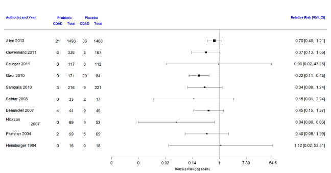

# Lecture 7: Statistical inference for proportions 
## When is a single proportion used?
* Proportions are very commonly used in medical research to summarize dichotomous variables
* Some examples include estimation of:
    + response rate in a survey
    + prevalence of a disease
    + sensitivity, specificity, positive and negative predictive values for a diagnostic test

### Central Limit Theorem
* From the text by Moore and McCabe:

*“… as the sample size increases, the distribution of $\bar Y$ becomes closer to a normal distribution*… no matter what the population distribution may be, as long as the population has a finite standard deviation σ. 

This famous fact of probability theory is called the *central limit theorem*. 

For large sample size n, we can regard $\bar Y$ as having the $N(\mu,\sigma/\sqrt n)$ distribution”

### Application of the Central Limit Theorem: Normal Approximation to the Binomial Distribution 
* In Lecture 3, we also studied expressions that showed that the sum of a series of random variables follows a Normal distribution (like the mean does)
* Recall that the **sum of the number of successes** in each of n Bernoulli trials follows a Binomial distribution with mean nπ and variance nπ(1-π)
* Let us look at the sampling distribution when n=5, 20 and 50 and π=0.1, 0.5 and 0.9

### Sampling distributions when π=0.1 
```{r, echo=FALSE,out.width='50%'}
knitr::include_graphics('./7_6.png')
```

### Sampling distributions when π=0.5 
```{r, echo=FALSE,out.width='50%'}
knitr::include_graphics('./7_7.png')
```

### Sampling distributions when π=0.9 
```{r, echo=FALSE,out.width='50%'}
knitr::include_graphics('./7_8.png')
```

### Sampling distribution of a Binomial variable
* We can see that as the sample size increases, the mean of the sampling distribution tends towards a normal distribution with mean nπ and variance nπ(1-π)
* This is true even for extreme values of π close to 0 or 1, though values closer to π=0.5 will approach normality at a smaller sample size

### Normal approximation to the Binomial distribution
*Recall that the probability density function for the Binomial distribution is given by

\[Pr\{X=k|n,p\}=\frac{n!}{k!(n-k)!}\pi^k(1-\pi)^{n-k}\]

* This expression can get very cumbersome to evaluate (especially with no computer) as n increases. Also tables of the Binomial distribution will not list all values of n
* Therefore, as n increases, we can use the normal approximation to the Binomial distribution instead to determine the Binomial density of cumulative probability
* How large should n be? The normal approximation to the binomial distribution is fairly good if both np and n(1−p) are at least equal to 5, where p is the sample proportion.

### Example 4: Estimating the number of true positives
* In low resource settings, hospitals often rely on smear microscopy for TB diagnosis despite its poor sensitivity
* The GeneXpert test is a point-of-care nucleic acid amplification test that has revolutionized testing for pulmonary TB . 
    + It has a sensitivity of 70% in TB cases missed by smear
* In a particular clinic setting, it is estimated that 150 TB patients are missed annually by smear microscopy.
    + What is the probability that at least 100 of them are correctly identified by GeneXpert?

### Example 4: Applying a continuity correction
* X=Number of positive results on GeneXpert out of 150 patients
* P(X ≥ 100 | Binomial(n=150, π=0.7))  
= P(X ≥ 99.5 |Binomial(n=150, π=0.7))  
≈ P(X ≥ 99.5 |Normal(mean=105,variance=32))  
= 1 – pnorm(99.5,mean=105,sd=sqrt(32))  
= 0.83

### Continuity correction
* The change from 100 to 99.5 is called the continuity correction. It is used to make the normal approximation slightly more accurate. 
* If n is large the continuity correction may not have a huge impact when estimating the probability of being greater than or the probability of being less than a certain value.
* However, we absolutely need the continuity correction to estimate the probability of being exactly equal to a certain value. This is because this probability is always zero under a normal distribution

### Example
* What is the probability that exactly 100 patients will be detected by GeneXpert?
* P(X = 100 | Binomial(n=150, π=0.7))  
= P(99.5 ≤ X ≤ 100.5 |Binomial(n=150, π=0.7))  
≈ P(99.5 ≤ X ≤ 100.5 | Normal(mean=105,variance=32))  
= pnorm(100.5,mean=105,sd=sqrt(32)) – pnorm(99.5,mean=105,sd=sqrt(32))  
= 0.05

### Comparison with the exact results based on the Binomial distribution
* What is the probability that at least 100 or exactly 100 patients will be detected by GeneXpert?
* The exact results based on the Binomial distribution are given by 

P(X ≥ 100 | Binomial(n=150, π=0.7))   
= 1- pbinom(99,150,0.7) = 0.84	  

P(X = 100 | Binomial(n=150, π=0.7))   
= dbinom(100,150,0.7) = 0.05

We can see they are very close to the approximate values based on the Normal distribution

### Example: Asymptomatic colonization with Clostridium difficile
* *Clostridium difficile* diarrhea (CDAD) is the most common nosocomial diarrhea, prolonging hospitalization and for some patients leading to colectomy or death.
* Patients are typically exposed to CD in a hospital setting, but may also become exposed in the community
* After exposure, an estimated 2/3 patients become asymptomatic carriers. There is a concern that asymptomatic colonization may play a greater role in spreading CD infection than previously thought
* A large, multi-centre Canadian study examined the risk of asymptomatic colonization at admission to hospital. They also examined various risk factors for asymptomatic colonization, including patient and pathogen characteristics (Kong et al, Am J Inf Control, 2015)

### Asymptomatic colonization with Clostridium difficile: Selected results
* Out of 5232 subjects, 212 were asymptomatically colonized at admission
* Among the 212 asymptomatically colonized patients:
    + 136 were hospitalized during the previous year
    + 98 used antibiotics in the previous 8 weeks
    + 1 used a probiotic in the previous 8 weeks
* Among 209 of the 212 patients, information was available on the strain of *Clostridium difficile*
    + 33 patients carried the hypervirulent NAP1 strain

### Example: Asymptomatic colonization with Clostridium difficile
a) Estimate the proportion of asymptomatically colonized patients together with a 95% confidence interval. What is your interpretation of the 95% confidence interval?
b) Estimate the proportion of patients with each risk factor and calculate a 95% confidence interval in each case. 
c) It has previously been reported that 50% of patients who develop Clostridium difficile infection carry the NAP1 strain. Carry out a hypothesis test to determine whether patients who are asymptomatically colonized at admission have a comparable risk of carrying the NAP1 strain. 

### Methods for means vs. proportions
* You will notice that all of the methods we studied earlier for means, have a counterpart for proportions
* As in the case of inference for means, we can distinguish between the following themes
    + Methods for a single proportion and for the difference between proportions
    + Frequentist inference and Bayesian inference
    + Hypothesis tests and confidence intervals

### Analogy between calculation of means and proportions
```{r, echo=FALSE}
library(knitr)
df<- data.frame(z=c("Sample data","Estimator of the population mean","Estimator of the population standard deviation","95% confidence interval for the population mean"),Means=c("$(x_1,x_2,...,x_n)$","$\\bar x=\\frac{\\sum_{i=1}^nx_1}{n}$","$sd=\\sqrt{\\frac{\\sum_{i=1}^n(x_i-\\bar x)^2}{n-1}}$","$\\bar x\\pm 1.96\\frac{sd}{\\sqrt n}$"),Proportions=c("$(x_1,x_2,...,x_n)=(1,0,...,1)$","$p=\\frac{\\sum_{i=1}^nx_1}{n}=\\frac{\\#\\space of\\space 1's}{n}$","$sd=\\sqrt{p(1-p)}$","$p\\pm 1.96\\frac{sd}{\\sqrt n}$"))
knitr::kable(df, col.names = gsub("[z]", " ", names(df)))
```

### Frequentist confidence interval for a single proportion
* Confidence interval for a large sample using the normal approximation
* Confidence interval for a small sample using the exact Binomial distribution

### Large sample confidence interval for a proportion
* Assume a large random sample of a dichotomous variable X of size n is drawn from a population with unknown proportion of successes (π)
* Let p be the observed proportion of successes
* Then an approximate level $(1-\alpha)$% confidence interval for $\pi$ is given by

\[p\pm Z_{1-\frac{\alpha}{2}}\times\sqrt{\frac{p(1-p)}{n}}\]

where $Z_{1-\alpha/2}$ is the upper $1-\alpha/2$ standard Normal quantile 

* This confidence interval has the usual frequentist interpretation that it was obtained using a **procedure** about which we have (1-α)% confidence. Across (1-α)% of repeated studies the confidence interval will include π. However, we do not know if the particular interval at hand includes the true value of π
* Notice that we used the Normal distribution quantile to construct the confidence interval. We were able to do this because:
    + We are relying on the central limit theorem that tells us that even though the variable of interest (X) follows a Bernoulli distribution, the sample mean is normally distributed provided the sample size is large enough. 
    + The sample proportion automatically provides an estimate for the sample standard deviation. Therefore we do not need to provide a separate estimate for the standard deviation and introduce another source of uncertainty. As a result we do not need to rely on the t-distribution

### Exact confidence interval for a proportion
* When the sample size is small or when p is close to 0 or 1, the normal approximation based on the central limit theorem can be poor
* In such cases, it may be preferable to use the exact method for obtaining a confidence interval which is based directly on the binomial distribution. 
* This method is more difficult to calculate, though the availability of fast computers today makes this irrelevant

### Clopper-Pearson exact confidence interval for a proportion (Biometrika, 1934)
* Let x be the observed number of successes and n be the number of trials. Let X denote a Binomial(π,n) random variable 
* The two-sided (1-α)% exact confidence interval is given by the interval $(p_L, p_H)$ such that 

\[\sum_{k=0}^x{n \choose k}p_H^k(1-p_H)^{n-k}=\frac{\alpha}{2}\]
\[\sum_{k=x}^n{n \choose k}p_L^k(1-p_L)^{n-k}=\frac{\alpha}{2}\]

### Exact confidence interval for a proportion$^*$
```{r, echo=FALSE,out.width='100%'}
knitr::include_graphics('./7_26.png')
```

$^*$From http://www.biyee.net/data-solution/resources/binomial-confidence-interval.aspx

### R function to obtain a confidence interval for a small proportion
* The R function binom.test carries out an exact binomial test and also provides an exact confidence interval

```
binom.test(x, n, p = 0.5,
           alternative = c("two.sided", "less", "greater"),
           conf.level = 0.95)
```

* The user has to provide the number of successes and the sample size among other arguments

### Exact confidence interval for a proportion
* Following is a comparison of exact and approximate confidence intervals. The gain in accuracy drops off with increasing sample size.

```{r, echo=FALSE,out.width='50%'}

```

### How do you determine if your sample is sufficiently large?
* Some common rules of thumb:
    + Both *n(1-p)* and *np* should be greater than 5 (greater than 10 according to some text books)
    + $np\pm3\sqrt{np(1-p)}$ should lie between 0 and n
    + In general if the distribution is shifted towards 0 or 1 and if confidence intervals calculated by the usual method give negative lower or upper bounds, it is better to use the exact method. 

### Example: Zero proportion
* The standard contrast agent used by radiologists over a long period has been shown to cause a serious reaction in about 15 of every 10,000 patients exposed to it
* A new contrast agent is introduced. Based on the first report of its use in 167 patients, no patient had a serious reaction. Do we have enough evidence to say that the new contrast agent is at least as safe to use as the old one?
* The thumb rules on the previous slide would lead us to conclude an exact confidence interval is required
* The risk of an adverse reaction with the old reagent is 15/10000 = 0.0015
* The point estimate of the risk with the new contrast agent is 0
* The 95% one-sided exact confidence interval is (0, 0.0178)
* This tells us that the observed data could possibly arise from situations where the true value of π ranges from 0 to 0.0178. This includes situations where the true risk of 0.0015
* It also means we cannot eliminate the possibility that the risk slightly greater than 0.0015

### Example: binom.test()
```
> binom.test(0,167,alternative="less",p=0.0015)

	Exact binomial test

data:  0 and 167
number of successes = 0, number of trials = 167, p-value = 0.7783
alternative hypothesis: true probability of success is less than 0.0015
95 percent confidence interval:
 0.00000000 0.01777858
sample estimates:
probability of success 
                     0 
```

The R function above provides the result of a one-sided hypothesis test of $H_0: p≥0.0015$ vs. $H_A: p<0.0015$. The confidence interval is the range of possible values of p that cannot be rejected under the null hypothesis. 

### Example: Asymptomatic colonization with C. difficile
* Proportion of patients asymptomatically colonized at admission = 212/5232 = 0.041
* Proportion of patients with risk factor
    + Recent hospitalization = 136/212 = 0.642
    + Recent antibiotic use = 98/212 = 0.462
    + Recent probiotic use = 1/212 = 0.005
* Proportion of asymptomatically colonized carrying NAP1 strain = 33/209 = 0.158

### Exact or approximate CI?
* For most of the proportions on the previous slide we can see that *np* and *n(1-p)* are both greater than 5 
* A quick way to check this is to look at the number of subjects with and without the outcome and see if they are both greater than 5

### 95% CI for proportion
* The 95% confidence interval for the risk of asymptomatic colonization at admission is given by

\[p\pm z_{1-\alpha/2}\times\sqrt{\frac{p(1-p)}{n}}=0.041\pm1.96\sqrt{\frac{0.041(1-0.041)}{5232}}\]
\[=0.041\pm0.005\]
\[=(0.036,0.046),\space approximately\]

* This confidence interval tells us that the information in the data is consistent with values of 𝜋 ranging from 3.6% to 4.6%. The observed data is unlikely to arise from a setting where 𝜋 >0.05. 
* This implies, based on the observed data, we would reject H0: 𝜋 >0.05 at the Type I error level of 0.05
* The confidence intervals for the proportion of patients with different risk factors can be obtained similarly

### Exact or approximate CI?
* However, only 1 subject reported using probiotics and 211 subjects did not
* Therefore, based on our rule of thumb we cannot use the normal approximation to obtain a 95% confidence interval for this proportion and must use an exact method instead
* Using the approximate method would result in the following confidence interval (-0.005, 0.014), which is clearly not appropriate as a proportion cannot be negative!

### Exact 95% equal-tailed confidence interval for proportion of probiotic use
```
> binom.test(1,212)

	Exact binomial test

data:  1 and 212
number of successes = 1, number of trials = 212, p-value < 2.2e-16
alternative hypothesis: true probability of success is not equal to 0.5
95 percent confidence interval:
 0.0001194165 0.0259997103
sample estimates:
probability of success 
           0.004716981
```

The R function above provides the result of a two-sided hypothesis test of $H_0: p=0.5$. The confidence interval is the range of possible values of p that cannot be rejected under the null hypothesis. 

### 95% confidence intervals for proportion of patients with risk factor among patients asymptomatically colonized with C. difficile
```{r, echo=FALSE,out.width='100%'}
knitr::include_graphics('./7_38.png')
```

### Statistics used to compare two proportions $p_1$ and $p_2$
* Several different statistics may be used to compare proportions. These include relative comparisons and absolute comparisons
    + Difference: $p_1-p_2$
    + Odds ratios: $\frac{p_1(1-p_2)}{p_2(1-p_1)}$
    + Risk ratios: $\frac{p_1}{p_2}$
    + Number needed to treat: $\frac{1}{p_1-p_2}$
    
### Example: Probiotics for prevention of CDAD
* *Clostridium difficile* diarrhea (CDAD), which was introduced earlier in the lecture, is strongly associated with antibiotic use
* An outbreak of a virulent form of CDAD in Quebec in 2004 has heightened the interest in tackling this infectious disease
* A probiotic is a live microorganism or a mixture of various bacteria administered to improve the microbial balance in the host GI system

### Results from two randomized controlled trials
* A recent systematic review identified 10 studies on the efficacy of lactobacillus probiotics for prevention of CDAD
* We will take a closer look at two of them
* For each of these studies we will calculate a 95% confidence interval for the difference in proportions and also a p-value for a two-sided test

### Forest plot of relative risk from 10 studies$^*$
```{r, echo=FALSE,out.width='100%'}

```

$^*$From http://cmajopen.ca/content/4/4/E706.abstract

### Results from two randomized controlled trials
```{r, echo=FALSE,out.width='100%'}

```

* Compare the two proportions reported in each study using hypothesis tests, confidence intervals

### Confidence Interval for the difference between two proportions
* Assume we have data from two independent, random samples of size $n_1$ and $n_2$ and that the observed proportions of the outcome of interest in the two samples are $p_1$ and $p_2$, respectively
* Assume these two samples are drawn from two independent, large populations with the true proportions of the outcomes of interest being $\pi_1$ and $\pi_2$, respectively
* When $n_1$ and $n_2$ are large, an approximate level $(1-\alpha)$% confidence interval for $\pi_1-\pi_2$  is

\[p_1-p_2\pm Z_{1-\alpha/2}\sqrt{\frac{p_1(1-p_1)}{n_1}+\frac{p_2(1-p_2)}{n_2}}\]

where $Z_{1-\alpha/2}$ is the upper $1-\alpha/2$ standard Normal critical value

### Hypothesis test for comparing two proportions 
* Carrying out a hypothesis test involves the same 4 steps as we had seen before:  

1. State the null and alternative hypotheses. The alternative could be one or two-sided

2. Calculate the test statistic measuring the evidence in favour of the null hypothesis

3. Determine the rejection region specified by the desired Type I error (α)

4. Determine if the test statistic falls in the rejection region. If yes, you conclude that you have enough evidence to reject the null hypothesis. If no, you conclude that you do not have enough evidence to reject the null hypothesis

* The null and alternative hypotheses may be stated in one of 3 ways as in the table below:

```{r, echo=FALSE,out.width='50%'}
knitr::include_graphics('./7_46.png')
```

* Notice that $H_0:\pi_1=\pi_2$ is equivalent to $H_0:risk\space ratio=1$  or $H_0:odds\space ratio=1$. In other words, these hypotheses can also be tested using the methods for the difference between two proportions = 0

* The test statistic in all 3 cases is given by $z=\frac{p_1-p_2}{s_p}$  
where $s_p=\sqrt{p(1-p)\left(\frac{1}{n_1}+\frac{1}{n_2}\right)}$ and $p=\frac{x_1+x_2}{n_1+n_2},$  
where $x_1$ and $x_2$ are the number of subjects who had the outcome of interest in group 1 and group 2, respectively   

* The rejection region is specified by the desired Type I error (α). 
* Quantiles of the normal distribution are used to define the rejection region as summarized in the table below

```{r, echo=FALSE,out.width='70%'}
knitr::include_graphics('./7_48.png')
```

* Note that $P(Z>Z_{1-\alpha})=P(Z<Z_\alpha)=\alpha$. Similarly, $P(Z>Z_{1-\alpha/2})=P(Z<Z_\alpha/2)=\alpha/2$, where Z is a standard normal variable
* The p-value is the probability of being more extreme than the observed z statistic under the standard normal distribution. Note that the measurement of ‘more extreme’ is determined by whether the alternative hypothesis is one or two-sided

```{r, echo=FALSE,out.width='70%'}
knitr::include_graphics('./7_49.png')
```

### Probiotics example: Confidence interval for difference in proportions
* Using the results from Allen et al., we will denote the probiotics group as Group 1 and the placebo group as Group 2
* First calculate the difference in proportion of CDAD cases in each group  
$p_1 - p_2 = 21/1493 - 30/1488 = 0.014  - 0.020 = -0.006$
* Then calculate the standard deviation of the difference in proportions

\[\sqrt{\frac{p_1(1-p_1)}{n_1}+\frac{p_2(1-p_2)}{n_2}}=\sqrt{\frac{\left(\frac{21}{1493}\right)\left(1-\frac{21}{1493}\right)}{1493}+\frac{\left(\frac{30}{1488}\right)\left(1-\frac{30}{1488}\right)}{1488}}=0.005\]

* The 95% confidence interval is then given by  
$-0.006 ± Z_{1-0.025} × 0.005  = -0.006 ± 1.96 × 0.005 = (-0.016, 0.004),$  
implying the observed difference between the two groups is not statistically significant compared to the Type I error level of 0.05

### Probiotics example: Hypothesis test
* The authors of the study carried out a two-sided hypothesis test, allowing for the possibility that probiotics decreased or increased the risk of CDAD
* This may be expressed as

$H_0:\pi_1=\pi_2$ vs. $H_a:\pi_1\neq\pi_2$

* To calculate the test statistic, we need to first calculate a pooled proportion given by

\[p=\frac{x_1+x_2}{n_1+n_2}=\frac{21+30}{1493+1488}=0.017\]

* The test statistic is given by 

\[z=\frac{p_1-p_2}{\sqrt{p(1-p)\left(\frac{1}{n_1}+\frac{1}{n_2}\right)}}=\frac{-0.006}{\sqrt{0.017(1-0.017)\left(\frac{1}{1493}+\frac{1}{1488}\right)}}\]

* Since this is a two-sided test, we calculate the p-value using the following expression:  

$2P(Z\geq|z|)=2P(Z\geq|-1.267|)$   
$=2P(Z\geq1.267)$  
$=2(1-P(Z<1.267))$
```
= 2*(1 – pnorm(1.267))   # R code 
```
$= 0.19,\space approximately$

* Implying that even if there were no difference between the two groups, there is a 0.19 probability of observing the difference reported in this study or something more extreme 
* Compared to the traditional level of significance of 0.05, we would consider this result is not statistically significant

### Probiotics example: Results for both studies
```{r, echo=FALSE,out.width='100%'}
knitr::include_graphics('./7_54.png')
```

* Notice that the Gao study resulted in the conclusion that the observed difference in proportions was statistically significant
* Looking at just these two studies, it is clear that no study should be evaluated on its own
* Ideally, we should analyze results from all available studies (i.e. carry out a meta-analysis) before we can draw a conclusion. Even then,  it would be important to consider the possibility of publication bias 

### Comparing two proportions in R
#### Description
prop.test can be used for testing the null that the proportions (probabilities of success) in several groups are the same, or that they equal certain given values.

#### Usage
```
prop.test(x, n, p = NULL,
          alternative = c("two.sided", "less", "greater"),
          conf.level = 0.95, correct = TRUE)
```

### Probiotics example: Obtaining the results in R
#### Gao study
```
> cdad=c(9,20)
> n=c(171,84)
> prop.test(cdad,n,correct=F)

	2-sample test for equality of proportions without continuity correction

data:  c(9, 20) out of c(171, 84)
X-squared = 19.223, df = 1, p-value = 1.163e-05
alternative hypothesis: two.sided
95 percent confidence interval:
 -0.2825003 -0.0884270
sample estimates:
    prop 1     prop 2 
0.05263158 0.23809524
```

#### Allen study
```
> cdad=c(21,30)
> n=c(1493,1488)
> prop.test(cdad,n,correct=F)

	2-sample test for equality of proportions without continuity correction

data:  cdad out of n
X-squared = 1.6467, df = 1, p-value = 0.1994
alternative hypothesis: two.sided
95 percent confidence interval:
 -0.015405919  0.003214617
sample estimates:
    prop 1     prop 2 
0.01406564 0.02016129 
```

### Number needed to treat
* The number needed to treat (NNT) is often reported in randomized controlled trials with a binary outcome
* It is the estimated number of patients who need to be treated with the new treatment rather than the standard treatment for one additional patient to benefit
* It is calculated as the **inverse of the absolute risk difference**, i.e. $NNT=\frac{1}{|p_1-p_2|}$
* Notice that the NNT can range from a minimum of 1 to a maximum of ∞

### Probiotics example: Number needed to treat
```{r, echo=FALSE,out.width='100%'}
knitr::include_graphics('./7_58.png')
```

* Therefore, the Gao study leads to the interpretation that roughly 4 patients need to be given probiotics to prevent 1 case of CDAD
* The Allen study on the other hand suggests 167 patients would need to be given probiotics to prevent 1 case of CDAD

### Confidence interval for number needed to treat
* Let the interval $(d_L, d_H)$ denote the 95% confidence interval for the absolute risk difference
* Calculating the confidence interval for the NNT is obtained by inverting these limits
    + When the risk difference is statistically significant it is straightforward to obtain the interval as $(1/d_H, 1/d_L)$, e.g. see the Gao study
    + When the risk difference is not statistically significant the interval encompasses both the NNH (or number needed to harm) and the NNB (number needed to benefit) and is more complicated.  One way to write the interval is as ($1/d_H$ to ∞ to  $1/d_L$), e.g. see the paper by Altman (BMJ 1998) on course website

## Sample size determination for studies of proportions
### Sample Size For Desired Margin Of Error
* The sample size (n) required to obtain a $(1-\alpha)$% confidence interval for a proportion with margin of error approximately equal to a specified value *m* is 

\[n=\left(\frac{z_{1-\alpha/2}}{m}\right)^2\pi^*(1-\pi^*)\]

where $\pi^*$ is a guessed value for the true proportion and $z_{1-\alpha/2}$ is the upper $1-\alpha/2$ standard Normal critical value.

* If $\pi^*$ is not known it can be set to 0.5 as this will maximize the sample size required. This gives

\[n=\left(\frac{z_{1-\alpha/2}}{2m}\right)^2\]

### Sample Size For Desired Power And Type I Error
* The sample size (n) required to test the null hypothesis $H_0:\pi=\pi_0$ vs.        
$H_a:\pi\neq\pi_0$ with Type I error = $\alpha$ and Type II error = $\beta$ = 1- Power, such that the minimum detectable difference between the two groups is $\pi_1-\pi_0$ is given by

\[n=\frac{[z_{1-\alpha/2}\sqrt{\pi_0(1-\pi_0)}+z_{1-\beta}\sqrt{\pi_1(1-\pi_1)}]^2}{(\pi_1-\pi_0)^2}\]

* Similar expressions can be defined for a one-sided test replacing $Z_{1-α/2}$ by $Z_{1-α}$
* Note once again that whereas the Type II error did not come into play when carrying out the hypothesis test, it is used here when planning the study

### Example
Q. A study will be conducted to determine whether refugees entering Canada from Cambodia need to be routinely tested for *Strongyloides* infection. Nothing is known about the prevalence of the disease in this population. Assuming a perfect test was available for the detection of *Strongyloides*, what sample size would be required to detect the prevalence within a margin of error of m = 5% with 90% confidence?

A. Since nothing is known about the prevalence of *Strongyloides* in this population, we use a guess value of $\pi^*=0.5$. The required sample size is

\[n=\left(\frac{z_{1-\alpha/2}}{m}\right)^2\pi^*(1-\pi^*)=\left(\frac{1.645}{0.05}\right)^20.5(1-0.5)=271\space (approximately)\]

### Planning a study to compare proportions
* Once again, we distinguish between the sample size required to estimate a confidence interval or to carry out a hypothesis test
* Inputs required for the two approaches are summarized below

```{r, echo=FALSE}
library(knitr)
df<- data.frame(Confidence_interval=c("Confidence level 1-α"," ","Guess value for the two proportions $π_1$ and $π_2$","Desired precision (or half-width of interval or margin or error) (m)","$k = n_1/n_2$, the ratio of the two sample sizes"),Hypothesis_test=c("Type I error α","Type II error β","Guess value for the two proportions $π_1$ and $π_2$","The minimum important difference to detect $(π_1 - π_2 = m)$","$k = n_1/n_2$, the ratio of the two sample sizes"))
knitr::kable(df, col.names = gsub("[_]", " ", names(df)))
```

### Sample size formulae
```{r, echo=FALSE,out.width='100%'}
knitr::include_graphics('./7_65.png')
```

Notes

* In both cases, the Group 1 sample size is given by kn
* In the expression for the hypothesis test, replace $Z_{1-α/2}$ by $Z_{1-α}$ for a one-sided test
* You may find other variations of the expression for the hypothesis test, e.g. those based on a pooled proportion

### Example
* A cardiologist wishes to design a clinical trial comparing a new drug with a control in the treatment of the acute phase of myocardial infarction. 
* It is of interest to test the null hypothesis that there is no difference in 1-month survival following treatment with either drug. This will be tested with a two-sided test at the 5% level. 
* If, in fact, the new drug increases the survival rate by 20%, the investigator wishes to risk a 10 percent chance of failing to conclude that the new drug is significantly better than the control. 
* Based on previous experience the survival rate among controls was 60%. How large a sample size is needed?

### Inputs for the sample size calculation
```{r, echo=FALSE}
library(knitr)
df<- data.frame(Hypothesis_test=c("Type I error α","Type II error β","Guess value for the two proportions $π_1$ and $π_2$","The minimum important difference to detect $(π_1 - π_2 = m)$","$k = n_1/n_2$, the ratio of the two sample sizes"),Inputs=c("5%","10%","$\\pi_1=0.6$ and $\\pi_2=0.8$","$\\pi_1-\\pi_2=0.2$","k=1"))
knitr::kable(df, col.names = gsub("[_]", " ", names(df)))
```

### Example
* The sample size required is given by

\[n=\left(\frac{Z_{1-\alpha/2}+Z_{1-\beta}}{\pi_1-\pi_2}\right)^2\left(\frac{\pi_1(1-\pi_1)}{k}+\pi_2(1-\pi_2)\right)\]
\[=\left(\frac{Z_{1-0.025}+Z_{1-0.1}}{0.6-0.8}\right)^2\left(\frac{0.6(1-0.6)}{1}+0.8(1-0.8)\right)\]
\[=105\space in\space each\space group\]
