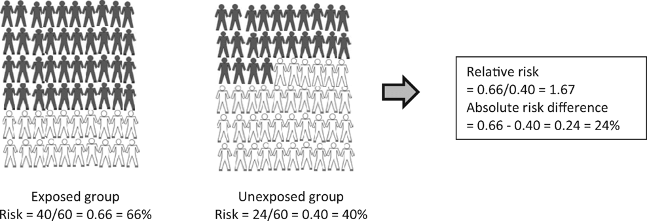
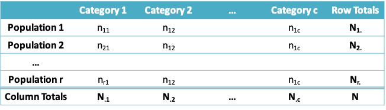
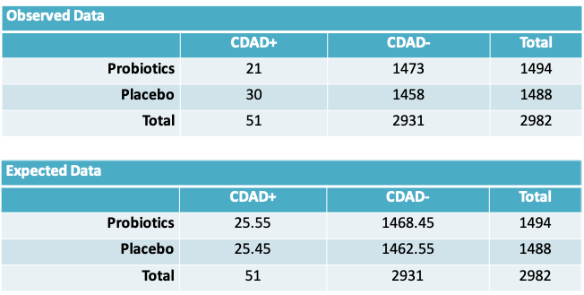
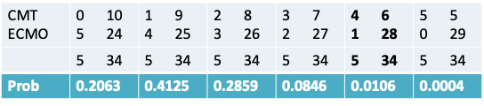

# Lecture 8: Other statistics for comparing proportions and methods for contingency tables
## Odds
* Another way of reporting a proportion (p) is in terms of the odds, which is the ratio of the probability of a ‘success’ (p) to the probability of a ‘loss’ (1-p)

\[Odds=\frac{p}{1-p}\]

* The odds can vary from 0 (when p=0) to ∞ (when p=1)
* **Example:** A proportion of 0.2 corresponds to an odds of 0.2/0.8 = 0.25, while a proportion of 0.8 corresponds to an odds of 0.8/0.2 = 4 

### Odds Ratio and Relative Risk
* So far we have looked at how proportions may be compared in terms of the difference between them
* The odds ratio and relative risk (or risk ratio) are also comparisons of proportions, but relying on their ratio
* Both these statistics range from 0 to ∞, with a value of 1 meaning no difference in the proportions
* Though they are mathematically more complicated, they are often reported, in part because they are obtained naturally from regression models

```{r, echo=FALSE,out.width='100%'}
knitr::include_graphics('./8_5.png')
```

* Observed odds ratio = $\frac{ad}{bc}$
* Observed risk ratio = $\frac{\frac{a}{a+c}}{\frac{b}{b+d}}$
* Note that if the risks $\frac{a}{a+c}$ and $\frac{b}{b+d}$ are small, then the odds ratio is approximately equal to the relative risk because a << c and b << d  

### Confidence interval for an odds ratio
* The distribution of the odds ratio is somewhat skew, so that the confidence interval is usually based on a normal distribution approximation to ln(odds ratio), where ln is the notation for the natural logarithm to the base e
* Using Taylor’s series expansion, we can show:

\[Variance(ln(odds\space ratio)) \cong \frac{1}{a}+\frac{1}{b}+\frac{1}{c}+\frac{1}{d}\]

* So that a 95% confidence interval for the ln(odds ratio) is given by

\[\left(ln(odds\space ratio)-1.96\sqrt{\frac{1}{a}+\frac{1}{b}+\frac{1}{c}+\frac{1}{d}},ln(odds\space ratio)+1.96\sqrt{\frac{1}{a}+\frac{1}{b}+\frac{1}{c}+\frac{1}{d}}\right)\]

* To convert this to an interval on the odds ratio scale, we have to take the exponent of both the lower and the upper limit

\[\left(e^{ln(odds\space ratio)-1.96\sqrt{\frac{1}{a}+\frac{1}{b}+\frac{1}{c}+\frac{1}{d}}},e^{ln(odds\space ratio)+1.96\sqrt{\frac{1}{a}+\frac{1}{b}+\frac{1}{c}+\frac{1}{d}}}\right)\]

### Confidence interval for the relative risk
* Similarly, for a relative risk or risk ratio,

\[Variance(ln(relative\space risk))\cong\frac{c}{a(a+c)}+\frac{d}{b(b+d)}\]

* So that the approximate 95% confidence interval for the relative risk is

\[\left(e^{ln(relative\space risk)-1.96\sqrt{\frac{c}{a(a+c)}+\frac{d}{b(b+d)}}},e^{ln(relative\space risk)+1.96\sqrt{\frac{c}{a(a+c)}+\frac{d}{b(b+d)}}}\right)\]

### Probiotics example: Results for both studies
```{r, echo=FALSE,out.width='100%'}
knitr::include_graphics('./8_9.png')
```

* Notice that the Gao study resulted in the conclusion that the observed difference in proportions was statistically significant
* Looking at just these two studies, it is clear that no study should be evaluated on its own
* Ideally, we should analyze results from all available studies (i.e. carry out a meta-analysis) before we can draw a conclusion. Even then,  it would be important to consider the possibility of publication bias 

### Probiotics and CDAD: Rearranging the data
```{r, echo=FALSE,out.width='100%'}
knitr::include_graphics('./8_10.png')
```

### R function for odds ratio and relative risk 
```
rror=function(a,b,c,d) {
  
  rr = (a/(a+c))/(b/(b+d))
  or = (a*d)/(b*c)
  
  sd.rr = sqrt(c/(a*(a+c))+d/(b*(b+d)))
  sd.or = sqrt(1/a+1/b+1/c+1/d)
  
  or.ll=or*exp(-1.96*sd.or)
  or.ul=or*exp(1.96*sd.or)
  rr.ll=rr*exp(-1.96*sd.rr)
  rr.ul=rr*exp(1.96*sd.rr)
  
  
  return(list(or=or,rr=rr,sd.or=sd.or,sd.rr=sd.rr,or.ll=or.ll,or.ul=or.ul,rr.ll=rr.ll,rr.ul=rr.ul))
  
}
```

### Example: Probiotics and CDAD
* **Gao et al.**

\[odds\space ratio = (9×64)/(20×162)=0.18\]
\[risk\space ratio = (9/171)/(21/84)=0.22\]

the odds ratio is not a good approximation of the risk ratio 

* **Allen et al.**

\[odds\space ratio = (21×1458)/(30×1473)=0.69\]
\[risk\space ratio =(21/1473)/(30/1458)=0.70\]

the odds ratio is an accurate approximation of the risk ratio

### Example: 95% confidence intervals for Gao et al.
* Odds Ratio
    + The standard deviation of the odds ratio can be calculated as $\sqrt{\frac{1}{9}+\frac{1}{20}+\frac{1}{162}+\frac{1}{64}}=0.43$
    * A 95% CI for the odds ratio is given by   
    (0.16 × exp(-1.96×0.43) , 0.16 × exp(1.96×0.43))  
    = (0.07, 0.38)
    
### Example: 95% confidence intervals for otitis data
* Risk Ratio
    + The standard deviation of the risk ratio can be calculated as $\sqrt{\frac{162}{9\times 171}+\frac{64}{20\times 84}}=0.38$
    + A 95% CI for the risk ratio is given by  
    (0.21 × exp(-1.96×0.38) , 0.21 × exp (1.96×0.38))  
    = (0.08, 0.35)
    
### Example: Probiotics and CDAD
* The 95% confidence intervals for the Allen et al. study can be calculated similarly as

\[95\%\space CI\space for\space odds\space ratio = (0.40, 1.22)\]
\[95\%\space CI\space for\space risk\space ratio = (0.40, 1.20)\]

* Therefore, our conclusions remain similar to what we had before, namely that there the Gao study suggests that there is a statistically significant benefit of probiotics but the Allen study concludes the opposite

### Risk ratio vs. risk difference

```{r, echo=FALSE,out.width='100%'}
knitr::include_graphics('./8_16.png')
```
```{r, echo=FALSE,fig.cap = "Hypothetical example of a study including 120 subjects: 60 in the group exposed to an environmental factor and 60 in the unexposed group. After 2 years of follow-up it was measured whether subjects had the outcome of interest (black) or did not have the outcome of interest (white).",out.width='100%'}

```

From: Relative risk versus absolute risk: one cannot be interpreted without the other  
Nephrol Dial Transplant. 2017;32(suppl_2):ii13-ii18. doi:10.1093/ndt/gfw465  
Nephrol Dial Transplant | © The Author 2017. Published by Oxford University Press on behalf of ERA-EDTA. All rights reserved.

* When interpreting a risk ratio it is important to keep the risk in the control group in mind
* The risk ratio may exaggerate the importance of a result. Research studies are often reported in the form "New treatment reduces risk of disease X by 75%" 
* Whilst this sounds good, the benefit really depends on how common or rare the disease is. A large reduction of relative risk for a rare disease might not mean much reduction in the absolute risk 
* For example, a 75% reduction in relative risk for something that has a 4 in a million absolute risk of happening brings the absolute risk down to 1 in a million
* Therefore, the risk difference is often preferred to the relative risk when estimating the public health impact of an intervention

## Methods for contingency tables
### Comparing Two or More Proportions: The generic setup
```{r, echo=FALSE,out.width='100%'}

```

### Examples from two randomized controlled trials
```{r, echo=FALSE,out.width='100%'}
knitr::include_graphics('./8_21.png')
```

### R code to examine an r × c table
```
# recreating the acute otitis media data for each child
tmt=rep(c(“AMX”,”SUL”,”Placebo”),c(40,36,41))
aom=rep(c(“AOM”,”No AOM”,“AOM”,”No AOM” “AOM”,”No AOM”),c(12,28,19,17,28,13))

# frequency in each cell
result=table(aom,tmt)
print(result)

# percentage in each cell
result/117

# calculate row and column totals
margin.table(result,1)
margin.table(result,2)

# calculate row and column percentage
prop.table(result,1)
prop.table(result,2)
```

### Output from R
```
> # frequency in each cell
> result=table(aom,tmt)
> print(result)
   tmt
aom  1  2  3
  0 28 17 13
  1 12 19 28
 
> # percentage in each cell
> result/117
   tmt
aom         1         2         3
  0 0.2393162 0.1452991 0.1111111
  1 0.1025641 0.1623932 0.2393162

> # calculate row and column percentage

> prop.table(result,1)
   tmt
aom         1         2         3
  0 0.4827586 0.2931034 0.2241379
  1 0.2033898 0.3220339 0.4745763

> prop.table(result,2)
   tmt
aom         1         2         3
  0 0.7000000 0.4722222 0.3170732
  1 0.3000000 0.5277778 0.6829268
```

### Hypothesis tests to compare two or more proportions
* Suppose we wish to test the null hypothesis that 

\[H_0:\pi_1=\pi_2=...=\pi_P,\]

that is, we have measured the  frequency of occurrence of a dichotomous outcome in P populations, and wish to check if the frequencies are all equal. 

* There are several candidate tests

### Methods to Compare Two or More Proportions
**1. Normal approximation (Z) Test:** We have seen this test when P = 2. The test does not apply when P > 2. Alternative hypothesis can be one or two-sided. 

* Requires large sample sizes to be accurate. “Large” is often stated as a criterion like:  Sample size × min{$\pi,(1-\pi)$} > 5

### Examples from two randomized controlled trials
* The C. difficile-associated diarrhea example can be handled using the Z-test as we have already seen. 
* However, it is not possible to directly extend these methods to the case when there are three (or more) outcome categories and/or three (or more) populations as in the acute otitis media example. 
* Furthermore, the Z-test is not suitable if the sample size is “small”

### Methods to Compare Two or More Proportions
**2. Chi-square ($\chi^2$) Test:** The $\chi^2$ test does apply when P > 2, but the alternative hypothesis is always two-sided. 

* It also requires large sample sizes to be accurate. “Large” is often operationalized as “the **expected** number of subjects in each cell in the r × c table must be at least 5”. 
* We will see soon how to calculate these expected cell sizes.

**3. Fisher’s Exact Test:** is an “exact” test suitable for small sample sizes. 

* It also applies when P > 2, but unlike the $\chi^2$ test, the alternative hypothesis can be one- or two-sided. 
* In contrast, both the $\chi^2$ and Z-test require “large” sample sizes in order to be accurate since they are based on the normal approximation to the binomial distribution. 

### Which method do we use?
* While it is common to use a $\chi^2$ test for large sample sizes and Fisher’s Exact Test for smaller sample sizes, a natural question is “Why not just use Fisher’s Exact Test all the time, since it is always applicable?”
* There are two possible answers. The first is that, as we will see, it is computationally expensive compared to the $\chi^2$ test. 
* Second, there are different assumptions behind each. As will become clear from the examples on the next few pages, in the Fisher’s Exact Test, all “margins” are held fixed (“conditioned upon”), while this is not the case for the Z and $\chi^2$ tests. Thus there is a slightly different inferential philosophy behind each. 

### Hypothesis test for comparing two or more proportions
* Carrying out a hypothesis test involves the same steps as we had seen before:

1. State the null and alternative hypotheses. The alternative is always two-sided if more than two proportions are involved
2. Calculate the test statistic measuring the evidence in favour of the null hypothesis
3. Determine the rejection region specified by the desired Type I error (α)
4. Determine if the test statistic falls in the rejection region. If yes, you conclude that you have enough evidence to reject the null hypothesis. If no, you conclude that you do not have enough evidence to reject the null hypothesis
5. Calculate a p-value

### Example: One Sample $\chi^2$ test
* Let us first consider a chi-square test for a single proportion. Let us assume the null and alternative hypothesis of interest are 

\[H_0:\pi=0.8\space vs\space H_a:\pi\neq0.8\]

* The observed data is summarized in the table below:
```{r, echo=FALSE}
library(knitr)
df<- data.frame(z=c("Population"),zSuccess=c(60),zFailure=c(40))
knitr::kable(df, col.names = gsub("[z]", " ", names(df)))
```

* Procedure: If the null hypothesis were true and then the split of successes and failures in this same sample of 100 subjects would be expected to be as follows:
```{r, echo=FALSE}
library(knitr)
df<- data.frame(z=c("Population"),zSuccess=c(80),zFailure=c(20))
knitr::kable(df, col.names = gsub("[z]", " ", names(df)))
```

* Observed discrepancies from these expected values are evidence against the null hypothesis. We calculate:

\[\chi^2=\sum_{all\space cells}\frac{(Observed-Expected)^2}{Expected}\]
\[=\frac{(60-80)^2}{80}+\frac{(40-20)^2}{20}=\frac{400}{80}+\frac{400}{20}=25\]

* The rejection region is the region beyond the $Q_{1-α}$ quantile of the $\chi^2$ distribution with 1 degree of freedom (1 df). This can be obtained using the qchisq() function in R

```
> qchisq(0.95,1)
[1] 3.841459
```

* Because 25 exceeds 3.841459 we can reject the null hypothesis
* The reason we the number of degrees of freedom is 1 is because we once we calculate the expected value in 1 cell, the expected value in the remaining (1) cell is known 
* Note that if the same hypothesis had been tested using a Z-test, the z-statistic would have been 5 or the square-root of the chi-squared statistic.

### Calculating the p-value under a chi-square distribution
```{r, echo=FALSE,out.width='50%'}
knitr::include_graphics('./8_36.png')
```

* As the graph illustrates, the p-value is the probability of being greater than the observed test statistic
* For our example the p-value may be obtained as follows:

```
> 1-pchisq(25,1)
[1] 5.733031e-07
```

### Example: Two sample $\chi^2$  Test
```{r, echo=FALSE,out.width='100%'}
knitr::include_graphics('./8_37.png')
```

* We would like to test the hypothesis $H_0:\pi_1=\pi_2$; that is, the proportion of CDAD cases is the same in the probiotics and placebo groups.
* Procedure: Since we hypothesize $\pi_1=\pi_2$, we expect to observe the following data, on average. The expected number of observations at the intersection of the $r^{th}$ row and $c^{th}$ column is given by $\frac{N_{.r}\times N_{.c}}{N}$

```{r, echo=FALSE,out.width='100%'}

```

* Once again, the observed discrepancies from the expected values are evidence against the null hypothesis. We calculate:

\[\chi^2=\sum_{all\space cells}\frac{(Observed-Expected)^2}{Expected}\]
\[=\frac{(21-25.55)^2}{25.55}+\frac{(30-25.45)^2}{25.45}+\frac{(1473-1468.45)^2}{1468.45}+\frac{(1458-1462.55)^2}{1462.55}\cong1.65\]

* Notice that once again, fixing the expected value in 1 cell determined the expected value in the remaining cells. Therefore the number of degrees of freedom in the problem is 1 and the relevant  rejection region is the region beyond the $Q_{1-α}$ quantile of the $\chi^2$ distribution with 1 degree of freedom (1 df).  
* Because 1.65 is less than qchisq(0.95,1) = 3.841459 we cannot reject the null hypothesis

### Example: $\chi^2$ test for the 2 x 3 Table
* Infants judged to be at high risk of acute otitis media (AOM) were randomized to one of three treatment groups a) amoxicillin (AMX), b) sulfisoxazole (SUL), or c) placebo, for a 6-month period (even in the absence of symptoms)
* The results from this study were summarized earlier in the lecture
* We would like to test the hypothesis $H_0:\pi_1=\pi_2=\pi_3$; that is, the proportions of infants who were AOM free at 6 months is the same irrespective of the treatment received. The alternative hypothesis is that the three proportions are not equal

```{r, echo=FALSE}
library(knitr)
library(kableExtra)
df<- data.frame(z=c("AOM during 6 mths of treatment","AOM free","Total"),AMX=c(12,28,40),SUL=c(19,17,36),Placebo=c(28,13,41),Total=c(59,58,117))
knitr::kable(df, col.names = gsub("[z]", " ", names(df))) %>%
  kable_styling("striped") %>%
  add_header_above(c("Observed Data" = 5))
```

```{r, echo=FALSE}
library(knitr)
library(kableExtra)
df<- data.frame(z=c("AOM during 6 mths of treatment","AOM free","Total"),AMX=c(20.17,19.83,40),SUL=c(18.15, 17.85,36),Placebo=c(20.681,20.32,41),Total=c(59,58,117))
knitr::kable(df, col.names = gsub("[z]", " ", names(df))) %>%
  kable_styling("striped") %>%
  add_header_above(c("Expected Data" = 5))
```

* Once again, the observed discrepancies from the expected values are evidence against the null hypothesis. We calculate:

\[\chi^2=\sum_{all\space cells}\frac{(Observed-Expected)^2}{Expected}\]
\[=\frac{(12-20.17)^2}{20.17}+\frac{(28-19.83)^2}{19.83}+\frac{(19-18.15)^2}{18.15}\]
\[+\frac{(17-17.85)^2}{17.85}+\frac{(19-18.15)^2}{18.15}+\frac{(17-17.85)^2}{17.85}\]
\[\cong11.991\]

* For tables where r>1 and c>1, we determine the number of degrees of freedom (df) using df = (r-1) × (c-1). For our example, df = (2-1) × (3-1) = 2
* Assuming the desired Type I error is 0.05, the rejection region is the region above 

```
> qchisq(0.95,2)
[1] 5.991465
```

* Since the test statistic lies above this value, we have enough evidence to reject the null hypothesis of no difference in the probability of being AOM free across the 3 treatment groups
* Alternatively, we could report the p-value to support the same conclusion

```
> 1-pchisq(11.991,2)
[1] 0.002489932 
```

### Some more notes on the chi-square test
* We saw examples involving 2 × 1, 2 × 2 and 2 × 3 tables. But the method applies more generally to r × c tables. 
* Generally speaking, the null and alternative hypotheses may be stated as  
$H_0:$ There is no association between X and Y  
$H_A:$ There is an association between X and Y  

where X and Y are the two categorical variables whose cross-tabulation defines the r × c table

### Chi-square test in R
* Tests involving one or two proportions can be carried out using the function prop.test()
* In order to carry out a chi-square test for ≥2 proportions we can use the chisq.test() function. The observed data must be supplied in the form of a matrix
* On the following slides you will find the R code for carrying out each of the three examples on the chi-square test

### Chi-square test for a single proportion
```
> prop.test(60,100,p=0.8,correct=F)

	1-sample proportions test without continuity correction

data:  60 out of 100, null probability 0.8
X-squared = 25, df = 1, p-value = 5.733e-07
alternative hypothesis: true p is not equal to 0.8
95 percent confidence interval:
 0.5020026 0.6905987
sample estimates:
  p 
0.6 
```

* Notice that the arguments to prop.test() include the value under the null hypothesis and also correct=F to avoid the continuity correction
* As seen in the previous lecture and also in the R output on the right, the chi-squared statistic is the square of the Z-statistic. The p-value is identical

### Two sample $\chi^2$ Test in R
```
a = matrix(c(21,1473,30,1458),
+            byrow=T,nrow=2)
> chisq.test(a,correct=F)

	Pearson's Chi-squared test

data:  a
X-squared = 1.6529, df = 1, p-value = 0.1986
 
> sqrt(1.6529)
[1] 1.285652
```

Notice that the data is supplied to the chisq.test() function in the form of a matrix a 

I provided the argument correct=F so the continuity correction is not applied, and we could compare the results with those obtained by hand

### Three sample $\chi^2$ Test in R
```
> a=matrix(c(12,19,28,28,17,13),2,3,
                         byrow=T)
> result=chisq.test(a,correct=F)
> print(result)

	Pearson's Chi-squared test

data:  a
X-squared = 11.991, df = 2, p-value = 0.00249

> names(result)
[1] "statistic" "parameter" "p.value"   "method"    "data.name" "observed"  "expected"  "residuals" "stdres" 
```

For this example, I defined an object called result which has the output of the chisq.test() function

By applying the names() function to this object, we can see that the chisq.test() function provides more than the output we have been looking at so far

Among other details, it provides the expected values in each cell of the contingency table

### Example: ECMO$^*$
* Extracorporeal membrane oxygenation (ECMO) is a potentially life-saving procedure that is used to treat newborn babies who suffer from severe respiratory failure
* Data from a randomized controlled trial evaluating ECMO are shown in the following table

```{r, echo=FALSE}
library(knitr)
library(kableExtra)
df<- data.frame(z=c("CMT","ECMO","Total"),Died=c(4,1,5),Lived=c(6,28,34),Total=c(10,29,39))
knitr::kable(df, col.names = gsub("[z]", " ", names(df))) %>%
  kable_styling("striped") %>%
  add_header_above(c("Observed Data" = 4))
```

$^*$Text by Samuels et al., Chapter 10

### Example: Fisher’s Exact Test
* As with the Z and chi-square tests, we would like to test the null hypothesis $H_0:\pi_{EMO}=\pi_{CMT}$, where $\pi$ denotes the risk of mortality
* However, since the sample size is so small, there is doubt about the applicability of these tests to this data set. In fact as the following table reveals the expected number of subjects in some cells is less than 5

```{r, echo=FALSE}
library(knitr)
library(kableExtra)
df<- data.frame(z=c("CMT","ECMO","Total"),Died=c(1.28,3.72,5),Lived=c(8.72,25.28,34),Total=c(10,29,39))
knitr::kable(df, col.names = gsub("[z]", " ", names(df))) %>%
  kable_styling("striped") %>%
  add_header_above(c("Expected Data" = 4))
```

### Fisher’s exact test
* An “exact” test can be constructed via the following reasoning: We have observed a total of 5 failures. If groups CMT and ECMO receive equally effective treatments, then the five failures should be equally distributed between the two groups. 
* If the sample sizes were equal, we would expect 2.5 failures in each group, but since the CMT group is much smaller, we expect the failures to be divided in a roughly 1:3 ratio. 
* As in the previous tests, discrepancies from this “fair split” indicate departures from the null hypothesis.

### Example: Fisher’s exact test
* We will first enumerate all possible tables that could have been observed and calculate the probability of each split

```{r, echo=FALSE,out.width='100%'}

```

* The probability of each split is given by an expression that we will see shortly
* The sum of these probabilities is 1
* The calculation of the p-value depends on whether the alternative is one- or two-sided.
* If the alternative is one-sided, then the p-value is obtained by considering the observed table and the tables that are more extreme in the direction supporting the alternative. 
* If the alternative is two-sided, then the p-value can be obtained by considering the observed table and all tables that are associated with a smaller probability.
* See the following slide for an illustration for our particular example.

### Calculation of p-value for Fisher’s exact test
```{r, echo=FALSE,out.width='100%'}
knitr::include_graphics('./8_54.png')
```

### Fisher’s exact test
* The probability of each possible table that can be observed while keeping the margins fixed, is calculated using the hypergeometric distribution
* In general, if we observe the following table then its probability is given by the expression on the next slide

```{r, echo=FALSE}
library(knitr)
library(kableExtra)
df<- data.frame(z=c("Row 1","Row 2","Total"),Columnz1=c("a","c","a+c"),Columnz2=c("b","d","b+d"),Total=c("a+b","c+d","N=a+b+c+d"))
knitr::kable(df, col.names = gsub("[z]", " ", names(df)))
```

* Probability of each table

\[=\frac{(a+b)!(b+d)!(a+c)!(c+d)!}{N!a!b!c!d!}\]

* Notice that unlike the chi-square test, the value in each cell and the fixed margins enter the calculations, illustrating the requirement of the Fisher’s exact test that the marginal totals should be fixed
* Another, equivalent but more complex expression, gives a clue as to how the probability is obtained:

\[\frac{\frac{(a+c)!}{a!c!}\frac{(b+d)!}{b!d!}}{\frac{N!}{(a+c)!(b+d)!}}\]

* It is the probability of selecting a failures among a+c possible failures for Group 1 and b successes among b+d possible successes for Group 1 , while selecting (a+c) failures among a sample size of N 

### Carrying out Fisher’s exact test in R - two-sided alternative
```
> a=matrix(c(4,1,6,28),2,2,byrow=T)
> fisher.test(a)

	Fisher's Exact Test for Count Data

data:  a
p-value = 0.01102
alternative hypothesis: true odds ratio is not equal to 1
95 percent confidence interval:
   1.366318 944.080411
sample estimates:
odds ratio 
  16.78571 
```

* Once again we provide the data as a matrix
* The default is the two-sided alternative
* Also, note there is no need to provide an argument for a continuity correction as this is an exact test

### Carrying out Fisher’s exact test in R - one -sided alternative
* Unlike for the chi-square test, here we can specify as an argument whether the test is one or two-sided
* The results on the following slide provide the results from R in the two cases where the alternative favors i) CMT or ii) ECMO for our example

#### Alternative: CMT has higher risk of dying
```
> fisher.test(a,alternative="greater")

	Fisher's Exact Test for Count Data

data:  a
p-value = 0.01102
alternative hypothesis: true odds ratio is greater than 1
95 percent confidence interval:
 1.833681      Inf
sample estimates:
odds ratio 
  16.78571 
```

#### Alternative: ECMO has higher risk of dying
```
> fisher.test(a,alternative="less")

	Fisher's Exact Test for Count Data

data:  a
p-value = 0.9996
alternative hypothesis: true odds ratio is less than 1
95 percent confidence interval:
   0.0000 467.3486
sample estimates:
odds ratio 
  16.78571 
```
