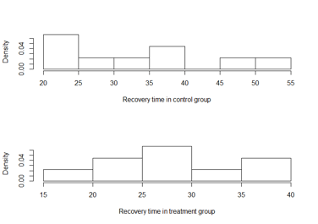
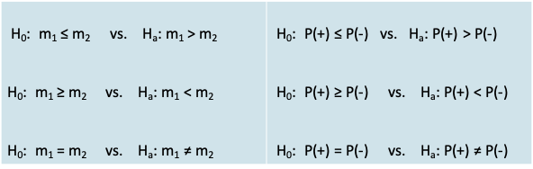
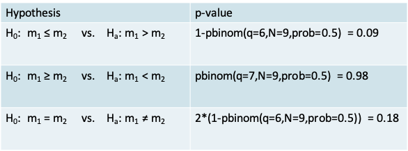
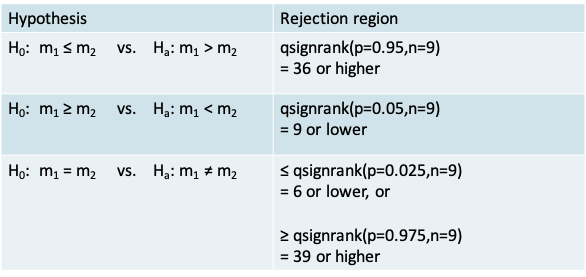
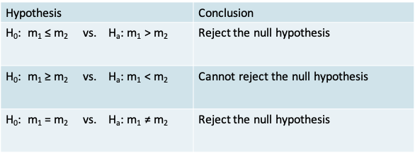
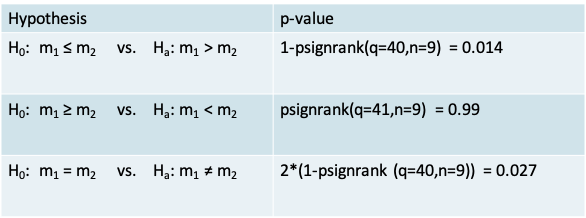
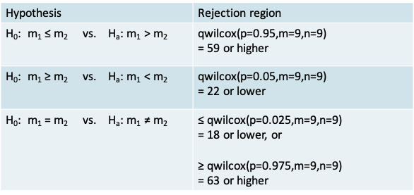
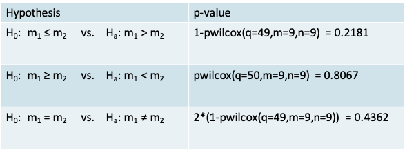
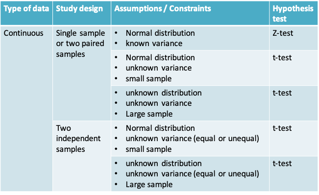
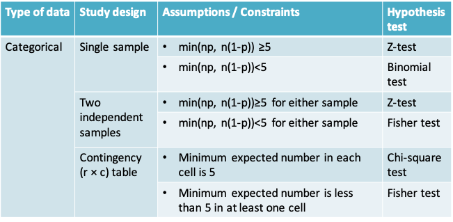

# Lecture 9: Non-parametric methods 
## Parametric Inference
* Thus far,  we studied methods for statistical inference that relied on assuming a distributional form that links observed data to the unknown parameters. We then estimated parameters of that distribution (e.g. mean or standard deviation) based on a sample
* For example, we assumed that continuous data may be normally distributed or that the mean of the variable may be normally distributed based on the central limit theorem. For dichotomous data, we assume a Bernoulli or binomial distribution instead. 
* Once the parameters have been estimated (for example, the mean and/or variance for a Normal distribution), the distribution is fully specified. This is known as parametric inference.

### Examples$^*$
* **Visual acuity** can be measured on an ordinal scale. We know 20-20 vision is better than 20-30, which is better than 20-40 vision and so on. However, a numeric value cannot easily be assigned to each level of visual acuity that all ophthalmologists would agree on
* Computing means and standard deviations for such data is therefore not meaningful, and parametric methods for hypothesis testing cannot be used
* A **patient’s condition after treatment** may be measured on a 5-point scale: 
    + 1=much improved
    + 2=slightly improved
    + 3=stays the same
    + 4=slightly worse
    + 5=much worse
* We cannot say whether the difference between 1 and 2 on this scale is the same as the difference between 2 and 3

### Non-Parametric Inference
* Sometimes we may be unwilling to specify in advance the general shape of the distribution, and prefer to base the inference on the data, without a parametric model. In this case, we use *distribution free*, or *nonparametric* methods.
* These methods are used typically when we have a very small sample size and the central limit cannot be relied on
* We will study 3 hypothesis testing methods in this lecture
    + The **sign test** for comparing paired samples
    + The **Wilcoxon signed rank** test for comparing paired samples
    + The **Wilcoxon rank sum** test for comparing samples that are not paired
* The same data will be used to illustrate all 3 tests

### Hypothesis testing procedure
* The procedure for non-parametric hypothesis testing is similar to that for parametric tests

```{r, echo=FALSE,out.width='100%'}
knitr::include_graphics('./9_7.png')
```

### Example: Comparison of Two Matched Samples
* **Example:** Suppose that a new post-surgical treatment is being compared with a standard treatment by observing the recovery times of n treatment subjects and m controls. Suppose the data are matched m=n=9 and that the observed recovery times (in days) are:

```{r, echo=FALSE}
library(knitr)
df<- data.frame(Pair=c("Control","Treatment","Sign (Treatment < Control)"),z1=c(20,19,"+"),z2=c(21,22,"-"),z3=c(24,25,"-"),z4=c(30,26,"+"),z5=c(32,28,"+"),z6=c(36,29,"+"),z7=c(40,34,"+"),z8=c(48,37,"+"),z9=c(54,38,"+"))
knitr::kable(df, col.names = gsub("[z]", " ", names(df)))
```

* Thus 7 out of 9, or 78%, of recovery times were better (i.e. lower) in the treatment group. Is this likely to be due to chance, or is it “statistically significant”?

### Example
```
>x=c(20,21,24,30,32,36,40,48,54)
>y=c(19,22,25,26,28,29,34,37,38)
>t.test(x,y,paired=T)

	Paired t-test

data:  x and y
t = 2.7939, df = 8, p-value = 0.02342
alternative hypothesis: true difference in means is not equal to 0
95 percent confidence interval:
 0.9118896 9.5325549
sample estimates:
mean of the differences 
               5.222222 
```

```{r, echo=FALSE,out.width='50%'}

```

* The distribution of the recovery time is not known and the sample is small
* A two-sided paired t-test gives us a p-value of 0.023, leading to the conclusion that there is sufficient evidence to reject the null hypothesis of no difference in the mean recovery times in the two groups
* Can we be confident of these results given the assumptions of the t-test are not really met?

### Comparison of Two Matched Samples: The Sign Test
* Let m1 and m2 denote the median of the continuous variable being compared in the control group and in the treatment group, respectively. Let P(+) and P(-) denote the number of positive and negative signs
* **Null and alternative hypotheses** can be expressed either in terms of the median or in terms of the number of positive signs:

```{r, echo=FALSE,out.width='100%'}

```

### The Sign Test: The test statistic
* It is simply the number of positive signs
* Reasoning: If the two procedures are truly equivalent then we would expect roughly equal numbers of +’s and –’s in the sample

### The Sign Test: Calculating the p-value
* Define the desired Type I error of α 
* Notice that the ‘number of positive signs’ out of a fixed number of N pairs can be considered like the ‘number of successes’ out of N trials in a Binomial experiment. 
* The p-value is simply the probability of being equal to or more extreme than the test-statistic. Once again, its value will depend on whether the alternative hypothesis is one- or two-sided, as we will see in the example

### Example
* The value of the test statistic is $n_+ = 7$
* The p-value corresponding to each alternative hypothesis appears in the table below. It is calculated using the pbinom function for the cumulative probability under the Binomial distribution

```{r, echo=FALSE,out.width='70%'}

```

* In this particular example, using the two-sided sign test would lead us to conclude that there isn’t enough evidence to reject the null hypothesis that the median recovery time is the same in both groups
* In this case the sign test was more conservative than the t-test

### Carrying out the Sign Test in R
```
> binom.test(7,9,alternative="greater")

	Exact binomial test

data:  7 and 9
number of successes = 7, number of trials = 9, p-value = 0.08984
alternative hypothesis: true probability of success is greater than 0.5
95 percent confidence interval:
 0.4503584 1.0000000
sample estimates:
probability of success 
             0.7777778 
```

* Since the sign test is nothing but the test for a single proportion based on the Binomial distribution, we can use the binom.test() function in R
* The example above corresponds to a one-sided test

### Are non-parameteric methods really “distribution free”?
* They are in the sense that we make no assumptions concerning the **underlying distribution from which the data arise**. 
* However, note that we still used a probability distribution in carrying out the sign test. We used the Binomial distribution from which we calculated the p-value 
* The t-test requires the assumption that the data arise from a Normal distribution or that the sample size is large, while the sign test does not require these assumptions. * The sign test made no assumptions about an underlying population, or the shape of any distribution. In using the sign test, we also did not need to consider degrees of freedom, or whether we had equal variances or not

### Comparison of Two Matched Samples: The Wilcoxon Signed Rank Test
* The sign test is very wasteful of information since it assigns each pair only a “+” or “-”, regardless of the magnitude of the difference. 
* We can take the differences into account by using a **Wilcoxon Signed Rank Test**. The statement of the null and alternative hypotheses remains the same as for the Sign test. 
* However, the calculation of the test statistic is different (see following slide)
    + Place the **absolute** differences in recovery times between the two groups in ascending order of magnitude
    + Rank the differences. Calculate the average rank in case of ties
    + Calculate the total of the ranks for the pairs with a + sign

### Example: Wilcoxon Signed Rank Test
```{r, echo=FALSE}
library(knitr)
df<- data.frame(Pair=c("Control","Treatment","Absolute difference in Recovery time
","Rank of the absolute difference","Adjusted rank","Sign (Treatment < Control)"),z1=c(20,19,1,1,2,"+"),z2=c(21,22,1,2,2,"-"),z3=c(24,25,1,3,2,"-"),z4=c(30,26,4,4,4.5,"+"),z5=c(32,28,4,5,4.5,"+"),z6=c(36,29,7,7,7,"+"),z7=c(40,34,6,6,6,"+"),z8=c(48,37,11,8,8,"+"),z9=c(54,38,16,9,9,"+"))
knitr::kable(df, col.names = gsub("[z]", " ", names(df)))
```

* The test statistic is given by $T_+  = 2+4.5+4.5+7+6+8+9 = 41$
* Summing up the ranks corresponding to the “+” signs we have $T_+ = 41$.  
  Summing up the ranks corresponding to the “-” signs we have $T_- = 4$.
* If there is no difference in the two groups, then we would expect $T_+$ and $T_-$ to be approximately equal to each other, so that unequal values indicate departures from the null hypothesis. 
* Is the observed difference “significant”?
* To answer this question we compare the test statistic to a rejection region defined by the distribution of the signed ranks
* As with the other probability distributions we have studied so far, we can use R to obtain the quantiles of the signed ranks. The relevant function is qsignrank()

```{r, echo=FALSE,out.width='70%'}

```

* Recall that the value for the test statistic is $T_+ = 41$
* The conclusion when using each of the three alternative hypotheses in the context of our example appears in the table below 

```{r, echo=FALSE,out.width='70%'}

```

* The p-value corresponding to each alternative hypothesis appears in the table below. It is calculated using the psignrank() function for the cumulative probability under the Wilcoxon signed rank distribution. 

```{r, echo=FALSE,out.width='70%'}

```

* Note that the expressions for calculations of the p-value on the previous slide were suitable for the situation where the test-statistic is above the mean value of the test statistic of n(n+1)/4
* In our example, $T_+ = 41$ was above the expected value of n(n+1)/4 = 90/4 = 22.5
* Alternatively, if $T_+$ turns out to be less than the mean, we can work with   $T_-  = n(n+1)/2 - T_+$ and apply the expressions on the previous slide.
* For example, if $T_+ = 15$ in a given problem with n=9, then we can calculate $T_- = n(n+1)/2 - T_+ = 45 - 15 = 30$ and calculate the p-value using the expressions on the previous slide

### Wilcoxon Signed Rank Test in R
```
x=c(20,21,24,30,32,36,40,48,54)
y=c(19,22,25,26,28,29,34,37,38)
wilcox.test(x,y,paired=T,correct=F, alternative="greater")

	Wilcoxon signed rank test

data:  x and y
V = 41, p-value = 0.01386
alternative hypothesis: true location shift is greater than 0

Warning message:
In wilcox.test.default(x, y, paired = T, correct = F, alternative = "greater") :
  cannot compute exact p-value with ties
```

* The Wilcoxon Signed Rank test can be carried out using the wilcox.test() function
* Notice, the arguments mentioning it is a paired test, that there is no continuity correction and that it is one-sided
* The warning tells us that this function cannot compute exact p-values in the presence of ties. The p-value that we calculated on the previous slide is exact, whereas the one from R is based on a normal approximation (which we will cover next)
* The continuity correction leads to a higher p-value of 0.0161, which is more conservative but not necessarily more precise

### Normal approximation to the Sign and Wilcoxon Signed Rank Tests
* If the sample size is large enough, we can use a normal approximation for both the sign and the signed rank tests. A continuity correction can be used to improve the approximation
* The approximate sign test is the same as the test for a single proportion based on the normal approximation to the Binomial distribution
* For the Wilcoxon signed rank test we can show that under the null hypothesis of “no difference”,   
  The expectation $E(T_+)=\frac{n(n+1)}{4}=\frac{9\times 10}{4}=22.5$   
  and $var(T_+)=\frac{n(n+1)(2n+1)}{24}=\frac{9\times 10\times 19}{24}=71.25$
  
### Normal approximation to the Wilcoxon Signed Rank Test
* Using the information about the expected value and the variance we can calculate a Z-statistic that follows a standard normal distribution
* Applying a continuity correction, calculate 

\[z=\frac{T_+-E(T_+)}{sd(T_+)}=\frac{40.5-22.5}{\sqrt{71.25}}=2.13\]

* From the Normal  tables, the one-sided p-value is, *p*=P(Z>2.13)=0.0164, which would lead to a similar conclusion as the exact test
* Notice that this result is similar enough but not identical to the calculation by R owing perhaps to differences in the way tied ranks are calculated 

### Comparison of two unmatched samples
* Suppose that the data in the previous example were not paired, but instead came from two independent samples
* We would then use the **Wilcoxon Rank Sum** test
* The hypotheses of interest would be stated in the same as for the sign test and signed rank test, but  the construction of the test statistic is slightly different
* This test is also known as the Mann-Whitney test

### Wilcoxon Rank Sum Test
* As shown on the following slide calculation of the test statistic involves the following steps
    + First, order the recovery times in the two groups without concern for the group to which an observation belongs
    + In the case of ties, you may need to calculate an adjusted rank by taking the average of the rank for the tied observations
    + Then, sum up the ranks in one of the groups

### Wilcoxon Rank Sum Test: Calculation of the test statistic 
```{r, echo=FALSE,out.width='100%'}

```
$^*$Recovery Time

* T denotes Treatment group and C denotes Control group
* There were no ties in this example
* Now summing the ranks in the control group gives:   
  $T_C = 2 + 3 + 5 + 10 + 11 + 13 + 16 + 17 + 18 = 95$
* The exact test statistic is given by $T_C-\frac{m(m+1)}{2}$, where m is the size of the control group
* For our example, $T_C-\frac{m(m+1)}{2}=95-\frac{9(9+1)}{2}=95-45=50$

### Exact Wilcoxon Rank Sum Test
* As with the signed rank test, there is an exact and an approximate version of the Wilcoxon Rank Sum test
* The exact version will rely on the quantiles and cumulative probabilities of Wilcoxon Rank Sum distribution for calculation of the rejection region and the p-value, respectively

### Example: Wilcoxon Rank Sum Test
* We can use the R function qwilcox() to obtain the quantiles that defined the rejection region for our example. Note that m is the number of controls and n is the number in the treatment group.

```{r, echo=FALSE,out.width='70%'}

```

* Recall that the value for the test statistic is 50
* The conclusion when using each of the three alternative hypotheses in the context of our example appears in the table

```{r, echo=FALSE,out.width='70%'}
knitr::include_graphics('./9_33.png')
```

* The p-value corresponding to each alternative hypothesis appears in the table below. It is calculated using the pwilcox() function for the cumulative probability under the Wilcoxon rank sum distribution

```{r, echo=FALSE,out.width='70%'}

```

* Therefore, our data would lead us to conclude we **cannot** reject the null hypothesis of equality of the median recovery time between the two treatments

### Approximate Wilcoxon Rank Sum Test
* On an average, *if the null hypothesis of “no difference” is true*, we would expect $T_c$ to be

\[E(T_C)=\frac{m(m+n+1)}{2}=\frac{9(9+9+1)}{2}=85.5\]

where m is the number of patients in the control group.

We would expect its variance to beand its variance to be

\[var(T_C)=\frac{mn(m+n+1)}{12}=\frac{9\times 9(9+9+1)}{12}=128.25\]

* and thus $sd(T_C)=\sqrt{128.25}=11.32$
* Using the information on the expectation and variance of $T_C$ we can calculate a Z-statistic
* If the sample is large enough, $z=\frac{T_C-E(T_C)}{sd(T_C)}$

z follows a normal distribution, so that the null hypothesis can be tested using the usual normal tables

* Because $T_C$ takes only whole number values, the continuity correction improves the accuracy of the approximation. Here, the continuity correction acts as if the whole number 95 occupies the entire interval from 94.5 to 95.5.
* Thus we calculate

\[z=\frac{T_C-E(T_C)}{sd(T_C)}=\frac{94.5-85.5}{11.32}=0.795\]

so that p=P(Z>0.795) = **1-**pnorm(0.795) = 0.2133

### Wilcoxon Rank Sum Test in R
```
> wilcox.test(x,y,correct=T,alternative= "greater")

	Wilcoxon rank sum test

data:  x and y
W = 50, p-value = 0.2181
alternative hypothesis: true location shift is greater than 0
```

* The function is the same as the one used for the signed rank test, but with the paired= argument set to its default value of F
* The lack of ties in this example means that this result corresponds to the exact test by default

```
wilcox.test(x,y,correct=T,alternative="greater",exact=F)

	Wilcoxon rank sum test with continuity correction

data:  x and y
W = 50, p-value = 0.2134
alternative hypothesis: true location shift is greater than 0
```

* We could use the exact=F argument to obtain a p-value closer to the one we got using the approximate method

### Summary of hypothesis tests covered in this course
```{r, echo=FALSE,out.width='100%'}


knitr::include_graphics('./9_42.png')
```

## Bootstrap confidence interval
### Confidence intervals vs. Hypothesis Testing
* As mentioned in earlier lectures
    + Hypothesis testing is preferable when the goal of the statistical inference is to make a decision
    + In exploratory research studies, where we are not yet interested in making a decision, a confidence interval reflecting the magnitude of the uncertainty in our inference is more useful

### Bootstrap confidence intervals
* A popular non-parametric method for the calculation of confidence intervals is the Bootstrap
* It was described in a 1979 paper by Bradley Efron
* The key idea is to perform the computations on the data itself and not to rely on any assumption about its distribution. The data is thus ‘pulling itself up by its bootstraps’ so to speak$^*$
* The Bootstrap method relies on resampling, i.e. sampling from the observed data with replacement
* The central limit theorem relied on the sampling distribution of the data (i.e. distribution of the statistic in repeated samples drawn from the population) 
* The Bootstrap relies instead on the empirical (or resampling) distribution of the data (i.e. the distribution of the statistic in repeated samples drawn from the observed dataset)

$^*$[MIT Opencourseware handout](https://ocw.mit.edu/courses/mathematics/18-05-introduction-to-probability-and-statistics-spring-2014/readings/MIT18_05S14_Reading24.pdf)

### Bootstrap: Example$^*$
* Suppose we roll an 8-sided die 10 times and we get the following (after sorting) 
    + 1, 1, 2, 3, 3, 3, 3, 4, 7, 7
* Imagine writing these values on 10 slips of paper, putting them in a hat and drawing one at random
* The true vs. resampling distributions would be as follows

```{r, echo=FALSE}
library(knitr)
df<- data.frame(z=c("True distribution","Resampling distribution"),z1=c("1/8","2/10"),z2=c("1/8","1/10"),z3=c("1/8","4/10"),z4=c("1/8","1/10"),z5=c("1/8","0"),z6=c("1/8","0"),z7=c("1/8","2/10"),z8=c("1/8","0"))
knitr::kable(df, col.names = gsub("[z]", "   ", names(df)))
```

* We can see from this example that the resampling distribution is not the true distribution
* It does not therefore provide a good estimate for the true distribution and should not be used to estimate the mean or quantiles of the true distribution
* However, it can be shown that it provides a pretty good estimate of the variability in the distribution. That is why the resampling distribution can be used to estimate confidence intervals

$^*$[MIT Opencourseware handout](https://ocw.mit.edu/courses/mathematics/18-05-introduction-to-probability-and-statistics-spring-2014/readings/MIT18_05S14_Reading24.pdf)

### The empirical bootstrap
* Suppose we observe n data points $x_1, x_2, …, x_n$  from the distribution F and that u is a statistic calculated from this sample, e.g. the sample mean
* An empirical bootstrap sample is a resample of the same size n from the observed sample
* We denote the resampled values by $x_1^*, x_2^*, …, x_n^*$. These values follow the empirical distribution $F^*$ while  $u^*$ is the statistic calculated from the bootstrap sample
* The bootstrap principle says that:
    + $F^* ≈ F$
    + The variation of u is well-approximated by the variation of $u^*$
* The variation in u depends on the sample size. Therefore, the size of the resample is the same as the original sample to be able to estimate this variation 

### Example
* Let us use the same dataset we have been using so far. Say the goal is to estimate the surgical recovery time in the Treatment group

```{r, echo=FALSE}
library(knitr)
df<- data.frame(Subject=c("Recovery time (days)"),z1=c(19),z2=c(22),z3=c(25),z4=c(26),z5=c(28),z6=c(29),z7=c(34),z8=c(37),z9=c(38))
knitr::kable(df, col.names = gsub("[z]", " ", names(df)))
```

* Because the sample size is small and we do not know whether the true distribution is normal, it is preferable not to use the confidence interval based on the central limit theorem, which we covered in Lecture 3
* We wish to estimate the median with an 80% confidence interval
* The sample median is 28 days. We would like to know how much the sample median (u) varies around the true median (m), i.e. we would like to know the distribution of δ=u-m
* The bootstrap principle says that we can approximate the distribution of δ by the distribution of $δ^*= u^*-u$, where $u^*$ is the median in an empirical bootstrap sample
* Note that the distribution of $δ^*= u^*-u$ depends on quantities we already know. Therefore, it can be easily recreated by using a computer
* We can draw as many resamples as we wish and calculate $δ^*$ each time. We can estimate $δ^*$ to a high degree of precision by drawing a large number of resamples 
* For example, if we used R to generate 10 bootstrap samples from our observed sample. They may look like this:
```{r, echo=FALSE}
library(knitr)
df<- data.frame(S1=c(26,22,29,38,29,29,22,25,22),S2=c(37,26,29,38,34,29,22,26,19),S3=c(26,28,19,25,25,38,29,29,29),S4=c(26,22,22,37,22,28,26,34,26),S5=c(26,37,37,22,38,29,25,37,22),S6=c(26,19,29,26,29,26,26,28,29),S7=c(38,38,34,38,19,25,38,25,34),S8=c(37,28,38,38,29,26,29,28,22),S9=c(29,34,22,37,29,29,34,37,22),S10=c(38,37,38,38,25,19,38,29,25))
knitr::kable(df)
```

* Notice that the same value may be sampled multiple times within each sample because it is a resample
* The median of the 10 samples is 

\[26, 29, 28, 26, 29, 26, 34, 29, 29, 37\]

* We can calculate $δ^*$ in each case and sort in ascending order to obtain

\[-2, -2, -2, 0, 1, 1, 1, 1, 6, 9\]

* The 10% and 90% quantiles of $δ^*$ may be approximated by -2 and 9
* Therefore the bootstrap 80% confidence interval for the true median (m) is

\[(u-\delta^*_{0.9},u-\delta^*_{0.1})=(28-(6),28-(-2))=(22,32)\]

* Note that the bootstrap cannot improve our point estimate of u. It is possible that u differs considerably from m, but u-m may still be well approximated by $u^*-u$

### R code for bootstrap
```
x=c(19,22,25,26,28,29,34,37,38)
n=9 # sample size
nboot = 10000 # number of bootstrap samples
tmp=sample(x,n*nboot,replace=T)
resamples=matrix(tmp,ncol=nboot)

ustar=apply(resamples,2,median)
u=median(x)
deltastar=ustar-u

# quantiles of deltastar
d=quantile(deltastar,c(0.1,0.9))

# confidence interval
u-c(d[2],d[1])
```

* We can increase the number of resamples to a very large value, e.g. 10000
* The function sample() allows us to sample with replacement
* The function apply() is very useful for calculating a statistic using each row or column of a matrix
