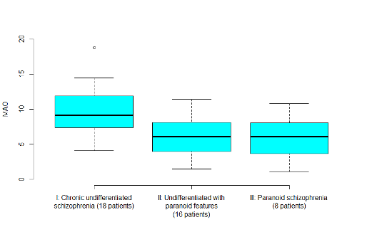
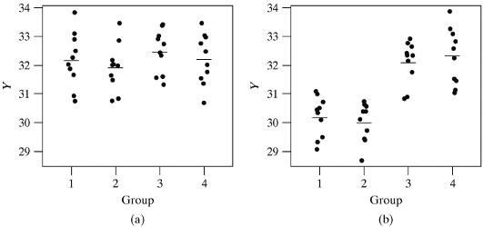
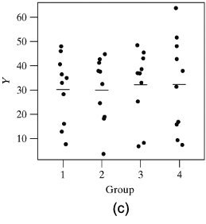
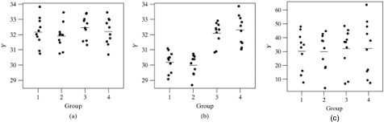

# Lecture 10: Analysis of Variance (ANOVA) 
## Introduction
* So far we have studied methods for comparing means between two groups
* Analysis of Variance (or ANOVA for short) allows us to compare means across more than two groups  
* You can think of it as the equivalent of the chi-squared test that allowed us to compare multiple proportions with a single hypothesis test

### Example: MAO and Schizophrenia
* Monoamine oxidase (MAO) is an enzyme that is thought to play a role in the regulation of behavior. 
* To see whether different categories of patients with schizophrenia have different levels of MAO activity, researchers collected blood specimens from 42 patients and measured the MAO activity in the platelets. 
* The data gathered are displayed on the following two  slides. Values are expressed as nmol benzylaldehyde product per $10^8$ platelets per hour

```{r, echo=FALSE}
library(knitr)
df<- data.frame(Diagnosis=c("I: Chronic undifferentiated schizophrenia (18 patients)","II: Undifferentiated with paranoid features (16 patients)","III: Paranoid schizophrenia (8 patients)"),MAOzactivity=c("6.8 4.1 7.3 14.2 18.8 9.9 7.4 11.9 5.2 7.8 7.8 8.7 12.7 14.5 10.7 8.4 9.7 10.6","7.8 4.4 11.4 3.1 4.3 10.1 1.5 7.4 5.2 10.0 3.7 5.5 8.5 7.7 6.8 3.1","6.4 10.8 1.1 2.9 4.5 5.8 9.4 6.8"),Mean=c(9.8,6.3,6.0),Standardzdeviation=c(3.6,2.9,3.2))
knitr::kable(df, col.names = gsub("[z]", " ", names(df)))
```

```{r, echo=FALSE,out.width='100%'}

```

* From the descriptive statistics and the boxplot, we can see that the mean MAO value in diagnostic category I is higher than in the other two groups
* But we can also see that there is a lot of variability within each group leading to overlapping boxplots
* Is the observed difference between the means statistically significant? In other words, if there was in fact no difference in mean MAO scores between the 3 groups, would it be unusual to obtain the data at hand?

### Why not answer these questions with repeated t-tests?
* We could have carried out 3 separate t-tests to compare the groups. The null hypotheses would be

```{r, echo=FALSE,out.width='100%'}
knitr::include_graphics('./10_8.png')
```

* There are several drawbacks:
    + Large number of pairwise comparisons are difficult to comprehend
    + As the number of tests increases, the Type I error increases 
    + Does not permit us to recognize the structure of the data, e.g. a natural ordering within the groups
    + Does not permit us to improve our estimate of the variance in each group by using information from all groups

### Graphical perspective on ANOVA
* When carrying out an ANOVA, the first step is to carry out the global null hypothesis test of

\[H_0:\mu_1=\mu_2=...=\mu_J\]

where J is the number of groups being tested. The alternative is always two-sided and states that at least two of the means are not equal

* We will look at a series of hypothetical dotplots to understand how this hypothesis is tested 
* A dotplot is essentially a scatterplot, where the variable on the x-axis is a categorical variable and the variable on y-axis is a continuous variable

```{r, echo=FALSE,out.width='100%'}

```

* Graph (a) illustrates a setting where $H_0$ is true. Therefore any differences observed between the groups in the sample means are due to chance
* Graph (b) illustrates a setting where $H_0$ is false. The means for groups 1 and 2 are quite different from those for groups 3 and 4. The small standard deviation in each group makes it possible to visualize the differences easily 

```{r, echo=FALSE,out.width='50%'}

```

```{r, echo=FALSE,out.width='100%'}

```

* In the third graph, $H_0$ is in fact false. The means in the four groups are identical to those in graph (b) seen earlier
* However, the individual group standard deviations are very large making it hard to tell that the population means differ
* In summary, the different graphs show us that in order to judge whether there is a difference between the group means, we need to consider the inherent variability in the data
* In order to be able to detect a difference there must not only be a variation **between** the group means, but this variation must be large relative to the variability **within** the groups
* Hence in order to compare means, we need an analysis of the variance (or ANOVA)

### One-way ANOVA
* An ANOVA for comparing 3 or more groups defined by one variable is called a one-way ANOVA
* For example, the 3 groups defined by the variable “schizophrenia diagnosis” can be compared using a one-way ANOVA
* More complex models would allow comparisons across groups defined by more than one variable, e.g. a two-way ANOVA could be used to compare groups defined by “schizophrenia diagnosis” and “family history” 

### One-way ANOVA: Assumptions
* The observations in the different groups are randomly selected
* The continuous variable of interest follows a normal distribution 
* The variance of this variable is the same in each group

### One-way ANOVA: Notation
* We assume that 
    + There are J groups to compare
    + The observations are denoted as $y_{ij}$ for the $i^{th}$ observation in the $j^{th}$ group
    + The sample size in the $j^{th}$ group is $n_j$
    + The mean in the $j^{th}$ group is $\bar y_j$
    + The standard deviation in the $j^{th}$ group is $s_j$
* The total number of observations is $n_.=\sum_{j=1}^Jn_j$
* The grand mean, i.e. the mean across all groups is

\[\bar{\bar y}=\frac{\sum_{j=1}^J\sum_{i=1}^{n_j}y_{ij}}{n_.}\]

* The grand mean can also be expressed as the weighted average of the group means

\[\bar{\bar y}=\frac{\sum_{j=1}^Jn_j\bar y_{j}}{\sum_{j=1}^Jn_j}\]

### One-way ANOVA: MAO and Schizophrenia
* There are J=3 groups in this problem
* The sample size in each group is $n_1 = 18$, $n_2 = 16$ and $n_3 = 8$
* Following our notation
    + $y_{11} = 6.8, y_{13} = 6.4, y_{31} = 7.3$
* The grand mean is given by

\[\bar{\bar y}=\frac{\sum_{j=1}^Jn_j\bar y_{i}}{\sum_{j=1}^Jn_j}=\frac{=18\times9.8+16\times6.3+8\times6.0}{18+16+8}=7.7\]

* In keeping with our earlier discussion, in order to implement an ANOVA for our example, we need to calculate the between-group and within-group variance in MAO

### ANOVA: Within-group variation
* Since the variance in each group is assumed to be the same, it is best estimated by the pooled variance $(s_p^2)$ across groups. 
    + You will recognize this expression as being similar to the one you saw when we studied t-tests 
    
\[s_p^2=\frac{\sum_{j=1}^J(n_j-1)s_j^2}{\sum_{j=1}^J(n_j-1)}\]

* In addition to the familiar pooled variance we define some other related measures that are typically reported in an ANOVA

```{r, echo=FALSE,out.width='100%'}
knitr::include_graphics('./10_23.png')
```

* Notice that the mean square within groups is the same as the pooled variance

### MAO: Within-group variation
```{r, echo=FALSE,out.width='100%'}
knitr::include_graphics('./10_24.png')
```

### ANOVA: Between-group variation
* The variation between groups is expressed by comparing each group mean to the grand mean

```{r, echo=FALSE,out.width='100%'}
knitr::include_graphics('./10_25.png')
```

### MAO: Between-group variation
* The variation between groups is expressed by comparing each group mean to the grand mean

```{r, echo=FALSE,out.width='100%'}
knitr::include_graphics('./10_25.png')
```

### A fundamental relationship of ANOVA
* Notice that the deviation of an individual observation from the grand mean can be expressed as follows:

\[y_{ij}-\bar{\bar y}=(y_{ij}-\bar y_j)+(\bar y_j-\bar{\bar y})\]

* In other words, this deviation is made up of two deviations:   
1) a within-group deviation $(y_{ij}-\bar y_j)$, and  
2) a between-group deviation $(\bar y_j-\bar{\bar y})$
* A less obvious relation is that this split also holds at the level of the sums of squares, i.e.

\[\sum\sum(y_{ij}-\bar{\bar y})^2=\sum\sum(y_{ij}-\bar y_j)^2+\sum\sum(\bar y_j-\bar{\bar y})^2\]

where the summation is over both i and j

* The quantity on the left of the equation, is called the total sum of squares
* The preceding equation shows that  
Total sum of squares   
= Within-group sum of squares + Between group sum of squares
* As we will see, answering our original question will depend on whether the between group sum of squares makes up the larger or the smaller part of the total sum of squares
* The following slide depicts the ANOVA table that is used to summarize the information on the total, the between-group and the within-group variation

### ANOVA table
```{r, echo=FALSE,out.width='100%'}
knitr::include_graphics('./10_30.png')
```

* Please note that the summation is across i and j
* SS/df is calculated separately for each row 

### MAO Example: ANOVA table
```{r, echo=FALSE,out.width='100%'}
knitr::include_graphics('./10_31.png')
```

* Please note that the sum of squares is slightly different from the earlier slide due to differences in rounding
* Our goal now is to use the data in this table to test the null hypothesis specified earlier

### The F-test
* Recall the null and alternative hypotheses are  
$H_0:\mu_1=\mu_2=...=\mu_J$, vs.  
Ha: At least two of the means are not equal
* As with the other hypothesis tests we studied earlier, we need to calculate the test statistic and determine the rejection region
* The test statistic is given by:

\[F=\frac{MS(between)}{MS(within)},\]

where MS denotes the mean squared error

* The rejection region is determined using an F distribution with degrees of freedom equal to the degrees of freedom between groups and the degrees of freedom within groups

### MAO example: The F-test
* The test statistic is given by:

\[F=\frac{MS(between)}{MS(within)}=\frac{68.1}{10.7}=6.36,\]

where MS denotes the mean squared error

* The rejection region is determined using an F distribution with degrees of freedom equal to the degrees of freedom between groups and the degrees of freedom within groups

### The F-distribution
```{r, echo=FALSE,out.width='50%'}
knitr::include_graphics('./10_35.png')
```

* This probability distribution is defined over the positive real line
* It is parametrized by the numerator degrees of freedom and the denominator degrees of freedom
* The figure on the right corresponds to a $F_{4,20}$ distribution whose 95% quantile is 2.87

### Rejection region
* If the Type I error is set to the traditional value of 0.05, then the rejection region for our problem is the region above the 95% quantile of the $F_{2,39}$ distribution 

This quantile can be obtained from R as follows:

```
> qf(0.95,2,39)
[1] 3.238096
```

### MAO example: Conclusion
* Since the F test statistic of value of 6.36 lies in the region above 3.23, we have enough evidence to reject the null hypothesis of equality of the mean MAO level in the three groups
* One can calculate an accompanying p-value by estimating the probability of being higher than the observed test statistic as follows:

```
> 1-pf(6.36,2,39)
[1] 0.004068354
```

### ANOVA in R
* The variable defining the groups must be identified as a factor (or a categorical variable). Otherwise it will be treated as a continuous variable
* The relevant functions are the aov and summary functions as illustrated below (Note some numbers may differ slightly from those on the preceding slides due to rounding)

```
> m1=aov(mao~as.factor(diagnosis),data=a)
> summary(m1)
                     Df Sum Sq Mean Sq F value  Pr(>F)   
as.factor(diagnosis)  2  136.1   68.06   6.346 0.00411 **
Residuals            39  418.3   10.72                   
---
Signif. codes:  0 ‘***’ 0.001 ‘**’ 0.01 ‘*’ 0.05 ‘.’ 0.1 ‘ ’ 1
```

### Checking the assumptions of ANOVA
* Once the ANOVA model is fit, it is important to check whether the assumptions under which it was fit hold
    + Normality of the observations within groups
    + Constant variance across groups

Both these assumptions can be verified using the residuals, i.e. the differences $(y_{ij}-\bar y_j)$

### Residuals for MAO example
```{r, echo=FALSE}
library(knitr)
df<- data.frame(Observation=c(6.8,4.1,7.3,14.2,18.8,9.9),Residual=c(-3.00556,-5.70556,-2.50556,4.394444,8.994444,0.094444))
knitr::kable(df)
```

* The first six residuals for the MAO example are listed in the adjoining table. Note that residuals can be positive or negative. Observations closest to the mean are associated with a near 0 value of the residual

```{r, echo=FALSE,out.width='50%'}
knitr::include_graphics('./10_41.png')
```

* The dot plot on the right illustrates the distribution of the residuals for each diagnostic category
* We can see more clearly now that the residuals are scattered around zero

### Quantile-quantile plot to check for normality
* A quantile-quantile plot compares the quantiles of the standardized residuals to the quantiles of the standard normal distribution
* If in fact the **standardized** residuals were normally distributed we know that
    + 50% of the standardized residuals will lie below zero
    + 2.5% of them will lie below a value of -1.96
    + More generally, p% of them will lie below $Q_p$ where $Q_p$ denotes the **quantile** of the standard normal distribution
* If the residuals are normally distributed, we would expect a scatter plot of the standardized residuals vs. the standard normal quantiles to lie along the diagonal line

### Quantile-quantile (QQ) plot for MAO data
```{r, echo=FALSE,out.width='50%'}
knitr::include_graphics('./10_43.png')
```

* The QQ plot for the MAO data shows that the scatter of points is close to the diagonal, meaning that our assumption that the observations are normally distributed is reasonable

### Residual plot to evaluate constant variance across groups
* A scatter plot of the standardized residuals vs. the groups being compared will allow us to check
    + if the variance is comparable across groups
    + if there are any outlying or unusual values
* The following plot of fictitious data illustrates a case where the variance is not constant across groups 
    + Note that i denotes the group in this illustration

```{r, echo=FALSE,out.width='50%'}

```

### Residuals for MAO example
```{r, echo=FALSE,out.width='50%'}

```

* This plot is similar to the dot plot we saw earlier, except it is based on the standardized residuals
* The two green lines demarcate the values -2 and 2 between which we would expect 95% of the standardized residuals to lie
* There appears to be one unusual value lying beyond 2 in the diagnostic category 1

### Multiple comparisons
* In the event the F-test is statistically significant, it would suggest that there is evidence of a difference between at least one pair of means
* We therefore proceed to compare different pairs of means to identify which of them is statistically and clinically significant
* More generally, some statistical problems, e.g. in exploratory genetic studies, may involve a very large number of hypothesis tests. The ideas we discuss here under multiple comparisons, would also apply to such studies
* As mentioned at the beginning of the lecture, one of the concerns with carrying out numerous hypothesis tests is that the Type I error can increase rapidly
* The relevance of these concerns is an area of debate in statistics. We will touch upon
    + Why the problem arises
    + Commonly used methods for controlling the Type I error
    + Why there is a debate
    
* Multiple comparisons: The problem
* Let us consider a situation where the global null hypothesis of equality of the means across the J groups is in fact true
    + This would mean the null hypothesis of equality of means is true for all pairwise comparisons as well
* Assume we carry out a series of pairwise hypothesis tests comparing the various groups, and that **the** Type I error of each of these tests is set at 0.05. 
    + In other words, for each test, though the null hypothesis is true, there is a 5% chance that we may falsely reject the null hypothesis
* If any of the individual tests was significant, we would reject our global null hypothesis
* In other words, a Type I error would occur if any of the individual pairwise comparisons were statistically significant
* For illustration, let J=3. This would mean there are 3 pairwise comparisons. 
    + The probability that at least one of the pairwise tests is significant is $1-(1-0.05)^3 = 0.14$, increasing our Type I error considerably beyond the desired value of 0.05 

```{r, echo=FALSE}
library(knitr)
df<- data.frame(J=c(2,3,4,6,8,10),zOverallzrisk=c(0.05,0.14,0.19,0.26,0.30,0.40))
knitr::kable(df, col.names = gsub("[z]", " ", names(df)))
```

* More generally, the table above shows how the Type I error for the global test increases with J despite the Type I error for individual tests (α) being fixed at 0.05
* If we were comparing 10 independent groups, there is a very high chance of 0.40 that at least one of the pairwise comparisons is statistically significant

### Multiple comparisons: Solutions
* To control the Type I error for the global hypothesis test, we make a distinction between two types of Type I error:
    + Comparison-wise error $(α_C)$ or the Type I error for each of the individual comparisons,
    + Experiment-wise error $(α_E)$ or the Type I error for the family of hypotheses comprising the different individual comparisons
* It can be shown that $α_E ≤ k × α_C$, where k is the number of individual hypothesis tests
* We will cover two (of many proposed) solutions for the multiple comparisons problem
    + Bonferroni correction
    + Tukey’s Honest Significant Method (HSD)

### Bonferroni correction
* This simple approach is perhaps the most commonly encountered correction
* It relies on the relation between the experiment-wise and the comparison-wise error rates
* The idea is simple. 
    + If the desired experiment-wise error rate is α, define the comparison-wise error rate to be α/k, where k is the number of comparisons. 
    + This ensures that the experiment-wise error rate is  
     $α_E ≤ k × α_C = k × (α/k) = α$
* To implement this approach you can either 
    + multiply the observed p-value for the t-test with Type1 error α by k and compare to α
    + Or you can set the significance level to α/k when carrying out the t-test
* The drawback of the Bonferroni correction is that when the number of planned hypothesis tests is very large, α/k approaches 0 making it practically impossible to reject the null hypothesis

### Bonferroni correction for the MAO example
```
> pairwise.t.test(a$mao,as.factor(a$diagnosis),p.adj="none")

	Pairwise comparisons using t tests with pooled SD 

data:  a$mao and as.factor(a$diagnosis) 

  1      2     
2 0.0033 -     
3 0.0087 0.8233

P value adjustment method: none 


> pairwise.t.test(a$mao,as.factor(a$diagnosis),p.adj="bonf")

	Pairwise comparisons using t tests with pooled SD 

data:  a$mao and as.factor(a$diagnosis) 

  1      2     
2 0.0099 -     
3 0.0262 1.0000

P value adjustment method: bonferroni
```

* The panel above includes the p-values based on the Bonferroni correction and without the correction
* Notice that the corrected p-values are obtained by multiplying the uncorrected p-values by 3
* If the pre-determined significance level were α=0.01, then the Bonferroni correction would lead to concluding that only the difference between groups 1 and 2 is significant. The difference between groups 1 and 3 would no longer be significant
* If the significance level were α=0.05, both approaches would lead to the same conclusion that the pairs (1,2) and (1,3) are statistically significantly different from each other 

### Bonferroni correction
* The Bonferroni correction can also be applied in the form of confidence intervals rather than hypothesis tests
* You can calculate a series of confidence intervals for pairwise differences using the same methods we studied previously, except you would replace the $t_{α/k,df}$ quantile instead of the $t_{α,df}$ quantile

### Tukey’s confidence interval
* This approach also involves replacing the standard t-distribution quantile by a value that adjusts for the multiple comparisons
* This method, due to Tukey, relies on a probability distribution called the studentized range distribution rather than the t-distribution
* The end result is a wider confidence interval than would be obtained based on the t-distribution quantiles, making it more difficult to conclude that a difference is statistically significant

### Results for the MAO data
```
> TukeyHSD(m1)
  Tukey multiple comparisons of means
    95% family-wise confidence level

Fit: aov(formula = mao ~ as.factor(diagnosis), data = a)

$`as.factor(diagnosis)`
         diff       lwr        upr     p adj
2-1 -3.524306 -6.265642 -0.7829689 0.0090142
3-1 -3.843056 -7.233250 -0.4528613 0.0231957
3-2 -0.318750 -3.773525  3.1360251 0.9725497
```

* Above are the adjusted 95% Tukey HSD confidence intervals for the MAO data
* The output also includes an adjusted p-value that is higher than the p-value obtained with no correction

### Multiple comparisons: The debate
* The article by Rothman in the course notes argues that correction for multiple comparisons is in fact never necessary because:
    + All arguments rely on the assumption that the null hypothesis is true. In many instances the null hypothesis of equality between groups is unlikely
    + If we correct for the overall Type I error to remain small, we automatically increase the risk of the Type II error. This means we run the risk of missing an important difference between groups
* Calculations arguing in favour of controlling for multiple comparisons assume that the various hypothesis tests are completely independent
* But in fact they are not as they involve the same underlying data
* A more appealing solution is to model the data appropriately, using a model that recognizes the dependence between the various comparisons and naturally results in wider confidence intervals

### Steps involved in ANOVA
* Summarize your data using relevant descriptive statistics and plots
* State the global hypothesis and carry out the corresponding F-test
* Check whether assumptions regarding normality and constant variance were reasonable
* If the F-test is significant (but even if not), you may wish to report pairwise comparisons using confidence intervals and apply a correction as relevant
