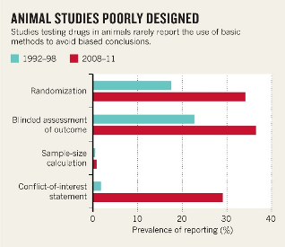
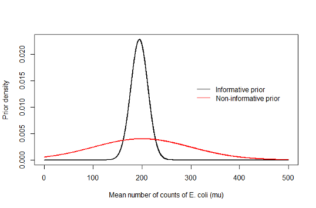
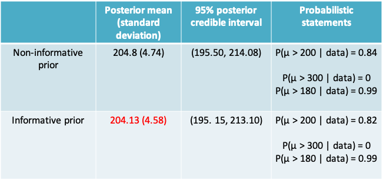
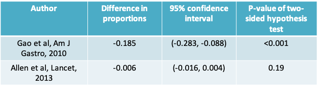
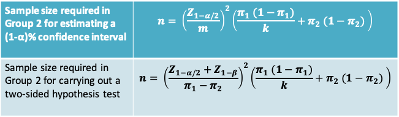
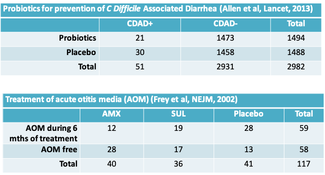
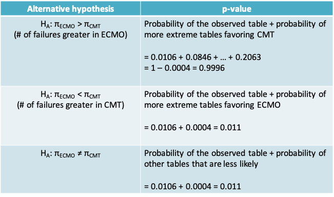
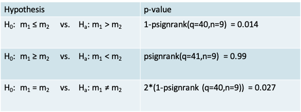
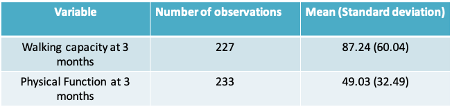

--- 
title: "Intro to Statistics Notes"
site: bookdown::bookdown_site
documentclass: book
bibliography: [book.bib, packages.bib]

description: |
  Intro to Stats notes for Nandini Dendukuri - Nikhil Mahalingam
link-citations: yes
github-repo: rstudio/bookdown-demo
---

```{r include=FALSE}
# automatically create a bib database for R packages
knitr::write_bib(c(
  .packages(), 'bookdown', 'knitr', 'rmarkdown'
), 'packages.bib')
```

# Schedule {-}

```{r include=FALSE}
pacman::p_load(tidyverse)
pacman::p_load(calendar)
pacman::p_load(lubridate)
pacman::p_load(glue)
pacman::p_load(rvest)
pacman::p_load(kableExtra)
options(kableExtra.html.bsTable = T)
pacman::p_load(knitr)
pacman::p_load(formattable)


strip_html <- function(s) {
  html_text(read_html(charToRaw(s)))
}

```


```{r, echo=FALSE}

schedule_raw <- read_csv(here::here("inst","schedule","schedule.csv"), na = c("NA"),
                         col_types = cols(
  Lecture = col_character(),
  Date = col_character(),
  Topics = col_character(),
  Assignment = col_character(),
))


schedule_raw %>% 
  kbl(escape = FALSE) %>% 
  kable_styling(c("hover"), fixed_thead = T, full_width = T) %>% 
  column_spec(1, width = "6em") %>% 
  column_spec(2, width = "8em") %>% 
  column_spec(3, width = "16em") %>% 
  column_spec(4, width = "10em") %>% 
  collapse_rows(columns = 1)
  

```


<!--chapter:end:index.Rmd-->

---
always_allow_html: true
---

# Course Details {-}

* **Dates:** Mon, Jun 1 – Mon Jul 13, 2020
* **Time:** 9:00am-12:00pm
* **Place:** Online! https://mcgill.zoom.us/j/98513054963
* **Course website:** MyCourses
* **Instructor email:** nandini.dendukuri@mcgill.ca

* **Assessment**:
    + 6 assignments: 60% 
    + In-class quizzes: 10%
    + 1 group project: 30%

## Project {-}

* Goal is for you to learn the methods covered in this course by applying to a real problem you are familiar with 
* You are required to work in groups of 3, identify a dataset, preferably related to your research and analyze it 
* At the end of the course, submit a short report and make a 10-minute presentation
    + Use reporting guidelines from the Equator network as relevant
* The methods used will naturally limited to those covered during this introductory course. However, you can discuss what other methods would be needed to answer the research question satisfactorily. 

## Suggested References {-}

* Many books available for free via McGill libraries, for example:
    + **Biostatistics with R: An Introduction to Statistics through Biological Data**, Babak Shahbaba, Springer, 2012
    + **A tiny handbook of R**, Mike Allerhand,  Springer-Verlag, 2011
* Lecture material for this course is drawn from a variety of sources including:
    + Other courses:
        - **Tim Hanson’s Course (Univ of South Carolina):**  http://people.stat.sc.edu/hansont/stat205/stat205_spring2014.html
        - **Ingo Ruczinski’s two-term course (Johns Hopkins)** http://www.biostat.jhsph.edu/~iruczins/teaching/140.615/140.615.index.html
        - **Lawrence Joseph’s EPIB-607 Course (Dept of Epidemiology, Biostatistics and Occupational Health, McGill University)**
       http://www.medicine.mcgill.ca/epidemiology/Joseph/courses/EPIB-607/main.html
    + Text books (available via sites like amazon.com):
        - **Statistics for the life sciences**, Samuels, Wittmer and Schaffner, 2016	
        - **Statistical data analysis for the life sciences**, Ekstrom and Sorensen, CRC press, 2010
        - **Data analysis for the life sciences**, Irizarry and Love, Leanpub, 2015
        - **Statistical ideas and methods**, Utts and Heckard, Thompson Brooks Cole, 2006


<!--chapter:end:Course_Details.Rmd-->

---
always_allow_html: true
---
# Lecture 1 

## Introduction

### What is Statistics?

*Statistics is a collection of procedures and principles for gathering data and analyzing information in order to help people make decisions when faced with uncertainty*\
- [Utts & Heckard](https://www.amazon.ca/Statistical-Methods-Internet-Companion-Statistics/dp/0495122505) in 'Statistical Ideas & Methods'

### A Motivating Example

```{r 1_9, echo=FALSE,out.width='50%'}
knitr::include_graphics('./1_9.png')
```

[News Clip](http://www.bbc.com/news/av/technology-41114587/selfie-app-spots-early-signs-of-pancreatic-cancer) [Manuscript](https://ubicomplab.cs.washington.edu/pdfs/biliscreen.pdf)

-   Pancreatic cancer has a very poor survival rate because it is often detected too late
-   A new app promises to detect early symptoms of jaundice that may go unnoticed typically
-   Should this "test" be adopted into routine practice?

### What was the evidence behind this optimistic headline?

-   In an initial study the app detected cases of "concern" correctly 89.7% of the time, and classified "negative" cases correctly 96.8% of the time
-   The reference test was based on the total serum bilirubin level

### What would a data detective ask?

```{r 1_11, echo=FALSE,out.width='50%'}
knitr::include_graphics('./1_11.png')
```

1.  Are the statistical methods appropriate?
2.  Is the study design appropriate?
3.  Is there information external to the study that affects its interpretation?

### Results reported in the study

```{r, echo=FALSE}
library(knitr)
df<- data.frame(z = c("BiliScreen Positive", "BiliScreen Negative", "Total"), BorderlinezorzElevatedzBilirubin = c("35 (89.7%)", 4, 39), NormalzBilirubin= c(1,"30 (96.8%)",31))
df2=head(df)
knitr::kable(df2, col.names = gsub("[z]", " ", names(df)))
```

-   The statistics of interest when evaluating a diagnostic test are
    -   Sensitivity = Probability(Positive result \| Reference test positive) = 89.7%
    -   Specificity = Probability(Negative result \| Reference test negative) = 96.8%
-   Do these data provide good estimates of BiliScreen accuracy?

### Evaluating the quality of the statistical methods

```{r 1_13, echo=FALSE,out.width='50%'}
knitr::include_graphics('./1_13.png')
```

-   Is the study large enough?
-   What is the uncertainty around the reported results?
-   Were relevant statistics recorded?
-   Do the statistics provided help make a decision about the next step?

### What if the sample size were smaller?

```{r, echo=FALSE}
library(knitr)
df<- data.frame(z = c("BiliScreen Positive", "BiliScreen Negative", "Total"), BorderlinezorzElevatedzBilirubin = c("9 (90%)", 1, 10), NormalzBilirubin= c(0,"10 (100%)",10))
df2=head(df)
knitr::kable(df2, col.names = gsub("[z]", " ", names(df)))
```

### What if the sample size were larger?

```{r, echo=FALSE}
library(knitr)
df<- data.frame(z = c("BiliScreen Positive", "BiliScreen Negative", "Total"), BorderlinezorzElevatedzBilirubin = c("180 (90%)", 20, 200), NormalzBilirubin= c(0,"150 (100%)",150))
df2=head(df)
knitr::kable(df2, col.names = gsub("[z]", " ", names(df)))
```

### Sample Size and Precision

```{r 1_16, echo=FALSE,out.width='100%'}
knitr::include_graphics('./1_16.png')
```

### Evaluating the quality of the statistical methods

-   Notice that **the certainty we have in our conclusions depends on the sample size**. The extreme results were less convincing when the sample size was reduced.
-   What sample size is needed to draw a definitive conclusion? That needs to be determined using appropriate statistical methods to obtain the desired precision. We will study this in Lectures 3 and 6

### Evaluating the quality of the study design

-   Are the subjects in the study representative?
-   Is the reference standard relevant?
-   Are the subjects in the study representative?
    -   Healthy volunteers and patients from a medical centre were used
    -   If the test accuracy is systematically better or worse in these patients than in patients on whom the test will be used, then the results are biased\
-   Is the reference standard relevant?
    -   Bilirubin level is a measure of jaundice, but not all cases of jaundice have pancreatic cancer
    -   If the accuracy of the test with respect to bilirubin level is systematically different from the accuracy with respect to pancreatic cancer, then our results may be biased

### The role of external (or prior) information

-   Besides the sample size and study design, our conclusions may also be affected by information external to the observed results, for example from a previous study
-   Statistical analyses should take into account the impact of this prior information. We will study how to do so in Lecture 6

## Reducing Bias in Research Studies

### Bias vs. Precision

```{r 1_23, echo=FALSE,out.width='30%'}
knitr::include_graphics('./1_23.png')
```

-   Precision results in a random departure from the true value
-   Bias is a systematic departure from the true value
-   A large sample size can improve precision but not bias. Study design and analysis could reduce bias

### Common study designs used in clinical research

```{r 1_24, echo=FALSE,out.width='30%'}
knitr::include_graphics('./1_24.png')
```

-   An analytical or experimental study can study the relation between an intervention and an outcome
-   A descriptive study, with no control group, cannot

### Randomized Controlled Trial

-   Advantages:
    -   unbiased distribution of confounders;
    -   blinding more likely;
    -   randomisation facilitates statistical analysis.
-   Disadvantages
    -   expensive: time and money;
    -   study subjects not representative;
    -   ethically problematic at times.

### Reducing bias in research studies

-   Different types of bias common in research studies have been enumerated

```{r, echo=FALSE}
library(knitr)
df<- data.frame(Type_of_bias = c("Selection bias", "Measurement bias", "Detection bias","Confounding"), Description = c("Sampling method results in sample not representative of the population", "Measurement method records outcome with systematic error", "Measurement method differs between groups being compared","Risk factors distributed unequally in groups being compared"), Possible_Remedial_Measures= c("Random sampling Statistical modeling","Statistical modeling","Blinding","Randomization Statistical modeling"))
df2=head(df)
knitr::kable(df2, col.names = gsub("[_]", " ", names(df)))
```

-   Statistical methods are often used to reduce bias, either at the planning stage of a study or at the analysis stage
-   In this lecture, we will look at random sampling and randomization. In Lecture 12 we will look at adjustment via regression

### A second motivating example: Renal Denervation

```{r 1_28, echo=FALSE,out.width='50%'}

```

[Image Source](https://www.terumo.com/about/pressrelease/2013/20130408.html)

-   A surgical procedure called "renal denervation" was developed to help people with hypertension who do not respond to medication.

### Example 4a: Results from a cohort study of renal denervation$^*$

```{r, echo=FALSE}
library(knitr)
library(kableExtra)
df<- data.frame(Number_of_patients = c(153), Blood_pressure = c("176/98 [systolic/diastolic (mmHg) Mean]"),Number_of_Patients = c(135),Change_in_blood_pressure=c("-25/-11 [systolic/diastolic (mmHg) Mean]"))
df2=head(df)
knitr::kable(df2, col.names = gsub("[_]", " ", names(df))) %>%
  kable_styling("striped") %>%
  add_header_above(c("Baseline" = 2, "3-month follow-up"=2))
```

$^*$Investigators Symplicity HTN-1. Catheter-based renal sympathetic denervation for resistant hypertension: durability of blood pressure reduction out to 24 months. Hypertension 2011;57(5):911-917.

-   Can the large observed change be interpreted as being caused by renal denervation?
-   This is an example of a before-after design that reports on change over a period of time, typically the change after an intervention.
-   The primary drawback of this design is the lack of a control group.
-   The observed change may simply be attributable to the participation in the study ('Hawthorne effect'). If so, then the same magnitude of change in the blood pressure would be observed in the control group. This would mean that the change was not due to renal denervation at all.
-   Therefore this study cannot provide proof that renal denervation causes a decline in blood pressure.
-   Another issue in the data presented here is that the variability around the mean change is not available. So we don't know if all patients experienced this benefit.

### Example 4b: Results compared to a control group$^*$

```{r 1_31, echo=FALSE,out.width='100%'}

```

```{r, echo=FALSE}
library(knitr)
library(kableExtra)
df<- data.frame(z = c("Renal Denervation", "Control group*"),Numberzofzpatients = c(45,5), Bloodzpressure = c("176/98 [systolic/diastolic (mmHg) Mean]","173/98 [systolic/diastolic (mmHg) Mean]"),NumberzofzPatients = c(39,3),Changezinzbloodzpressure=c("-21/-10 [systolic/diastolic (mmHg) Mean]","+2/+3 [systolic/diastolic (mmHg) Mean]"))
df2=head(df)
knitr::kable(df2, col.names = gsub("[z]", " ", names(df))) %>%
  kable_styling("striped") %>%
  add_header_above(c(" "=1,"Baseline" = 2, "3-month follow-up"=2))
```

$^*$Patients excluded from renal denervation arm for anatomical reasons

[$^*$Catheter-based renal sympathetic denervation for resistant hypertension: a multicentre safety and proof-of-principle cohort study](https://www-sciencedirect-com.proxy3.library.mcgill.ca/science/article/pii/S0140673609605663)

-   The control group was of patients who were excluded for anatomical reasons.
-   It is possible that, the control group may not have had the same risk of resistant hypertension as the treatment group, i.e. the 'anatomical reasons' were a confounding factor. This may explain why the control group had a worse mean change in blood pressure than the renal denervation group
-   Therefore, once again, we don't have a conclusive result.
-   Of course, the small size of the control group also does not help. Other concerns in this study include loss to follow-up. Only 18 patients completed the follow-up of 24 months.

### Example 4c: Results from a randomized controlled trial (RCT) of renal denervation$^*$

```{r, echo=FALSE}
library(knitr)
library(kableExtra)
df<- data.frame(z = c("Renal Denervation", "Control*"),Numberzofzpatients = c(49,51), Bloodzpressure = c("178/96 [systolic/diastolic (mmHg) Mean]","178/97 [systolic/diastolic (mmHg) Mean]"),NumberzofzPatients = c(49,51),Changezinzbloodzpressure=c("-32/-12 [systolic/diastolic (mmHg) Mean]","+1/0 [systolic/diastolic (mmHg) Mean]"))
df2=head(df)
knitr::kable(df2, col.names = gsub("[z]", " ", names(df))) %>%
  kable_styling("striped") %>%
  add_header_above(c(" "=1,"Baseline" = 2, "6-month follow-up"=2))
```

$^*$\*Esler MD, Krum H, Sobotka PA, Schlaich MP, Schmieder RE, Bohm M. Renal sympathetic denervation in patients with treatment-resistant hypertension (The Symplicity HTN-2 Trial): a randomised controlled trial. Lancet 2010;376(9756):1903-1909

-   The study concluded there was a statistically significant (p\<0.001) difference between the intervention and control groups
-   The randomization procedure gives us greater confidence in these results as patients had the same risk of a change in BP at the time of randomization
-   However, the study was not perfect. Importantly, it was not blinded and the main outcome was office BP rather than ambulatory BP. Therefore, it is possible that the patients in the renal denervation arm reacted differently owing to the greater attention they received.
-   Also, the follow-up of 6-months is very short and it is unknown whether the observed drop in BP is sustained in the long term.

### Example 4d: Results from a second randomized controlled trial of renal denervation$^*$

```{r 1_36, echo=FALSE,out.width='50%'}
knitr::include_graphics('./1_36.png')
```

-   "A significant change from baseline to 6 months in office systolic blood pressure was observed in both study groups.

The between-group difference (the primary efficacy end point) did not meet a test of superiority with a margin of 5 mm Hg.

The bars indicate standard deviations."

-   The second RCT improved on the first one by using a sham procedure in the control group. This removed the concern about blinding.
-   They found that there was no significant difference between the renal denervation and control groups.

$^*$Bhatt et al. A controlled trial of renal denervation for resistant hypertension. N Engl J Med 2014;370:1393-401. DOI: 10.1056/NEJMoa1402670

### Example 4: Renal Denervation as a treatment for resistant hypertension

-   An early study suggested that renal denervation (which uses radiotherapy to destroy some nerves in arteries feeding the kidney) reduces blood pressure. In that experiment, patients who received surgery had an average improvement in systolic blood pressure of 33 mmHg more than did control patients who received no surgery.
-   Later an experiment was conducted in which patients were randomly assigned to one of two groups. Patients in the treatment group received the renal denervation surgery. Patients in the control group received a sham operation in which a catheter was inserted, as in the real operation, but 20 minutes later the catheter was removed without radiotherapy being used. These patients had no way of knowing that their operation was a sham. The rates of improvement in the two groups of patients were nearly identical.(Samuels 10-11)

### Lessons learnt from renal denervation example

-   A control group is necessary to draw conclusions about the effect of a variable
-   However, a randomized design is necessary to make a cause-effect conclusion
-   A randomized, controlled trial is not automatically unbiased. Blinding is necessary

### Health Technology Assessment of Renal Denervation

-   The MUHC's Technology Assessment Unit evaluated Renal Denervation in 2013. The full report is available [here](https://www.mcgill.ca/tau/files/tau/muhc_tau_2013_72_renald.pdf)
-   We concluded:\
    "... There is evidence, based mainly on observational data that this procedure results in a clinically significant reduction in blood pressure at 6 months. Weaker evidence suggests that the effect is sustained up to 2 years of follow-up. Some side-effects, none unmanageable or permanent, are reported.

It is recommended that this technology receive temporary (two-year) and conditional approval for use only in the context of a formal research study to be supported by the manufacturer as specified."

## Random sampling and Randomization

### Sample surveys

-   A sample survey is a type of observational study
-   In a **sample survey** a subgroup of a larger population is studied. Ideally, we wish to use methods to draw a representative sample to avoid bias
-   **Surveys** are preferred because they are less expensive and time consuming than a census (or complete enumeration of a population)

### Simple random sample

-   A **simple random sample** is a sample of n items in which
    -   every member of the population has an equal chance of being included,
    -   members are chosen independently from each other
-   The word random does not mean haphazard. Rather, it refers to a well-defined process whose outcomes are not fixed but are determined by a probability distribution

### Sample surveys\*

-   Interestingly, if you use commonly accepted methods, a sample of size 1500 would be adequate to gauge the percentage of a population who have a certain trait or opinion to within ±3%
-   Further, this result does not depend on the size of the population. A sample size of 1500 is adequate whether the population size is 10 million or 4 billion, as long as a proper sampling technique has been used

### Margin of error

-   An obvious question is: how close is a sample estimate to the true value?
-   The central limit theorem (which we will study in Lecture 3) we know that the margin of error around the sample mean is proportional to $\frac{\sigma}{\sqrt n}$, where $\sigma$ is the standard deviation and n is the sample size

### How to choose a simple random sample

-   Create a sampling frame by listing all members of the population
-   Find a method to randomly select from among these
    -   e.g. a physical method, e.g. placing the names of members of the population in an opaque bowl and drawing the required number
    -   e.g. a virtual method with a computer, e.g. using the sample() function in R
-   The chosen members constitute the sample

### Example: Drawing a random sample

```{r 1_48, echo=FALSE,out.width='50%'}

```

-   A respiratory researcher wants to estimate the amount of inflammation in the parenchyma of a mouse lung.
-   She takes an image of a histological slide of the lungs of the mouse with staining of the inflammatory cells of interest.
-   She divides the images in a grid of 100 rectangular areas, but excludes 10 areas because they include airways.
-   She then counts the number of inflammatory cells in 40 areas randomly selected out of the remaining 90 areas
-   What was the sampling frame in this study, and how did it differ from the population of interest?
-   Explain why "using the wrong sampling frame" might lead to a biased estimate.
-   Use R to propose to the researcher which rectangular areas she needs to study.

### Practical concerns when random sampling

-   For practical reasons, it may not be possible to obtain a simple random sample because it may not be possible to enumerate the entire population
    -   e.g. how would we enumerate the population of people who need to be screened by Biliscreen?
-   Then, it would be important to identify the population, and scrutinize the method of selection to ensure that the resulting sample satisfies the definition of a simple random sample
-   Other sampling techniques such as **cluster sampling** or **stratified random sampling** may be easier to implement

### Some typical biases that can arise during a survey

-   **Selection bias**: Due to selecting non-representative sample
-   **Non-response (or missingness bias)**: Arises when a representative sample was chosen but a subset could not or did not provide responses, e.g. a survey conducted during the evening would miss individuals who were working at that time
-   **Response bias**: Occurs when participants respond differently from how they feel, e.g. response to sensitive questions such as smoking habits

### Randomization

-   Random sampling can also be used in the context of an experiment, such that each subject has the same probability of receiving the different treatments under study
-   Randomization ensures that any observed or unobserved confounding variables have a similar distribution in each treatment group

### Simple randomization

-   Like with random sampling, there are different techniques we can use to carry out randomization to a treatment group
-   In **simple randomization**, subjects are assigned to groups based on a single sequence of random assignments
    -   e.g. If there are two treatments, we can toss a coin to determine how to assign each patient recruited into the study (Heads -- Treatment, Tails -- Control)
    -   Instead of a coin you can use a computer to generate the random sequence
-   This method is suitable when the planned sample size is relatively large and the subjects to be sampled are relatively homogenous

### Relevance of statistical methods to researchers in the life sciences

```{r 1_53, echo=FALSE,out.width='50%'}

```

[Nandini Dendukuri, McGill University](https://www.nature.com/news/poorly-designed-animal-experiments-in-the-spotlight-1.18559)

-   Medical research is increasingly quantitative. Simultaneously, there is a move towards evidence-based medicine
-   Statistical methods are necessary for designing and analyzing research studies that can answer relevant questions
-   Knowledge of statistics is necessary for interpreting research publications

### Organizations supporting transparent reporting of biomedical research & evidence-based decision making

```{r 1_54a, echo=FALSE,out.width='100%'}

```

```{r 1_54b, echo=FALSE,out.width='30%'}
knitr::include_graphics('./1_54b.png')
```

```{r 1_54c, echo=FALSE,out.width='30%'}

```

### Biomedical journals are insisting on appropriate statistical methods

```{r 1_55, echo=FALSE,out.width='100%'}
knitr::include_graphics('./1_55.png')

```

### FEV Example: Dataset

```{r, echo=FALSE}
library(knitr)
library(kableExtra)
df<- data.frame(id = c(1,2,3,4,5,6),age=c(9,8,7,9,9,8),fev=c(1.708,1.724,1.72,1.558,1.895,2.336),ht=c(57,67.5,54.5,53,57,61),sex=c(0,0,0,1,1,0),smoke=c(0,0,0,0,0,0))
df2=head(df)
knitr::kable(df2) %>%
  kable_styling("striped") %>%
  add_header_above(c("First few rows of FEV dataset"=6))
```

-   The variables in the dataset include the following:
    -   fev (in liters)
    -   age (in years)
    -   height (in inches)
    -   gender (M/F)
    -   smoke (Y/N)

<!--chapter:end:Lecture_1.Rmd-->

---
always_allow_html: true
---

# Lecture 2: Types of Variables, Probability and Probability Distributions
## Types of variables 
* A variable is a characteristic of a person or a thing that can be assigned a number or a category
    + Age and sex are two variables that can be measured on a person
* Variables can be of different types

```{r, echo=FALSE}
library(knitr)
df<- data.frame(Qualitative = c("Nominal","Ordinal"),Quantitative=c("Continuous","Discrete/Ordinal"))
kable(df)
```

* We need to distinguish between different types of variables because the statistical methods employed – whether descriptive or inferential - to study them depend on the type of variable we have studied

### Some questions on types of variables
* Click on this [link](https://forms.office.com/Pages/ResponsePage.aspx?id=cZYxzedSaEqvqfz4-J8J6vtaSwoU68FCgvKfzwN_XcBURFJJUTFWN05JRTJGRzU0WUw3MzIwMlJEUy4u) to answer a few questions on types of variables 

### Qualitative variables
* Qualitative variables are categorical and not measured on a numerical scale
    + Nominal variables do not have a particular ordering
        - Blood type of a person: A, B, AB, O
        - Sex of a fish: male, female
        - Research interest of students in EXMD 634: 
                 Cell Biology, Immunology, Cancer, ...
* Qualitative variables are categorical and not measured on a numerical scale
    + Ordinal variables do have a particular ordering, but the gap between successive categories is not measureable and may not be equal
        - Likert-type scale:
```{r 2_6, echo=FALSE,out.width='50%'}

```
        - Age in categories:
            + Infants, Toddlers, Gradeschoolers, Adolescents
* Quantitative variables are measured on a numerical scale that allows us to measure the interval between any two observations
    + Continuous variables can take decimal values
        - Age of a patient
        - Cholesterol concentration in a blood specimen
        - Optical density of a solution
    + Discrete/Ordinal variables are reported as integers
        - Number of bacteria colonies in a petri dish
        - Number of cancerous lymph nodes detected in a patient
        - Length of a DNA segment in basepairs
* The distinction between continuous and discrete variables is not a rigid one as measurements can be rounded off.
    e.g. age or birth weight can be reported as integers 
* In practice, if the number of unique integer values observed is small (say <10), then we would treat the quantitative variable as discrete/ordinal

## Probability
* The conclusions of a statistical data analysis are often stated in terms of probability
* Probability models allow us to quantify how likely, or unlikely, an experimental result is, given certain modeling assumptions
* We will first look at probability and probability distributions for dichotomous and discrete variables, before proceeding to continuous variables

### Definitions
* A probability is a numerical quantity that expresses the likelihood of an event
* The probability of an event E may be written as P(E) 
* P(E) is always a number between 0 and 1, inclusive. May also be expressed as a percentage 
* The higher the probability, the more certain we are that the event will occur
* We can speak meaningfully about a probability P(E) only in the context of a **chance operation** or a **chance experiment**—that is, an operation whose outcome is not pre-determined
* The chance operation must be defined in such a way that each time the chance operation is performed, the event E either occurs or does not occur. We refer to the event that E does not occur as E complement ($E^c$)
* The sample space enumerates all the possible events that a chance experiment gives rise to. The sum of their probabilities is 1

### Example 1: Coin Tossing    
* Consider the familiar chance operation of tossing a coin. The sample space is {Heads, Tails}. That means each time the coin is tossed, either it falls heads or Tails 
* Define the event E:Heads. If the coin is fair (i.e. equally likely to fall heads or tails), then P(E) = 1/2 = 0.5 
* If the coin is not fair (perhaps because it is slightly bent), then P(E) will be some value other than 0.5, e.g. P(E) = 0.6, suggesting it is more likely to see a head than a tail

### Example 2: Coin Tossing again
* Consider the event
		E: 3 heads in a row 
* The chance operation that could give rise to this event is “Toss a coin 3 times”
* Notice that the sample space is now larger than when the operation was made of a single toss
* The sample space is now
{HHH, HHT, HTH, HTT, THH, THT, TTH, TTT}
where H denotes Heads and T denotes Tails
* Assuming we have a fair coin, the probability of each of the 8 outcomes in the sample space is equally likely
* Therefore, P(E) = 1/8

### Interpretation of probability
* How do we know P(Heads)=0.5 for a fair coin?
* For one, we know that there are two possible events resulting from a coin toss both of which are equally likely
* Another interpretation arises when a chance operation can be observed repeatedly. Then P(E) can be interpreted as the relative frequency of occurrence of E in an indefinitely long series of repetitions of the chance operation

### Relative frequency interpretation of probability
```{r 2_16, echo=FALSE,out.width='50%'}
knitr::include_graphics('./2_16.png')
```

```{r, echo=FALSE}
library(knitr)
df<- data.frame(Number_of_tosses = c(1,2,3,4,5,10,200,500,750,1000),Outcome=c("H","H","T","T","T","H","H","H","H","T"),Cumulative_number_of_heads=c(1,2,2,2,2,4,111,257,378,487),Relative_frequency_of_heads=c(1,1,0.67,0.5,0.4,0.4,0.555,0.514,0.504,0.487))
knitr::kable(df, col.names = gsub("[_]", " ", names(df)))
```

### Subjective interpretation of probability
* It is not always possible to observe events repeatedly. In such cases, probability may be used to represent a subjective or personal degree of belief  

e.g. There is an 80% chance it will rain tomorrow  

e.g. It is believed that culture for  M. tuberculosis in children has a <2% chance of being falsely positive 

* There are very few restrictions place on personal probabilities besides that they must be coherent
    + e.g. If you say there is an 80% chance it will rain tomorrow, then you should also agree that there is a 20% chance it will not rain tomorrow
* Different individuals can have different personal probabilities, and may not necessarily agree, 
    + e.g. members on a job interview committee may different views on the probability of a client being suitable

### Compound events
* A compound event is defined by the joint occurrence of three simple events
    + e.g.  Obtaining three heads on three successive tosses of a coin
    + e.g.  Obtaining a true positive diagnostic test result for tuberculosis
* The different simple events may be independent or dependent
    + Each toss of a coin is independent of the previous toss
    + The probability of a positive result on a diagnostic test is dependent on whether the patient has the disease

### Some questions on probability
* Click on this [link](https://forms.office.com/Pages/ResponsePage.aspx?id=cZYxzedSaEqvqfz4-J8J6vtaSwoU68FCgvKfzwN_XcBUQTRINzBERUowMVJVRjVTVzVXNzdFUUY1Ti4u) to answer a few questions on probability 

###  Combining probabilities: Addition rules
```{r 2_21, echo=FALSE,out.width='50%'}

knitr::include_graphics('./2_21b.png')
```

* When two events are independent (top panel) then 

\[P\{E1 \space or \space E2\} = P\{E1\} + P\{E2\}\]

* When two events are dependent (bottom panel)

\[P\{E1 \space or \space E2\}  = P\{E1\} + P\{E2\} - P\{E1 \space and \space E2\}\]

### Combining probabilities: Multiplication rules
```{r 2_22, echo=FALSE,out.width='50%'}

knitr::include_graphics('./2_22b.png')
```

* When two events are independent (top panel) then 

\[P\{E1 \space and \space E2\} = P\{E1\} × P\{E2\}\]

* When two events are dependent (bottom panel)

    \[P\{E1 \space and \space E2\} = P\{E1\} × P\{E2|E1\} = P\{E2\} × P\{E1|E2\}\]

### Conditional probability
* P(E2|E1) is the conditional probability of E2 given E1, it is interpreted as the probability of observing E2 given that E1 has occurred

\[P(E2|E1) = \frac{P(E_1 \space and \space E_2)}{P(E_1)}\]

### Probability Trees
* Often it is useful to depict a probability problem using a probability tree
* The following slides depict how we can enumerate the events in the sample space that arises from independent events, and how we can then calculate the corresponding probabilities of each event using probability rules

### Example 3: Independent events
* If two carriers of the gene for albinism marry, each of their children has probability 1/4 of being albino. 
* The chance that the second child is albino is the same (1/4) whether or not the first child is albino; similarly, the outcome for the third child is independent of the first two, and so on.
* We can use a probability tree to enumerate the sample space and corresponding probabilities

### Albinism example
```{r 2_26, echo=FALSE,out.width='50%'}

```

* Suppose two carriers of the gene for albinism marry and have two children. Then the probability that both of their children are albino is

\[P\{AA\} 
    = 0.25 × 0.25
    = 0.0625\]
    
### Albinism example: Sample space and probabilities
```{r, echo=FALSE}
library(knitr)
df<- data.frame(Number_of_Albino_children=c(2,1,0,"Total"),Probability=c("$0.25^2 = 0.0625$","$2 \\times 0.25 \\times 0.75 = 0.375$","$0.75^2 = 0.5625$",1))
df2=head(df)
knitr::kable(df2, col.names = gsub("[_]", " ", names(df)))
```

### Example 4: Medical testing
* The following is based on a scenario a statistician, David Eddy, (1982) posed to a 100 physicians* (see full text [here](http://personal.lse.ac.uk/robert49/teaching/mm/articles/Eddy1982_ProbReasoningInClinicalMedicine.pdf)):
* One of your patients has a lump in her breast. You are almost certain that it is benign, and believe there is only a 1% chance that it is malignant. Just to be sure you have the patient undergo a mammogram. Sadly for your patient the mammogram is positive. 
* Suppose that the mammogram has the following characteristics 
    + P{Testing positive | Person has disease} = Sensitivity = 80%
    + P{Testing negative | Person does not have disease} = Specificity = 90% 
* What is the probability that a randomly chosen woman will test positive on a mammogram? What are the chances the lump is truly malignant?

### Medical testing example
```{r 2_29, echo=FALSE,out.width='50%'}
knitr::include_graphics('./2_29.png')
```

* The sample space is {D+T+, D+T-, D-T+, D-T-}
* The probability of a positive test  

= P{true positive} + P{false positive}

= Pr{D+T+} + P{D-T+}

= 0.01 × 0.8 + 0.99 × 0.1

= 0.107

* Probability that a person truly has the disease given they are positive

= P{D+ | T+}

= P{D+ and T+}/P{T+}

= (0.01 × 0.8)/(0.01 × 0.8 + 0.99 × 0.1)

= 0.075

The above expression is formally referred to as Bayes Theorem

## Probability Distributions
* A **probability distribution** is a mathematical function that provides the probabilities of occurrence of different possible values of a random variable
    + It follows the probability rules we studied earlier, e.g. the sum of the probabilities of all possible values of a random variable is 1
* A very large number(100s?) of probability distributions have been described – but we tend to use a much smaller number in common applications

### Population and sample$^*$
```{r 2_33, echo=FALSE,out.width='50%'}

```

$^*$From text by Ekstrom and Sorensen

### Notation
```{r 2_34, echo=FALSE,out.width='50%'}
knitr::include_graphics('./2_34.png')
```

### Parameters, Statistics, Probability Distributions
* A **parameter** is a number that describes the **population**. A parameter is a fixed number; but in practice we do not know its value.
* A **statistic** is a number that describes a **sample**. The value of a statistic is known when we have taken a sample, but it can change from sample to sample. We often use a statistic to estimate an unknown parameter
* The **probability distributions** we will study in this lecture are examples of **probability models** that help us to make inference about the population based on observed statistics

### Binomial Distribution
* Both the coin toss and the albinism examples were examples of random variables following a Binomial distribution. These variables are characterized by:
    + **Binary outcomes**: There are two possible outcomes for each trial (success and failure).
    + **Independent trials**: The outcomes of the trials are independent of each other.
    + **n is fixed**: The number of trials, n, is fixed in advance.
    + **Same value of $\pi$**: The probability of a success on a single trial is the same for all trials.

### Binomial Distribution Function
Whereas both examples we looked at had n=2 trials, and were easy to illustrate with a probability tree, we can write a more general expression for the probability of k successes in n independent trials as follows

\[Pr\{k|n,\pi\} = \frac{n!}{k!(n-k)!}\pi^k(1-\pi)^{n-k}\]

### Albinism example for a couple with 5 children: Sample space and probabilities 
```{r, echo=FALSE}
library(knitr)
df<- data.frame(Number_of_Albino_children=c(0,1,2,3,4,5),Probability_expression=c("$(1-\\pi)^5$","$5\\pi(1-\\pi)^4$","$10\\pi^2(1-\\pi)^3$","$10\\pi^3(1-\\pi)^2$","$5\\pi^4(1-\\pi)$","$\\pi^5$"),Probability_rounded_value=c(0.24,0.40,0.26,0.09,0.01,0))
df2=head(df)
knitr::kable(df2, col.names = gsub("[_]", " ", names(df)))
```

These probabilities may be obtained from R with the following command:

dbinom(x=seq(0,5),size=5,prob=0.25)

### Probability distributions in R
* One of the main advantages of R is that it has several functions related to statistical probability distributions that can be used to:
    + Obtain a random sample from a distribution
    + Calculate the density function
    + Calculate the cumulative probability
    + Obtain quantiles of the distribution
    
```{r, echo=FALSE}
library(knitr)
df<- data.frame(Distribution=c("Binomial","Gamma","Poisson","Normal"),Random_Sample=c("rbinom","rgamma","rpois","rnorm"),Density_function = c("dbinom","dgamma","dpois","dnorm"), Cumulative_probability_function = c("pbinom","pgamma","ppois","pnorm"),Quantiles=c("qbinom","qgamma","qpois","qnorm"))
df2=head(df)
knitr::kable(df2, col.names = gsub("[_]", " ", names(df)))
```    

### Example: Binomial distribution in practice$^*$
* The assumptions behind the use of the Binomial distribution may not always be satisfied in practice. For example:
* Let X represent the number of females in four children, among all couples in Canada with exactly four children
* The “Real World” data and the data predicted by a Binomial distribution model with n=4 and $\pi=0.5$ are given on the following page, i.e. the predicted proportion was given by

\[Pr\{X=k\} = \frac{4!}{k!(4-k)!}\pi^k(1-\pi)^{4-k}\]

```{r, echo=FALSE}
library(knitr)
df<- data.frame(X=c(0,1,2,3,4),Predicted_proportion_obtained_using_dbinom_in_R=c(0.0625,0.25,0.375,0.25,0.0625),Observed_proportion=c(0.08,0.26,0.31,0.27,0.08))
df2=head(df)
knitr::kable(df2, col.names = gsub("[_]", " ", names(df)))
```   

* Why do you think the observed values differ (slightly) from those predicted by a Binomial model?
* Which assumptions of the Binomial model may be violated here?

$^*$From Lawrence Joseph’s notes

### Mean and variance of random variables
Let X be a discrete random variable taking values $\{x_1, x_2, …, x_n\}$ with probabilities $\{p_1, p_2, …, p_n\}$, respectively

* Population mean (or expectation) of a discrete random variable $=E(X)=\sum_{i=1}^nx_ip_i$
* Population variance of a discrete random variable $=\sum_{i=1}^n(x_i-E(X))^2p_i$

### Mean and variance for a Binomial distribution
```{r 2_44, echo=FALSE,out.width='50%'}

```

* Let X be a Binomial variable with n trials and probability of success $\pi$
* $E(X)=n\pi=5\times 0.25=1.25$
* $Var(X)=n\pi(1-\pi)=5\times 0.25\times 0.75 = 0.9375$

Therefore, standard deviation of X = 0.968

### Probability of a continuous variable
```{r 2_45, echo=FALSE,out.width='50%'}
knitr::include_graphics('./2_45.png')
```

* We can think of the relative frequency histogram of a continuous variable as an approximation of the underlying true population distribution from which the data came.
* A smooth curve representing a frequency distribution is called a probability density function
* On the x-axis we have different possible values of the variable (i.e. the sample space). On the y-axis we have the probability density corresponding to each value of the variable.

### Probability density function for a continuous variable
```{r 2_46, echo=FALSE,out.width='50%'}


```

* If a variable is continuous, then we find probabilities by using the density curve for the variable. 
* The probability that a continuous variable lies in a certain range equals the area under the density curve for the variable between two points
* This means the probability of a single value, say Pr{Y=a}=0. But the $Pr\{a-\delta<Y<a+\delta\}$, where $\delta$ is an infinitesimal quantity is non-zero and equal to the height of the density function at Y=a.
* The area under the entire curve is 1

### Normal Distribution
* The most well know continuous distribution is the Normal (or Gaussian) distribution that is recognizable by its characteristic bell shape
* Probability density function of a continuous variable Y that follows a normal distribution with mean $\mu$ and variance $\sigma^2$

\[f(y|\mu,\sigma^2)=\frac{1}{\sigma\sqrt{2\pi}}exp\left(-\frac{(y-\mu)^2}{2\sigma^2}\right),-\infty<y<\infty\]

### Normal probability density function
```{r 2_48, echo=FALSE,out.width='50%'}
knitr::include_graphics('./2_48.png')
```

* The density function is symmetric about the mean $\mu$ (which also happens to be the median and mode of this distribution
* Though it is defined all the way from $-\infty$ to $\infty$, most of the probability lies in the range $\mu\pm3\sigma$

### Three normal curves with different means and standard deviations
```{r 2_49, echo=FALSE,out.width='50%'}
knitr::include_graphics('./2_49.png')
```

### Area under the normal curve
```{r 2_50, echo=FALSE,out.width='50%'}

```

* $Pr\{a<Y<b\}=\int_a^b\frac{1}{\sigma\sqrt{2\pi}}exp\left(-\frac{(y-\mu)^2}{2\sigma^2}\right)$
* The values of the areas under the standard normal distribution (denoted $N(\mu=0, \sigma^2=1))$ were typically published as tables in statistics books
* Today you can use a program like R to calculate this integral

### Example: Distribution of serum cholesterol values
* The serum cholesterol levels of 12- to 14-year-olds follow a normal distribution with mean 155 mg/dl and standard deviation 27 mg/dl. What percentage of 12 to 14-year-olds have serum cholesterol values

a) 137 or less?

b) 186 or less?

c) 164 or more?

d) 100 or more?

e) between 159 and 186?

f) between 100 and 132?

g) between 132 and 159?

```{r 2_52, echo=FALSE,out.width='50%'}

```

Let Y denote the variable serum cholesterol. 

We know the distribution is symmetric about 155mg/dl and that most values of Y will lie between (74, 236)

a) P(Y ≤ 137) = pnorm(q=137,mean=155,sd=27) = 0.252

b) P(Y≥164) = 1 – Pr(Y < 164) = 1 – pnorm(q=164,mean=155,sd=27) = 0.369

c) P(Y≤186) = 0.875

d) P (Y ≥100) = 1 – 0.02 = 0.98

```{r 2_54, echo=FALSE,out.width='50%'}

```

e) between 159 and 186?

P(159 ≤ Y ≤ 186)
= P(Y ≤ 186) – Pr(Y ≤ 159)
= pnorm(186,155,27) 
        - pnorm(159,155,27)

= 0.875 – 0.559
= 0.316

Another way to answer this question is via the z-transformation of Y into a standard normal variable with mean=0 and standard deviation=1

P(159 ≤ Y ≤ 186)
= P( (159-155)/27 ≤ (Y-155)/27 ≤ (186-155)/27 )

= Pr(0.148 ≤ Z  ≤ 1.148)
= Pr(Z  ≤ 1.148) – Pr(Z  ≤ 0.148)

= pnorm(1.148) - pnorm(0.148)
= 0.875 – 0.559
= 0.316

e) between 100 and 132?

P(100 ≤ Y ≤ 132) = 0.176


f) between 132 and 159?

P(132 ≤ Y ≤ 159) = 0.362

### Area under the normal curve
```{r 2_57, echo=FALSE,out.width='50%'}
knitr::include_graphics('./2_57.png')
```

* We can show that the probability of lying within 1 standard deviation of the mean is 0.68, within 2 standard deviations is 95% and within 3 standard deviations is 99.7%

### Mean and variance of the normal distribution
* The expressions for the mean and variance are similar to those for discrete variables, except that the summation sign is replaced by an integral sign
* $Expectation(Y)=\int_{-\infty}^\infty\frac{y}{\sigma\sqrt{2\pi}}exp\left(-\frac{(y-\mu)^2}{2\sigma^2}\right)dy = \mu$
* $Variance(Y)=\int_{-\infty}^\infty\frac{(y-\mu)^2}{\sigma\sqrt{2\pi}}exp\left(-\frac{(y-\mu)^2}{2\sigma^2}\right)dy = \sigma^2$

### Examples of discrete distributions
* Bernoulli distribution
* Binomial distribution
* Poisson distribution
* Negative binomial distribution

### Bernoulli distribution
```{r 2_60, echo=FALSE,out.width='50%'}

```

* X is dichotomous
* Examples: 
    + Single coin toss
    + Observation on an individual patient in a longitudinal study of survival following a treatment
    
Probability density function

\[f(x|\pi)=\pi^x(1-\pi)^{1-x},x=0,1\]

Mean = $\pi$

Variance = $\pi(1-\pi)$

### Binomial distribution
```{r 2_61, echo=FALSE,out.width='50%'}

```

* X is the sum of successes in n independent Bernoulli trials
* Examples: 
    + three coin tosses
    + number of patients who will survive 1 year following a treatment

Probability density function

\[f(x|n,\pi)={n\choose x}\pi^x(1-\pi)^{1-x},x=0,1,...,n\]

Mean = $n\pi$

Variance = $n\pi(1-\pi)$

### Poisson distribution
```{r 2_62, echo=FALSE,out.width='50%'}
knitr::include_graphics('./2_62.png')
```

* X takes discrete taking values 0, 1, to $\infty$  within a unit of time or space
* Examples
    + Number of downloads of an app in 1 minute
    + Number of cases of cancer reported in a square kilometre

Probability density function

\[f(x\space events|time=t,rate=\lambda)=\frac{exp^{-\mu}\mu^x}{x!},x=0,1,...,\infty\]

Mean = $\mu$

Variance = $\mu$

### Example: Transcriptomic Analyses$^*$
```{r 2_63, echo=FALSE,out.width='50%'}
knitr::include_graphics('./2_63.png')
```

* RNA sequencing is a powerful and commonly used tool to analysis expression data
* The goal of most sequencing experiments is to identify differences in gene expression between biological conditions such as the influence of a disease-linked genetic mutation or drug treatment.

### Underlying statistical principles of commonly used packages
```{r 2_64, echo=FALSE,out.width='50%'}
knitr::include_graphics('./2_64.png')
```

### How it works
* In a standard sequencing experiment (RNA-Seq), we map the sequencing reads to the reference genome and count how many reads fall within a given gene (or exon). 
```{r 2_65, echo=FALSE,out.width='50%'}
knitr::include_graphics('./2_65.png')
```

=> This means that the input for the statistical analysis are discrete non-negative integers (“counts”) for each gene in each sample. 

### What would be a suitable probability distribution?
* The total number of reads for each sample tends to be in the millions, while the counts per gene vary considerably but tend to be in the tens, hundreds or thousands. 
* The chance of a given read to be mapped to any specific gene is rather small. 
* Discrete events that are sampled out of a large pool with low probability - sounds like a Poisson distribution would be suitable

Problem: The **variability of read counts** in sequencing experiments tends to be **larger than the Poisson distribution allows**.

```{r 2_67, echo=FALSE,out.width='50%'}
knitr::include_graphics('./2_67.png')
```

* It is obvious that the variance of counts is generally greater than their mean, especially for genes expressed at a higher level. This phenomenon is called “**overdispersion**“. 
* The negative binomial distribution can model the greater variance

### Poisson Distribution is limiting
* The Poisson distribution makes the restrictive assumption that the mean of the distribution is equal to its variance
* In terms of RNA-seq, Poisson distribution implies that for a certain gene, its expression profile follows a distribution with a mean expression equal to the variance in expression
* Empirical observations show that for highly expressed genes at least, this is not the case even in biological replicates
* Another degree of variation that removes this restriction

### Negative Binomial Distribution
* The NB distribution is similar to a Poisson distribution but has an extra parameter (α) called the “clumping” or “dispersion” parameter => **More variance**

\[\sigma^2=\mu+\alpha\mu^2\]

* The NB distribution can be defined as a **Poisson-Gamma mixture distribution**
* This means that the NB distribution is a weighted mixture of Poisson distributions where the rate parameter (i.e. the expected counts) is itself associated with uncertainty following a Gamma distribution

### Conceptual Justification
* When comparing samples of different conditions we usually have multiple independent replicates of each condition.
* Such replicates are called **“biological”** replicates because they come from independent animals, dishes, or cultures. 
* Splitting a sample in two and running it through the sequencer twice would be a **“technical”** replicate.
* In general, there is more variance associated with biological replicates than technical replicates. 
* As a result, the Poisson process in each biological replicate has a slightly different expected count parameter. 

### Additional Notes and Practical Implications
* In a standard sequencing experiments, we have to be content with few biological replicates per condition due to the high costs associated with sequencing experiments and the large amount of time that goes into library preparations.
* Modern RNA-Seq analysis tools such as [DESeq2](https://bioconductor.org/packages/release/bioc/html/DESeq2.html) and [edgeR](https://bioconductor.org/packages/release/bioc/html/edgeR.html) combine the gene-wise dispersion estimate with an estimate of the expected dispersion rate based on all genes. 
* This **Bayesian “shrinkage”** of the variance has emerged as a powerful technique to mitigate the shortcomings of having few replicates.

### Examples of continuous distributions
* Normal distribution
* Uniform distribution
* Student’s t-distribution
* Gamma distribution
* Beta distribution

### Normal distribution
```{r 2_73, echo=FALSE,out.width='50%'}

```

* X is continuous and symmetrically distributed over a range that lies between $-\infty$ to $\infty$
* Example: 
    + blood pressure
    + body mass index
    
Probability density function

$f(x|\mu,\sigma^2)=\frac{1}{\sigma\sqrt{2\pi}}exp\left(-\frac{(x-\mu)^2}{2\sigma^2}\right),-\infty<x<\infty$

Mean = $\mu$

Variance = $\sigma^2$

### Uniform distribution
```{r 2_74, echo=FALSE,out.width='50%'}

```

* X is continuous and equally likely to take values in the range (a,b)
* In the standard Uniform distribution, a=0, b=1
* Example: 
    + X is a probability, such as disease prevalence or sensitivity of a test

<!--chapter:end:Lecture_2.Rmd-->

---
always_allow_html: true
---

# Lecture 3: Central Limit Theorem and Inference for Means
## Mean and Standard Deviation 
### Descriptive statistics vs. Inferential Statistics
```{r 3_3, echo=FALSE,out.width='50%'}
knitr::include_graphics('./3_3.png')
```

* Descriptive statistics help to describe the characteristics of the sample gathered
* Inferential statistics help to use these characteristics to draw conclusions about the target population

### Some commonly encountered shapes of distributions of a variable
```{r 3_4, echo=FALSE,out.width='50%'}
knitr::include_graphics('./3_4.png')
```

### Descriptive statistics: Notation
* We use capital letters to denote a variable, and small letters to denote the values it takes. For example,
    + X = FEV (the variable),
    + x = 0.793 litres (an observed value)
* $\sum_{i=1}^nx_i$ means the sum of the observed values x on a sample of size n. $x_i$ is the observed value for the $i^{th}$ subject in the sample
* The next few slides list common measures of central tendency and spread

### Histogram of FEV
```{r 3_6, echo=FALSE,out.width='50%'}

```

### Measures of central tendency
```{r 3_7, echo=FALSE,out.width='100%'}
knitr::include_graphics('./3_7.png')
```

### Summary of FEV variable
```{r 3_8, echo=FALSE,out.width='100%'}
knitr::include_graphics('./3_8.png')
```

For a symmetric distribution, the median=mean. 

The values above suggest that the distribution of FEV may be slightly skewed to the right as the mean is higher than the mode

### Robustness
* A statistic is said to be **robust** if the value of the statistic is relatively unaffected by changes in a small portion of the data, even if the changes are dramatic ones. The median is a robust statistic, but the mean is not robust because it can be greatly shifted by changes in even one
* **Example:**  In the FEV dataset, I replaced the last observation in the dataset of 3.211 by 6.211, an extreme value. This resulted in increasing the mean from 2.637 to 2.641 but the median remained at 2.548
* If the frequency distribution is skewed, both measures are pulled toward the longer tail, but the mean is usually pulled farther than the median 

### Mean vs. Median
* In some situations the mean makes very little sense. Suppose, for example, that the observations are survival times of cancer patients on a certain treatment protocol, and that most patients survive less than 1 year, while a few respond well and survive for 5 or even 10 years. In this case, the mean survival time might be greater than the survival time of most patients; the median would more nearly represent the experience of a “typical” patient. Note also that the mean survival time cannot be computed until the last patient has died; the median does not share this disadvantage. Situations in which the median can readily be computed, but the mean cannot, are not uncommon in bioassay, survival, and toxicity studies
* An advantage of the mean is that in some circumstances it is more efficient than the median. Efficiency is a technical notion in statistical theory; roughly speaking, a method is efficient if it takes full advantage of all the information in the data. Partly because of its efficiency, the mean has played a major role in classical methods in statistics

### Quantiles
* Quantiles (also known as percentiles) help to demarcate different points of the distribution of a continuous variable
* The q% quantile is the number below which q% of observed values lie
* For example
    + The 10% quantile of FEV is the value below which 10% of FEV values lie = 1.612  
    = $0.1n^{th}$ lowest value of FEV

### Measures of spread
```{r 3_12, echo=FALSE,out.width='100%'}
knitr::include_graphics('./3_12.png')
```

### Summary of FEV variable
```{r 3_13, echo=FALSE,out.width='100%'}

```

### Comparison of measures of spread
```{r 3_14, echo=FALSE,out.width='100%'}
knitr::include_graphics('./3_14.png')
```

### Variance and Standard Deviation
* The standard deviation is more commonly reported than the variance because it is in the same units as the variable X and the mean of X
* Notice that we use the sum of the squared deviations. This is because the sum of the deviations themselves will always be 0. We need a way to get rid of the signs of the deviations. Alternatives to taking the squares include taking the absolute value. But squares are more popular because of their mathematical properties
* Why do we divide by n-1 rather than n? We do so because we are measuring the deviation from a quantity that is also defined using the sample, i.e. $\bar x$. It is as if we must penalize the sample size to correct for this. If we knew the true population mean (µ), then we would divide by n instead:

\[Population\space variance = \frac{\sum_{i=1}^n(x_i-\mu)^2}{n}\]

### Why n-1 rather than n?$^*$
* Suppose the population has only 4 members {1,2,3,4}
    + The true mean is $\frac{1+2+3+4}{4} = 2.5$
    + The true variance is $\frac{(1−2.5)^2+(2−2.5)^2+(3−2.5)^2+(4−2.5)^2}{4}=1.25$
* Now suppose we cannot view the whole population, but instead take a sample of size two. On the next slide, all possible samples are listed together with mean, the correct calculation for the sample variance dividing by n-1 and the incorrect calculation dividing by n. Each sample is equally likely to occur, assuming we are sampling with replacement from the population
* Notice that the incorrect expression for the sample variance results in an underestimate on the average across samples

```{r, echo=FALSE}
library(knitr)
df<- data.frame(Sample=c("(1,2)","(1,3)","(1,4)","(2,3)","(2,4)","(3,4)","(2,1)","(3,1)","(4,1)","(3,2)","(4,2)","(4,3)","(1,1)","(2,2)","(3,3)","(4,4)","Average across samples"),Sample.mean=c(1.5,2,2.5,2.5,3,3.5,1.5,2,2.5,2.5,3,3.5,1,2,3,4,2.5),Correct.Sample.variance=c(0.5,2,4.5,0.5,2,0.5,0.5,2,4.5,0.5,2,0.5,0,0,0,0,1.25),Underestimated.Sample.variance=c(0.25,1,2.25,0.25,1,0.25,0.25,1,2.25,0.25,1,0.25,0,0,0,0,0.625))
knitr::kable(df, col.names = gsub("[.]", " ", names(df)))
```

$^*$Lawrence Joseph’s notes

## Central Limit Theorem
### Example 1: Serum cholesterol in children
* Though we are more conscious of the relationship between cholesterol level and heart disease in adults, high levels of cholesterol are also a concern in children, particularly if they have risk factors like family history or obesity
* The American Academy of Pediatrics now recommends cholesterol testing in certain age groups
* To determine if a child is at risk of heart disease, we would need to compare the observed cholesterol level with the standard expected in a normal child. How large a sample size do we need to determine the normal level?
* The serum cholesterol levels (Y) of 12- to 14-year-olds follow a normal distribution with mean μ=155mg/dl and standard deviation σ=27 mg/dl
* You wish to estimate the true mean serum cholesterol in this population by using a sample of observations:
    + Should you prefer a sample of n=10, 30 or 100 observations?
    
```{r 3_21, echo=FALSE,out.width='100%'}

```

### The sampling distribution of $\bar Y$
* The sample mean can be used, not only as a description of the data in the sample, but also as an estimate of the population mean μ. 
* It is natural to ask, “How close to μ is $\bar y$?” We cannot answer this question for the mean $\bar y$ of a particular sample, but we can answer it if we think in terms of the random sampling model and regard the sample mean as a random variable $\bar Y$.
* The question then becomes: “How close to μ is $\bar Y$ likely to be?” and the answer is provided by the **sampling distribution of $\bar Y$** - that is, the probability distribution that describes sampling variability in $\bar Y$
* In order to visualize the sampling distribution of $\bar Y$, imagine repeated samples of size n are drawn from a population with fixed mean µ and standard deviation σ. The variation of the $\bar y's$ among the samples is specified by the sampling distribution of $\bar Y$

```{r 3_23, echo=FALSE,out.width='50%'}
knitr::include_graphics('./3_23.png')
```

###  Example: Sampling distribution of $\bar Y$ when n=10
```{r 3_24, echo=FALSE,out.width='50%'}
knitr::include_graphics('./3_24.png')
```

### Example: Sampling distribution of $\bar Y$ when n=30
```{r 3_25, echo=FALSE,out.width='50%'}
knitr::include_graphics('./3_25.png')
```

### Example: Sampling distribution of $\bar Y$ when n=100
```{r 3_26, echo=FALSE,out.width='50%'}
knitr::include_graphics('./3_26.png')
```

### Example: Sampling distribution of $\bar Y$ when n=1000
```{r 3_27, echo=FALSE,out.width='50%'}
knitr::include_graphics('./3_27.png')
```

### Example 1
* We notice that the mean of the sampling distribution gets very close to µ even with smaller sample sizes. This only improves as n increases
* As n increases, there is a very clear decrease in the standard deviation of the means across a 100 samples
* Finally, we notice that the shape of the sampling distribution is increasingly like a normal distribution as n increases

### The sampling distribution of $\bar Y$
* **Mean**: The mean of the sampling distribution of $\bar Y$ is equal to the population mean, i.e. $E(\bar Y)=\mu_{\bar Y}=\mu$
* **Standard deviation**: The standard deviation of the sampling distribution is equal to the population standard deviation divided by the square root of the sample size, i.e. $SD(\bar Y)=\sigma_{\bar Y}=\frac{\sigma}{\sqrt n}$. Note that this implies the $Variance(\bar Y)=\sigma^2_{\bar Y}=\frac{\sigma^2}{n}$
* **Shape** 
    + If the population distribution of Y is normal, then the sampling distribution is normal, regardless of the sample size n. 
    + *Central Limit Theorem*: If n is large, then the sampling distribution is approximately normal, even if the population distribution of Y is not normal

### Central Limit Theorem
* From the text by Moore and McCabe:

“The sampling distribution of $\bar Y$ is normal if the underlying population itself is normal. 

What happens when the population distribution is not normal? It turns out that as the *sample size increases, the distribution of $\bar Y$ becomes closer to a normal distribution*. This is true no matter what the population distribution may be, as long as the population has a finite standard deviation σ. This famous fact of probability theory is called the *central limit theorem*. For large sample size n, we can regard $\bar Y$ as having the $N\left(\mu,\frac{\sigma}{\sqrt n}\right)$ distribution”

### Example 1
* Applying the Central Limit Theorem, we can say that the sampling distribution of the mean serum cholesterol is:
    + $N\left(\mu_{\bar Y}=155,\sigma_{\bar Y}=\frac{27}{\sqrt {10}}=8.54\right)$ when n=10
    + $N\left(\mu_{\bar Y}=155,\sigma_{\bar Y}=\frac{27}{\sqrt {30}}=4.93\right)$ when n=30
    + $N\left(\mu_{\bar Y}=155,\sigma_{\bar Y}=\frac{27}{\sqrt {100}}=2.7\right)$ when n=100
    + $N\left(\mu_{\bar Y}=155,\sigma_{\bar Y}=\frac{27}{\sqrt {1000}}=0.85\right)$ when n=1000

Therefore, applying the rules pertaining to the normal distribution, we know that roughly 95% of the sampling distribution lies in the following ranges depending on the size of n:

```{r 3_32, echo=FALSE,out.width='50%'}
knitr::include_graphics('./3_32.png')
```

### Theory related to the sums of random variables
* These two slides help to see how $\frac{\sigma}{\sqrt n}$ arises. 
* Let X and Y be two arbitrary, independent random variables. Then from probability theory we know that: 
    + E(X+Y) = E(X) + E(Y)
    + Var(X + Y) = Var(X) + Var(Y)
    + E(aX+bY) = aE(X) + bE(Y), where a and b are constants
    + $Var(aX+bY) = a^2 Var(X) + b^2 Var(Y)$
    + If X ~ $N(\mu_X,\sigma_X^2)$ and Y ~ $N(\mu_Y,\sigma_Y^2)$ then (X+Y) ~ $N(\mu_X+\mu_Y,\sigma_X^2+\sigma_Y^2)$

### Some examples related to the sums of independent random variables
1. If X ~ $N(\mu_X=0,\sigma_X^2=1)$ and Y ~ $N(\mu_Y=3,\sigma_Y^2=4)$,  
then X+Y ~ N(mean=3, variance=5)

2. If $X_1,X_2,...,X_n$ ~ N(0,1), then $\sum_{i=1}^nX_i$ ~ N(0,n)

3. ... and then, $\frac{1}{n}\sum_{i=1}^nX_i$ ~ $N(0,\frac{1}{n})$

4. If $X_1,X_2,...,X_n$ ~ $N(\mu,\sigma^2)$, then $\sum_{i=1}^nX_i$ ~ $N(n\mu,n\sigma^2)$

5. ... and then, $\frac{1}{n}\sum_{i=1}^nX_i$ ~ $N(\mu,\frac{\sigma^2}{n})$

#### Excerpt from Lawrence Joseph’s notes
```{r 3_35, echo=FALSE,out.width='50%'}
knitr::include_graphics('./3_35.png')
```

### Example 2: Central Limit Theorem in action
* What is the average time taken across the 50 students in the class?
* R code to replicate

x1 = rnorm(50,4,1) # walk to bus stop
x2 = runif(50,4,16) # wait for bus 
x3 = rnorm(50,20,2) # bus ride
x4 = rgamma(50,shape=3/2,scale=2) # trudge up hill

par(mfrow=c(2,3))
hist(x1);hist(x2);hist(x3);hist(x4)
hist(x1+x2+x3+x4,xlab="Sum for 50 students",main="")
hist((x1+x2+x3+x4)/4,xlab="Mean for 50 students",main="")

## Confidence intervals for means
### Confidence interval estimation for a single mean
```{r 3_38, echo=FALSE,out.width='50%'}
knitr::include_graphics('./3_38.png')
```

* The construction of a confidence interval relies on the principal of the central limit theorem
* If, we can reasonably assume that the sample mean follows a normal distribution with mean µ and standard deviation $\frac{\sigma}{\sqrt n}$
* Then, across repeated samples, 95% of samples’ means $(\bar x's)$ lie in the interval $\left(\mu-2\frac{\sigma}{\sqrt n},\mu+2\frac{\sigma}{\sqrt n}\right)$
* This implies that 95% of the intervals $\left(\bar x-2\frac{\sigma}{\sqrt n},\bar x+2\frac{\sigma}{\sqrt n}\right)$ will include $\mu$. This interval is called the 95% confidence interval for µ
* More generally, $(1-\alpha)$% of the intervals $\left(\bar x-Z_{(1-\frac{\alpha}{2})}\frac{\sigma}{\sqrt n},\bar x+Z_{(1-\frac{\alpha}{2})}\frac{\sigma}{\sqrt n}\right)$ will include $\mu$.
* This interval is called the (1-α)% equal-tailed confidence interval for µ, where $Z_{(1-\frac{\alpha}{2})}$ is the (1- α/2) quantile of the standard normal distribution
* Equal-tailed refers to the fact that the probability of (1-α) is divided equally in the two tails of the distribution
* Notice that the 95% or (1-α)% in the definition refers to a percentage across repeated experiments
* We cannot say whether the 95% confidence interval estimated from the sample at hand is one of the ones that captured the true value of µ or not
* The population standard deviation (σ) is seldom known and must be substituted by the sample standard deviation (s)
* Does the assumption of 95% confidence still hold? It turns out that it does but we must replace the quantile $Z_{(1-\frac{\alpha}{2})}$ from the normal distribution by the $t_{(1-\frac{\alpha}{2})}$  quantile from the Student’s t-distribution (or t-distribution for short)
* The resulting expression for the confidence interval is given by:

\[\left(\bar x-t_{(1-\frac{\alpha}{2}),n-1}\frac{s}{\sqrt n},\bar x+t_{(1-\frac{\alpha}{2}),n-1}\frac{s}{\sqrt n}\right)\]

where $t_{(1-\frac{\alpha}{2}),n-1}$ is the (1- α/2) quantile of the t-distribution with n-1 degrees of freedom

### t-distribution
```{r 3_41, echo=FALSE,out.width='50%'}

```

Image from Wikipedia

* The t-distribution was discovered by the British scientist W. S. Gossett who was employed by the Guiness Brewery. 
    + He published his work in 1908 under the pseudonym Student
* The t-distribution is a bell-shaped, symmetrically distribution over the range -∞ to ∞. It resembles the normal distribution, but has a higher standard deviation. 
* The exact shape of the distribution depends on a quantity called the degrees of freedom (ν in the illustration). The higher the value of ν the closer it is to a normal distribution

Probability density function centred at 0

\[f(x|v) = \frac{\Gamma\left(\frac{v+1}{2}\right)}{\sqrt {v\pi}\Gamma\left(\frac{v}{2}\right)}\left(1+\frac{x^2}{v}\right)^{-\frac{v+1}{2}},-\infty<x<\infty\]

Mean=0

Variance=$\frac{v}{v-2}$

### Example 1: Serum Potassium Concentration
```{r 3_42, echo=FALSE,out.width='50%'}
knitr::include_graphics('./3_42.png')
```

* As part of a study of natural variation in blood chemistry, serum potassium concentrations were measured in 84 healthy women. 
* The mean concentration was 4.36 mEq/l, and the standard deviation was 0.42 mEq/l. 
* The table presents a frequency distribution of the data
* Calculate the standard error of the mean
* Construct a histogram of the data and indicate the intervals mean ± SD and mean ± SE
* Construct a 95% confidence interval for the population mean. Interpret this confidence interval
* Would this interval be suitable to define “reference limits” for serum potassium in healthy women, i.e. the limits within which we would expect to find 95% of healthy people?
* Suppose a similar study is to be conducted the following year among 200 women. What would you predict would be
    + the SD of the new measurements?
    + the SE of the new measurements?

### Example 1: Histogram of the data
```{r 3_44, echo=FALSE,out.width='50%'}
knitr::include_graphics('./3_44.png')
```

### Verifying assumptions behind the t-distribution confidence interval
* Does the central limit theorem hold? 
* In other words, do at least one of the following conditions hold 
    + the data follow an approximately normal distribution? 
    + the sample size is large
* For the serum potassium example both conditions appear to hold

### Example 1: Standard Error and 95% confidence interval 
* The standard error of the mean (SE)  
$=\frac{SD}{\sqrt n}=\frac{0.42}{\sqrt {84}}=0.05$ mEq/l, after rounding
* The 95% confidence interval  
$=\left(\bar x-t_{(1-\frac{\alpha}{2}),n-1}\frac{s}{\sqrt n},\bar x+t_{(1-\frac{\alpha}{2}),n-1}\frac{s}{\sqrt n}\right)$  
$=(4.36 – t_{0.975,84-1} 0.05, 4.36 + t_{0.975,84-1} 0.05)$  
= (4.36 – 1.98 × 0.05, 4.36 + 1.98 × 0.05)  
= (4.26, 4.46) mEq/l

### Interpretation of the 95% confidence interval
* Assuming that the sample at hand is a random sample, there is a 95% probability that the procedure used to calculate the interval (4.26, 4.46) will capture the population mean serum potassium concentration
* It would **not** be correct to say: There is a 95% probability that the population mean serum concentration lies between 4.26 and 4.46 mEq/l

### Confidence level
* The higher the confidence level, the wider the confidence interval would be
```{r 3_48, echo=FALSE,out.width='100%'}

```

* qt(prob,df) is the R function that returns the t-distribution quantile 
    + Arguments provided are the cumulative probability and the degrees of freedom

### Example 1: Distribution of the data (with intervals)
```{r 3_49, echo=FALSE,out.width='50%'}
knitr::include_graphics('./3_49.png')
```

### Interpreting the confidence interval
* *Would the 95% confidence interval be suitable to define “reference limits” for serum potassium in healthy women, i.e. the limits within which we would expect to find 95% of healthy people?*
* No. The 95% interval attempts to captures the uncertainty in the **mean** of the distribution. 
* In the expression for the confidence interval, if we replaced the standard error by the standard deviation, we would get the desired reference limits

### Standard error vs Standard deviation
* *Suppose a similar study is to be conducted the following year among 200 women. What would you predict would be*
    + *the SD of the new measurements?*
    + *the SE of the new measurements?*
* Our best prediction for the SD would be the value in the smaller sample of 84, namely 0.42 mEq/l 
* However, the SE of the new measurements would decrease from 0.05 to $\frac{0.42}{\sqrt {200}}$ = 0.03 mEq/l

## Confidence interval for the difference between two means
### Example 2: Nck1 deficiency and adipogenesis
```{r 3_53, echo=FALSE,out.width='50%'}
knitr::include_graphics('./3_53.png')
```

* Obesity results from an excessive expansion of white adipose tissue (WAT), which is still poorly understood from an etiologic-mechanistic perspective
* A study from the MUHC-RI reported on the role of the Nck1 adaptor protein during WAT expansion and in vitro adipogenesis
* Two outcomes of interest were body weight and adipose weight

```{r 3_54, echo=FALSE,out.width='50%'}
knitr::include_graphics('./3_54.png')
```

* Nck1 wild type (Nck1+/+) and knock-out mice (Nck1-/-) were compared at baseline and at 16 weeks
* Two research questions of interest: Is there a difference in wild-type and knock-out mice in terms of 
    + Body weight
    + Adipose weight
* What would be considered a meaningful change on these two outcomes?
* In order to apply the Central Limit Theorem we would ask:
    + Is it reasonable to assume that body weight and adipose weight follow an approximately normal distribution?
    + If not, is the sample size sufficiently large?
* The sample size is not large, so the approximate normality must hold to construct a t-distribution-based confidence interval

```{r 3_55, echo=FALSE,out.width='100%'}
knitr::include_graphics('./3_55.png')
```

### Confidence interval for the difference between means from two independent samples
The (1-α)% confidence interval comparing two means from independent samples is given by

\[\bar x_1-\bar x_2-t_{(1-\alpha/2),df}s_{diff},\bar x_1-\bar x_2+t_{(1-\alpha/2),df}s_{diff}\]

where 

```{r 3_56, echo=FALSE,out.width='50%'}

```

### Variance of the difference in means 
```{r 3_57, echo=FALSE,out.width='50%'}
knitr::include_graphics('./3_57.png')
```

### Calculating degrees of freedom of the t-distribution when variances are not equal
* The degrees of freedom can be set to min(n1-1, n2-1), which is a conservative value. This is a useful approach if you are doing the t-test by hand
* Alternatively, a computer program may use a more complex method called the Welch’s method or Satterthwaite’s method to calculate the degrees of freedom as follows:

\[\frac{(se_1^2+se_2^2)^2}{\frac{se_1^4}{n1-1}+\frac{se_2^4}{n2-1}},\]

where $se_1 = se_1/\sqrt{n1}$ and $se_2 = se_2/\sqrt{n1}$

### Example 2: Nck1 deficiency and adipogenesis
* Based on the sample estimates, and perhaps from information gathered previously, it may be reasonable to assume that the variance is the same in both groups being compared
* Since we are assuming that the variance is the same, it is reasonable to calculate a pooled variance that averages across both groups. 

### Calculating the pooled variance for body weight
* The pooled variance is given by 

\[s_p^2=\frac{(n1-1)s_1^2+(n2-1)s_2^2}{n1+n2-2}=\frac{15*5.4*5.4+8*5.6*5.6}{16+9-2}=29.9\]

* Therefore the pooled standard deviation is given by the square root of 29.9 or $s_p=5.5$
* The value of $s_{diff}=s_p\sqrt{\frac{1}{n1}+\frac{1}{n2}}=5.5\sqrt{\frac{1}{16}+\frac{1}{9}}=2.3$

### Confidence interval for difference in body weight
* The difference in mean body weight between Nck1+/+ and Nck1-/- mice is $\bar y_1-\bar y_2=38.2-35.7=2.5$
* 95% confidence interval for the difference in means is

$\bar y_1-\bar y_2-t_{(1-\alpha/2),n1+n2-2}s_{diff},\bar y_1-\bar y_2+t_{(1-\alpha/2),n1+n2-2}s_{diff}$

= (2.5 – 2.07 × 2.3, 2.5 + 2.07 × 2.3)

= (-2.3, 7.3)

### Confidence intervals comparing the two groups
```{r 3_62, echo=FALSE,out.width='100%'}

```

* The assumption of unequal variance results in a lower value for the degrees of freedom and would typically be more conservative

### Interpreting the confidence interval
* As in the case of a single mean, we have 95% confidence in the procedure used to construct the interval. 
    + We cannot say if this interval based on our sample includes the true mean difference between Nck1 +/+ and Nck1 -/- mice
* Say we consider 5g to be a meaningful difference in body weight
    + This implies, though the confidence interval includes 0, the upper limit crosses 5g suggesting we cannot eliminate the possibility there is a meaningful difference. Ideally, the study should be repeated to obtain a more precise estimate 
* Say we consider a 0.5g to be a clinically meaningful difference in adipose weight
    + The interval provides evidence for a statistically significant difference, but does eliminate the possibility that the difference may not be clinically meaningful difference as the lower limit lies below 0.5g

## Sample size calculations
* Before collecting data for a research study, it is wise to consider in advance whether the estimates generated from the data will be sufficiently precise. 
* It can be painful indeed to discover after a long and expensive study that the standard errors are so large that the primary questions addressed by the study cannot be answered.

### An illustration
```{r 3_66, echo=FALSE,out.width='50%'}
knitr::include_graphics('./3_66.png')
```

* https://www.youtube.com/watch?v=PbODigCZqL8

### Sample size calculation
* The method one uses for the sample size calculation depends on the plan for the statistical inference
* Accordingly, depending on whether you intend to report a hypothesis test, or a confidence interval or a Bayesian analysis, your method for sample size calculation may change

### Sample size calculation for reporting a confidence interval
* This approach is relevant when we want to estimate a parameter within a certain precision, with a high level of confidence. 
* For example, we might want to estimate
    + mean change in body weight in mice within ± 2.5g of the true value with 99% confidence 
    + mean serum cholesterol in middle-aged men within ± 6mg/dL of its true value with 90% confidence

### Example: Method for a single mean
* A medical researcher proposes to estimate the mean serum cholesterol level of a certain population of middle-aged men, based on a random sample of the population. 
* He asks a statistician for advice. The ensuing discussion reveals that the researcher wants to estimate the population mean to within δ = ±6 mg/dl or less, with 95% confidence. 
* Also, the researcher believes that the standard deviation of serum cholesterol in the population is probably about s=40 mg/dl. 
* How large a sample does the researcher need to take?

### The desired precision is much smaller than the standard deviation of the variable
```{r 3_70, echo=FALSE,out.width='50%'}
knitr::include_graphics('./3_70.png')
```

### Example: Method for a single mean
* The research question can be re-expressed as

“What is the sample size required to calculate a 95% confidence interval for the mean serum cholesterol which has half-width 6mg / dL?”

* Recall that the general expression for the (1- α)% confidence interval is

\[\bar x-t_{(1-\alpha/2),n-1}\frac{s}{\sqrt n},\bar x+t_{(1-\alpha/2),n-1}\frac{s}{\sqrt n}\]

* In other words, we need to find out how large n should be so that

\[t_{(1-\alpha/2),n-1}\frac{s}{\sqrt n}=\delta=6\]

* To solve this expression for n, we need to know the values of $t_{(1-\alpha/2),n-1}$ and the value of s, the standard deviation
* Since $t_{(1-\alpha/2),n-1}$ itself depends on n, we cannot know its value without n! We therefore, replace it by the normal quantile $Z_{(1-\alpha/2)}$. In our example, $Z_{(1-\alpha/2)}=1.96$ 
* The value of s could be a guess value or determined from the literature or an earlier pilot study. In our example, s=40
* Therefore, we wish to solve

\[Z_{(1-\alpha/2)}\frac{s}{\sqrt n}=1.96\frac{40}{\sqrt n}=\delta=6\]

* This implies $\sqrt n = Z_{(1-\alpha/2)}\frac{s}{\delta}=1.96\frac{40}{6}$
* Or $n = (1.96\frac{40}{6})^2 \approx 171$

### Alternative values of α, s and δ 
```{r, echo=FALSE}
library(knitr)
df<- data.frame(alpha = c(0.05,0.01,0.05,0.01,0.05,0.01,0.05,0.01),s=c(40,40,30,30,40,40,30,30),delta=c(6,6,6,6,12,12,12,12),n=c(171,240,96,135,43,60,24,24))
kable(df)
```

* By varying the values of α, s and δ we can see how they impact the sample size
* n increases if:  
α decreases, s increases or δ decreases   
* In practice, the sample size may be constrained by feasibility or cost. Using a table like this allows us to see how much precision we can ‘buy’ with the available sample size

### Example: Sample size calculation for comparing two means
* Consider the study on body weight in Nck+/+ vs Nck-/- mice
* Lets say we wish to repeat the earlier study so that we can show more convincingly that there is a clinically meaningful difference 
* Earlier in the lecture we found that the **pooled** standard deviation of the difference was $s_p=5.5g$
* We desire to ensure that the observed mean change lies within δ = ± 2.5 g of the true mean change with 95% confidence. 
* What is the sample size required in each group (assuming the sample size is equal in both groups)? 

### Example: Comparison of two means
* To calculate the sample size required to estimate a 95% CI with adequate precision we need to solve  
$Z_{(1-\alpha/2)}s_{diff}=Z_{(1-\alpha/2)}s_p\sqrt{\frac{1}{n}+\frac{1}{n}}=\delta$  
or $1.96\times 5.5\times \sqrt{\frac{1}{n}+\frac{1}{n}}=2.5$
* This implies $\sqrt n =1.96\frac{5.5\times\sqrt 2}{2.5}$
* Or $n = 2(1.96\frac{5.5}{2.5})^2 \approx 37$ mice in each group

<!--chapter:end:Lecture_3.Rmd-->

---
always_allow_html: true
---

# Lecture 4: Inference for means continued
## Hypothesis testing 
### Example 1: Nck1 and adipogenesis continued
* Whereas in the previous lecture we saw how to carry out statistical inference about the differences between Nck1 wild type and Nck1 knock out mice using confidence intervals, the manuscript relied on hypothesis testing

### Hypothesis testing
* Hypothesis testing is an alternative approach to statistical inference that also relies on the Central Limit Theorem
* The research question takes the form of a decision making problem, e.g. 
    + Does mobility improve 3-months after a stroke?
    + Is there a difference in the improvement in mobility between men and women after a stroke?
    + Does Treatment A improve life-expectancy compared to Treatment B?
* Each of these questions can be answered yes or no. Each response can be expressed as a specific statement
* We can view the response to the stroke mobility problem as a choice between the following two statements or hypotheses
    + $H_0$: There is no improvement in mobility 3 months after stroke
    + $H_A$: There is improvement in mobility 3 months after stroke
* In general, a decision-making problem can be framed in terms of a null hypothesis $(H_0)$ and an alternative hypothesis $(H_A)$. The $H_A$ is the complement of the null hypothesis
* We typically focus on the null hypothesis, which is usually simpler than the alternative hypothesis, and decide whether or not to reject it. 
* To this end, we examine the evidence that the observed data provide against the null hypothesis $H_0$
* If the evidence against $H_0$ is strong, **we reject $H_0$** 
* If not, we state that the evidence provided by the data is not strong enough, and **we fail to reject $H_0$**.

### Hypothesis testing for a single mean
* The hypothesis test may be set up with 
    + a two-sided alternative 
    + or a one-sided alternative
* resulting in 3 different possibilities mentioned in 
the following slides

### Mobility after stroke: two-sided alternative hypothesis
```{r, echo=FALSE}
library(knitr)
df<- data.frame(Null_Hypothesis = c("$H_0$: The **true mean** change in the STREAM score between 3-days and 3 months post stroke **is 0 units**"),Alternative_Hypothesis=c("$H_A$: The **true mean** change in the STREAM score between 3-days and 3 months post stroke **is not 0 units**"))
df2=head(df)
knitr::kable(df2, col.names = gsub("[_]", " ", names(df)))
```

### Mobility after stroke: one-sided alternative hypothesis I
```{r, echo=FALSE}
library(knitr)
df<- data.frame(Null_Hypothesis = c("$H_0$: The **true mean** change in the STREAM score between 3-days and 3 months post stroke **is less than or equal to 0 units**"),Alternative_Hypothesis=c("$H_A$: The **true mean** change in the STREAM score between 3-days and 3 months post stroke **is greater than 0 units**"))
df2=head(df)
knitr::kable(df2, col.names = gsub("[_]", " ", names(df)))
```

### Mobility after stroke: one-sided alternative hypothesis II
```{r, echo=FALSE}
library(knitr)
df<- data.frame(Null_Hypothesis = c("$H_0$: The **true mean** change in the STREAM score between 3-days and 3 months post stroke **is greater than or equal to 0 units**"),Alternative_Hypothesis=c("$H_A$: The **true mean** change in the STREAM score between 3-days and 3 months post stroke **is less than 0 units**"))
df2=head(df)
knitr::kable(df2, col.names = gsub("[_]", " ", names(df)))
```

### More generally, the hypothesis test for a single mean may be stated as follows
* The null and alternative hypotheses for a two-sided test may be stated as

$H_0: µ = µ_0\space\space\space\space\space vs \space\space\space\space\space H_A: µ ≠ µ_0$

where µ denotes the true population mean $µ_0$ is a known constant

* The null and alternative hypotheses for a one-sided test can be stated as follows

$H_0: µ ≤ µ_0 \space\space\space\space\space vs \space\space\space\space\space H_A: µ > µ_0$

OR

$H_0: µ ≥ µ_0\space\space\space\space\space vs \space\space\space\space\space H_A: µ < µ_0$

### Example: Mobility after stroke

```{r, echo=FALSE}
library(knitr)
df<- data.frame(z = c("Number of cases","Minimum","Maximum","Mean","Standard deviation"),Threezdayszafterzstroke=c(235,0,100,68.30,30.12),Threezmonthszafterzstroke=c(235,0,100,83.75,22.74),Difference=c(235,-22.22,91.67,"$\\bar y = 15.45$","s = 18.97"))
df2=head(df)
knitr::kable(df2, col.names = gsub("[z]", " ", names(df)))
```

### Defining the test statistic and the rejection region
* Recall that based on the Central Limit Theorem,  
$\bar Y$ ~ $N(\mu,\sigma^2/n)$ or $\bar Y$ ~ $N(\mu,\sigma^2/235)$

* We can also express this as $\frac{\bar Y-\mu}{\frac{\sigma}{\sqrt n}}$ follow a standard normal distribution
* We can use our knowledge of the sampling distribution of $\frac{\bar Y-\mu}{\frac{\sigma}{\sqrt n}}$ (the test statistic) to determine which values are likely under the null hypothesis
* We define a rejection region such that if test statistic falls in this region we reject the null hypothesis

### Defining the t-test statistic
* As in the case of the construction of a confidence interval, we are faced, with the problem that we seldom know the true standard deviation. 
* We can **estimate** the value of the unknown population standard deviation using the sample standard deviation $\hat{\sigma}=s=18.97$
* The standardized test statistic is then $\frac{\bar Y-\mu}{\frac{\sigma}{\sqrt n}}=\frac{15.45}{\frac{18.97}{\sqrt{235}}}=12.49$
* This statistic is referred to as the **t-statistic** as it follows a t-distribution with n-1 degrees of freedom
* The corresponding hypothesis test is called the **t-test**. 

### Rejection region for the t-test
```{r 4_15, echo=FALSE,out.width='50%'}
knitr::include_graphics('./4_15.png')
```

* Our goal is to select a rejection region such that it covers values that are unlikely under the null hypothesis
* The form of rejection region depends on the statement of the alternative hypothesis. * We first consider the two-sided alternative. Under this alternative hypothesis, the rejection region covers the extremes of the distribution on both sides
* The two areas each covering with 0.025 probability in the extremes are unlikely under the null hypothesis as illustrated by the diagram. They correspond to a **Type I error of 0.025+0.025 = 0.05**, which we will define shortly
* Under the t-distribution with degrees of freedom = n-1 = 234, these areas may be identified by the quantiles $Q_{0.025} = -1.97$ and $Q_{0.975} = 1.97$
    + Therefore, if the t-statistic is above 1.97 or less than -1.97 we reject the null hypothesis
* In our example, 12.49 is well above 1.97 so we **reject the null hypothesis**

### Comparison to confidence interval
* The hypothesis testing approach resulted in a similar conclusion to the equal-tailed confidence interval derived earlier in that we concluded that mobility improves 3 months after stroke
* In fact, the equal-tailed 95% confidence interval derived previously gives the range of possible values of the null hypothesis that cannot be rejected. 
    + All values outside that interval will be rejected
    + That happens to include the value of 5 units which defines a clinically meaningful improvement

### Determining the rejection region using R
We use the qt() function to obtain the quantiles of a t-distribution corresponding to the desired tail-area probability

> qt(0.025,234)  
[1] -1.970154

> qt(0.975,234)  
[1] 1.970154


The sample size is very large. Therefore, for all practical purposes the t-distribution with degrees of freedom n-1 = 234 is like a normal distribution

> qnorm(0.025)  
[1] -1.959964

> qnorm(0.975)  
[1] 1.959964

### Type I and Type II errors
* With respect to our decision regarding the null hypothesis we can make two types of errors
    + Type I error (α): We reject $H_0$ when it is true
    + Type II error (β): We fail to reject $H_0$ when it is not true (i.e. when $H_A$ is true)
* Clearly, we wish to minimize the chance of these errors. Typical values are α=0.05 and β=0.2 

### Hypothesis testing: A summary
1. Define null and alternative hypotheses
2. Define test statistic
3. Define rejection region with suitably selected Type I error α 
4. If test statistic lies in the rejection region then reject null hypothesis, otherwise conclude that you do not have enough evidence to reject the null hypothesis

### Similarity between diagnostic testing and  hypothesis testing
```{r 4_21a, echo=FALSE,out.width='50%'}

```

* Sensitivity = A / (A+C)
* Specificity = D / (B+D)
* A, B, C and D are numbers of individuals tested

```{r 4_21b, echo=FALSE,out.width='50%'}

```

* 1-Type II error (Power) = A / (A+C)
* 1-Type I error = D / (B+D)
* A, B, C and D are values of the test statistic observed across repeated experiments

### Defining the t-test statistic, for a one-sided test
* Consider the situation where we pose the null and alternative hypotheses as follows  
$H_0: µ ≤ µ_0 \space\space\space\space\space vs \space\space\space\space\space H_A: µ > µ_0$ 

* The test statistic is still evaluated at $µ = µ_0 = 0$ as before
* However, the rejection region is one-sided. In order to ensure that the rejection region has a 5% probability as in our previous example, we will define it as the region above $Q_{0.95} = 1.65$
* For our example, the t-statistic would remain unchanged at 12.49 and therefore would lie in the rejection region once again, leading to the same conclusion as before

### Why did the test statistic not change for the one-sided hypothesis test?
* Notice that though our null hypothesis was $H_0: µ ≤ 0$, we calculated the test-statistic at µ=0
* This is because we know that rejection region under smaller values of µ below zero will be shifted to the left compared to $Q_{0.95} = 1.65$
* Therefore, if our test statistic results in rejecting µ=0, it will certainly result in rejecting values of µ less than 0 

### What is statistical significance?
* As mentioned earlier, the rejection region is selected so that it is unlikely under the null hypothesis
* Therefore, when the test-statistic falls in the rejection region, we say it is statistically significant
* Traditionally, this region is selected to have 5% probability under the null hypothesis. However, 5% is arbitrary
* Note that in setting up the test statistic, only the null hypothesis came into play. The alternative hypothesis did not matter

### What is a p-value?
* The p-value is defined as the probability of being more extreme than the test statistic under the null hypothesis  
	= **P(Test statistic is more extreme than its observed value | H0)**
* In our example, involving a **one-sided** test  
$p-value = P(T_{234} > 12.49 |H_0) = 1-pt(12.49,234) = 0$
* Clearly, when the test statistic is statistically significant, the p-value is less than 5% or more generally it is less than the Type I error
* This explains why the p-value is often compared to 5% to determine statistical significance

### p-value illustrated
```{r 4_26, echo=FALSE,out.width='50%'}
knitr::include_graphics('./4_26.png')
```

* Notice the difference between the p-value and the rejection region for a **two-sided** test
    + The red lines mark off the rejection region of α=0.05 at ±1.97
    + The blue line is a hypothetical observed t-statistic=2.3
    + The shaded area marks off the p-value
    + The green line is at -2.3, was not observed. Yet, we use the area beyond it to obtain a two-sided p-value 

```{r 4_27, echo=FALSE,out.width='50%'}
knitr::include_graphics('./4_27.png')
```

* This figure illustrates the p-value for a one-sided test with $H_A: µ > µ_0$
    + Once again, the red line marks off the rejection region of α=0.05 at 1.65
    + The blue line is the observed t-statistic=2.3 in this illustration
    + The shaded area marks off the p-value. Note that the p-value is half that of the one-sided test by definition

```{r 4_28, echo=FALSE,out.width='50%'}

```

* Finally, this figure illustrates the p-value for a one-sided test with $H_A: µ < µ_0$
    + This time, the red line marks off the rejection region of α=0.05 at -1.65
    + The blue line is the observed t-statistic=-2.3 in this illustration
    + The shaded area marks off the p-value

### Type I and Type II errors
```{r 4_29, echo=FALSE,out.width='50%'}
knitr::include_graphics('./4_29.png')
```

* Recall
    + Type I error is the probability of rejecting the null hypothesis when it is true
    + Type II error is the probability of not rejecting the null hypothesis when the alternative is true

### t-test
```{r 4_30, echo=FALSE,out.width='50%'}
knitr::include_graphics('./4_30.png')
```

* The t.test function in R tells us that that we can reject the null hypothesis of no difference in the mean log10 interleukin levels in the two groups at the Type I error level of 0.05

### A bit of history: Pearson vs. Fisher
* The hypothesis test and p-value were proposed by Karl Pearson and Ronald Fisher, respectively, who were contemporaries who strongly disagreed with each other
* It is ironic that today we use these two techniques together!
* As we will discuss in greater detail in later lectures, there has been a backlash against both these approaches and a move towards usage of confidence intervals or Bayesian methods

### Inference for comparing two means
* The hypothesis test for comparing two means resembles the structure of the hypothesis test for a single mean
    + it can be two-sided or one-sided
    + the form of the test-statistics depends on the study design and assumptions, e.g.
        - Whether the study design involves paired or unpaired means
        - Assuming the variance in the two groups is equal or not
        - Assuming the variance is known or not

### Stroke study: Question 2, two-sided alternative hypothesis
```{r, echo=FALSE}
library(knitr)
df<- data.frame(Null_Hypothesis = c("$H_0$: The true mean change in the STREAM score between 3-days and 3 months post stroke **is the same for men and women**"),Alternative_Hypothesis=c("$H_A$: The true mean change in the STREAM score between 3-days and 3 months post stroke **is not the same for men and women**"))
df2=head(df)
knitr::kable(df2, col.names = gsub("[_]", " ", names(df)))
```

### Stroke study: Question 2, one-sided hypothesis I
```{r, echo=FALSE}
library(knitr)
df<- data.frame(Null_Hypothesis = c("$H_0$: The true mean change in the STREAM score between 3-days and 3 months post stroke **is at most as great in men as in women**"),Alternative_Hypothesis=c("$H_A$: The **true mean change** in the STREAM score between 3-days and 3 months post stroke **is greater in men than in women**"))
df2=head(df)
knitr::kable(df2, col.names = gsub("[_]", " ", names(df)))
```

### Stroke study: Question 2, one-sided hypothesis II
```{r, echo=FALSE}
library(knitr)
df<- data.frame(Null_Hypothesis = c("$H_0$: The true mean change in the STREAM score between 3-days and 3 months post stroke **is at least as great in men as in women**"),Alternative_Hypothesis=c("$H_A$: The **true mean change** in the STREAM score between 3-days and 3 months post stroke **is lesser in men than in women**"))
df2=head(df)
knitr::kable(df2, col.names = gsub("[_]", " ", names(df)))
```

### Example: One-sided or two-sided test?
* We return to the second research question based on the stroke dataset. It is of interest to compare the change in mobility (from baseline to 3 months) between men and women
* One way to do this is to carry out a hypothesis test.
* We will begin with a two-sided hypothesis test:  

$H_0: \mu_1=\mu_2\space\space\space\space\space vs. \space\space\space\space\space H_A:\mu_1\neq\mu_2$

where $µ_1$ is the true mean change in mobility in men and $µ_2$ is the true mean change in women

### Difference in change in mobility between men and women

```{r, echo=FALSE}
library(knitr)
df<- data.frame(z=c("Number of cases","Mean","Standard deviation"),ChangezinzMen=c(144,"$\\bar y_1 = 17.09$","$s_1 = 19.25$"),ChangezinzWomen=c(91,"$\\bar y_2 = 12.86$","$s_2 = 18.31$"))
df2=head(df)
knitr::kable(df2, col.names = gsub("[z]", " ", names(df)))
```

* Recall that we had assumed that the variance is the same in both groups being compared and calculate a pooled variance that averages across both groups of $s_{diff}=2.53$

### Comparing change in mobility between men and women
* The t-statistic is given by 

\[\frac{\bar Y_1-\bar Y_2-(\mu_1-\mu_2)}{s_{diff}}=\frac{\bar Y_1-\bar Y_2}{s_{diff}}=\frac{17.09-12.86}{2.53}=1.67\]

* Since we are working under the assumption that the variances are equal, the t-distribution used to define the rejection region has degrees of freedom n1+n2-2 (as we saw previously when defining a confidence interval for comparing two means)
* If we use a Type I error value of α=0.05, we **would** reject the null hypothesis if it lies below -1.96 or above 1.96
* In our case, the t-statistic falls within this **region** so we say “we do not have enough evidence to reject the null hypothesis”
* The p-value is 0.09, which exceeds 0.05 
* The p-value can be calculated as follows in R  

> 2*(1-pt((17.09-12.86)/2.53,233))  
[1] 0.09587913

### What if our alternative hypothesis was one-sided instead?
* It is to be expected that men may experience a greater improvement in mobility than women. Therefore, we can restate our hypothesis test as:

$H_0: µ_1 ≤ µ_2 \space\space\space\space\space vs \space\space\space\space\space H_A: µ_1 > µ_2$ 

where µ1 is the true mean change in men and µ2 is the true mean change in women

* As in the case of hypothesis testing for a single mean, the test statistic remains the same
* However the rejection region is one-sided. Using the quantiles of the t-distribution with n1+n2-2=233 degrees of freedom, we can determine that the rejection region includes the region above $Q_{0.95} = 1.65$. Therefore, our test statistic of 1.67 lies in the rejection region
* In comparison with this rejection region, we would conclude that we have enough evidence to reject the null hypothesis that the mean change in mobility in men is less than or equal to that of women

### What if our alternative hypothesis was one-sided in the other direction?
* Only for the purpose of illustrating how the rejection region is defined, let us restate our hypothesis test as:

$H_0: µ_1 \geq µ_2 \space\space\space\space\space vs \space\space\space\space\space H_A: µ_1 < µ_2$ 

where µ1 is the true mean change in men and µ2 is the true mean change in women

* Once again, the test statistic remains the same
* However the rejection region is now the region below $Q_{0.95} = -1.65$. Therefore, our test statistic of 1.67 does not lie in the rejection region
* This would lead us to conclude we do not have enough evidence to reject the null hypothesis that the mean change in mobility men is less than or equal to that in women

### What if our null hypothesis was one-sided instead?
* The p-value for this situation is  
P(Test statistic > 1.67| H0)
* In R this can be calculated as (1-pt((17.09-12.86)/2.53,233)) = 0.04793956,
which falls below the Type I error level of α=0.05

### Why did our conclusion change when we moved from a two-sided to a one-sided hypothesis?
* The two-sided test is a more stringent test, which makes it more difficult to reject the null hypothesis 
* Under a two-sided alternative we have to consider the probability of being more extreme than the observed value on both sides of the null 
* This would be relevant only if we thought that it were possible that the difference $\bar Y_1-\bar Y_2$ could be either positive or negative
* If we have reason to believe that men are unlikely to have worse mobility than women, the one-sided test would make more sense in the context of our example

## Hypothesis testing vs. confidence interval estimation
### What is statistics?
*Statistics is a collection of procedures and principles for gathering data and analyzing information in order to help people make decisions when faced with uncertainty*  
[Utts & Heckard](https://www.amazon.ca/Statistical-Methods-Internet-Companion-Statistics/dp/0495122505) in ‘Statistical Ideas & Methods’

### Quantifying uncertainty vs. decision making
* The hypothesis testing framework is designed to support decision making, e.g. 
    + Whether to take an umbrella to work
    + Whether the observed association between a predictor and an outcome is real
* Confidence interval estimation, on the other hand, conveys the uncertainty in our knowledge about a statistic, e.g.
    + There is a 60%-80% chance it will rain today
    + The difference in survival associated with treatment A vs. treatment B is 60%-80%

### Interpreting Confidence Intervals vs. Hypothesis Tests$^*$
* Suppose that you have just calculated a confidence interval for a certain parameter. There are five possible conclusions that can be drawn, depending on where the upper and lower confidence interval limits fall in relation to the upper and lower limits of the region of clinical equivalence. 
* The region of clinical equivalence, sometimes called the region of indifference, is the region inside of which both treatments would be considered to be the same for all practical purposes.  

$^*$From Lawrence Joseph’s notes

#### Interpreting confidence intervals: 5 possible conclusions
```{r 4_48, echo=FALSE,out.width='50%'}
knitr::include_graphics('./4_48.png')
```

### Notes on significance tests$^*$
* We saw that there are two ways of reporting the results of a hypothesis test – either we can report **the decision** (reject vs. not reject which is the same thing as significant vs. not significant) or **the p-value**
* Reporting the p-value is more informative than merely reporting whether a test was “significant” or “not significant”.
* The level of significance, $\alpha$, is often set to 0.05, but it should be chosen according to the problem. There is nothing magical about $\alpha$ = 0.05. There is no practical difference if p = 0.049 or p = 0.051.
* Even a very small p-value does not guarantee $H_0$ is false. Repeating the study is usually necessary for further proof, or to vary the conditions or population.
* Statistical significance (small p-value) is not the same as practical significance. 
* The p-value is not everything. Must also examine your data carefully, data cleaning for outliers, etc. Remember – all tests carry assumptions that can be thrown off by outliers.
* Reporting a confidence interval for an effect is more informative than reporting a p-value.
* P-values are often misinterpreted. A p-value is not the probability of the null hypothesis.
* It is also not the probability that a result occurred by chance. . . . 
* The p-value only tells you something about the probability of seeing your results given a particular hypothesis—it cannot tell you the probability that the results are true or whether they’re due to random chance.

$^*$From Lawrence Joseph’s notes

## Sample size calculations for studies of one or two means
### Sample size for hypothesis tests
* This approach is relevant when we want to test a certain hypothesis 
* For example, we might want to test
    + $H_0$: mean change in stroke mobility ≤ 10 points vs.  
    + $H_a$: mean change in stroke mobility > 10 points
    
    + $H_0$: mean serum cholesterol ≤ 200 vs.
    + $H_a$: mean serum cholesterol > 200

### Example
* In the United States, appropriate levels of serum cholesterol in adults have been defined by the National Heart, Lung, and Blood Institute as follows:
    + **Good:** 200 mg/dL or lower
    + **Borderline:** 200 to 239 mg/dL
    + **High:** 240 mg/dL or higher
    
* Let’s say the researcher in our earlier example posed the question differently. 
* He or she wants to test the hypothesis that the mean cholesterol level in the population has fallen to 195 mg/dL such that it is now within the “Good” range

\[H_0: µ ≤ 195\space\space vs.\space H_a: µ > 195\]

* How large a sample size is required to test this hypothesis such that 
    + Type I error (α)= $P(Rejecting\space H_0 | H_0\space is\space true)$ = 1%, and 
    + Type II error (β)= $P(Not\space rejecting\space H_0 | H_A\space is\space true)$ = 5%
* The researcher wishes to design the study such that the test is sufficiently sensitive to detect difference of 6 mg/dL or more (i.e. when µ=201 or more)

### We are interested in detecting a shift in the mean of the distribution
```{r 4_55, echo=FALSE,out.width='50%'}
knitr::include_graphics('./4_55.png')
```

### Sample size required for a hypothesis test of a single mean
* Again, we rely on the quantiles of the normal distribution rather than the t-distribution
* The required sample size for a two-sided test is given by this expression:

\[n = \frac{s^2(Z_{1-\alpha/2}+Z_{1-\beta})^2}{(\mu_0-\mu_A)^2}\]

* The required sample size for a one-sided test is given by this expression:

\[n = \frac{s^2(Z_{1-\alpha}+Z_{1-\beta})^2}{(\mu_0-\mu_A)^2}\]

* From the expressions on the previous slide we can see that n increases as:
    + s increases
    + α decreases or β decreases
    + $\mu_0-\mu_A$ decreases
* Once again, you may wish to calculate sample size under several different scenarios

### Sample size required under different scenarios
```{r 4_58, echo=FALSE,out.width='100%'}
knitr::include_graphics('./4_58.png')
```

### Example: Serum cholesterol
* The sample size required for a one-sided test is

\[n = \frac{s^2(Z_{1-0.01}+Z_{1-0.05})^2}{(\mu_0-\mu_A)^2}=\frac{40^2(2.33+1.65)^2}{(195-201)^2}=704\]

* **Impact of increasing α to 0.05:**
    + If the type I error was increased to 0.05, we would replace $Z_{1-0.01} = 2.33$ by $Z_{1-0.05} = 1.65$. 
    + $n = \frac{s^2(Z_{1-0.05}+Z_{1-0.05})^2}{(\mu_0-\mu_A)^2}=\frac{40^2(1.65+1.65)^2}{(195-201)^2}=484$
* **Impact of increasing β:**
    + If in addition to the above change, the type II error was increased to 0.2, as is commonly done in practice. Then, $Z_{1-0.2} = 1.65$ in the expression above would be replace by $Z_{1-0.2} = 0.84$
    + $n = \frac{s^2(Z_{1-0.01}+Z_{1-0.2})^2}{(\mu_0-\mu_A)^2}=\frac{40^2(1.65+0.84)^2}{(195-201)^2}=276$
* **Impact of increasing $\mu_0-\mu_A$**
    + If $µ_0$ were set to 190, then the difference between the two groups increases to 11
    + $n = \frac{s^2(Z_{1-0.01}+Z_{1-0.05})^2}{(\mu_0-\mu_A)^2}=\frac{40^2(1.65+0.84)^2}{(190-201)^2}=82$

### Summary: What do you need to calculate the sample size required?
```{r, echo=FALSE}
library(knitr)
df<- data.frame(Confidence.interval=c("Confidence level 1-α"," ","Guess value for standard deviation (s)","Desired precision (or half-width of interval) (δ)
"),Hypothesis.test=c("Type I error α","Type II error β","Guess value for standard deviation (s)","The minimum important difference to detect $(\\mu_0-\\mu_A)$"))
df2=head(df)
knitr::kable(df2, col.names = gsub("[.]", " ", names(df)))
```

### Sample size calculation: Comparing two means
* Once again, we can define different methods depending on whether we plan to report confidence intervals or hypothesis tests

### Example
* Consider the study on in-vivo efficacy of the single domain antibody P1.40 in Tg+ mice
* Lets say we wish to repeat the earlier randomized controlled trial. 
* The authors reported that the mean change in cholesterol at 4 days after the intervention was 20 mg/dL and I guessed that the **pooled** standard deviation of the difference was $s_p$=9 mg/dL
* We desire to ensure that the observed mean change lies within δ = ±5  mg/dL of the true mean change with 95% confidence. 
* What is the sample size required in each arm of the RCT (assuming the sample size is equal in both arms)? 

* Alternatively, we may wish to carry out a one-sided hypothesis test of the difference between the two groups

\[H_0: µ_{P1.40} - µ_{PBS} ≤ 0\space vs. H_a:  µ_{P1.40} - µ_{PBS} > 0\]

* Recall, that the previous study reported that the mean change in cholesterol at 4 days after the intervention was 20 mg/dL and that the standard deviation was assumed to be $s_p$=9 mg/dL
* We desire to ensure that the test is sensitive enough to detect a difference greater than $µ_1 - µ_2 =15$ mg/dL with Type II error = 20%. The Type I error is fixed at the traditional value of 5%.
* What is the sample size required in each arm of the RCT (assuming the sample size is equal in both arms)? 

### Sample size required to test $H_0:\mu_1=\mu_2$
* In the expressions below n = total sample size. If the sample size is the same in both groups, it is n/2 in each group
* The required sample size for a two-sided test is given by this expression:

\[n = \frac{4s_p^2(Z_{1-\alpha/2}+Z_{1-\beta})^2}{(\mu_1-\mu_2)^2}\]

* The required sample size for a one-sided test is given by this expression:

\[n = \frac{4s_p^2(Z_{1-\alpha}+Z_{1-\beta})^2}{(\mu_1-\mu_2)^2}\]

### Example: In-vivo efficacy of P1.40
* The sample size required for a one-sided test is 

\[n = \frac{4s_p^2(Z_{1-0.05}+Z_{1-0.2})^2}{(\mu_1-\mu_2)^2}=\frac{4\times 9^2(1.65+0.84)^2}{(15)^2}\]

~ **80 mice (or 40 mice in each group)**

* If the standard deviation was 4 mg /dL instead, then 

\[n = \frac{4s_p^2(Z_{1-0.05}+Z_{1-0.2})^2}{(\mu_1-\mu_2)^2}=\frac{4\times 4^2(1.65+0.84)^2}{(15)^2}\]

~ **16 (or 8 mice in each group)**

* If we used a calculation for a two-sided test instead (with the standard deviation of 9), then  

\[n = \frac{4s_p^2(Z_{1-0.05}+Z_{1-0.2})^2}{(\mu_1-\mu_2)^2}=\frac{4\times 9^2(1.96+0.84)^2}{(15)^2}\]

~ **102 (or 51 mice per group)**

### Power
* The expressions for sample size can be rearranged to calculate the power for a given sample size
* For a single mean

\[Z_{1-\beta}=\frac{\sqrt N|\mu_0-\mu_A|-s\times z_{1-\alpha/2}}{s}\]

* For comparing two means

\[Z_{1-\beta}=\frac{\sqrt N|\mu_1-\mu_2|-2s_pz_{1-\alpha/2}}{2s_p}\]

### Calculating the power in R

```
power.t.test(n = NULL, delta = NULL, sd = 1, sig.level = 0.05,
             power = NULL,
             type = c("two.sample", "one.sample", "paired"),
             alternative = c("two.sided", "one.sided"),
             strict = FALSE)
```

* The power.t.test function can be used to either take the sample size in each group (n) as an input and return the power, or vice-versa
* Whereas the expressions we studied so far were based on normal quantiles, this R function uses the t-distribution quantiles and should therefore provide a more precise answer

### Example: Power function
* A proposed study wishes to investigate the effects of a new hypertensive drug (experimental group) compared to a conventional treatment (control group). 
* The outcome of interest is the difference in the mean blood pressure in each group. Previous studies show that the pooled standard deviation (SD) across the two groups is 20mmHg
* Assuming that the desired Type I error is 5% and that the feasible sample size is 25 in each group, and that the minimum clinically important difference is 15mmHg. 
* What is the power of a two-sided test to detect the minimum important difference? Plot the function relating the difference between the two groups to the power of the test

* First, we will calculate the power using the expression in your notes
* Then we will use the power.t.test function to plot the power function
* Using the expression for calculating the normal distribution quantile corresponding to the power we have

\[Z_{1-\beta}=\frac{\sqrt N|\mu_1-\mu_2|-2s_pz_{1-\alpha/2}}{2s_p}=\frac{\sqrt{50}|15|-2\times 20\times 1.96}{2\times 20}=0.6916504\]

* The power of the test is given by  
$P(Z\leq Z_{1-\beta})$ = pnorm(0.6916504) = 0.754216
* Using the function in R instead we would obtain the following result  

```
power.t.test(n = 25, delta = 15, sd = 20, sig.level = 0.05)
= 0.7383646
```

which is slightly lower than the result based on the approximation using the normal quantile
* To find the power for a series of different values for the minimum difference we can use the following R code (<span style="color: red;">in red</span>) 

$\#$ a vector of possible values for the difference  
<span style="color: red;">min.diff = c(5, 10, 15, 20, 25)</span>

$\#$ create an object for the result of the power function  
<span style="color: red;">result = power.t.test(n = 25, delta = min.diff, sd = 20, sig.level = 0.05)</span>

<span style="color: red;">names(result)</span>	# to examine the contents of the object  
[1] "n"           "delta"       "sd"          "sig.level"   "power"      
[6] "alternative" "note"        "method" 

<span style="color: red;">output=result$power</span>	# create another object to extract the power

$\#$ scatter and line plot  
<span style="color: red;">plot(min.diff,output,type="b",xlab="Difference between group means",ylab="Power")</span>

$\#$ red reference line at Power=80%  
<span style="color: red;">abline(h=0.8,col=2)</span>

Notice that with 25 patients in each group, we would have 80% or higher power to detect differences greater than about 17mmHg

```{r 4_73, echo=FALSE,out.width='70%'}
knitr::include_graphics('./4_73.png')
```

### What is the impact of equal or unequal group sizes on the precision?
* If we write the standard error of an estimated difference in mean responses as $\sigma\sqrt{\frac{1}{n_1}+\frac{1}{n_2}}$ where $\sigma$ is the standard deviation and n1 and n2 are the sample size in each group, then we can establish the following principles (which would apply to both means and proportions:
    + **If costs and other factors (including unit variability) are equal, and if both types of units are equally scarce or equally plentiful**, then for a given total sample size of $n = n_1 + n_2$ , an equal division of n i.e. $n_1 = n_2$ is preferable since it yields a smaller standard error than any non-symmetric division. 
    + **If one type of unit is much scarcer, and thus the limiting factor**, then it makes sense to choose all (say $n_1$) of the available scarcer units, and some $n_2 \geq n_1$ of the other type. The greater is $n_2$, the smaller the standard error of the estimated difference. 

#### Effect of different numbers in each sample on precision, when both groups are equally difficult to sample from
The following table gives the value of the standard error (SE) for various combinations of $n_1$ and $n_2$ adding to 100 and assuming $\sigma = 1$ (the values of $n_1 + n_2 =100$ and $\sigma = 1$ also arbitrary). Notice that, the standard error is relatively unaffected until the ratio exceeds 70:30. 

```{r 4_75, echo=FALSE,out.width='50%'}

```

$^*$if sample sizes are $\pi:(1-\pi)$, the % increase is $50/\sqrt{\pi(1-\pi)}$

#### Effect of different numbers in each sample on precision, when group 1 is more scarce than group 2
There is a 'law of diminishing returns' once $n_2$ is more than a few multiples of $n_1$ as seen in the following table where $n_1$ is fixed (arbitrarily) at 100 and $n_2$ ranges from $kn=1 \times n_1$ to $kn=100 \times n_1$; again, we assume $\sigma=1$.

```{r 4_76, echo=FALSE,out.width='100%'}
knitr::include_graphics('./4_76.png')
```

### An R package for sample size and power calculations
* There are a number of user-contributed packages that can be added to R
* Once such package is the pwr package that includes functions for calculating the sample size required for a hypothesis test when the two groups being compared have unequal sample size

### Installing a package in R
User-contributed packages are not part of the base R installation. They need to be installed with the install.packages() function and then read into R with the library() function as below:

> install.packages("pwr")
> library(pwr)
> help(package="pwr")

### Sample size for comparing two means
The function pwr.t2n.test() can be used

```
pwr.t2n.test(n1 = NULL, n2= NULL, d = NULL, sig.level = 0.05, power = NULL,  
 alternative = c("two.sided", "less","greater"))
```

Notice that it takes the effect size $d=\frac{|\mu_1-\mu_2|}{s_p}$ as an argument, whereas the power.t.test() function we saw earlier takes arguments delta and sd instead

This function can be used to calculate either the power or the sample size

#### Example 1:
Calculate the sample size in group 2 when:  
effect size=15/20=0.75, Type I error=0.05, Power=0.8, and feasible sample size in group 1 is 25

> pwr.t2n.test(n1=25,d=0.75,power=0.8)

     t test power calculation 

             n1 = 25
             n2 = 34.17153
              d = 0.75
      sig.level = 0.05
          power = 0.8
    alternative = two.sided

#### Example 2:
Calculate the power available when:  
effect size=15/20=0.75, Type I error=0.05, Sample size = 25 in both groups

Notice we now have the same result we obtained previously with power.t.test

> pwr.t2n.test(n1=25,n2=25,d=0.75)

     t test power calculation 

            n1 = 25
            n2 = 25
            d = 0.75
            sig.level = 0.05
            power = 0.7383671
            alternative = two.sided

## Extra Problems
### 1.	
During a weight loss study, each of nine subjects was given (1) the active drug m-chlorophenylpiperazine (mCPP) for 2 weeks and then a placebo for another 2 weeks, or (2) the placebo for the first 2 weeks and then mCPP for the second 2 weeks. The following table shows the amount of weight loss (kg) for the nine subjects when taking the drug mCPP and when taking placebo (Note that if a subject gained weight, then the recorded weight loss is negative, as is the case for the subject 2, who gained 0.3 kg when on the placebo.) Use a t-test to investigate the claim that mCPP affects weight loss. Let $H_A$ be non-directional, and let α=0.01. 

```{r, echo=FALSE}
library(knitr)
library(kableExtra)
df<- data.frame(Subject=c(1,2,3,4,5,6,7,8,9,"Mean","SD"),mcPP=c(1.1,1.3,1.0,1.7,1.4,0.1,0.5,1.6,-0.5,0.91,0.74),Placebo=c(0.0,-0.3,0.6,0.3,-0.7,-0.2,0.6,0.9,-2.0,-0.09,0.88),Difference_in_kg=c(1.1,1.6,0.4,1.4,2.1,0.3,-0.1,0.7,1.5,1.00,0.72))
knitr::kable(df, col.names = gsub("[_]", " ", names(df))) %>%
  kable_styling("striped") %>%
  add_header_above(c(" " = 1, "Weight Change (kg)"=2," "=1))
```

a)	What is the value of the t-test statistic for assessing whether weight change when taking mCPP is different from a placebo?  
b)	In the context of this study, state the null and alternative hypotheses.  
c)	The p-value for the t-test is 0.003. If α=0.10, what is your conclusion regarding the hypothesis in (b)?  
d)	Construct a 99% confidence interval for the mean difference.  
e)	Assume that a 1kg difference in weight loss between the two regimens is considered important. Interpret the confidence interval in the context of this assumption.

### 2. 
A study was undertaken to compare the respiratory responses of hypnotized and non-hypnotized subjects to certain instructions. The 16 male volunteers were allocated at random to an experimental group to be hypnotized or to a control group. Baseline measurements were taken at the start of the experiment. In analyzing the data, the baseline breathing patterns of the two groups were different; this was surprising, since all the subjects had been treated the same up to that time. One explanation proposed for this unexpected difference was that the experimental group were more excited in anticipation of the experience of being hypnotized. The accompanying table presents a summary of the baseline measurements of total ventilation (liters of air per minute per square meter of body area).

```{r, echo=FALSE}
library(knitr)
df<- data.frame(z = c(1,2,3,4,5,6,7,8,"N","Mean","SD"),Experimental=c(5.32,5.60,5.74,6.06,6.32,6.34,6.79,7.18,8,6.169,0.621),Control=c(4.50,4.78,4.79,4.86,5.41,5.70,6.08,6.21,8,5.291,0.652))
knitr::kable(df, col.names = gsub("[z]", " ", names(df)))
```

a)	Create a dotplot to illustrate the distribution of observations in the two groups.  
b)	Use a t-test to test the hypothesis of no difference against a non-directional alternative. Let α=0.05  
c)	Use a t-test to test the hypothesis of no difference against the alternative that the experimental conditions produce a larger mean than the control conditions. Let α=0.05.  
d)	Which of the two tests ((b) or (c)) is more appropriate? Explain  

<!--chapter:end:Lecture_4.Rmd-->

---
always_allow_html: true
---

# Lecture 5: Sample size calculations to plan for hypothesis tests of means
## Sample size calculation 
* The method one uses for the sample size calculation depends on the plan for the statistical inference
* Accordingly, depending on whether you intend to report a hypothesis test, or a confidence interval or a Bayesian analysis, your method for sample size calculation may change

### Type I and Type II errors

```{r 5_3, echo=FALSE,out.width='50%'}
knitr::include_graphics('./5_3.png')
```

* When carrying out a hypothesis test we can in fact make two types of errors
    + Type I error (α): We reject $H_0$ when it is true
    + Type II error (β): We fail to reject $H_0$ when it is not true (i.e. when $H_A$ is true)

### Similarity between diagnostic testing and  hypothesis testing
```{r 5_4a, echo=FALSE,out.width='50%'}
knitr::include_graphics('./5_4a.png')
```

* Sensitivity = A / (A+C)
* Specificity = D / (B+D)
* A, B, C and D are numbers of individuals in the study

```{r 5_4b, echo=FALSE,out.width='50%'}

```

* 1-Type II error (Power) = A / (A+C)
* 1-Type I error = D / (B+D)
* A, B, C and D are number of repetitions of the study

### Example
* In the United States, appropriate levels of serum cholesterol in adults have been defined by the National Heart, Lung, and Blood Institute as follows:
    + **Good:** 200 mg/dL or lower
    + **Borderline:** 200 to 239 mg/dL
    + **High:** 240 mg/dL or higher
    
* Let’s say the researcher in our earlier example posed the question differently. 
* He or she wants to test the hypothesis that the mean cholesterol level in the population has fallen to 195 mg/dL such that it is now within the “Good” range

\[H_0: µ ≤ 195\space\space vs.\space H_a: µ > 195\]

* How large a sample size is required to test this hypothesis such that 
    + Type I error (α)= $P(Rejecting\space H_0 | H_0\space is\space true)$ = 1%, and 
    + Type II error (β)= $P(Not\space rejecting\space H_0 | H_A\space is\space true)$ = 5%
* The researcher wishes to design the study such that the test is sufficiently sensitive to detect difference of 6 mg/dL or more (i.e. when µ=201 or more)

### We are interested in detecting a shift in the mean of the distribution
```{r, echo=FALSE,out.width='50%'}
knitr::include_graphics('./4_55.png')
```

### Sample size required for a hypothesis test of a single mean
* Again, we rely on the quantiles of the normal distribution rather than the t-distribution
* The required sample size for a two-sided test is given by this expression:

\[n = \frac{s^2(Z_{1-\alpha/2}+Z_{1-\beta})^2}{(\mu_0-\mu_A)^2}\]

* The required sample size for a one-sided test is given by this expression:

\[n = \frac{s^2(Z_{1-\alpha}+Z_{1-\beta})^2}{(\mu_0-\mu_A)^2}\]

* From the expressions on the previous slide we can see that n increases as:
    + s increases
    + α decreases or β decreases
    + $\mu_0-\mu_A$ decreases
* Once again, you may wish to calculate sample size under several different scenarios

### Sample size required under different scenarios for a one-sided test
```{r, echo=FALSE,out.width='100%'}
knitr::include_graphics('./4_58.png')
```

### Example: Serum cholesterol
* The sample size required for a one-sided test is

\[n = \frac{s^2(Z_{1-0.01}+Z_{1-0.05})^2}{(\mu_0-\mu_A)^2}=\frac{40^2(2.33+1.65)^2}{(195-201)^2}=704\]

* **Impact of increasing α to 0.05:**
    + If the type I error was increased to 0.05, we would replace $Z_{1-0.01} = 2.33$ by $Z_{1-0.05} = 1.65$. 
    + $n = \frac{s^2(Z_{1-0.05}+Z_{1-0.05})^2}{(\mu_0-\mu_A)^2}=\frac{40^2(1.65+1.65)^2}{(195-201)^2}=484$
* **Impact of increasing β:**
    + If in addition to the above change, the type II error was increased to 0.2, as is commonly done in practice. Then, $Z_{1-0.2} = 1.65$ in the expression above would be replace by $Z_{1-0.2} = 0.84$
    + $n = \frac{s^2(Z_{1-0.01}+Z_{1-0.2})^2}{(\mu_0-\mu_A)^2}=\frac{40^2(1.65+0.84)^2}{(195-201)^2}=276$
* **Impact of increasing $\mu_0-\mu_A$**
    + If $µ_0$ were set to 190, then the difference between the two groups increases to 11
    + $n = \frac{s^2(Z_{1-0.01}+Z_{1-0.05})^2}{(\mu_0-\mu_A)^2}=\frac{40^2(1.65+0.84)^2}{(190-201)^2}=82$

### Summary: Input needed to calculate sample size for single mean
```{r, echo=FALSE}
library(knitr)
df<- data.frame(Confidence.interval=c("Confidence level 1-α"," ","Guess value for standard deviation (s)","Desired precision (or half-width of interval) (δ)
"),Hypothesis.test=c("Type I error α","Type II error β","Guess value for standard deviation (s)","The minimum important difference to detect $(\\mu_0-\\mu_A)$"))
df2=head(df)
knitr::kable(df2, col.names = gsub("[.]", " ", names(df)))
```

### Example: Planning a study to compare means using a hypothesis test
* Lets say we wish to repeat the earlier study on the association of adapter protein Nck1 with body weight and that we wish to carry out a one-sided hypothesis test of the difference between the two groups stated as follows:

\[H_0:\mu_{WT}-\mu_{KO}\geq 5\space vs. \space H_a:\mu_{WT}-\mu_{KO}<5\]

* The authors reported that the mean difference in body weight at 16 weeks between the two groups was 2.5g and we estimated that the pooled standard deviation of this difference was $s_p=5.5g$
* We desire to ensure that the test is sensitive enough to detect a difference greater than $µ_1 - µ_2 = 6g$ with Type II error = 20%. The Type I error is fixed at the traditional value of 5%.
* What is the sample size required in each arm of the RCT (assuming the sample size is equal in both arms)? 

### Sample size required to compare means
* In the expressions below n = total sample size. If the sample size is the same in both groups, it is n/2 in each group
* The required sample size for a two-sided test is given by this expression:

\[n = \frac{4s_p^2(Z_{1-\alpha/2}+Z_{1-\beta})^2}{(\mu_1-\mu_2)^2}\]

* The required sample size for a one-sided test is given by this expression:

\[n = \frac{4s_p^2(Z_{1-\alpha}+Z_{1-\beta})^2}{(\mu_1-\mu_2)^2}\]

### Example: Sample size required to compare Nck1 WT and KO mice
* The sample size required for a one-sided test is 

\[n = \frac{4s_p^2(Z_{1-0.05}+Z_{1-0.2})^2}{(\mu_1-\mu_2)^2}=\frac{4\times 5.5^2(1.65+0.84)^2}{(6)^2}\]

~ **21 mice (or 11 mice in each group)**

* If the standard deviation was 10 mg/dL instead, then 

\[n = \frac{4s_p^2(Z_{1-0.05}+Z_{1-0.2})^2}{(\mu_1-\mu_2)^2}=\frac{4\times 10^2(1.65+0.84)^2}{(6)^2}\]

~ **69 (or 35 mice in each group)**

* If we used a calculation for a two-sided test instead (with the standard deviation of 5.5), then  

\[n = \frac{4s_p^2(Z_{1-0.05/2}+Z_{1-0.2})^2}{(\mu_1-\mu_2)^2}=\frac{4\times 5.5^2(1.96+0.84)^2}{(6)^2}\]

~ **26 (or 13 mice per group)**

### Power
* The expressions for sample size can be rearranged to calculate the power for a given sample size
* For a single mean

\[Z_{1-\beta}=\frac{\sqrt N|\mu_0-\mu_A|-s\times z_{1-\alpha/2}}{s}\]

* For comparing two means

\[Z_{1-\beta}=\frac{\sqrt N|\mu_1-\mu_2|-2s_pz_{1-\alpha/2}}{2s_p}\]

### Calculating the power in R

```
power.t.test(n = NULL, delta = NULL, sd = 1, sig.level = 0.05,
             power = NULL,
             type = c("two.sample", "one.sample", "paired"),
             alternative = c("two.sided", "one.sided"),
             strict = FALSE)
```

* The power.t.test function can be used to either take the sample size in each group (n) as an input and return the power, or vice-versa
* Whereas the expressions we studied so far were based on normal quantiles, this R function uses the t-distribution quantiles and should therefore provide a more precise answer

### Example: Power function
* A proposed study wishes to investigate the effects of a new hypertensive drug (experimental group) compared to a conventional treatment (control group). 
* The outcome of interest is the difference in the mean blood pressure in each group. Previous studies show that the pooled standard deviation (SD) across the two groups is 20mmHg
* Assuming that the desired Type I error is 5% and that the feasible sample size is 25 in each group, and that the minimum clinically important difference is 15mmHg. 
* What is the power of a two-sided test to detect the minimum important difference? Plot the function relating the difference between the two groups to the power of the test

* First, we will calculate the power using the expression in your notes
* Then we will use the power.t.test function to plot the power function
* Using the expression for calculating the normal distribution quantile corresponding to the power we have

\[Z_{1-\beta}=\frac{\sqrt N|\mu_1-\mu_2|-2s_pz_{1-\alpha/2}}{2s_p}=\frac{\sqrt{50}|15|-2\times 20\times 1.96}{2\times 20}=0.6916504\]

* The power of the test is given by  
$P(Z\leq Z_{1-\beta})$ = pnorm(0.6916504) = 0.754216
* Using the function in R instead we would obtain the following result  

power.t.test(n = 25, delta = 15, sd = 20, sig.level = 0.05)
= 0.7383646

which is slightly lower than the result based on the approximation using the normal quantile
* To find the power for a series of different values for the minimum difference we can use the following R code (<span style="color: red;">in red</span>) 

$\#$ a vector of possible values for the difference  
<span style="color: red;">min.diff = c(5, 10, 15, 20, 25)</span>

$\#$ create an object for the result of the power function  
<span style="color: red;">result = power.t.test(n = 25, delta = min.diff, sd = 20, sig.level = 0.05)</span>

<span style="color: red;">names(result)</span>	# to examine the contents of the object  
[1] "n"           "delta"       "sd"          "sig.level"   "power"      
[6] "alternative" "note"        "method" 

<span style="color: red;">output=result$power</span>	# create another object to extract the power

$\#$ scatter and line plot  
<span style="color: red;">plot(min.diff,output,type="b",xlab="Difference between group means",ylab="Power")</span>

$\#$ red reference line at Power=80%  
<span style="color: red;">abline(h=0.8,col=2)</span>

Notice that with 25 patients in each group, we would have 80% or higher power to detect differences greater than about 17mmHg

```{r, echo=FALSE,out.width='70%'}
knitr::include_graphics('./4_73.png')
```

### What is the impact of equal or unequal group sizes on the precision?$^*$
* **If costs and other factors (including unit variability) are equal, and if both types of units are equally scarce or equally plentiful**, then for a given total sample size of $n = n_1 + n_2$ , an equal division of n i.e. $n_1 = n_2$ is preferable since it yields a smaller standard error than any non-symmetric division. 
* **If one type of unit is much scarcer, and thus the limiting factor**, then it makes sense to choose all (say $n_1$) of the available scarcer units, and some $n_2 \geq n_1$ of the other type. The greater is $n_2$, the smaller the standard error of the estimated difference. 
* These principles apply to both means and proportions

$^*$[From James Hanley’s notes](http://www.medicine.mcgill.ca/epidemiology/hanley/bios601/Mean-Quantile/2%20MeansQuantitativeVariable.pdf)

#### Effect of different numbers in each sample on precision, when both groups are equally difficult to sample from
* Let the standard error of an estimated difference in mean responses as $SE\sqrt{\frac{1}{n_1}+\frac{1}{n_2}}$ where SE is the standard deviation and n1 and n2 are the sample size in each group.
* The following table gives the value of the standard error (SE) for various combinations of $n_1$ and $n_2$ adding to 100 and assuming SE=1 
* Notice that, the standard error is relatively unaffected until the ratio exceeds 70:30

```{r, echo=FALSE,out.width='50%'}

```

$^*$if sample sizes are $\pi:(1-\pi)$, the % increase is $50/\sqrt{\pi(1-\pi)}$

#### Effect of different numbers in each sample on precision, when group 1 is more scarce than group 2
There is a 'law of diminishing returns' once $n_2$ is more than a few multiples of $n_1$ as seen in the following table where $n_1$ is fixed (arbitrarily) at 100 and $n_2$ ranges from $kn=1 \times n_1$ to $kn=100 \times n_1$; again, we assume SE=1

```{r, echo=FALSE,out.width='100%'}
knitr::include_graphics('./4_76.png')
```

### An R package for sample size and power calculations
* There are a number of user-contributed packages that can be added to R
* Once such package is the pwr package for sample size calculations for hypothesis testing
* It includes functions for calculating the sample size required for a hypothesis test when the two groups being compared have unequal sample size

### Installing a package in R
* User-contributed packages are not part of the base R installation. 
* They can be installed by clicking on the Install tab in R Studio. Once installed, they must be read into R using the library() function  
> library(pwr)
* Click on the name of the library in the list of libraries within R Studio to access the help file

### Sample size for comparing two means
The function pwr.t2n.test() can be used

pwr.t2n.test(n1 = NULL, n2= NULL, d = NULL, sig.level = 0.05, power = NULL,  
 alternative = c("two.sided", "less","greater"))

Notice that it takes the effect size $d=\frac{|\mu_1-\mu_2|}{s_p}$ as an argument, whereas the power.t.test() function we saw earlier takes arguments delta and sd instead

This function can be used to calculate either the power or the sample size

#### Example 1:
Calculate the sample size in group 2 when:  
effect size=15/20=0.75, Type I error=0.05, Power=0.8, and feasible sample size in group 1 is 25

> pwr.t2n.test(n1=25,d=0.75,power=0.8)

     t test power calculation 

             n1 = 25
             n2 = 34.17153
              d = 0.75
      sig.level = 0.05
          power = 0.8
    alternative = two.sided

#### Example 2:
Calculate the power available when:  
effect size=15/20=0.75, Type I error=0.05, Sample size = 25 in both groups

Notice we now have the same result we obtained previously with power.t.test

> pwr.t2n.test(n1=25,n2=25,d=0.75)

     t test power calculation 

            n1 = 25
            n2 = 25
            d = 0.75
            sig.level = 0.05
            power = 0.7383671
            alternative = two.sided

<!--chapter:end:Lecture_5.Rmd-->

---
always_allow_html: true
---

# Lecture 6: Bayesian inference for means 
## Example: Beach Water Quality
```{r, echo=FALSE,out.width='50%'}

```

Image from: http://www.ottawapublichealth.ca/en/public-health-services/beach-water-quality-results.aspx

* The city health inspector wishes to determine the mean number of E. coli colonies (counts) per 100mL of water at a popular city beach. 
* Assume the number of bacteria per liter of water follows a normal distribution with mean µ and standard deviation is known to be σ = 15. 
* She collects 10 water samples and finds the bacteria counts to be: 185 200 225 208 194 217 220 203 206 190.
* If the true mean count exceeds 200, the beach is considered unsafe for swimming

### Descriptive Statistics
```{r, echo=FALSE,out.width='50%'}
knitr::include_graphics('./6_4.png')
```

* Sample mean = 204.8 counts/100mL
* Sample standard deviation = 13.14 counts/100mL

### Frequentist inference
* To make inferences about the true population mean *E. coli* count, we could rely on a t-test of the following null hypothesis

\[H_0: µ ≤ 200\space  vs. H_A: µ > 200\]

* Or, we could calculate a confidence interval

### p-value

> x=c(185,200,225,208,194,217,220,203,206,190)

> t.test(x,mu=200,alternative="greater")

	One Sample t-test

data:  x  
t = 1.1553, df = 9, p-value = <span style="color: red;">0.1389</span>  
alternative hypothesis: true mean is greater than 200  
95 percent confidence interval:  
 <span style="color: red;">197.1838</span>       <span style="color: red;">Inf</span>  
sample estimates:  
mean of x   
    204.8 

```{r, echo=FALSE,out.width='50%'}
knitr::include_graphics('./6_6.png')
```

* The p-value of the one-sided t-test is 0.1389
* This is typically interpreted as insufficient evidence to reject the null hypothesis $H_0: µ ≤ 200$ 
* The p-value is the probability of observing results more extreme than the data under the null hypothesis

### 95% confidence interval

> x=c(185,200,225,208,194,217,220,203,206,190)

> t.test(x,mu=200)

	One Sample t-test  
data:  x  
t = 1.1553, df = 9, p-value = 0.2777  
alternative hypothesis: true mean is not equal to 200  
95 percent confidence interval:  
 <span style="color: red;">195.4012 214.1988</span>  
sample estimates:  
mean of x   
    204.8 
    
* A one-sided 95% confidence interval has a lower limit of 197.18 counts/100mL
* A two-sided 95% confidence interval would be between 195.40 to 214.20 counts/100mL
* In both cases, the value 200 counts /100mL falls within the confidence interval

### Bayesian analysis
* Bayesian statistical inference is based on Bayes Theorem of conditional probability
    + It is an alternative to the predominant ‘frequentist’ (or classical) approach to statistical inference
* It can be used for any statistical problem
    + Simple problems, e.g. comparing two means or logistic regression
    + Complex problems, e.g. network meta-analysis, cost-effectiveness analysis
    + Study design, e.g. design of adaptive randomized controlled trials
* Bayesian methods involve specific computational skills
* In this class we will make simplifying assumptions to limit ourselves to problems where the calculations can be done easily. None the less, we will be able to see the advantages of the Bayesian approach when it comes to interpreting results

### What is the true mean E. coli count (µ)?
* **Frequentist approach:**
    + Treat the unknown parameter µ as a **fixed** quantity
    + Assume that the data at hand is one of several datasets that could be observed
    + Make inferential statements of the form P(data | Hypothesis about µ), e.g.   P(Observed mean > 204.8 | H0: µ ≤ 200)
* Bayesian approach:
    + Treat the unknown parameter µ is a **random** variable
    + Update the subjective prior information about the parameter using the observed data via Bayes Theorem 
    + Inferential statements of the form P(Hypothesis about µ | data), 
     e.g. P(µ > 200 | Observed mean = 204.8 )

### Bayesian (inductive) vs. Frequentist (deductive) thinking
```{r, echo=FALSE,out.width='50%'}
knitr::include_graphics('./6_10.png')
```

From Goodman S, Ann Intern Med. 1999;130:995-1004

### Principal elements of a Bayesian analysis
1. Specify the **likelihood function**, i.e. the probability distribution of the observed data (x) in terms of the unknown parameter (µ).
    + This step remains the same whether one uses a Bayesian or a frequentist approach
2. Specify a **prior distribution** f(µ) over the unknown parameter(s)
3. Use Bayes Theorem to update the prior distribution with the data and obtain the **posterior distribution** of f(µ|x)

### The prior distribution
* A distinguishing feature of a Bayesian analysis is the use of a prior distribution
* A prior probability distribution on the unknown parameters, is a summary of information about them from sources external to (but not necessarily collected before) the observed experiment
* It could be based on:
    + a subjective prior belief: e.g. “it is highly unlikely that the true mean is greater than 400 counts/100mL”
    + a subjective prior based on previously observed data: e.g. the 95% confidence interval of the mean count from earlier pilot study
    + It may be ‘objective’ or ‘non-informative’, e.g. assuming a uniform prior distribution over the possible range (0, 1000) of the number of counts

### Beach Water Quality: Bayesian analysis
Let X = Number E. coli counts in a sample

1. **Likelihood function**: X ~ N(µ, σ=15)
2. **Prior distribution** summarizes information we have on the mean number of counts
    + e.g. µ ~ N(mean=θ=200, standard deviation=τ=100)  
    Applying Bayes Theorem we obtain the  
3. **Posterior distribution**  
e.g.  µ | X ~ N(mean=204.79, standard deviation=4.74)

### Two possible prior distributions
```{r, echo=FALSE,out.width='100%'}

```

* Both priors were selected to be Normal distributions because
    + The mean count is continuous and the standard deviation of the normal prior distribution can be adjusted so that it is concentrated over plausible values
    + There is also a mathematical advantage. The normal distribution is a **conjugate** prior distribution. This means the form of both prior and posterior are the same. Therefore, by choosing a normal prior distribution for a normal likelihood, we ensure that the posterior distribution is also normal  
* Notice that the non-informative prior has a very high standard deviation. This was chosen so that our normal prior distribution translates into an approximately uniform distribution over the range from 150 to 250 
* On the other hand, the informative prior distribution has a much smaller standard deviation, comparable to the standard deviation of the observed data
    + Note however that the standard error of the data is smaller still at 
15/sqrt(10)

### Illustration of the two prior distributions 
```{r, echo=FALSE,out.width='50%'}

```

### Applying Bayes Theorem
* To update the information in the prior with the data we use Bayes Theorem. 
* It is based on the same principle that we saw before, but modified by the fact that the distribution is continuous. If you compare with the expressions we had previously, you will notice that the only difference is that the summation is replaced by an integral.
* We have

\[f(\mu|X)=\frac{f(X|\mu)f(\mu)}{\int f(X|\mu)f(\mu)dx}\]

* The integral in the denominator can be very challenging to solve. To get around this computationally intensive methods have been developed, e.g. Monte Carlo Markov Chain (MCMC) methods. These methods are more easily accessible today because of the rapid evolution of computers in the last two decades
* Before the personal computer era, one way to simplify the integral was to use a conjugate prior 
* In our example, we have a normal likelihood and a conjugate normal prior distribution with mean θ and standard deviation τ
* This results in the following normal posterior distribution

$\mu$|X ~ $N(mean=A\times\theta+B\times\bar x,standard\space deviation=\sqrt{\frac{1}{\frac{n}{\sigma^2}+\frac{1}{\tau^2}}}$

where A and B are constants defined on the next slide

### The normal posterior distribution
* A is the weight given to the prior mean, and B is the weight given to the posterior mean

$A=\frac{\sigma^2/n}{\tau^2+\sigma^2/n}$ and $B = \frac{\tau^2}{\tau^2+\sigma^2/n}$

* Notice that A and B add up to 1 
* Also notice 
    + A will be higher than B if the standard deviation of the sample mean is higher than the prior standard deviation, and vice versa
    + If A is higher than B, the posterior mean is weighted more towards the prior mean θ.  
* Thus the posterior distribution is a compromise between the prior distribution and the observed data, taking into account their relative ‘informativeness’ as defined by their variance
* The posterior distribution’s standard deviation is given by

\[\sqrt{\frac{1}{\frac{n}{\sigma^2}+\frac{1}{\tau^2}}}\]

* If the prior standard deviation is very high, e.g. τ=100, then the posterior standard deviation is well approximated by the sample standard deviation
* Thus once again we see that the standard deviation of the posterior is a compromise between that of the prior and the likelihood (or data)

### Beach Water Quality Example: Non-informative prior
* Our non-informative N(θ=200, τ=100) prior implies that prior to observing the data, we would say that the true mean (µ) is equally likely to be below or above 200 counts/mL 
* In our example, when using the non-informative prior distribution

\[A=\frac{\sigma^2/n}{\tau^2+\sigma^2/n}=\frac{15^2/10}{100^2+15^2/10}\approx 0\]
\[B = \frac{\tau^2}{\tau^2+\sigma^2/n}=\frac{100^2}{100^2+15^2/10}\approx 1\]
\[Posterior\space mean=A\times\theta+B\times\bar x\approx0\times 200+1\times204.8=204.79\]

the observed data completely dominated the posterior, and the prior had no influence. This illustrates why non-informative priors are widely used if want to ensure there is no influence of 'subjective' opinion

* Posterior standard deviation

\[\sqrt{\frac{1}{\frac{n}{\sigma^2}+\frac{1}{\tau^2}}}=\sqrt{\frac{1}{\frac{10}{15^2}+\frac{1}{100^2}}}=4.74,\]

which shows that the posterior standard deviation also was essentially the same as that based on the data alone

### Bayesian analysis using R
```
> x=c(185,200,225,208,194,217,220,203,206,190)

> mean(x)
[1] 204.8

> normnp(x,m.x=200,s.x=100,sigma.x=15)
Known standard deviation :15
Posterior mean           : 204.7892242
Posterior std. deviation : 4.7380891

Prob.	Quantile 
------	----------
0.005	192.5847154
0.010	193.7667807
0.025	195.5027402
0.050	196.9957611
0.500	204.7892242
0.950	212.5826873
0.975	214.0757083
0.990	215.8116678
0.995	216.9937331
```

* Download the R package [Bolstad](https://cran.r-project.org/web/packages/Bolstad/index.html)
* It was developed based on material from an [introductory Bayesian textbook](https://mcgill.worldcat.org/title/introduction-to-bayesian-statistics/oclc/957525550&referer=brief_results) 
* The function that is relevant for our problem is normnp()

### Posterior distribution compared to likelihood and non-informative prior
```{r, echo=FALSE,out.width='50%'}

```

### Prior and posterior distribution plot from R
```{r, echo=FALSE,out.width='50%'}
knitr::include_graphics('./6_25.png')
```

### Statistics typically reported in a Bayesian analysis
```{r, echo=FALSE,out.width='100%'}

```

$^*$The credible interval is the Bayesian equivalent of the frequentist confidence interval

### Interpretation of the Bayesian credible interval (CrI)
```{r, echo=FALSE,out.width='50%'}
knitr::include_graphics('./6_27.png')
```

* A 95% credible interval is an interval that has a 0.95 probability of including the true parameter (µ)
    + There are several such credible intervals, e.g.
        - $(Q_{0.025}, Q_{0.975})$ is called the equal-tailed 95% CrI and is most commonly reported
        - $(Q_{0.03}, Q_{0.98})$ or $(Q_{0.01}, Q_{0.96})$ are also 95% credible intervals
* Notice the 95% refers to the interval we have observed and not to a procedure or to repeated experiments

### Mean E. coli counts: Hypothesis testing vs. confidence interval vs. Bayesian inference
```{r, echo=FALSE,out.width='100%'}
knitr::include_graphics('./6_28.png')
```

* The hypothesis test would lead us to conclude that we do not have enough evidence to reject the null hypothesis. But the Bayesian analysis allows to calculate that the probability of the alternative is in fact highly likely given the observed data
* Notice that numerically the Bayesian interval resulting from a non-informative prior and a frequentist 95% CI are very similar. However, their interpretation is different

### Beach Water Quality: Informative prior distribution
```{r, echo=FALSE,out.width='100%'}
knitr::include_graphics('./6_28.png')
```

### Expressing the 95% CI from earlier data as a normal distribution
* To obtain the parameters of the informative prior distribution we matched the lower and upper limit of the 95% CI to the 2.5% and 97.5% quantiles of the prior distribution
* Since we are assuming the that prior distribution is normal we know that
    + The 97.5% quantile = θ + 2τ = 230
    + The 2.5% quantile = θ - 2τ = 160
* Solving these two equations give us θ=195 and τ=17.5

### Beach Water Quality Example: Informative prior
* In our example, for the informative prior

\[A=\frac{\sigma^2/n}{\tau^2+\sigma^2/n}=\frac{15^2/10}{17.5^2+15^2/10}\approx 0.07\]
\[B = \frac{\tau^2}{\tau^2+\sigma^2/n}=\frac{17.5^2}{17.5^2+15^2/10}\approx 0.93\]
\[Posterior\space mean=A\times\theta+B\times\bar x\approx0.07\times 195+0.93\times204.8=204.13\]

Which shows the observed data were more dominant than the prior, though the prior did have some influence

### Non-informative prior
* Posterior standard deviation

\[\sqrt{\frac{1}{\frac{n}{\sigma^2}+\frac{1}{\tau^2}}}=\sqrt{\frac{1}{\frac{10}{15^2}+\frac{1}{17.5^2}}}=4.58,\]

which shows that the posterior standard deviation deviation was lower than the standard deviation based on the observed data alone (4.74). 

* So there was some gain in informativeness by using the prior information

### Results with non-informative vs. informative prior
```{r, echo=FALSE,out.width='100%'}

```

#### Non-informative prior
```{r, echo=FALSE,out.width='50%'}

```

#### Informative prior
```{r, echo=FALSE,out.width='50%'}
knitr::include_graphics('./6_34b.png')
```

### R code for Bayesian analysis
```
library(Bolstad)

x=c(185,200,225,208,194,217,220,203,206,190)

result=normnp(x,m.x=200,s.x=100,sigma.x=15)
plot(result,xlim=c(0,400))

result=normnp(x,m.x=195,s.x=17.5,sigma.x=15)
plot(result,xlim=c(0,400))
```

### Beach Water Quality Example
* What is the impact of using other prior distributions?
    + Non-informative prior with a different mean, wider or narrower variance
    + Informative prior with a smaller variance
    + Informative prior with a different mean

### Example: Renal Denervation
* A surgical procedure called “renal denervation” was developed to help people with hypertension who do not respond to medication. 
* In a randomized , blinded, controlled trial ([Bhatt et al., NEJM, 2014](https://www.nejm.org/doi/full/10.1056/NEJMoa1402670)) concluded there was no significant difference between patients who received renal denervation and those who received a sham procedure

```{r, echo=FALSE,out.width='50%'}
knitr::include_graphics('./6_38.png')
```

“A significant change from baseline to 6 months in office systolic blood pressure was observed in both study groups. 

The between-group difference (the primary efficacy end point) did not meet a test of superiority with a margin of 5 mm Hg. 

The bars indicate standard deviations.”

### Re-analysis of Renal Denervation data using a Bayesian approach
* We need to specify the likelihood function and the prior distribution. Using Bayes Theorem we can derive the posterior distribution
* We will assume that the change in blood pressure in both groups follows a normal distribution with a known standard deviation of 25
* We need to define two prior distributions this time, one for the mean change in the renal denervation group and one for the mean change in the sham group
    + we will use a non-informative prior N(0, 1000) prior for both

### Posterior distributions
* Posterior distribution for the mean change in blood pressure in the renal denervation group (µRD)

$\mu_{RD}|X_{RD}$ ~ $N\left(A_{RD}\times\theta_{RD}+B_{RD}\times\overline{x_{RD}},standard\space deviation=\sqrt{\frac{1}{\frac{n_{RD}}{\sigma^2}+\frac{1}{\tau^2}}}\right)$

* Posterior distribution for the mean change in blood pressure in the control group $(\mu_p)$

$\mu_{s}|X_{s}$ ~ $N\left(A_{s}\times\theta_{s}+B_{s}\times\overline{x_{s}},standard\space deviation=\sqrt{\frac{1}{\frac{n_{s}}{\sigma^2}+\frac{1}{\tau^2}}}\right)$

### Posterior distribution of the difference between the two groups
* Based on the expressions we had seen in Lecture 3 (Slides 33 and 34), we know that the difference between two independent, normally distributed variables is also normal with
    + Mean = Difference in the two means
    + Variance = Sum of the two variances

### Posterior distribution of the difference between the two groups
```{r, echo=FALSE,out.width='100%'}
knitr::include_graphics('./6_42.png')
```

* Therefore:

$\mu_{RD}-\mu_s|data$ ~ N(mean=-2.39, standard deviation=2.33)

* As with the case of the single mean, we can extract various statistics and an equal-tailed 95% credible interval from this posterior distribution. We can also make probabilistic statements.  

### Summary of results: Hypothesis testing vs. confidence interval vs. Bayesian inference
```{r, echo=FALSE,out.width='100%'}

```

* The hypothesis test tells us that if there were no difference between the two groups, the probability of observed results more extreme than what we have is 0.26. Since this p-value exceeds the traditional limit of Type I error=0.05 we cannot reject the null hypothesis 
* The confidence interval would suggest there is some evidence that the true mean difference between the groups lies outside the zone of clinical equivalence (i.e. < -5)
* The Bayesian approach allows to quantify the probability of a clinically meaningful difference between the two groups. It is 0.13. Once again the 95% credible interval is similar in magnitude to the confidence interval, though its interpretation is different

### Update on the renal denervation story
* More recently “… positive results of second-generation trials helped renal denervation to resurrect as a hopeful therapy for hypertension” [Lurz, Vascular News, 2018](https://vascularnews.com/the-resurgence-of-renal-denervation/)
* “Important tasks for the future include refinements in patient selection and technique as well as establishing a measure of procedural success”

### Why is Bayesian inference not used more widely?
* As the ASA statement noted, frequentist statistical methods are still widely taught
* Researchers, including statisticians, are put off by the challenge of learning something new
* Bayesian statistics is perceived as computationally complex
* The prior distribution seems like a subjective choice of the user that could lead to manipulation of results

### Are Bayesian methods worth the effort?
* For simpler problems, like the ones we have seen, frequentist confidence intervals are numerically similar to Bayesian intervals when using a non-informative prior
    + None the less, Bayesian methods offer an advantage in terms of interpretation
* For more complex problems, e.g. those involving hierarchical models or missing data, Bayesian methods are crucial to achieve a sound solution

### Are Bayesian methods complex?
* I would argue that they are actually simpler
* No matter how complicated your model, the Bayesian solution always involves the same 3 steps – specify the likelihood and prior and then obtain the posterior distribution
* The same software package (e.g. WinBUGS) handles everything – no need to switch between separates programs for logistic and linear regression, meta-analysis etc.

## Risk of incorrect conclusions with hypothesis testing
```{r, echo=FALSE,out.width='100%'}

```

```{r, echo=FALSE,out.width='100%'}
knitr::include_graphics('./6_50.png')
```

Chavalarias et al., JAMA 2016

The ASA Statement:

In light of misuses of and misconceptions concerning p-values, the statement notes that statisticians often supplement or even replace p-values with other approaches. These include methods “that emphasize estimation over testing such as confidence, credibility, or prediction intervals; Bayesian methods; alternative measures of evidence such as likelihood ratios or Bayes factors; and other approaches such as decision-theoretic modeling and false discovery rates.”

### Concerns with hypothesis testing
* At the end of a research study there is seldom a need to make a firm decision. Indeed, a single study may not provide enough evidence to make a sound decision
* Yet, the scientific literature has relied heavily on hypothesis testing to identify associations of interest
* Many early reports of associations have proven impossible to replicate suggesting they were spurious
* This is probably a combination of making decisions based on weak evidence, and publication bias

### Optimizing decision making$^*$
* When designing a study we focus on the Type I and Type II errors with a view to optimizing the decision process in the long run
* This makes sense in certain settings, e.g. industrial quality control, where it is possible to define the minimum effect size of interest and also the cost of any errors
* For example, if a factory has to produce screw heads with a diameter of 1 ± 0.01cm, then we know or can estimate
    + The minimum effect size of interest is 0.01cm
    + The cost of failing to detect too large or too small screws
    + The cost of throwing away a good batch of screws
* Further, we can control the sample size easily to ensure high power
* In contrast, these elements may be difficult to gauge in a research setting, e.g.
    + What is the smallest difference of interest in adipose weight gain in  Nck1 Wild Type mice?
    + What is the cost of falsely claiming that a treatment is beneficial?
* Given this ambiguity, researchers often fall back on the default values, like the α=0.05 level

$^*$Szucs & Ioannidis, 2017

### Concerns with p-values
* A p-value provides the probability:  
P(Data is more extreme than observed|H0)
* But what the investigator desires is P(H0|Data)
* p-values are functions of the data and are affected by sample size

### Factors that influence the accuracy of hypothesis testing
* The chances of a statistically significant result depend on
    + **Pre-study odds**: The more implausible the null hypothesis, the greater the chance that a significant finding is a false alarm
    + **Type I error**: This has to be sufficiently low to avoid wrongly rejecting the null hypothesis
    + **Type II error**: This also has to be low, and defined keeping in mind the magnitude of a practically meaningful effect

### Probabilities of true and false reporting$^*$
* Using the 3 factors on the previous slide we can define the following probabilities by applying Bayes Theorem:
    + False reporting probability = P(H0 | significant result)
    + True reporting probability = P(H1 | significant result)
* It is based on a modeling of these probabilities that Ioannidis (PLOS One 2005) claimed most published research findings are false

$^*$Szucs & Ioannidis, 2017

### Illustration from Nuzzo et al.
```{r, echo=FALSE,out.width='100%'}
knitr::include_graphics('./6_50.png')
```

### Illustration of true and false reporting probabilities
* Let us assume 
    + P(H0)=P(H1)=0.5, Type I error = 0.05, Type II error = 0.4

False reporting probability P(H0|significant result)  
$\frac{P(significant\space result|H0)P(H0)}{P(significant\space result)}=\frac{0.05\times0.5}{0.05\times0.5+0.6\times0.5}=0.0769$

which is higher than the value of 0.05, which we often confuse to be the false-reporting probability

* Let us assume 
    + P(H0)=5/6 P(H1)=1/6, Type I error = 0.05, Type II error = 0.4

False reporting probability P(H0|significant result)
$\frac{P(significant\space result|H0)P(H0)}{P(significant\space result)}=\frac{0.05\times(\frac{5}{6})}{0.05\times(\frac{5}{6})+0.6\times(\frac{1}{6})}=0.2941$

which is considerably larger than 0.05

* We may not be able to control the pre-study odds but by designing a study with higher power, we can reduce the FRP somewhat

### Pre-study odds of H0:H1
```{r, echo=FALSE,out.width='100%'}

```

<!--chapter:end:Lecture_6.Rmd-->

---
always_allow_html: true
---

# Lecture 7: Statistical inference for proportions 
## When is a single proportion used?
* Proportions are very commonly used in medical research to summarize dichotomous variables
* Some examples include estimation of:
    + response rate in a survey
    + prevalence of a disease
    + sensitivity, specificity, positive and negative predictive values for a diagnostic test

### Central Limit Theorem
* From the text by Moore and McCabe:

*“… as the sample size increases, the distribution of $\bar Y$ becomes closer to a normal distribution*… no matter what the population distribution may be, as long as the population has a finite standard deviation σ. 

This famous fact of probability theory is called the *central limit theorem*. 

For large sample size n, we can regard $\bar Y$ as having the $N(\mu,\sigma/\sqrt n)$ distribution”

### Application of the Central Limit Theorem: Normal Approximation to the Binomial Distribution 
* In Lecture 3, we also studied expressions that showed that the sum of a series of random variables follows a Normal distribution (like the mean does)
* Recall that the **sum of the number of successes** in each of n Bernoulli trials follows a Binomial distribution with mean nπ and variance nπ(1-π)
* Let us look at the sampling distribution when n=5, 20 and 50 and π=0.1, 0.5 and 0.9

### Sampling distributions when π=0.1 
```{r, echo=FALSE,out.width='50%'}
knitr::include_graphics('./7_6.png')
```

### Sampling distributions when π=0.5 
```{r, echo=FALSE,out.width='50%'}
knitr::include_graphics('./7_7.png')
```

### Sampling distributions when π=0.9 
```{r, echo=FALSE,out.width='50%'}
knitr::include_graphics('./7_8.png')
```

### Sampling distribution of a Binomial variable
* We can see that as the sample size increases, the mean of the sampling distribution tends towards a normal distribution with mean nπ and variance nπ(1-π)
* This is true even for extreme values of π close to 0 or 1, though values closer to π=0.5 will approach normality at a smaller sample size

### Normal approximation to the Binomial distribution
*Recall that the probability density function for the Binomial distribution is given by

\[Pr\{X=k|n,p\}=\frac{n!}{k!(n-k)!}\pi^k(1-\pi)^{n-k}\]

* This expression can get very cumbersome to evaluate (especially with no computer) as n increases. Also tables of the Binomial distribution will not list all values of n
* Therefore, as n increases, we can use the normal approximation to the Binomial distribution instead to determine the Binomial density of cumulative probability
* How large should n be? The normal approximation to the binomial distribution is fairly good if both np and n(1−p) are at least equal to 5, where p is the sample proportion.

### Example 4: Estimating the number of true positives
* In low resource settings, hospitals often rely on smear microscopy for TB diagnosis despite its poor sensitivity
* The GeneXpert test is a point-of-care nucleic acid amplification test that has revolutionized testing for pulmonary TB . 
    + It has a sensitivity of 70% in TB cases missed by smear
* In a particular clinic setting, it is estimated that 150 TB patients are missed annually by smear microscopy.
    + What is the probability that at least 100 of them are correctly identified by GeneXpert?

### Example 4: Applying a continuity correction
* X=Number of positive results on GeneXpert out of 150 patients
* P(X ≥ 100 | Binomial(n=150, π=0.7))  
= P(X ≥ 99.5 |Binomial(n=150, π=0.7))  
≈ P(X ≥ 99.5 |Normal(mean=105,variance=32))  
= 1 – pnorm(99.5,mean=105,sd=sqrt(32))  
= 0.83

### Continuity correction
* The change from 100 to 99.5 is called the continuity correction. It is used to make the normal approximation slightly more accurate. 
* If n is large the continuity correction may not have a huge impact when estimating the probability of being greater than or the probability of being less than a certain value.
* However, we absolutely need the continuity correction to estimate the probability of being exactly equal to a certain value. This is because this probability is always zero under a normal distribution

### Example
* What is the probability that exactly 100 patients will be detected by GeneXpert?
* P(X = 100 | Binomial(n=150, π=0.7))  
= P(99.5 ≤ X ≤ 100.5 |Binomial(n=150, π=0.7))  
≈ P(99.5 ≤ X ≤ 100.5 | Normal(mean=105,variance=32))  
= pnorm(100.5,mean=105,sd=sqrt(32)) – pnorm(99.5,mean=105,sd=sqrt(32))  
= 0.05

### Comparison with the exact results based on the Binomial distribution
* What is the probability that at least 100 or exactly 100 patients will be detected by GeneXpert?
* The exact results based on the Binomial distribution are given by 

P(X ≥ 100 | Binomial(n=150, π=0.7))   
= 1- pbinom(99,150,0.7) = 0.84	  

P(X = 100 | Binomial(n=150, π=0.7))   
= dbinom(100,150,0.7) = 0.05

We can see they are very close to the approximate values based on the Normal distribution

### Example: Asymptomatic colonization with Clostridium difficile
* *Clostridium difficile* diarrhea (CDAD) is the most common nosocomial diarrhea, prolonging hospitalization and for some patients leading to colectomy or death.
* Patients are typically exposed to CD in a hospital setting, but may also become exposed in the community
* After exposure, an estimated 2/3 patients become asymptomatic carriers. There is a concern that asymptomatic colonization may play a greater role in spreading CD infection than previously thought
* A large, multi-centre Canadian study examined the risk of asymptomatic colonization at admission to hospital. They also examined various risk factors for asymptomatic colonization, including patient and pathogen characteristics (Kong et al, Am J Inf Control, 2015)

### Asymptomatic colonization with Clostridium difficile: Selected results
* Out of 5232 subjects, 212 were asymptomatically colonized at admission
* Among the 212 asymptomatically colonized patients:
    + 136 were hospitalized during the previous year
    + 98 used antibiotics in the previous 8 weeks
    + 1 used a probiotic in the previous 8 weeks
* Among 209 of the 212 patients, information was available on the strain of *Clostridium difficile*
    + 33 patients carried the hypervirulent NAP1 strain

### Example: Asymptomatic colonization with Clostridium difficile
a) Estimate the proportion of asymptomatically colonized patients together with a 95% confidence interval. What is your interpretation of the 95% confidence interval?
b) Estimate the proportion of patients with each risk factor and calculate a 95% confidence interval in each case. 
c) It has previously been reported that 50% of patients who develop Clostridium difficile infection carry the NAP1 strain. Carry out a hypothesis test to determine whether patients who are asymptomatically colonized at admission have a comparable risk of carrying the NAP1 strain. 

### Methods for means vs. proportions
* You will notice that all of the methods we studied earlier for means, have a counterpart for proportions
* As in the case of inference for means, we can distinguish between the following themes
    + Methods for a single proportion and for the difference between proportions
    + Frequentist inference and Bayesian inference
    + Hypothesis tests and confidence intervals

### Analogy between calculation of means and proportions
```{r, echo=FALSE}
library(knitr)
df<- data.frame(z=c("Sample data","Estimator of the population mean","Estimator of the population standard deviation","95% confidence interval for the population mean"),Means=c("$(x_1,x_2,...,x_n)$","$\\bar x=\\frac{\\sum_{i=1}^nx_1}{n}$","$sd=\\sqrt{\\frac{\\sum_{i=1}^n(x_i-\\bar x)^2}{n-1}}$","$\\bar x\\pm 1.96\\frac{sd}{\\sqrt n}$"),Proportions=c("$(x_1,x_2,...,x_n)=(1,0,...,1)$","$p=\\frac{\\sum_{i=1}^nx_1}{n}=\\frac{\\#\\space of\\space 1's}{n}$","$sd=\\sqrt{p(1-p)}$","$p\\pm 1.96\\frac{sd}{\\sqrt n}$"))
knitr::kable(df, col.names = gsub("[z]", " ", names(df)))
```

### Frequentist confidence interval for a single proportion
* Confidence interval for a large sample using the normal approximation
* Confidence interval for a small sample using the exact Binomial distribution

### Large sample confidence interval for a proportion
* Assume a large random sample of a dichotomous variable X of size n is drawn from a population with unknown proportion of successes (π)
* Let p be the observed proportion of successes
* Then an approximate level $(1-\alpha)$% confidence interval for $\pi$ is given by

\[p\pm Z_{1-\frac{\alpha}{2}}\times\sqrt{\frac{p(1-p)}{n}}\]

where $Z_{1-\alpha/2}$ is the upper $1-\alpha/2$ standard Normal quantile 

* This confidence interval has the usual frequentist interpretation that it was obtained using a **procedure** about which we have (1-α)% confidence. Across (1-α)% of repeated studies the confidence interval will include π. However, we do not know if the particular interval at hand includes the true value of π
* Notice that we used the Normal distribution quantile to construct the confidence interval. We were able to do this because:
    + We are relying on the central limit theorem that tells us that even though the variable of interest (X) follows a Bernoulli distribution, the sample mean is normally distributed provided the sample size is large enough. 
    + The sample proportion automatically provides an estimate for the sample standard deviation. Therefore we do not need to provide a separate estimate for the standard deviation and introduce another source of uncertainty. As a result we do not need to rely on the t-distribution

### Exact confidence interval for a proportion
* When the sample size is small or when p is close to 0 or 1, the normal approximation based on the central limit theorem can be poor
* In such cases, it may be preferable to use the exact method for obtaining a confidence interval which is based directly on the binomial distribution. 
* This method is more difficult to calculate, though the availability of fast computers today makes this irrelevant

### Clopper-Pearson exact confidence interval for a proportion (Biometrika, 1934)
* Let x be the observed number of successes and n be the number of trials. Let X denote a Binomial(π,n) random variable 
* The two-sided (1-α)% exact confidence interval is given by the interval $(p_L, p_H)$ such that 

\[\sum_{k=0}^x{n \choose k}p_H^k(1-p_H)^{n-k}=\frac{\alpha}{2}\]
\[\sum_{k=x}^n{n \choose k}p_L^k(1-p_L)^{n-k}=\frac{\alpha}{2}\]

### Exact confidence interval for a proportion$^*$
```{r, echo=FALSE,out.width='100%'}
knitr::include_graphics('./7_26.png')
```

$^*$From http://www.biyee.net/data-solution/resources/binomial-confidence-interval.aspx

### R function to obtain a confidence interval for a small proportion
* The R function binom.test carries out an exact binomial test and also provides an exact confidence interval

```
binom.test(x, n, p = 0.5,
           alternative = c("two.sided", "less", "greater"),
           conf.level = 0.95)
```

* The user has to provide the number of successes and the sample size among other arguments

### Exact confidence interval for a proportion
* Following is a comparison of exact and approximate confidence intervals. The gain in accuracy drops off with increasing sample size.

```{r, echo=FALSE,out.width='50%'}
knitr::include_graphics('./7_28.png')
```

### How do you determine if your sample is sufficiently large?
* Some common rules of thumb:
    + Both *n(1-p)* and *np* should be greater than 5 (greater than 10 according to some text books)
    + $np\pm3\sqrt{np(1-p)}$ should lie between 0 and n
    + In general if the distribution is shifted towards 0 or 1 and if confidence intervals calculated by the usual method give negative lower or upper bounds, it is better to use the exact method. 

### Example: Zero proportion
* The standard contrast agent used by radiologists over a long period has been shown to cause a serious reaction in about 15 of every 10,000 patients exposed to it
* A new contrast agent is introduced. Based on the first report of its use in 167 patients, no patient had a serious reaction. Do we have enough evidence to say that the new contrast agent is at least as safe to use as the old one?
* The thumb rules on the previous slide would lead us to conclude an exact confidence interval is required
* The risk of an adverse reaction with the old reagent is 15/10000 = 0.0015
* The point estimate of the risk with the new contrast agent is 0
* The 95% one-sided exact confidence interval is (0, 0.0178)
* This tells us that the observed data could possibly arise from situations where the true value of π ranges from 0 to 0.0178. This includes situations where the true risk of 0.0015
* It also means we cannot eliminate the possibility that the risk slightly greater than 0.0015

### Example: binom.test()
```
> binom.test(0,167,alternative="less",p=0.0015)

	Exact binomial test

data:  0 and 167
number of successes = 0, number of trials = 167, p-value = 0.7783
alternative hypothesis: true probability of success is less than 0.0015
95 percent confidence interval:
 0.00000000 0.01777858
sample estimates:
probability of success 
                     0 
```

The R function above provides the result of a one-sided hypothesis test of $H_0: p≥0.0015$ vs. $H_A: p<0.0015$. The confidence interval is the range of possible values of p that cannot be rejected under the null hypothesis. 

### Example: Asymptomatic colonization with C. difficile
* Proportion of patients asymptomatically colonized at admission = 212/5232 = 0.041
* Proportion of patients with risk factor
    + Recent hospitalization = 136/212 = 0.642
    + Recent antibiotic use = 98/212 = 0.462
    + Recent probiotic use = 1/212 = 0.005
* Proportion of asymptomatically colonized carrying NAP1 strain = 33/209 = 0.158

### Exact or approximate CI?
* For most of the proportions on the previous slide we can see that *np* and *n(1-p)* are both greater than 5 
* A quick way to check this is to look at the number of subjects with and without the outcome and see if they are both greater than 5

### 95% CI for proportion
* The 95% confidence interval for the risk of asymptomatic colonization at admission is given by

\[p\pm z_{1-\alpha/2}\times\sqrt{\frac{p(1-p)}{n}}=0.041\pm1.96\sqrt{\frac{0.041(1-0.041)}{5232}}\]
\[=0.041\pm0.005\]
\[=(0.036,0.046),\space approximately\]

* This confidence interval tells us that the information in the data is consistent with values of 𝜋 ranging from 3.6% to 4.6%. The observed data is unlikely to arise from a setting where 𝜋 >0.05. 
* This implies, based on the observed data, we would reject H0: 𝜋 >0.05 at the Type I error level of 0.05
* The confidence intervals for the proportion of patients with different risk factors can be obtained similarly

### Exact or approximate CI?
* However, only 1 subject reported using probiotics and 211 subjects did not
* Therefore, based on our rule of thumb we cannot use the normal approximation to obtain a 95% confidence interval for this proportion and must use an exact method instead
* Using the approximate method would result in the following confidence interval (-0.005, 0.014), which is clearly not appropriate as a proportion cannot be negative!

### Exact 95% equal-tailed confidence interval for proportion of probiotic use
```
> binom.test(1,212)

	Exact binomial test

data:  1 and 212
number of successes = 1, number of trials = 212, p-value < 2.2e-16
alternative hypothesis: true probability of success is not equal to 0.5
95 percent confidence interval:
 0.0001194165 0.0259997103
sample estimates:
probability of success 
           0.004716981
```

The R function above provides the result of a two-sided hypothesis test of $H_0: p=0.5$. The confidence interval is the range of possible values of p that cannot be rejected under the null hypothesis. 

### 95% confidence intervals for proportion of patients with risk factor among patients asymptomatically colonized with C. difficile
```{r, echo=FALSE,out.width='100%'}
knitr::include_graphics('./7_38.png')
```

### Statistics used to compare two proportions $p_1$ and $p_2$
* Several different statistics may be used to compare proportions. These include relative comparisons and absolute comparisons
    + Difference: $p_1-p_2$
    + Odds ratios: $\frac{p_1(1-p_2)}{p_2(1-p_1)}$
    + Risk ratios: $\frac{p_1}{p_2}$
    + Number needed to treat: $\frac{1}{p_1-p_2}$
    
### Example: Probiotics for prevention of CDAD
* *Clostridium difficile* diarrhea (CDAD), which was introduced earlier in the lecture, is strongly associated with antibiotic use
* An outbreak of a virulent form of CDAD in Quebec in 2004 has heightened the interest in tackling this infectious disease
* A probiotic is a live microorganism or a mixture of various bacteria administered to improve the microbial balance in the host GI system

### Results from two randomized controlled trials
* A recent systematic review identified 10 studies on the efficacy of lactobacillus probiotics for prevention of CDAD
* We will take a closer look at two of them
* For each of these studies we will calculate a 95% confidence interval for the difference in proportions and also a p-value for a two-sided test

### Forest plot of relative risk from 10 studies$^*$
```{r, echo=FALSE,out.width='100%'}
knitr::include_graphics('./7_42.png')
```

$^*$From http://cmajopen.ca/content/4/4/E706.abstract

### Results from two randomized controlled trials
```{r, echo=FALSE,out.width='100%'}
knitr::include_graphics('./7_43.png')
```

* Compare the two proportions reported in each study using hypothesis tests, confidence intervals

### Confidence Interval for the difference between two proportions
* Assume we have data from two independent, random samples of size $n_1$ and $n_2$ and that the observed proportions of the outcome of interest in the two samples are $p_1$ and $p_2$, respectively
* Assume these two samples are drawn from two independent, large populations with the true proportions of the outcomes of interest being $\pi_1$ and $\pi_2$, respectively
* When $n_1$ and $n_2$ are large, an approximate level $(1-\alpha)$% confidence interval for $\pi_1-\pi_2$  is

\[p_1-p_2\pm Z_{1-\alpha/2}\sqrt{\frac{p_1(1-p_1)}{n_1}+\frac{p_2(1-p_2)}{n_2}}\]

where $Z_{1-\alpha/2}$ is the upper $1-\alpha/2$ standard Normal critical value

### Hypothesis test for comparing two proportions 
* Carrying out a hypothesis test involves the same 4 steps as we had seen before:  

1. State the null and alternative hypotheses. The alternative could be one or two-sided

2. Calculate the test statistic measuring the evidence in favour of the null hypothesis

3. Determine the rejection region specified by the desired Type I error (α)

4. Determine if the test statistic falls in the rejection region. If yes, you conclude that you have enough evidence to reject the null hypothesis. If no, you conclude that you do not have enough evidence to reject the null hypothesis

* The null and alternative hypotheses may be stated in one of 3 ways as in the table below:

```{r, echo=FALSE,out.width='50%'}
knitr::include_graphics('./7_46.png')
```

* Notice that $H_0:\pi_1=\pi_2$ is equivalent to $H_0:risk\space ratio=1$  or $H_0:odds\space ratio=1$. In other words, these hypotheses can also be tested using the methods for the difference between two proportions = 0

* The test statistic in all 3 cases is given by $z=\frac{p_1-p_2}{s_p}$  
where $s_p=\sqrt{p(1-p)\left(\frac{1}{n_1}+\frac{1}{n_2}\right)}$ and $p=\frac{x_1+x_2}{n_1+n_2},$  
where $x_1$ and $x_2$ are the number of subjects who had the outcome of interest in group 1 and group 2, respectively   

* The rejection region is specified by the desired Type I error (α). 
* Quantiles of the normal distribution are used to define the rejection region as summarized in the table below

```{r, echo=FALSE,out.width='70%'}
knitr::include_graphics('./7_48.png')
```

* Note that $P(Z>Z_{1-\alpha})=P(Z<Z_\alpha)=\alpha$. Similarly, $P(Z>Z_{1-\alpha/2})=P(Z<Z_\alpha/2)=\alpha/2$, where Z is a standard normal variable
* The p-value is the probability of being more extreme than the observed z statistic under the standard normal distribution. Note that the measurement of ‘more extreme’ is determined by whether the alternative hypothesis is one or two-sided

```{r, echo=FALSE,out.width='70%'}
knitr::include_graphics('./7_49.png')
```

### Probiotics example: Confidence interval for difference in proportions
* Using the results from Allen et al., we will denote the probiotics group as Group 1 and the placebo group as Group 2
* First calculate the difference in proportion of CDAD cases in each group  
$p_1 - p_2 = 21/1493 - 30/1488 = 0.014  - 0.020 = -0.006$
* Then calculate the standard deviation of the difference in proportions

\[\sqrt{\frac{p_1(1-p_1)}{n_1}+\frac{p_2(1-p_2)}{n_2}}=\sqrt{\frac{\left(\frac{21}{1493}\right)\left(1-\frac{21}{1493}\right)}{1493}+\frac{\left(\frac{30}{1488}\right)\left(1-\frac{30}{1488}\right)}{1488}}=0.005\]

* The 95% confidence interval is then given by  
$-0.006 ± Z_{1-0.025} × 0.005  = -0.006 ± 1.96 × 0.005 = (-0.016, 0.004),$  
implying the observed difference between the two groups is not statistically significant compared to the Type I error level of 0.05

### Probiotics example: Hypothesis test
* The authors of the study carried out a two-sided hypothesis test, allowing for the possibility that probiotics decreased or increased the risk of CDAD
* This may be expressed as

$H_0:\pi_1=\pi_2$ vs. $H_a:\pi_1\neq\pi_2$

* To calculate the test statistic, we need to first calculate a pooled proportion given by

\[p=\frac{x_1+x_2}{n_1+n_2}=\frac{21+30}{1493+1488}=0.017\]

* The test statistic is given by 

\[z=\frac{p_1-p_2}{\sqrt{p(1-p)\left(\frac{1}{n_1}+\frac{1}{n_2}\right)}}=\frac{-0.006}{\sqrt{0.017(1-0.017)\left(\frac{1}{1493}+\frac{1}{1488}\right)}}\]

* Since this is a two-sided test, we calculate the p-value using the following expression:  

$2P(Z\geq|z|)=2P(Z\geq|-1.267|)$   
$=2P(Z\geq1.267)$  
$=2(1-P(Z<1.267))$
```
= 2*(1 – pnorm(1.267))   # R code 
```
$= 0.19,\space approximately$

* Implying that even if there were no difference between the two groups, there is a 0.19 probability of observing the difference reported in this study or something more extreme 
* Compared to the traditional level of significance of 0.05, we would consider this result is not statistically significant

### Probiotics example: Results for both studies
```{r, echo=FALSE,out.width='100%'}

```

* Notice that the Gao study resulted in the conclusion that the observed difference in proportions was statistically significant
* Looking at just these two studies, it is clear that no study should be evaluated on its own
* Ideally, we should analyze results from all available studies (i.e. carry out a meta-analysis) before we can draw a conclusion. Even then,  it would be important to consider the possibility of publication bias 

### Comparing two proportions in R
#### Description
prop.test can be used for testing the null that the proportions (probabilities of success) in several groups are the same, or that they equal certain given values.

#### Usage
```
prop.test(x, n, p = NULL,
          alternative = c("two.sided", "less", "greater"),
          conf.level = 0.95, correct = TRUE)
```

### Probiotics example: Obtaining the results in R
#### Gao study
```
> cdad=c(9,20)
> n=c(171,84)
> prop.test(cdad,n,correct=F)

	2-sample test for equality of proportions without continuity correction

data:  c(9, 20) out of c(171, 84)
X-squared = 19.223, df = 1, p-value = 1.163e-05
alternative hypothesis: two.sided
95 percent confidence interval:
 -0.2825003 -0.0884270
sample estimates:
    prop 1     prop 2 
0.05263158 0.23809524
```

#### Allen study
```
> cdad=c(21,30)
> n=c(1493,1488)
> prop.test(cdad,n,correct=F)

	2-sample test for equality of proportions without continuity correction

data:  cdad out of n
X-squared = 1.6467, df = 1, p-value = 0.1994
alternative hypothesis: two.sided
95 percent confidence interval:
 -0.015405919  0.003214617
sample estimates:
    prop 1     prop 2 
0.01406564 0.02016129 
```

### Number needed to treat
* The number needed to treat (NNT) is often reported in randomized controlled trials with a binary outcome
* It is the estimated number of patients who need to be treated with the new treatment rather than the standard treatment for one additional patient to benefit
* It is calculated as the **inverse of the absolute risk difference**, i.e. $NNT=\frac{1}{|p_1-p_2|}$
* Notice that the NNT can range from a minimum of 1 to a maximum of ∞

### Probiotics example: Number needed to treat
```{r, echo=FALSE,out.width='100%'}

```

* Therefore, the Gao study leads to the interpretation that roughly 4 patients need to be given probiotics to prevent 1 case of CDAD
* The Allen study on the other hand suggests 167 patients would need to be given probiotics to prevent 1 case of CDAD

### Confidence interval for number needed to treat
* Let the interval $(d_L, d_H)$ denote the 95% confidence interval for the absolute risk difference
* Calculating the confidence interval for the NNT is obtained by inverting these limits
    + When the risk difference is statistically significant it is straightforward to obtain the interval as $(1/d_H, 1/d_L)$, e.g. see the Gao study
    + When the risk difference is not statistically significant the interval encompasses both the NNH (or number needed to harm) and the NNB (number needed to benefit) and is more complicated.  One way to write the interval is as ($1/d_H$ to ∞ to  $1/d_L$), e.g. see the paper by Altman (BMJ 1998) on course website

## Sample size determination for studies of proportions
### Sample Size For Desired Margin Of Error
* The sample size (n) required to obtain a $(1-\alpha)$% confidence interval for a proportion with margin of error approximately equal to a specified value *m* is 

\[n=\left(\frac{z_{1-\alpha/2}}{m}\right)^2\pi^*(1-\pi^*)\]

where $\pi^*$ is a guessed value for the true proportion and $z_{1-\alpha/2}$ is the upper $1-\alpha/2$ standard Normal critical value.

* If $\pi^*$ is not known it can be set to 0.5 as this will maximize the sample size required. This gives

\[n=\left(\frac{z_{1-\alpha/2}}{2m}\right)^2\]

### Sample Size For Desired Power And Type I Error
* The sample size (n) required to test the null hypothesis $H_0:\pi=\pi_0$ vs.        
$H_a:\pi\neq\pi_0$ with Type I error = $\alpha$ and Type II error = $\beta$ = 1- Power, such that the minimum detectable difference between the two groups is $\pi_1-\pi_0$ is given by

\[n=\frac{[z_{1-\alpha/2}\sqrt{\pi_0(1-\pi_0)}+z_{1-\beta}\sqrt{\pi_1(1-\pi_1)}]^2}{(\pi_1-\pi_0)^2}\]

* Similar expressions can be defined for a one-sided test replacing $Z_{1-α/2}$ by $Z_{1-α}$
* Note once again that whereas the Type II error did not come into play when carrying out the hypothesis test, it is used here when planning the study

### Example
Q. A study will be conducted to determine whether refugees entering Canada from Cambodia need to be routinely tested for *Strongyloides* infection. Nothing is known about the prevalence of the disease in this population. Assuming a perfect test was available for the detection of *Strongyloides*, what sample size would be required to detect the prevalence within a margin of error of m = 5% with 90% confidence?

A. Since nothing is known about the prevalence of *Strongyloides* in this population, we use a guess value of $\pi^*=0.5$. The required sample size is

\[n=\left(\frac{z_{1-\alpha/2}}{m}\right)^2\pi^*(1-\pi^*)=\left(\frac{1.645}{0.05}\right)^20.5(1-0.5)=271\space (approximately)\]

### Planning a study to compare proportions
* Once again, we distinguish between the sample size required to estimate a confidence interval or to carry out a hypothesis test
* Inputs required for the two approaches are summarized below

```{r, echo=FALSE}
library(knitr)
df<- data.frame(Confidence_interval=c("Confidence level 1-α"," ","Guess value for the two proportions $π_1$ and $π_2$","Desired precision (or half-width of interval or margin or error) (m)","$k = n_1/n_2$, the ratio of the two sample sizes"),Hypothesis_test=c("Type I error α","Type II error β","Guess value for the two proportions $π_1$ and $π_2$","The minimum important difference to detect $(π_1 - π_2 = m)$","$k = n_1/n_2$, the ratio of the two sample sizes"))
knitr::kable(df, col.names = gsub("[_]", " ", names(df)))
```

### Sample size formulae
```{r, echo=FALSE,out.width='100%'}

```

Notes

* In both cases, the Group 1 sample size is given by kn
* In the expression for the hypothesis test, replace $Z_{1-α/2}$ by $Z_{1-α}$ for a one-sided test
* You may find other variations of the expression for the hypothesis test, e.g. those based on a pooled proportion

### Example
* A cardiologist wishes to design a clinical trial comparing a new drug with a control in the treatment of the acute phase of myocardial infarction. 
* It is of interest to test the null hypothesis that there is no difference in 1-month survival following treatment with either drug. This will be tested with a two-sided test at the 5% level. 
* If, in fact, the new drug increases the survival rate by 20%, the investigator wishes to risk a 10 percent chance of failing to conclude that the new drug is significantly better than the control. 
* Based on previous experience the survival rate among controls was 60%. How large a sample size is needed?

### Inputs for the sample size calculation
```{r, echo=FALSE}
library(knitr)
df<- data.frame(Hypothesis_test=c("Type I error α","Type II error β","Guess value for the two proportions $π_1$ and $π_2$","The minimum important difference to detect $(π_1 - π_2 = m)$","$k = n_1/n_2$, the ratio of the two sample sizes"),Inputs=c("5%","10%","$\\pi_1=0.6$ and $\\pi_2=0.8$","$\\pi_1-\\pi_2=0.2$","k=1"))
knitr::kable(df, col.names = gsub("[_]", " ", names(df)))
```

### Example
* The sample size required is given by

\[n=\left(\frac{Z_{1-\alpha/2}+Z_{1-\beta}}{\pi_1-\pi_2}\right)^2\left(\frac{\pi_1(1-\pi_1)}{k}+\pi_2(1-\pi_2)\right)\]
\[=\left(\frac{Z_{1-0.025}+Z_{1-0.1}}{0.6-0.8}\right)^2\left(\frac{0.6(1-0.6)}{1}+0.8(1-0.8)\right)\]
\[=105\space in\space each\space group\]

<!--chapter:end:Lecture_7.Rmd-->

---
always_allow_html: true
---

# Lecture 8: Other statistics for comparing proportions and methods for contingency tables
## Odds
* Another way of reporting a proportion (p) is in terms of the odds, which is the ratio of the probability of a ‘success’ (p) to the probability of a ‘loss’ (1-p)

\[Odds=\frac{p}{1-p}\]

* The odds can vary from 0 (when p=0) to ∞ (when p=1)
* **Example:** A proportion of 0.2 corresponds to an odds of 0.2/0.8 = 0.25, while a proportion of 0.8 corresponds to an odds of 0.8/0.2 = 4 

### Odds Ratio and Relative Risk
* So far we have looked at how proportions may be compared in terms of the difference between them
* The odds ratio and relative risk (or risk ratio) are also comparisons of proportions, but relying on their ratio
* Both these statistics range from 0 to ∞, with a value of 1 meaning no difference in the proportions
* Though they are mathematically more complicated, they are often reported, in part because they are obtained naturally from regression models

```{r, echo=FALSE,out.width='100%'}

```

* Observed odds ratio = $\frac{ad}{bc}$
* Observed risk ratio = $\frac{\frac{a}{a+c}}{\frac{b}{b+d}}$
* Note that if the risks $\frac{a}{a+c}$ and $\frac{b}{b+d}$ are small, then the odds ratio is approximately equal to the relative risk because a << c and b << d  

### Confidence interval for an odds ratio
* The distribution of the odds ratio is somewhat skew, so that the confidence interval is usually based on a normal distribution approximation to ln(odds ratio), where ln is the notation for the natural logarithm to the base e
* Using Taylor’s series expansion, we can show:

\[Variance(ln(odds\space ratio)) \cong \frac{1}{a}+\frac{1}{b}+\frac{1}{c}+\frac{1}{d}\]

* So that a 95% confidence interval for the ln(odds ratio) is given by

\[\left(ln(odds\space ratio)-1.96\sqrt{\frac{1}{a}+\frac{1}{b}+\frac{1}{c}+\frac{1}{d}},ln(odds\space ratio)+1.96\sqrt{\frac{1}{a}+\frac{1}{b}+\frac{1}{c}+\frac{1}{d}}\right)\]

* To convert this to an interval on the odds ratio scale, we have to take the exponent of both the lower and the upper limit

\[\left(e^{ln(odds\space ratio)-1.96\sqrt{\frac{1}{a}+\frac{1}{b}+\frac{1}{c}+\frac{1}{d}}},e^{ln(odds\space ratio)+1.96\sqrt{\frac{1}{a}+\frac{1}{b}+\frac{1}{c}+\frac{1}{d}}}\right)\]

### Confidence interval for the relative risk
* Similarly, for a relative risk or risk ratio,

\[Variance(ln(relative\space risk))\cong\frac{c}{a(a+c)}+\frac{d}{b(b+d)}\]

* So that the approximate 95% confidence interval for the relative risk is

\[\left(e^{ln(relative\space risk)-1.96\sqrt{\frac{c}{a(a+c)}+\frac{d}{b(b+d)}}},e^{ln(relative\space risk)+1.96\sqrt{\frac{c}{a(a+c)}+\frac{d}{b(b+d)}}}\right)\]

### Probiotics example: Results for both studies
```{r, echo=FALSE,out.width='100%'}
knitr::include_graphics('./8_9.png')
```

* Notice that the Gao study resulted in the conclusion that the observed difference in proportions was statistically significant
* Looking at just these two studies, it is clear that no study should be evaluated on its own
* Ideally, we should analyze results from all available studies (i.e. carry out a meta-analysis) before we can draw a conclusion. Even then,  it would be important to consider the possibility of publication bias 

### Probiotics and CDAD: Rearranging the data
```{r, echo=FALSE,out.width='100%'}

```

### R function for odds ratio and relative risk 
```
rror=function(a,b,c,d) {
  
  rr = (a/(a+c))/(b/(b+d))
  or = (a*d)/(b*c)
  
  sd.rr = sqrt(c/(a*(a+c))+d/(b*(b+d)))
  sd.or = sqrt(1/a+1/b+1/c+1/d)
  
  or.ll=or*exp(-1.96*sd.or)
  or.ul=or*exp(1.96*sd.or)
  rr.ll=rr*exp(-1.96*sd.rr)
  rr.ul=rr*exp(1.96*sd.rr)
  
  
  return(list(or=or,rr=rr,sd.or=sd.or,sd.rr=sd.rr,or.ll=or.ll,or.ul=or.ul,rr.ll=rr.ll,rr.ul=rr.ul))
  
}
```

### Example: Probiotics and CDAD
* **Gao et al.**

\[odds\space ratio = (9×64)/(20×162)=0.18\]
\[risk\space ratio = (9/171)/(21/84)=0.22\]

the odds ratio is not a good approximation of the risk ratio 

* **Allen et al.**

\[odds\space ratio = (21×1458)/(30×1473)=0.69\]
\[risk\space ratio =(21/1473)/(30/1458)=0.70\]

the odds ratio is an accurate approximation of the risk ratio

### Example: 95% confidence intervals for Gao et al.
* Odds Ratio
    + The standard deviation of the odds ratio can be calculated as $\sqrt{\frac{1}{9}+\frac{1}{20}+\frac{1}{162}+\frac{1}{64}}=0.43$
    * A 95% CI for the odds ratio is given by   
    (0.16 × exp(-1.96×0.43) , 0.16 × exp(1.96×0.43))  
    = (0.07, 0.38)
    
### Example: 95% confidence intervals for otitis data
* Risk Ratio
    + The standard deviation of the risk ratio can be calculated as $\sqrt{\frac{162}{9\times 171}+\frac{64}{20\times 84}}=0.38$
    + A 95% CI for the risk ratio is given by  
    (0.21 × exp(-1.96×0.38) , 0.21 × exp (1.96×0.38))  
    = (0.08, 0.35)
    
### Example: Probiotics and CDAD
* The 95% confidence intervals for the Allen et al. study can be calculated similarly as

\[95\%\space CI\space for\space odds\space ratio = (0.40, 1.22)\]
\[95\%\space CI\space for\space risk\space ratio = (0.40, 1.20)\]

* Therefore, our conclusions remain similar to what we had before, namely that there the Gao study suggests that there is a statistically significant benefit of probiotics but the Allen study concludes the opposite

### Risk ratio vs. risk difference

```{r, echo=FALSE,out.width='100%'}
knitr::include_graphics('./8_16.png')
```
```{r, echo=FALSE,fig.cap = "Hypothetical example of a study including 120 subjects: 60 in the group exposed to an environmental factor and 60 in the unexposed group. After 2 years of follow-up it was measured whether subjects had the outcome of interest (black) or did not have the outcome of interest (white).",out.width='100%'}
knitr::include_graphics('./8_17.png')
```

From: Relative risk versus absolute risk: one cannot be interpreted without the other  
Nephrol Dial Transplant. 2017;32(suppl_2):ii13-ii18. doi:10.1093/ndt/gfw465  
Nephrol Dial Transplant | © The Author 2017. Published by Oxford University Press on behalf of ERA-EDTA. All rights reserved.

* When interpreting a risk ratio it is important to keep the risk in the control group in mind
* The risk ratio may exaggerate the importance of a result. Research studies are often reported in the form "New treatment reduces risk of disease X by 75%" 
* Whilst this sounds good, the benefit really depends on how common or rare the disease is. A large reduction of relative risk for a rare disease might not mean much reduction in the absolute risk 
* For example, a 75% reduction in relative risk for something that has a 4 in a million absolute risk of happening brings the absolute risk down to 1 in a million
* Therefore, the risk difference is often preferred to the relative risk when estimating the public health impact of an intervention

## Methods for contingency tables
### Comparing Two or More Proportions: The generic setup
```{r, echo=FALSE,out.width='100%'}
knitr::include_graphics('./8_20.png')
```

### Examples from two randomized controlled trials
```{r, echo=FALSE,out.width='100%'}

```

### R code to examine an r × c table
```
# recreating the acute otitis media data for each child
tmt=rep(c(“AMX”,”SUL”,”Placebo”),c(40,36,41))
aom=rep(c(“AOM”,”No AOM”,“AOM”,”No AOM” “AOM”,”No AOM”),c(12,28,19,17,28,13))

# frequency in each cell
result=table(aom,tmt)
print(result)

# percentage in each cell
result/117

# calculate row and column totals
margin.table(result,1)
margin.table(result,2)

# calculate row and column percentage
prop.table(result,1)
prop.table(result,2)
```

### Output from R
```
> # frequency in each cell
> result=table(aom,tmt)
> print(result)
   tmt
aom  1  2  3
  0 28 17 13
  1 12 19 28
 
> # percentage in each cell
> result/117
   tmt
aom         1         2         3
  0 0.2393162 0.1452991 0.1111111
  1 0.1025641 0.1623932 0.2393162

> # calculate row and column percentage

> prop.table(result,1)
   tmt
aom         1         2         3
  0 0.4827586 0.2931034 0.2241379
  1 0.2033898 0.3220339 0.4745763

> prop.table(result,2)
   tmt
aom         1         2         3
  0 0.7000000 0.4722222 0.3170732
  1 0.3000000 0.5277778 0.6829268
```

### Hypothesis tests to compare two or more proportions
* Suppose we wish to test the null hypothesis that 

\[H_0:\pi_1=\pi_2=...=\pi_P,\]

that is, we have measured the  frequency of occurrence of a dichotomous outcome in P populations, and wish to check if the frequencies are all equal. 

* There are several candidate tests

### Methods to Compare Two or More Proportions
**1. Normal approximation (Z) Test:** We have seen this test when P = 2. The test does not apply when P > 2. Alternative hypothesis can be one or two-sided. 

* Requires large sample sizes to be accurate. “Large” is often stated as a criterion like:  Sample size × min{$\pi,(1-\pi)$} > 5

### Examples from two randomized controlled trials
* The C. difficile-associated diarrhea example can be handled using the Z-test as we have already seen. 
* However, it is not possible to directly extend these methods to the case when there are three (or more) outcome categories and/or three (or more) populations as in the acute otitis media example. 
* Furthermore, the Z-test is not suitable if the sample size is “small”

### Methods to Compare Two or More Proportions
**2. Chi-square ($\chi^2$) Test:** The $\chi^2$ test does apply when P > 2, but the alternative hypothesis is always two-sided. 

* It also requires large sample sizes to be accurate. “Large” is often operationalized as “the **expected** number of subjects in each cell in the r × c table must be at least 5”. 
* We will see soon how to calculate these expected cell sizes.

**3. Fisher’s Exact Test:** is an “exact” test suitable for small sample sizes. 

* It also applies when P > 2, but unlike the $\chi^2$ test, the alternative hypothesis can be one- or two-sided. 
* In contrast, both the $\chi^2$ and Z-test require “large” sample sizes in order to be accurate since they are based on the normal approximation to the binomial distribution. 

### Which method do we use?
* While it is common to use a $\chi^2$ test for large sample sizes and Fisher’s Exact Test for smaller sample sizes, a natural question is “Why not just use Fisher’s Exact Test all the time, since it is always applicable?”
* There are two possible answers. The first is that, as we will see, it is computationally expensive compared to the $\chi^2$ test. 
* Second, there are different assumptions behind each. As will become clear from the examples on the next few pages, in the Fisher’s Exact Test, all “margins” are held fixed (“conditioned upon”), while this is not the case for the Z and $\chi^2$ tests. Thus there is a slightly different inferential philosophy behind each. 

### Hypothesis test for comparing two or more proportions
* Carrying out a hypothesis test involves the same steps as we had seen before:

1. State the null and alternative hypotheses. The alternative is always two-sided if more than two proportions are involved
2. Calculate the test statistic measuring the evidence in favour of the null hypothesis
3. Determine the rejection region specified by the desired Type I error (α)
4. Determine if the test statistic falls in the rejection region. If yes, you conclude that you have enough evidence to reject the null hypothesis. If no, you conclude that you do not have enough evidence to reject the null hypothesis
5. Calculate a p-value

### Example: One Sample $\chi^2$ test
* Let us first consider a chi-square test for a single proportion. Let us assume the null and alternative hypothesis of interest are 

\[H_0:\pi=0.8\space vs\space H_a:\pi\neq0.8\]

* The observed data is summarized in the table below:
```{r, echo=FALSE}
library(knitr)
df<- data.frame(z=c("Population"),zSuccess=c(60),zFailure=c(40))
knitr::kable(df, col.names = gsub("[z]", " ", names(df)))
```

* Procedure: If the null hypothesis were true and then the split of successes and failures in this same sample of 100 subjects would be expected to be as follows:
```{r, echo=FALSE}
library(knitr)
df<- data.frame(z=c("Population"),zSuccess=c(80),zFailure=c(20))
knitr::kable(df, col.names = gsub("[z]", " ", names(df)))
```

* Observed discrepancies from these expected values are evidence against the null hypothesis. We calculate:

\[\chi^2=\sum_{all\space cells}\frac{(Observed-Expected)^2}{Expected}\]
\[=\frac{(60-80)^2}{80}+\frac{(40-20)^2}{20}=\frac{400}{80}+\frac{400}{20}=25\]

* The rejection region is the region beyond the $Q_{1-α}$ quantile of the $\chi^2$ distribution with 1 degree of freedom (1 df). This can be obtained using the qchisq() function in R

```
> qchisq(0.95,1)
[1] 3.841459
```

* Because 25 exceeds 3.841459 we can reject the null hypothesis
* The reason we the number of degrees of freedom is 1 is because we once we calculate the expected value in 1 cell, the expected value in the remaining (1) cell is known 
* Note that if the same hypothesis had been tested using a Z-test, the z-statistic would have been 5 or the square-root of the chi-squared statistic.

### Calculating the p-value under a chi-square distribution
```{r, echo=FALSE,out.width='50%'}
knitr::include_graphics('./8_36.png')
```

* As the graph illustrates, the p-value is the probability of being greater than the observed test statistic
* For our example the p-value may be obtained as follows:

```
> 1-pchisq(25,1)
[1] 5.733031e-07
```

### Example: Two sample $\chi^2$  Test
```{r, echo=FALSE,out.width='100%'}
knitr::include_graphics('./8_37.png')
```

* We would like to test the hypothesis $H_0:\pi_1=\pi_2$; that is, the proportion of CDAD cases is the same in the probiotics and placebo groups.
* Procedure: Since we hypothesize $\pi_1=\pi_2$, we expect to observe the following data, on average. The expected number of observations at the intersection of the $r^{th}$ row and $c^{th}$ column is given by $\frac{N_{.r}\times N_{.c}}{N}$

```{r, echo=FALSE,out.width='100%'}
knitr::include_graphics('./8_38.png')
```

* Once again, the observed discrepancies from the expected values are evidence against the null hypothesis. We calculate:

\[\chi^2=\sum_{all\space cells}\frac{(Observed-Expected)^2}{Expected}\]
\[=\frac{(21-25.55)^2}{25.55}+\frac{(30-25.45)^2}{25.45}+\frac{(1473-1468.45)^2}{1468.45}+\frac{(1458-1462.55)^2}{1462.55}\cong1.65\]

* Notice that once again, fixing the expected value in 1 cell determined the expected value in the remaining cells. Therefore the number of degrees of freedom in the problem is 1 and the relevant  rejection region is the region beyond the $Q_{1-α}$ quantile of the $\chi^2$ distribution with 1 degree of freedom (1 df).  
* Because 1.65 is less than qchisq(0.95,1) = 3.841459 we cannot reject the null hypothesis

### Example: $\chi^2$ test for the 2 x 3 Table
* Infants judged to be at high risk of acute otitis media (AOM) were randomized to one of three treatment groups a) amoxicillin (AMX), b) sulfisoxazole (SUL), or c) placebo, for a 6-month period (even in the absence of symptoms)
* The results from this study were summarized earlier in the lecture
* We would like to test the hypothesis $H_0:\pi_1=\pi_2=\pi_3$; that is, the proportions of infants who were AOM free at 6 months is the same irrespective of the treatment received. The alternative hypothesis is that the three proportions are not equal

```{r, echo=FALSE}
library(knitr)
library(kableExtra)
df<- data.frame(z=c("AOM during 6 mths of treatment","AOM free","Total"),AMX=c(12,28,40),SUL=c(19,17,36),Placebo=c(28,13,41),Total=c(59,58,117))
knitr::kable(df, col.names = gsub("[z]", " ", names(df))) %>%
  kable_styling("striped") %>%
  add_header_above(c("Observed Data" = 5))
```

```{r, echo=FALSE}
library(knitr)
library(kableExtra)
df<- data.frame(z=c("AOM during 6 mths of treatment","AOM free","Total"),AMX=c(20.17,19.83,40),SUL=c(18.15, 17.85,36),Placebo=c(20.681,20.32,41),Total=c(59,58,117))
knitr::kable(df, col.names = gsub("[z]", " ", names(df))) %>%
  kable_styling("striped") %>%
  add_header_above(c("Expected Data" = 5))
```

* Once again, the observed discrepancies from the expected values are evidence against the null hypothesis. We calculate:

\[\chi^2=\sum_{all\space cells}\frac{(Observed-Expected)^2}{Expected}\]
\[=\frac{(12-20.17)^2}{20.17}+\frac{(28-19.83)^2}{19.83}+\frac{(19-18.15)^2}{18.15}\]
\[+\frac{(17-17.85)^2}{17.85}+\frac{(19-18.15)^2}{18.15}+\frac{(17-17.85)^2}{17.85}\]
\[\cong11.991\]

* For tables where r>1 and c>1, we determine the number of degrees of freedom (df) using df = (r-1) × (c-1). For our example, df = (2-1) × (3-1) = 2
* Assuming the desired Type I error is 0.05, the rejection region is the region above 

```
> qchisq(0.95,2)
[1] 5.991465
```

* Since the test statistic lies above this value, we have enough evidence to reject the null hypothesis of no difference in the probability of being AOM free across the 3 treatment groups
* Alternatively, we could report the p-value to support the same conclusion

```
> 1-pchisq(11.991,2)
[1] 0.002489932 
```

### Some more notes on the chi-square test
* We saw examples involving 2 × 1, 2 × 2 and 2 × 3 tables. But the method applies more generally to r × c tables. 
* Generally speaking, the null and alternative hypotheses may be stated as  
$H_0:$ There is no association between X and Y  
$H_A:$ There is an association between X and Y  

where X and Y are the two categorical variables whose cross-tabulation defines the r × c table

### Chi-square test in R
* Tests involving one or two proportions can be carried out using the function prop.test()
* In order to carry out a chi-square test for ≥2 proportions we can use the chisq.test() function. The observed data must be supplied in the form of a matrix
* On the following slides you will find the R code for carrying out each of the three examples on the chi-square test

### Chi-square test for a single proportion
```
> prop.test(60,100,p=0.8,correct=F)

	1-sample proportions test without continuity correction

data:  60 out of 100, null probability 0.8
X-squared = 25, df = 1, p-value = 5.733e-07
alternative hypothesis: true p is not equal to 0.8
95 percent confidence interval:
 0.5020026 0.6905987
sample estimates:
  p 
0.6 
```

* Notice that the arguments to prop.test() include the value under the null hypothesis and also correct=F to avoid the continuity correction
* As seen in the previous lecture and also in the R output on the right, the chi-squared statistic is the square of the Z-statistic. The p-value is identical

### Two sample $\chi^2$ Test in R
```
a = matrix(c(21,1473,30,1458),
+            byrow=T,nrow=2)
> chisq.test(a,correct=F)

	Pearson's Chi-squared test

data:  a
X-squared = 1.6529, df = 1, p-value = 0.1986
 
> sqrt(1.6529)
[1] 1.285652
```

Notice that the data is supplied to the chisq.test() function in the form of a matrix a 

I provided the argument correct=F so the continuity correction is not applied, and we could compare the results with those obtained by hand

### Three sample $\chi^2$ Test in R
```
> a=matrix(c(12,19,28,28,17,13),2,3,
                         byrow=T)
> result=chisq.test(a,correct=F)
> print(result)

	Pearson's Chi-squared test

data:  a
X-squared = 11.991, df = 2, p-value = 0.00249

> names(result)
[1] "statistic" "parameter" "p.value"   "method"    "data.name" "observed"  "expected"  "residuals" "stdres" 
```

For this example, I defined an object called result which has the output of the chisq.test() function

By applying the names() function to this object, we can see that the chisq.test() function provides more than the output we have been looking at so far

Among other details, it provides the expected values in each cell of the contingency table

### Example: ECMO$^*$
* Extracorporeal membrane oxygenation (ECMO) is a potentially life-saving procedure that is used to treat newborn babies who suffer from severe respiratory failure
* Data from a randomized controlled trial evaluating ECMO are shown in the following table

```{r, echo=FALSE}
library(knitr)
library(kableExtra)
df<- data.frame(z=c("CMT","ECMO","Total"),Died=c(4,1,5),Lived=c(6,28,34),Total=c(10,29,39))
knitr::kable(df, col.names = gsub("[z]", " ", names(df))) %>%
  kable_styling("striped") %>%
  add_header_above(c("Observed Data" = 4))
```

$^*$Text by Samuels et al., Chapter 10

### Example: Fisher’s Exact Test
* As with the Z and chi-square tests, we would like to test the null hypothesis $H_0:\pi_{EMO}=\pi_{CMT}$, where $\pi$ denotes the risk of mortality
* However, since the sample size is so small, there is doubt about the applicability of these tests to this data set. In fact as the following table reveals the expected number of subjects in some cells is less than 5

```{r, echo=FALSE}
library(knitr)
library(kableExtra)
df<- data.frame(z=c("CMT","ECMO","Total"),Died=c(1.28,3.72,5),Lived=c(8.72,25.28,34),Total=c(10,29,39))
knitr::kable(df, col.names = gsub("[z]", " ", names(df))) %>%
  kable_styling("striped") %>%
  add_header_above(c("Expected Data" = 4))
```

### Fisher’s exact test
* An “exact” test can be constructed via the following reasoning: We have observed a total of 5 failures. If groups CMT and ECMO receive equally effective treatments, then the five failures should be equally distributed between the two groups. 
* If the sample sizes were equal, we would expect 2.5 failures in each group, but since the CMT group is much smaller, we expect the failures to be divided in a roughly 1:3 ratio. 
* As in the previous tests, discrepancies from this “fair split” indicate departures from the null hypothesis.

### Example: Fisher’s exact test
* We will first enumerate all possible tables that could have been observed and calculate the probability of each split

```{r, echo=FALSE,out.width='100%'}
knitr::include_graphics('./8_52.png')
```

* The probability of each split is given by an expression that we will see shortly
* The sum of these probabilities is 1
* The calculation of the p-value depends on whether the alternative is one- or two-sided.
* If the alternative is one-sided, then the p-value is obtained by considering the observed table and the tables that are more extreme in the direction supporting the alternative. 
* If the alternative is two-sided, then the p-value can be obtained by considering the observed table and all tables that are associated with a smaller probability.
* See the following slide for an illustration for our particular example.

### Calculation of p-value for Fisher’s exact test
```{r, echo=FALSE,out.width='100%'}

```

### Fisher’s exact test
* The probability of each possible table that can be observed while keeping the margins fixed, is calculated using the hypergeometric distribution
* In general, if we observe the following table then its probability is given by the expression on the next slide

```{r, echo=FALSE}
library(knitr)
library(kableExtra)
df<- data.frame(z=c("Row 1","Row 2","Total"),Columnz1=c("a","c","a+c"),Columnz2=c("b","d","b+d"),Total=c("a+b","c+d","N=a+b+c+d"))
knitr::kable(df, col.names = gsub("[z]", " ", names(df)))
```

* Probability of each table

\[=\frac{(a+b)!(b+d)!(a+c)!(c+d)!}{N!a!b!c!d!}\]

* Notice that unlike the chi-square test, the value in each cell and the fixed margins enter the calculations, illustrating the requirement of the Fisher’s exact test that the marginal totals should be fixed
* Another, equivalent but more complex expression, gives a clue as to how the probability is obtained:

\[\frac{\frac{(a+c)!}{a!c!}\frac{(b+d)!}{b!d!}}{\frac{N!}{(a+c)!(b+d)!}}\]

* It is the probability of selecting a failures among a+c possible failures for Group 1 and b successes among b+d possible successes for Group 1 , while selecting (a+c) failures among a sample size of N 

### Carrying out Fisher’s exact test in R - two-sided alternative
```
> a=matrix(c(4,1,6,28),2,2,byrow=T)
> fisher.test(a)

	Fisher's Exact Test for Count Data

data:  a
p-value = 0.01102
alternative hypothesis: true odds ratio is not equal to 1
95 percent confidence interval:
   1.366318 944.080411
sample estimates:
odds ratio 
  16.78571 
```

* Once again we provide the data as a matrix
* The default is the two-sided alternative
* Also, note there is no need to provide an argument for a continuity correction as this is an exact test

### Carrying out Fisher’s exact test in R - one -sided alternative
* Unlike for the chi-square test, here we can specify as an argument whether the test is one or two-sided
* The results on the following slide provide the results from R in the two cases where the alternative favors i) CMT or ii) ECMO for our example

#### Alternative: CMT has higher risk of dying
```
> fisher.test(a,alternative="greater")

	Fisher's Exact Test for Count Data

data:  a
p-value = 0.01102
alternative hypothesis: true odds ratio is greater than 1
95 percent confidence interval:
 1.833681      Inf
sample estimates:
odds ratio 
  16.78571 
```

#### Alternative: ECMO has higher risk of dying
```
> fisher.test(a,alternative="less")

	Fisher's Exact Test for Count Data

data:  a
p-value = 0.9996
alternative hypothesis: true odds ratio is less than 1
95 percent confidence interval:
   0.0000 467.3486
sample estimates:
odds ratio 
  16.78571 
```

<!--chapter:end:Lecture_8.Rmd-->

---
always_allow_html: true
---

# Lecture 9: Non-parametric methods 
## Parametric Inference
* Thus far,  we studied methods for statistical inference that relied on assuming a distributional form that links observed data to the unknown parameters. We then estimated parameters of that distribution (e.g. mean or standard deviation) based on a sample
* For example, we assumed that continuous data may be normally distributed or that the mean of the variable may be normally distributed based on the central limit theorem. For dichotomous data, we assume a Bernoulli or binomial distribution instead. 
* Once the parameters have been estimated (for example, the mean and/or variance for a Normal distribution), the distribution is fully specified. This is known as parametric inference.

### Examples$^*$
* **Visual acuity** can be measured on an ordinal scale. We know 20-20 vision is better than 20-30, which is better than 20-40 vision and so on. However, a numeric value cannot easily be assigned to each level of visual acuity that all ophthalmologists would agree on
* Computing means and standard deviations for such data is therefore not meaningful, and parametric methods for hypothesis testing cannot be used
* A **patient’s condition after treatment** may be measured on a 5-point scale: 
    + 1=much improved
    + 2=slightly improved
    + 3=stays the same
    + 4=slightly worse
    + 5=much worse
* We cannot say whether the difference between 1 and 2 on this scale is the same as the difference between 2 and 3

### Non-Parametric Inference
* Sometimes we may be unwilling to specify in advance the general shape of the distribution, and prefer to base the inference on the data, without a parametric model. In this case, we use *distribution free*, or *nonparametric* methods.
* These methods are used typically when we have a very small sample size and the central limit cannot be relied on
* We will study 3 hypothesis testing methods in this lecture
    + The **sign test** for comparing paired samples
    + The **Wilcoxon signed rank** test for comparing paired samples
    + The **Wilcoxon rank sum** test for comparing samples that are not paired
* The same data will be used to illustrate all 3 tests

### Hypothesis testing procedure
* The procedure for non-parametric hypothesis testing is similar to that for parametric tests

```{r, echo=FALSE,out.width='100%'}
knitr::include_graphics('./9_7.png')
```

### Example: Comparison of Two Matched Samples
* **Example:** Suppose that a new post-surgical treatment is being compared with a standard treatment by observing the recovery times of n treatment subjects and m controls. Suppose the data are matched m=n=9 and that the observed recovery times (in days) are:

```{r, echo=FALSE}
library(knitr)
df<- data.frame(Pair=c("Control","Treatment","Sign (Treatment < Control)"),z1=c(20,19,"+"),z2=c(21,22,"-"),z3=c(24,25,"-"),z4=c(30,26,"+"),z5=c(32,28,"+"),z6=c(36,29,"+"),z7=c(40,34,"+"),z8=c(48,37,"+"),z9=c(54,38,"+"))
knitr::kable(df, col.names = gsub("[z]", " ", names(df)))
```

* Thus 7 out of 9, or 78%, of recovery times were better (i.e. lower) in the treatment group. Is this likely to be due to chance, or is it “statistically significant”?

### Example
```
>x=c(20,21,24,30,32,36,40,48,54)
>y=c(19,22,25,26,28,29,34,37,38)
>t.test(x,y,paired=T)

	Paired t-test

data:  x and y
t = 2.7939, df = 8, p-value = 0.02342
alternative hypothesis: true difference in means is not equal to 0
95 percent confidence interval:
 0.9118896 9.5325549
sample estimates:
mean of the differences 
               5.222222 
```

```{r, echo=FALSE,out.width='50%'}
knitr::include_graphics('./9_9.png')
```

* The distribution of the recovery time is not known and the sample is small
* A two-sided paired t-test gives us a p-value of 0.023, leading to the conclusion that there is sufficient evidence to reject the null hypothesis of no difference in the mean recovery times in the two groups
* Can we be confident of these results given the assumptions of the t-test are not really met?

### Comparison of Two Matched Samples: The Sign Test
* Let m1 and m2 denote the median of the continuous variable being compared in the control group and in the treatment group, respectively. Let P(+) and P(-) denote the number of positive and negative signs
* **Null and alternative hypotheses** can be expressed either in terms of the median or in terms of the number of positive signs:

```{r, echo=FALSE,out.width='100%'}

```

### The Sign Test: The test statistic
* It is simply the number of positive signs
* Reasoning: If the two procedures are truly equivalent then we would expect roughly equal numbers of +’s and –’s in the sample

### The Sign Test: Calculating the p-value
* Define the desired Type I error of α 
* Notice that the ‘number of positive signs’ out of a fixed number of N pairs can be considered like the ‘number of successes’ out of N trials in a Binomial experiment. 
* The p-value is simply the probability of being equal to or more extreme than the test-statistic. Once again, its value will depend on whether the alternative hypothesis is one- or two-sided, as we will see in the example

### Example
* The value of the test statistic is $n_+ = 7$
* The p-value corresponding to each alternative hypothesis appears in the table below. It is calculated using the pbinom function for the cumulative probability under the Binomial distribution

```{r, echo=FALSE,out.width='70%'}
knitr::include_graphics('./9_14.png')
```

* In this particular example, using the two-sided sign test would lead us to conclude that there isn’t enough evidence to reject the null hypothesis that the median recovery time is the same in both groups
* In this case the sign test was more conservative than the t-test

### Carrying out the Sign Test in R
```
> binom.test(7,9,alternative="greater")

	Exact binomial test

data:  7 and 9
number of successes = 7, number of trials = 9, p-value = 0.08984
alternative hypothesis: true probability of success is greater than 0.5
95 percent confidence interval:
 0.4503584 1.0000000
sample estimates:
probability of success 
             0.7777778 
```

* Since the sign test is nothing but the test for a single proportion based on the Binomial distribution, we can use the binom.test() function in R
* The example above corresponds to a one-sided test

### Are non-parameteric methods really “distribution free”?
* They are in the sense that we make no assumptions concerning the **underlying distribution from which the data arise**. 
* However, note that we still used a probability distribution in carrying out the sign test. We used the Binomial distribution from which we calculated the p-value 
* The t-test requires the assumption that the data arise from a Normal distribution or that the sample size is large, while the sign test does not require these assumptions. * The sign test made no assumptions about an underlying population, or the shape of any distribution. In using the sign test, we also did not need to consider degrees of freedom, or whether we had equal variances or not

### Comparison of Two Matched Samples: The Wilcoxon Signed Rank Test
* The sign test is very wasteful of information since it assigns each pair only a “+” or “-”, regardless of the magnitude of the difference. 
* We can take the differences into account by using a **Wilcoxon Signed Rank Test**. The statement of the null and alternative hypotheses remains the same as for the Sign test. 
* However, the calculation of the test statistic is different (see following slide)
    + Place the **absolute** differences in recovery times between the two groups in ascending order of magnitude
    + Rank the differences. Calculate the average rank in case of ties
    + Calculate the total of the ranks for the pairs with a + sign

### Example: Wilcoxon Signed Rank Test
```{r, echo=FALSE}
library(knitr)
df<- data.frame(Pair=c("Control","Treatment","Absolute difference in Recovery time
","Rank of the absolute difference","Adjusted rank","Sign (Treatment < Control)"),z1=c(20,19,1,1,2,"+"),z2=c(21,22,1,2,2,"-"),z3=c(24,25,1,3,2,"-"),z4=c(30,26,4,4,4.5,"+"),z5=c(32,28,4,5,4.5,"+"),z6=c(36,29,7,7,7,"+"),z7=c(40,34,6,6,6,"+"),z8=c(48,37,11,8,8,"+"),z9=c(54,38,16,9,9,"+"))
knitr::kable(df, col.names = gsub("[z]", " ", names(df)))
```

* The test statistic is given by $T_+  = 2+4.5+4.5+7+6+8+9 = 41$
* Summing up the ranks corresponding to the “+” signs we have $T_+ = 41$.  
  Summing up the ranks corresponding to the “-” signs we have $T_- = 4$.
* If there is no difference in the two groups, then we would expect $T_+$ and $T_-$ to be approximately equal to each other, so that unequal values indicate departures from the null hypothesis. 
* Is the observed difference “significant”?
* To answer this question we compare the test statistic to a rejection region defined by the distribution of the signed ranks
* As with the other probability distributions we have studied so far, we can use R to obtain the quantiles of the signed ranks. The relevant function is qsignrank()

```{r, echo=FALSE,out.width='70%'}
knitr::include_graphics('./9_21.png')
```

* Recall that the value for the test statistic is $T_+ = 41$
* The conclusion when using each of the three alternative hypotheses in the context of our example appears in the table below 

```{r, echo=FALSE,out.width='70%'}
knitr::include_graphics('./9_22.png')
```

* The p-value corresponding to each alternative hypothesis appears in the table below. It is calculated using the psignrank() function for the cumulative probability under the Wilcoxon signed rank distribution. 

```{r, echo=FALSE,out.width='70%'}

```

* Note that the expressions for calculations of the p-value on the previous slide were suitable for the situation where the test-statistic is above the mean value of the test statistic of n(n+1)/4
* In our example, $T_+ = 41$ was above the expected value of n(n+1)/4 = 90/4 = 22.5
* Alternatively, if $T_+$ turns out to be less than the mean, we can work with   $T_-  = n(n+1)/2 - T_+$ and apply the expressions on the previous slide.
* For example, if $T_+ = 15$ in a given problem with n=9, then we can calculate $T_- = n(n+1)/2 - T_+ = 45 - 15 = 30$ and calculate the p-value using the expressions on the previous slide

### Wilcoxon Signed Rank Test in R
```
x=c(20,21,24,30,32,36,40,48,54)
y=c(19,22,25,26,28,29,34,37,38)
wilcox.test(x,y,paired=T,correct=F, alternative="greater")

	Wilcoxon signed rank test

data:  x and y
V = 41, p-value = 0.01386
alternative hypothesis: true location shift is greater than 0

Warning message:
In wilcox.test.default(x, y, paired = T, correct = F, alternative = "greater") :
  cannot compute exact p-value with ties
```

* The Wilcoxon Signed Rank test can be carried out using the wilcox.test() function
* Notice, the arguments mentioning it is a paired test, that there is no continuity correction and that it is one-sided
* The warning tells us that this function cannot compute exact p-values in the presence of ties. The p-value that we calculated on the previous slide is exact, whereas the one from R is based on a normal approximation (which we will cover next)
* The continuity correction leads to a higher p-value of 0.0161, which is more conservative but not necessarily more precise

### Normal approximation to the Sign and Wilcoxon Signed Rank Tests
* If the sample size is large enough, we can use a normal approximation for both the sign and the signed rank tests. A continuity correction can be used to improve the approximation
* The approximate sign test is the same as the test for a single proportion based on the normal approximation to the Binomial distribution
* For the Wilcoxon signed rank test we can show that under the null hypothesis of “no difference”,   
  The expectation $E(T_+)=\frac{n(n+1)}{4}=\frac{9\times 10}{4}=22.5$   
  and $var(T_+)=\frac{n(n+1)(2n+1)}{24}=\frac{9\times 10\times 19}{24}=71.25$
  
### Normal approximation to the Wilcoxon Signed Rank Test
* Using the information about the expected value and the variance we can calculate a Z-statistic that follows a standard normal distribution
* Applying a continuity correction, calculate 

\[z=\frac{T_+-E(T_+)}{sd(T_+)}=\frac{40.5-22.5}{\sqrt{71.25}}=2.13\]

* From the Normal  tables, the one-sided p-value is, *p*=P(Z>2.13)=0.0164, which would lead to a similar conclusion as the exact test
* Notice that this result is similar enough but not identical to the calculation by R owing perhaps to differences in the way tied ranks are calculated 

### Comparison of two unmatched samples
* Suppose that the data in the previous example were not paired, but instead came from two independent samples
* We would then use the **Wilcoxon Rank Sum** test
* The hypotheses of interest would be stated in the same as for the sign test and signed rank test, but  the construction of the test statistic is slightly different
* This test is also known as the Mann-Whitney test

### Wilcoxon Rank Sum Test
* As shown on the following slide calculation of the test statistic involves the following steps
    + First, order the recovery times in the two groups without concern for the group to which an observation belongs
    + In the case of ties, you may need to calculate an adjusted rank by taking the average of the rank for the tied observations
    + Then, sum up the ranks in one of the groups

### Wilcoxon Rank Sum Test: Calculation of the test statistic 
```{r, echo=FALSE,out.width='100%'}
knitr::include_graphics('./9_30.png')
```
$^*$Recovery Time

* T denotes Treatment group and C denotes Control group
* There were no ties in this example
* Now summing the ranks in the control group gives:   
  $T_C = 2 + 3 + 5 + 10 + 11 + 13 + 16 + 17 + 18 = 95$
* The exact test statistic is given by $T_C-\frac{m(m+1)}{2}$, where m is the size of the control group
* For our example, $T_C-\frac{m(m+1)}{2}=95-\frac{9(9+1)}{2}=95-45=50$

### Exact Wilcoxon Rank Sum Test
* As with the signed rank test, there is an exact and an approximate version of the Wilcoxon Rank Sum test
* The exact version will rely on the quantiles and cumulative probabilities of Wilcoxon Rank Sum distribution for calculation of the rejection region and the p-value, respectively

### Example: Wilcoxon Rank Sum Test
* We can use the R function qwilcox() to obtain the quantiles that defined the rejection region for our example. Note that m is the number of controls and n is the number in the treatment group.

```{r, echo=FALSE,out.width='70%'}
knitr::include_graphics('./9_32.png')
```

* Recall that the value for the test statistic is 50
* The conclusion when using each of the three alternative hypotheses in the context of our example appears in the table

```{r, echo=FALSE,out.width='70%'}

```

* The p-value corresponding to each alternative hypothesis appears in the table below. It is calculated using the pwilcox() function for the cumulative probability under the Wilcoxon rank sum distribution

```{r, echo=FALSE,out.width='70%'}

```

* Therefore, our data would lead us to conclude we **cannot** reject the null hypothesis of equality of the median recovery time between the two treatments

### Approximate Wilcoxon Rank Sum Test
* On an average, *if the null hypothesis of “no difference” is true*, we would expect $T_c$ to be

\[E(T_C)=\frac{m(m+n+1)}{2}=\frac{9(9+9+1)}{2}=85.5\]

where m is the number of patients in the control group.

We would expect its variance to beand its variance to be

\[var(T_C)=\frac{mn(m+n+1)}{12}=\frac{9\times 9(9+9+1)}{12}=128.25\]

* and thus $sd(T_C)=\sqrt{128.25}=11.32$
* Using the information on the expectation and variance of $T_C$ we can calculate a Z-statistic
* If the sample is large enough, $z=\frac{T_C-E(T_C)}{sd(T_C)}$

z follows a normal distribution, so that the null hypothesis can be tested using the usual normal tables

* Because $T_C$ takes only whole number values, the continuity correction improves the accuracy of the approximation. Here, the continuity correction acts as if the whole number 95 occupies the entire interval from 94.5 to 95.5.
* Thus we calculate

\[z=\frac{T_C-E(T_C)}{sd(T_C)}=\frac{94.5-85.5}{11.32}=0.795\]

so that p=P(Z>0.795) = **1-**pnorm(0.795) = 0.2133

### Wilcoxon Rank Sum Test in R
```
> wilcox.test(x,y,correct=T,alternative= "greater")

	Wilcoxon rank sum test

data:  x and y
W = 50, p-value = 0.2181
alternative hypothesis: true location shift is greater than 0
```

* The function is the same as the one used for the signed rank test, but with the paired= argument set to its default value of F
* The lack of ties in this example means that this result corresponds to the exact test by default

```
wilcox.test(x,y,correct=T,alternative="greater",exact=F)

	Wilcoxon rank sum test with continuity correction

data:  x and y
W = 50, p-value = 0.2134
alternative hypothesis: true location shift is greater than 0
```

* We could use the exact=F argument to obtain a p-value closer to the one we got using the approximate method

### Summary of hypothesis tests covered in this course
```{r, echo=FALSE,out.width='100%'}
knitr::include_graphics('./9_40.png')

knitr::include_graphics('./9_42.png')
```

## Bootstrap confidence interval
### Confidence intervals vs. Hypothesis Testing
* As mentioned in earlier lectures
    + Hypothesis testing is preferable when the goal of the statistical inference is to make a decision
    + In exploratory research studies, where we are not yet interested in making a decision, a confidence interval reflecting the magnitude of the uncertainty in our inference is more useful

### Bootstrap confidence intervals
* A popular non-parametric method for the calculation of confidence intervals is the Bootstrap
* It was described in a 1979 paper by Bradley Efron
* The key idea is to perform the computations on the data itself and not to rely on any assumption about its distribution. The data is thus ‘pulling itself up by its bootstraps’ so to speak$^*$
* The Bootstrap method relies on resampling, i.e. sampling from the observed data with replacement
* The central limit theorem relied on the sampling distribution of the data (i.e. distribution of the statistic in repeated samples drawn from the population) 
* The Bootstrap relies instead on the empirical (or resampling) distribution of the data (i.e. the distribution of the statistic in repeated samples drawn from the observed dataset)

$^*$[MIT Opencourseware handout](https://ocw.mit.edu/courses/mathematics/18-05-introduction-to-probability-and-statistics-spring-2014/readings/MIT18_05S14_Reading24.pdf)

### Bootstrap: Example$^*$
* Suppose we roll an 8-sided die 10 times and we get the following (after sorting) 
    + 1, 1, 2, 3, 3, 3, 3, 4, 7, 7
* Imagine writing these values on 10 slips of paper, putting them in a hat and drawing one at random
* The true vs. resampling distributions would be as follows

```{r, echo=FALSE}
library(knitr)
df<- data.frame(z=c("True distribution","Resampling distribution"),z1=c("1/8","2/10"),z2=c("1/8","1/10"),z3=c("1/8","4/10"),z4=c("1/8","1/10"),z5=c("1/8","0"),z6=c("1/8","0"),z7=c("1/8","2/10"),z8=c("1/8","0"))
knitr::kable(df, col.names = gsub("[z]", "   ", names(df)))
```

* We can see from this example that the resampling distribution is not the true distribution
* It does not therefore provide a good estimate for the true distribution and should not be used to estimate the mean or quantiles of the true distribution
* However, it can be shown that it provides a pretty good estimate of the variability in the distribution. That is why the resampling distribution can be used to estimate confidence intervals

$^*$[MIT Opencourseware handout](https://ocw.mit.edu/courses/mathematics/18-05-introduction-to-probability-and-statistics-spring-2014/readings/MIT18_05S14_Reading24.pdf)

### The empirical bootstrap
* Suppose we observe n data points $x_1, x_2, …, x_n$  from the distribution F and that u is a statistic calculated from this sample, e.g. the sample mean
* An empirical bootstrap sample is a resample of the same size n from the observed sample
* We denote the resampled values by $x_1^*, x_2^*, …, x_n^*$. These values follow the empirical distribution $F^*$ while  $u^*$ is the statistic calculated from the bootstrap sample
* The bootstrap principle says that:
    + $F^* ≈ F$
    + The variation of u is well-approximated by the variation of $u^*$
* The variation in u depends on the sample size. Therefore, the size of the resample is the same as the original sample to be able to estimate this variation 

### Example
* Let us use the same dataset we have been using so far. Say the goal is to estimate the surgical recovery time in the Treatment group

```{r, echo=FALSE}
library(knitr)
df<- data.frame(Subject=c("Recovery time (days)"),z1=c(19),z2=c(22),z3=c(25),z4=c(26),z5=c(28),z6=c(29),z7=c(34),z8=c(37),z9=c(38))
knitr::kable(df, col.names = gsub("[z]", " ", names(df)))
```

* Because the sample size is small and we do not know whether the true distribution is normal, it is preferable not to use the confidence interval based on the central limit theorem, which we covered in Lecture 3
* We wish to estimate the median with an 80% confidence interval
* The sample median is 28 days. We would like to know how much the sample median (u) varies around the true median (m), i.e. we would like to know the distribution of δ=u-m
* The bootstrap principle says that we can approximate the distribution of δ by the distribution of $δ^*= u^*-u$, where $u^*$ is the median in an empirical bootstrap sample
* Note that the distribution of $δ^*= u^*-u$ depends on quantities we already know. Therefore, it can be easily recreated by using a computer
* We can draw as many resamples as we wish and calculate $δ^*$ each time. We can estimate $δ^*$ to a high degree of precision by drawing a large number of resamples 
* For example, if we used R to generate 10 bootstrap samples from our observed sample. They may look like this:
```{r, echo=FALSE}
library(knitr)
df<- data.frame(S1=c(26,22,29,38,29,29,22,25,22),S2=c(37,26,29,38,34,29,22,26,19),S3=c(26,28,19,25,25,38,29,29,29),S4=c(26,22,22,37,22,28,26,34,26),S5=c(26,37,37,22,38,29,25,37,22),S6=c(26,19,29,26,29,26,26,28,29),S7=c(38,38,34,38,19,25,38,25,34),S8=c(37,28,38,38,29,26,29,28,22),S9=c(29,34,22,37,29,29,34,37,22),S10=c(38,37,38,38,25,19,38,29,25))
knitr::kable(df)
```

* Notice that the same value may be sampled multiple times within each sample because it is a resample
* The median of the 10 samples is 

\[26, 29, 28, 26, 29, 26, 34, 29, 29, 37\]

* We can calculate $δ^*$ in each case and sort in ascending order to obtain

\[-2, -2, -2, 0, 1, 1, 1, 1, 6, 9\]

* The 10% and 90% quantiles of $δ^*$ may be approximated by -2 and 9
* Therefore the bootstrap 80% confidence interval for the true median (m) is

\[(u-\delta^*_{0.9},u-\delta^*_{0.1})=(28-(6),28-(-2))=(22,32)\]

* Note that the bootstrap cannot improve our point estimate of u. It is possible that u differs considerably from m, but u-m may still be well approximated by $u^*-u$

### R code for bootstrap
```
x=c(19,22,25,26,28,29,34,37,38)
n=9 # sample size
nboot = 10000 # number of bootstrap samples
tmp=sample(x,n*nboot,replace=T)
resamples=matrix(tmp,ncol=nboot)

ustar=apply(resamples,2,median)
u=median(x)
deltastar=ustar-u

# quantiles of deltastar
d=quantile(deltastar,c(0.1,0.9))

# confidence interval
u-c(d[2],d[1])
```

* We can increase the number of resamples to a very large value, e.g. 10000
* The function sample() allows us to sample with replacement
* The function apply() is very useful for calculating a statistic using each row or column of a matrix

<!--chapter:end:Lecture_9.Rmd-->

---
always_allow_html: true
---

# Lecture 10: Analysis of Variance (ANOVA) 
## Introduction
* So far we have studied methods for comparing means between two groups
* Analysis of Variance (or ANOVA for short) allows us to compare means across more than two groups  
* You can think of it as the equivalent of the chi-squared test that allowed us to compare multiple proportions with a single hypothesis test

### Example: MAO and Schizophrenia
* Monoamine oxidase (MAO) is an enzyme that is thought to play a role in the regulation of behavior. 
* To see whether different categories of patients with schizophrenia have different levels of MAO activity, researchers collected blood specimens from 42 patients and measured the MAO activity in the platelets. 
* The data gathered are displayed on the following two  slides. Values are expressed as nmol benzylaldehyde product per $10^8$ platelets per hour

```{r, echo=FALSE}
library(knitr)
df<- data.frame(Diagnosis=c("I: Chronic undifferentiated schizophrenia (18 patients)","II: Undifferentiated with paranoid features (16 patients)","III: Paranoid schizophrenia (8 patients)"),MAOzactivity=c("6.8 4.1 7.3 14.2 18.8 9.9 7.4 11.9 5.2 7.8 7.8 8.7 12.7 14.5 10.7 8.4 9.7 10.6","7.8 4.4 11.4 3.1 4.3 10.1 1.5 7.4 5.2 10.0 3.7 5.5 8.5 7.7 6.8 3.1","6.4 10.8 1.1 2.9 4.5 5.8 9.4 6.8"),Mean=c(9.8,6.3,6.0),Standardzdeviation=c(3.6,2.9,3.2))
knitr::kable(df, col.names = gsub("[z]", " ", names(df)))
```

```{r, echo=FALSE,out.width='100%'}
knitr::include_graphics('./10_6.png')
```

* From the descriptive statistics and the boxplot, we can see that the mean MAO value in diagnostic category I is higher than in the other two groups
* But we can also see that there is a lot of variability within each group leading to overlapping boxplots
* Is the observed difference between the means statistically significant? In other words, if there was in fact no difference in mean MAO scores between the 3 groups, would it be unusual to obtain the data at hand?

### Why not answer these questions with repeated t-tests?
* We could have carried out 3 separate t-tests to compare the groups. The null hypotheses would be

```{r, echo=FALSE,out.width='100%'}

```

* There are several drawbacks:
    + Large number of pairwise comparisons are difficult to comprehend
    + As the number of tests increases, the Type I error increases 
    + Does not permit us to recognize the structure of the data, e.g. a natural ordering within the groups
    + Does not permit us to improve our estimate of the variance in each group by using information from all groups

### Graphical perspective on ANOVA
* When carrying out an ANOVA, the first step is to carry out the global null hypothesis test of

\[H_0:\mu_1=\mu_2=...=\mu_J\]

where J is the number of groups being tested. The alternative is always two-sided and states that at least two of the means are not equal

* We will look at a series of hypothetical dotplots to understand how this hypothesis is tested 
* A dotplot is essentially a scatterplot, where the variable on the x-axis is a categorical variable and the variable on y-axis is a continuous variable

```{r, echo=FALSE,out.width='100%'}
knitr::include_graphics('./10_10.png')
```

* Graph (a) illustrates a setting where $H_0$ is true. Therefore any differences observed between the groups in the sample means are due to chance
* Graph (b) illustrates a setting where $H_0$ is false. The means for groups 1 and 2 are quite different from those for groups 3 and 4. The small standard deviation in each group makes it possible to visualize the differences easily 

```{r, echo=FALSE,out.width='50%'}
knitr::include_graphics('./10_12.png')
```

```{r, echo=FALSE,out.width='100%'}
knitr::include_graphics('./10_13.png')
```

* In the third graph, $H_0$ is in fact false. The means in the four groups are identical to those in graph (b) seen earlier
* However, the individual group standard deviations are very large making it hard to tell that the population means differ
* In summary, the different graphs show us that in order to judge whether there is a difference between the group means, we need to consider the inherent variability in the data
* In order to be able to detect a difference there must not only be a variation **between** the group means, but this variation must be large relative to the variability **within** the groups
* Hence in order to compare means, we need an analysis of the variance (or ANOVA)

### One-way ANOVA
* An ANOVA for comparing 3 or more groups defined by one variable is called a one-way ANOVA
* For example, the 3 groups defined by the variable “schizophrenia diagnosis” can be compared using a one-way ANOVA
* More complex models would allow comparisons across groups defined by more than one variable, e.g. a two-way ANOVA could be used to compare groups defined by “schizophrenia diagnosis” and “family history” 

### One-way ANOVA: Assumptions
* The observations in the different groups are randomly selected
* The continuous variable of interest follows a normal distribution 
* The variance of this variable is the same in each group

### One-way ANOVA: Notation
* We assume that 
    + There are J groups to compare
    + The observations are denoted as $y_{ij}$ for the $i^{th}$ observation in the $j^{th}$ group
    + The sample size in the $j^{th}$ group is $n_j$
    + The mean in the $j^{th}$ group is $\bar y_j$
    + The standard deviation in the $j^{th}$ group is $s_j$
* The total number of observations is $n_.=\sum_{j=1}^Jn_j$
* The grand mean, i.e. the mean across all groups is

\[\bar{\bar y}=\frac{\sum_{j=1}^J\sum_{i=1}^{n_j}y_{ij}}{n_.}\]

* The grand mean can also be expressed as the weighted average of the group means

\[\bar{\bar y}=\frac{\sum_{j=1}^Jn_j\bar y_{j}}{\sum_{j=1}^Jn_j}\]

### One-way ANOVA: MAO and Schizophrenia
* There are J=3 groups in this problem
* The sample size in each group is $n_1 = 18$, $n_2 = 16$ and $n_3 = 8$
* Following our notation
    + $y_{11} = 6.8, y_{13} = 6.4, y_{31} = 7.3$
* The grand mean is given by

\[\bar{\bar y}=\frac{\sum_{j=1}^Jn_j\bar y_{i}}{\sum_{j=1}^Jn_j}=\frac{=18\times9.8+16\times6.3+8\times6.0}{18+16+8}=7.7\]

* In keeping with our earlier discussion, in order to implement an ANOVA for our example, we need to calculate the between-group and within-group variance in MAO

### ANOVA: Within-group variation
* Since the variance in each group is assumed to be the same, it is best estimated by the pooled variance $(s_p^2)$ across groups. 
    + You will recognize this expression as being similar to the one you saw when we studied t-tests 
    
\[s_p^2=\frac{\sum_{j=1}^J(n_j-1)s_j^2}{\sum_{j=1}^J(n_j-1)}\]

* In addition to the familiar pooled variance we define some other related measures that are typically reported in an ANOVA

```{r, echo=FALSE,out.width='100%'}

```

* Notice that the mean square within groups is the same as the pooled variance

### MAO: Within-group variation
```{r, echo=FALSE,out.width='100%'}
knitr::include_graphics('./10_24.png')
```

### ANOVA: Between-group variation
* The variation between groups is expressed by comparing each group mean to the grand mean

```{r, echo=FALSE,out.width='100%'}

```

### MAO: Between-group variation
* The variation between groups is expressed by comparing each group mean to the grand mean

```{r, echo=FALSE,out.width='100%'}

```

### A fundamental relationship of ANOVA
* Notice that the deviation of an individual observation from the grand mean can be expressed as follows:

\[y_{ij}-\bar{\bar y}=(y_{ij}-\bar y_j)+(\bar y_j-\bar{\bar y})\]

* In other words, this deviation is made up of two deviations:   
1) a within-group deviation $(y_{ij}-\bar y_j)$, and  
2) a between-group deviation $(\bar y_j-\bar{\bar y})$
* A less obvious relation is that this split also holds at the level of the sums of squares, i.e.

\[\sum\sum(y_{ij}-\bar{\bar y})^2=\sum\sum(y_{ij}-\bar y_j)^2+\sum\sum(\bar y_j-\bar{\bar y})^2\]

where the summation is over both i and j

* The quantity on the left of the equation, is called the total sum of squares
* The preceding equation shows that  
Total sum of squares   
= Within-group sum of squares + Between group sum of squares
* As we will see, answering our original question will depend on whether the between group sum of squares makes up the larger or the smaller part of the total sum of squares
* The following slide depicts the ANOVA table that is used to summarize the information on the total, the between-group and the within-group variation

### ANOVA table
```{r, echo=FALSE,out.width='100%'}

```

* Please note that the summation is across i and j
* SS/df is calculated separately for each row 

### MAO Example: ANOVA table
```{r, echo=FALSE,out.width='100%'}

```

* Please note that the sum of squares is slightly different from the earlier slide due to differences in rounding
* Our goal now is to use the data in this table to test the null hypothesis specified earlier

### The F-test
* Recall the null and alternative hypotheses are  
$H_0:\mu_1=\mu_2=...=\mu_J$, vs.  
Ha: At least two of the means are not equal
* As with the other hypothesis tests we studied earlier, we need to calculate the test statistic and determine the rejection region
* The test statistic is given by:

\[F=\frac{MS(between)}{MS(within)},\]

where MS denotes the mean squared error

* The rejection region is determined using an F distribution with degrees of freedom equal to the degrees of freedom between groups and the degrees of freedom within groups

### MAO example: The F-test
* The test statistic is given by:

\[F=\frac{MS(between)}{MS(within)}=\frac{68.1}{10.7}=6.36,\]

where MS denotes the mean squared error

* The rejection region is determined using an F distribution with degrees of freedom equal to the degrees of freedom between groups and the degrees of freedom within groups

### The F-distribution
```{r, echo=FALSE,out.width='50%'}

```

* This probability distribution is defined over the positive real line
* It is parametrized by the numerator degrees of freedom and the denominator degrees of freedom
* The figure on the right corresponds to a $F_{4,20}$ distribution whose 95% quantile is 2.87

### Rejection region
* If the Type I error is set to the traditional value of 0.05, then the rejection region for our problem is the region above the 95% quantile of the $F_{2,39}$ distribution 

This quantile can be obtained from R as follows:

```
> qf(0.95,2,39)
[1] 3.238096
```

### MAO example: Conclusion
* Since the F test statistic of value of 6.36 lies in the region above 3.23, we have enough evidence to reject the null hypothesis of equality of the mean MAO level in the three groups
* One can calculate an accompanying p-value by estimating the probability of being higher than the observed test statistic as follows:

```
> 1-pf(6.36,2,39)
[1] 0.004068354
```

### ANOVA in R
* The variable defining the groups must be identified as a factor (or a categorical variable). Otherwise it will be treated as a continuous variable
* The relevant functions are the aov and summary functions as illustrated below (Note some numbers may differ slightly from those on the preceding slides due to rounding)

```
> m1=aov(mao~as.factor(diagnosis),data=a)
> summary(m1)
                     Df Sum Sq Mean Sq F value  Pr(>F)   
as.factor(diagnosis)  2  136.1   68.06   6.346 0.00411 **
Residuals            39  418.3   10.72                   
---
Signif. codes:  0 ‘***’ 0.001 ‘**’ 0.01 ‘*’ 0.05 ‘.’ 0.1 ‘ ’ 1
```

### Checking the assumptions of ANOVA
* Once the ANOVA model is fit, it is important to check whether the assumptions under which it was fit hold
    + Normality of the observations within groups
    + Constant variance across groups

Both these assumptions can be verified using the residuals, i.e. the differences $(y_{ij}-\bar y_j)$

### Residuals for MAO example
```{r, echo=FALSE}
library(knitr)
df<- data.frame(Observation=c(6.8,4.1,7.3,14.2,18.8,9.9),Residual=c(-3.00556,-5.70556,-2.50556,4.394444,8.994444,0.094444))
knitr::kable(df)
```

* The first six residuals for the MAO example are listed in the adjoining table. Note that residuals can be positive or negative. Observations closest to the mean are associated with a near 0 value of the residual

```{r, echo=FALSE,out.width='50%'}

```

* The dot plot on the right illustrates the distribution of the residuals for each diagnostic category
* We can see more clearly now that the residuals are scattered around zero

### Quantile-quantile plot to check for normality
* A quantile-quantile plot compares the quantiles of the standardized residuals to the quantiles of the standard normal distribution
* If in fact the **standardized** residuals were normally distributed we know that
    + 50% of the standardized residuals will lie below zero
    + 2.5% of them will lie below a value of -1.96
    + More generally, p% of them will lie below $Q_p$ where $Q_p$ denotes the **quantile** of the standard normal distribution
* If the residuals are normally distributed, we would expect a scatter plot of the standardized residuals vs. the standard normal quantiles to lie along the diagonal line

### Quantile-quantile (QQ) plot for MAO data
```{r, echo=FALSE,out.width='50%'}

```

* The QQ plot for the MAO data shows that the scatter of points is close to the diagonal, meaning that our assumption that the observations are normally distributed is reasonable

### Residual plot to evaluate constant variance across groups
* A scatter plot of the standardized residuals vs. the groups being compared will allow us to check
    + if the variance is comparable across groups
    + if there are any outlying or unusual values
* The following plot of fictitious data illustrates a case where the variance is not constant across groups 
    + Note that i denotes the group in this illustration

```{r, echo=FALSE,out.width='50%'}
knitr::include_graphics('./10_45.png')
```

### Residuals for MAO example
```{r, echo=FALSE,out.width='50%'}
knitr::include_graphics('./10_46.png')
```

* This plot is similar to the dot plot we saw earlier, except it is based on the standardized residuals
* The two green lines demarcate the values -2 and 2 between which we would expect 95% of the standardized residuals to lie
* There appears to be one unusual value lying beyond 2 in the diagnostic category 1

### Multiple comparisons
* In the event the F-test is statistically significant, it would suggest that there is evidence of a difference between at least one pair of means
* We therefore proceed to compare different pairs of means to identify which of them is statistically and clinically significant
* More generally, some statistical problems, e.g. in exploratory genetic studies, may involve a very large number of hypothesis tests. The ideas we discuss here under multiple comparisons, would also apply to such studies
* As mentioned at the beginning of the lecture, one of the concerns with carrying out numerous hypothesis tests is that the Type I error can increase rapidly
* The relevance of these concerns is an area of debate in statistics. We will touch upon
    + Why the problem arises
    + Commonly used methods for controlling the Type I error
    + Why there is a debate
    
* Multiple comparisons: The problem
* Let us consider a situation where the global null hypothesis of equality of the means across the J groups is in fact true
    + This would mean the null hypothesis of equality of means is true for all pairwise comparisons as well
* Assume we carry out a series of pairwise hypothesis tests comparing the various groups, and that **the** Type I error of each of these tests is set at 0.05. 
    + In other words, for each test, though the null hypothesis is true, there is a 5% chance that we may falsely reject the null hypothesis
* If any of the individual tests was significant, we would reject our global null hypothesis
* In other words, a Type I error would occur if any of the individual pairwise comparisons were statistically significant
* For illustration, let J=3. This would mean there are 3 pairwise comparisons. 
    + The probability that at least one of the pairwise tests is significant is $1-(1-0.05)^3 = 0.14$, increasing our Type I error considerably beyond the desired value of 0.05 

```{r, echo=FALSE}
library(knitr)
df<- data.frame(J=c(2,3,4,6,8,10),zOverallzrisk=c(0.05,0.14,0.19,0.26,0.30,0.40))
knitr::kable(df, col.names = gsub("[z]", " ", names(df)))
```

* More generally, the table above shows how the Type I error for the global test increases with J despite the Type I error for individual tests (α) being fixed at 0.05
* If we were comparing 10 independent groups, there is a very high chance of 0.40 that at least one of the pairwise comparisons is statistically significant

### Multiple comparisons: Solutions
* To control the Type I error for the global hypothesis test, we make a distinction between two types of Type I error:
    + Comparison-wise error $(α_C)$ or the Type I error for each of the individual comparisons,
    + Experiment-wise error $(α_E)$ or the Type I error for the family of hypotheses comprising the different individual comparisons
* It can be shown that $α_E ≤ k × α_C$, where k is the number of individual hypothesis tests
* We will cover two (of many proposed) solutions for the multiple comparisons problem
    + Bonferroni correction
    + Tukey’s Honest Significant Method (HSD)

### Bonferroni correction
* This simple approach is perhaps the most commonly encountered correction
* It relies on the relation between the experiment-wise and the comparison-wise error rates
* The idea is simple. 
    + If the desired experiment-wise error rate is α, define the comparison-wise error rate to be α/k, where k is the number of comparisons. 
    + This ensures that the experiment-wise error rate is  
     $α_E ≤ k × α_C = k × (α/k) = α$
* To implement this approach you can either 
    + multiply the observed p-value for the t-test with Type1 error α by k and compare to α
    + Or you can set the significance level to α/k when carrying out the t-test
* The drawback of the Bonferroni correction is that when the number of planned hypothesis tests is very large, α/k approaches 0 making it practically impossible to reject the null hypothesis

### Bonferroni correction for the MAO example
```
> pairwise.t.test(a$mao,as.factor(a$diagnosis),p.adj="none")

	Pairwise comparisons using t tests with pooled SD 

data:  a$mao and as.factor(a$diagnosis) 

  1      2     
2 0.0033 -     
3 0.0087 0.8233

P value adjustment method: none 


> pairwise.t.test(a$mao,as.factor(a$diagnosis),p.adj="bonf")

	Pairwise comparisons using t tests with pooled SD 

data:  a$mao and as.factor(a$diagnosis) 

  1      2     
2 0.0099 -     
3 0.0262 1.0000

P value adjustment method: bonferroni
```

* The panel above includes the p-values based on the Bonferroni correction and without the correction
* Notice that the corrected p-values are obtained by multiplying the uncorrected p-values by 3
* If the pre-determined significance level were α=0.01, then the Bonferroni correction would lead to concluding that only the difference between groups 1 and 2 is significant. The difference between groups 1 and 3 would no longer be significant
* If the significance level were α=0.05, both approaches would lead to the same conclusion that the pairs (1,2) and (1,3) are statistically significantly different from each other 

### Bonferroni correction
* The Bonferroni correction can also be applied in the form of confidence intervals rather than hypothesis tests
* You can calculate a series of confidence intervals for pairwise differences using the same methods we studied previously, except you would replace the $t_{α/k,df}$ quantile instead of the $t_{α,df}$ quantile

### Tukey’s confidence interval
* This approach also involves replacing the standard t-distribution quantile by a value that adjusts for the multiple comparisons
* This method, due to Tukey, relies on a probability distribution called the studentized range distribution rather than the t-distribution
* The end result is a wider confidence interval than would be obtained based on the t-distribution quantiles, making it more difficult to conclude that a difference is statistically significant

### Results for the MAO data
```
> TukeyHSD(m1)
  Tukey multiple comparisons of means
    95% family-wise confidence level

Fit: aov(formula = mao ~ as.factor(diagnosis), data = a)

$`as.factor(diagnosis)`
         diff       lwr        upr     p adj
2-1 -3.524306 -6.265642 -0.7829689 0.0090142
3-1 -3.843056 -7.233250 -0.4528613 0.0231957
3-2 -0.318750 -3.773525  3.1360251 0.9725497
```

* Above are the adjusted 95% Tukey HSD confidence intervals for the MAO data
* The output also includes an adjusted p-value that is higher than the p-value obtained with no correction

### Multiple comparisons: The debate
* The article by Rothman in the course notes argues that correction for multiple comparisons is in fact never necessary because:
    + All arguments rely on the assumption that the null hypothesis is true. In many instances the null hypothesis of equality between groups is unlikely
    + If we correct for the overall Type I error to remain small, we automatically increase the risk of the Type II error. This means we run the risk of missing an important difference between groups
* Calculations arguing in favour of controlling for multiple comparisons assume that the various hypothesis tests are completely independent
* But in fact they are not as they involve the same underlying data
* A more appealing solution is to model the data appropriately, using a model that recognizes the dependence between the various comparisons and naturally results in wider confidence intervals

### Steps involved in ANOVA
* Summarize your data using relevant descriptive statistics and plots
* State the global hypothesis and carry out the corresponding F-test
* Check whether assumptions regarding normality and constant variance were reasonable
* If the F-test is significant (but even if not), you may wish to report pairwise comparisons using confidence intervals and apply a correction as relevant

<!--chapter:end:Llecture_10.Rmd-->

---
always_allow_html: true
---

# Lecture 11: Analysis of Variance (ANOVA) 2 
## 1-way ANOVA model
* Previously we studied methods for 1-way ANOVA focusing on the division of the total variance into between-group and within-group variances
* It can also be helpful to think of 1-way ANOVA in terms of the following model

\[y_{ij}=\mu+\tau_j+\epsilon_{ij}\]

where µ is the true mean in the population and $\tau_j$ is the deviation of the mean in the $j^{th}$ group from µ

* The $\tau_j$'s are referred to as the group effects. Notice that $H_0: μ_1 = μ_2 = … = μ_J$ is equivalent to $H_0: τ_1 = \tau_2 = … = τ_J = 0$
* The unknown parameters in the model on the previous slide are estimated as follows  
$y_{ij}=\hat{\mu}+\hat{\tau_j}+\hat{\epsilon_{ij}}$, or  
$y_{ij}=\bar{\bar y}+(\bar y_j-\bar{\bar y})+(y_{ij}-\bar y_j)$
* We can see now why the within-group sum of squares may be referred to as the residual sum of squares. 

### Extending the 1-way ANOVA model
* We would like to reduce the residual term $(y_{ij}-\bar y_j)$ to be as small as possible
* This may be achieved by including other sources of variation in the model besides the J groups
* In the simplest case we consider one more source of variation resulting in a 2-way ANOVA model
    + the $2^{nd}$ source of variation could be a variable of interest, e.g. an experimental intervention, or an extraneous variable, e.g. a subject or design characteristic

### Study designs handled with 2-way ANOVA models
* **Randomized block design**: Experimental subjects are first divided into homogeneous blocks before they are randomly assigned to a treatment group. 
* **Factorial design**: Two variables (factors) of interest are measured on each unit of observation
* **Repeated measures design**: Multiple observations are made on the same subject, e.g. over time or by different observers

### Example: Repeated Measures Design
* A study was designed to examine if the plasma concentration of a hormone was affected by the activity level of subjects 
* Measurements were obtained on each of 5 subjects while they were resting, exercising or sleeping

```{r, echo=FALSE}
library(knitr)
df<- data.frame(z=c("Subject 1","Subject 2","Subject 3","Subject 4","Subject 5","Mean"),zSleeping=c(1.3,1.15,0.5,0.3,1.3,0.910),zResting=c(1.78,1.25,1.27,0.55,0.80,1.130),zExercisingz=c(2.67,2.25,1.46,1.66,0.80,1.768),zzzSubjectzMean=c(1.917,1.550,1.077,0.837,0.967," "))
knitr::kable(df, col.names = gsub("[z]", " ", names(df)))
```

### Number of study units (from 3rs website of Michael Festing$^*$)

```{r, echo=FALSE,out.width='50%'}
knitr::include_graphics('./11_08a.png')
```

* In this study the animals are all housed in one cage and the treatment is given by injection.
* Any two animals can receive different treatments, so the animal is the experimental unit and N (the number of experimental units) is 8

```{r, echo=FALSE,out.width='50%'}
knitr::include_graphics('./11_08b.png')
```

* In this study the animals are housed two per cage and the treatment is given in the food or water.
* Both animals in a cage receive the same treatment. So N (the number of experimental units) is 4

$^*$[website](http://www.3rs-reduction.co.uk/)

### Example: Repeated Measures Design
* Though the study has 15 unique observations, measurements on the same patient are more similar than measurements on different patients
* Like in the paired t-test, the statistical analysis must remove the effect of variability across patients in order to compare the three activity levels 
* The number of units is in fact 5. This can be recognized using a two-way ANOVA 

### Example: 2-way ANOVA model
* Our goal is to test the null hypothesis  
$H_0:\mu_{sleeping}=\mu_{resting}=\mu_{exercising}$, vs.  
Ha: At least two of the means are not equal
* The 2-way ANOVA model may be expressed as  
$y_{ijk}=\mu+\tau_j+\beta_i+\epsilon_{ijk}$, where  
$\mu$ is the population mean  
$\tau_j$ is the group effect  
$\beta_i$ is the patient effect, and  
$\epsilon_{ijk}$ is the error term

### Example: Visualizing the patient-effects
* To visualize the impact of the patient effects, we can reorganize our model as follows

\[y_{ijk}-\tau_j=\mu+\beta_i+\epsilon_{ijk}\]

The left-hand-side describes the data after the group effects have been removed. It can be estimated as follows:

\[y_{ijk}-\hat{\tau_j}=y_{ijk}-(\bar y_{.j}-\bar{\bar y})=residual+grand\space mean\]

```{r, echo=FALSE,out.width='60%'}
knitr::include_graphics('./11_12.png')
```

* The above shows that even after removing the group (or activity) effects, there is variability in the data due to the patient-effects
* In order to measure the relative importance of this variability we will need to calculate the means squares for patient-effects

```{r, echo=FALSE,out.width='60%'}
knitr::include_graphics('./11_14.png')
```

* On the above we see that 
    + The variability among the group means is unchanged between the plots
    + The within-group variability reduced after adjusting for the patient-effects
    + As a result, the difference between the three group means is more pronounced
* Recall that the F-test statistic is the ratio of the between-group to the within-group variance. As the within-group variance decreases, the F-test is more likely to be statistically significant

### Example: 1-way ANOVA model
```{r, echo=FALSE,out.width='100%'}
knitr::include_graphics('./11_16.png')
```

* When we ignore the patient effects, the F-statistic is 0.993/0.3244 = 3.061 and the corresponding p-value is 0.0843 when comparing to the $F_{2,12}$ distribution
* Therefore, at the Type I error level of 0.05 we would conclude that there is insufficient evidence to reject the null hypothesis that the mean plasma concentration of the hormone is the same at all three activity levels

### Example: 2-way ANOVA model
```{r, echo=FALSE,out.width='100%'}
knitr::include_graphics('./11_17.png')
```

* By comparing the 1-way and the 2-way ANOVA models, we can see that the previously estimated within-groups variance is now split further into the between-patient variance and the within-group variance (or the residual)

```{r, echo=FALSE,out.width='100%'}
knitr::include_graphics('./11_18.png')
```

* After adjusting for the patient effects (i.e. the between patient variability), we find that there is now a statistically significant difference between the three activity levels. F-statistic = 0.993/0.182 = 5.471. The corresponding p-value is 0.0318
* This example illustrates how ignoring the dependence between multiple observations on the same patient could lead us to an incorrect conclusion 

### 2-way ANOVA in R
```
> m1=aov(y~as.factor(group),data=repmd)
> summary(m1)
                 Df Sum Sq Mean Sq F value Pr(>F)  
as.factor(group)  2  1.986  0.9930   3.061 0.0843 .
Residuals        12  3.893  0.3244                 
---
Signif. codes:  0 ‘***’ 0.001 ‘**’ 0.01 ‘*’ 0.05 ‘.’ 0.1 ‘ ’ 1
```

```
> m2=aov(y~as.factor(group)+as.factor(id),data=repmd)
> summary(m2)
                 Df Sum Sq Mean Sq F value Pr(>F)
as.factor(group)  2  1.986  0.9930   5.471 0.0318
as.factor(id)     4  2.441  0.6103   3.362 0.0679
Residuals         8  1.452  0.1815               
                  
as.factor(group) *
as.factor(id)    .
Residuals         
---
Signif. codes:  
0 ‘***’ 0.001 ‘**’ 0.01 ‘*’ 0.05 ‘.’ 0.1 ‘ ’ 1
```

### Example: Factorial Design$^*$
* Researchers wished to study the neuroprotective effect of insulin in preventing memory impairments due to exposure to anaesthesia
* In one experiment they recorded the “percentage of freezing time” in mice following an adverse stimulus (an electric shock) under 4 different exposures determined by insulin level and anaesthesia level  

```{r, echo=FALSE,out.width='60%'}

```

$^*$From project report by Preeti Bhatt based on 'Unpublished data, Dr. Patricia Roque, Khoutorsky Lab, McGill University’

```{r, echo=FALSE,out.width='50%'}
knitr::include_graphics('./11_22.png')
```

* The four combinations of the exposure levels are:
    + Neither Anaesthesia nor insulin
    + Anaesthesia only
    + Insulin only
    + Anaesthesia and insulin
* The adjacent graph plots the mean percentage of freezing time in the four groups
* We can see that when the mice were exposed to insulin, the impact of anaesthesia was reduced

### Example: 2-way ANOVA model
* When we suspect that the two factors interact, we can extend the ANOVA model to include an interaction term as follows

\[y_{ijk}=\mu+\tau_j+\beta_i+\gamma_{ij}+\epsilon_{ijk}\]

* The term $\gamma_{ij}$ is the effect of the interaction between level j of the first factor (anaesthesia) and level I of the second factor (insulin)
* If there are I levels of factor i and J levels of factor j, then the number of degrees of freedom associated with the interaction terms are (I-1) X (J-1)
* The first hypothesis test of interest for is whether the interaction terms are non-zero, i.e.  
$H_0:\gamma_{11}=\gamma_{12}=...=\gamma_{1J}=0$, vs.  
Ha: At least one interaction term is non-zero
* The F-test statistic is once again obtained by dividing the mean interaction sum of squares by the mean residual sum of squares

### Example: 2-way ANOVA table
```{r, echo=FALSE,out.width='100%'}
knitr::include_graphics('./11_25.png')
```

* The F-test statistic for the interaction terms is 8.875. When compared to the $F_{1,95}$ distribution,  the p-value is 0.00442, which leads us to conclude that the there is an interaction between Insulin and Anaesthesia
* The remaining p-values for the effects of Insulin and Anaesthesia are not useful in this context. Instead, we have to carry out pairwise comparisons of each factor conditional on the other

### Example: 2-way ANOVA table in R
```
m3=aov(Freezing~Anaesthesia+Insulin+Anaesthesia*Insulin,data=freezing)

> summary(m3)
                    Df Sum Sq Mean Sq F value  Pr(>F)   
Anaesthesia          1   1228  1228.4   9.119 0.00395 **
Insulin              1   1212  1212.3   9.000 0.00417 **
Anaesthesia:Insulin  1   1195  1195.5   8.875 0.00442 **
Residuals           51   6870   134.7                   
---
Signif. codes:  0 ‘***’ 0.001 ‘**’ 0.01 ‘*’ 0.05 ‘.’ 0.1 ‘ ’ 1
```

### Example: Pairwise comparisons
```{r, echo=FALSE,out.width='100%'}
knitr::include_graphics('./11_27.png')
```

### Assumptions behind 2-way ANOVA
* Independence of the residuals
* Equality of the variances
* Normality of the residuals
* As in the case of 1-way ANOVA, we may use plots of the residuals to check if these assumptions are met

## Correlation
* What can we conclude from the following two graphs regarding the **association** between age and blood pressure?

```{r, echo=FALSE,out.width='70%'}

```

### Association between age & BP
* The two plots on the previous page are based on the same data! 
* Changing the scale on the “Age” axis could falsely lead us to believing that the relation in the second graph was stronger than the first. 
* Therefore we need a more objective measure that we can use to supplement the information from a scatter plot. 
* The estimate of the Pearson correlation coefficient between age and blood pressure in our example is r=0.718.

### The correlation coefficient
* The **correlation** is a numerical measure of the **direction** and **strength** of the **linear relation** between two quantitative variables 
* The most commonly used approach for measuring correlation is the **product-moment** or **Pearson’s** correlation coefficient 
* There are other methods for calculating the correlation, e.g. the **Spearman’s** correlation coefficient, is a **non-parametric** equivalent that is based on the ranks of the observations rather than on the observations themselves

### Pearson’s correlation coefficient
* This coefficient is based on the assumption of a **bivariate random sampling model**, i.e.:
    + A model under which each pair $(x_i, y_i)$ is regarded as having been randomly sampled from a population of (X, Y) pairs
    + This implies that the observed x's are a random sample, and the observed y's are also a random sample
* This assumption makes the correlation coefficient unsuitable for settings where the values of one of the variables is pre-determined, 
    + e.g. where X is the fixed value of the analyte concentrations defined by a researcher to fit a standard curve for an ELISA and Y is the observed optical densities
* As with other statistics we have studied we make a distinction between the population (or true) correlation coefficient and the sample correlation coefficient that we are able to observe
* **Population correlation($\rho$)**

\[\rho=\frac{\sum_{all\space population}(X_i-\mu_x)(Y_i-\mu_y)}{\sqrt{\sum_{all\space population}(X_i-\mu_x)^2\sum_{all\space population}(Y_i-\mu_y)^2}},-1\leq\rho\leq1\]

* **Sample correlation (r)** is an estimate of the population correlation

\[r=\frac{\sum_{i=1}^n(x_i-\bar x)(y_i-\bar y)}{\sqrt{\sum_{i=1}^n(x_i-\bar x)^2\sum_{i=1}^n(y_i-\bar y)^2}},-1\leq r\leq 1\]

### Properties of $\rho$
* Notice that the terms in the denominator can be expressed in terms of the sample standard deviations of x and y, namely   
$r=\frac{1}{(n-1)}\sum_{i=1}^n\frac{(x_i-\bar x)}{s_x}\frac{(y_i-\bar y)}{s_y}$, where $s_x=\sqrt{\frac{\sum_{i=1}^n(x_i- \bar x)^2}{n-1}}$ and $s_y=\sqrt{\frac{\sum_{i=1}^n(y_i-\bar y)^2}{n-1}}$
* In other words, the correlation can be expressed in terms of the standardized values of X and Y
* This implies that the correlation does not change when we change the units of measurement of X or Y or both. Hence, it is unitless, unlike the covariance.
* The correlation always lies between –1 and +1. Values close to zero indicate a weak linear relationship. Values close to +1 indicate a strong, positive linear relationship, i.e. X values tend to increase with Y values. Values close to –1 indicate a strong negative relationship, i.e. as X values increase, Y values tend to decrease and vice-versa. The extreme values of –1 and +1 occur only when the points in a scatter plot lie on a perfect straight line.
* Correlation only describes the strength of the linear relationship between two variables. It cannot detect non-linear relationships no matter how strong they are.
* Like the mean and standard deviation, correlation is affected by outliers and must be used with caution.

### Scatterplots of data with a variety of sample correlation values
```{r, echo=FALSE,out.width='50%'}
knitr::include_graphics('./11_37.png')
```

### Example: Length and weight of snakes
* In a study of a free-living population of the snake *Vipera bertis*, researchers caught and measured nine adult females. Their body lengths and weights are shown in the following table

```{r, echo=FALSE}
library(knitr)
df<- data.frame(z=c(" "," "," "," "," "," "," "," "," ","Mean","Standard Deviation"),zLengthzXzinzcm=c(60,69,66,64,54,67,59,65,63,63,4.6),zWeightzYzinzg=c(136,198,194,140,93,172,116,174,145,152,35.3))
knitr::kable(df, col.names = gsub("[z]", " ", names(df)))
```

### Scatterplot of weight vs. length of snakes 
```{r, echo=FALSE,out.width='50%'}

```

* The scatterplot shows a clear upward trend. We say that weight shows a positive association with length, indicating that greater lengths are associated with greater weights. 
* Thus, snakes that are longer than the average length of $\overline x=63$ tend to be heavier than the average weight of $\overline y=152$
* Note that the line superimposed on the plot is called the least-squares line or fitted regression line of Y on X. We will learn how to compute and interpret the regression line later on

### How strong is the linear relationship between snake length and weight?
* To understand how the correlation coefficient works, rather than plotting the original data the following figure plots the standardized values of x and y (commonly referred to as z-scores) 
* Note that this plot looks identical to the earlier scatterplot except the scales are unit-less.

### Scatterplot of standardized values of weight vs. length of snakes
```{r, echo=FALSE,out.width='50%'}

```

* Dividing the plot into quadrants based on the sign of the standardized score, we see that most of these points fall into the upper-right and lower-left quadrants. 
* Points falling in these quadrants will have standardized scores whose products are positive. Likewise, points falling in the upper-left and lower-right quadrants will have standardized score products that are negative. Computing the sum of these products provides a numeric measure of where our points fall (i.e., which quadrants are dominant). 
* In our case, since there is a positive association between length and weight, most points fall in the positive product quadrants; thus, the sum of the products of standardized scores is positive. If a negative relationship were present, most of the points would fall in the negative quadrants and the sum would be negative. And, if there were no linear relationship, the points would fall in evenly in all four quadrants so that the positive and negative products would balance and their sum would be zero.

### Example: Calculating the correlation coefficient
```{r, echo=FALSE,out.width='100%'}
knitr::include_graphics('./11_44.png')
```

* The correlation coefficient is therefore given by $r=\frac{7.549405}{9-1}\approx 0.94$ for our example

### Inference about $\rho$ : Test For A Zero Population Correlation
* In a sample of n (x,y) pairs we would like to know “Is there evidence of a non-zero correlation between X and Y?” 
* To test this, we can set up a null hypothesis $H_0$ that  the correlation in the population is zero and measure whether our observed r is too discrepant from $\rho=0$ to be just sampling fluctuation
* To set up this test we assume that (X,Y) follow a bivariate normal distribution
* We will need to: i) define the alternative hypothesis, ii) calculate the test statistic, iii) define the rejection region, iv) calculate a p-value
* The test-statistic is measured as $s_r=\frac{r\sqrt{n-2}}{\sqrt{1-r^2}}$
* The test statistic follows a t-distribution with n-2 degrees of freedom. Accordingly, the rejection region and p-value are obtained using this distribution
* The following table summarizes the rejection region and the expression for the p-value for three different possibilities for the alternative hypothesis. $t_{n-2, α}$ refers to the quantile of the t-distribution with n-2 degrees of freedom. $T_{n-2}$ refers to the t-distribution with n-2 degrees of freedom

```{r, echo=FALSE,out.width='70%'}
knitr::include_graphics('./11_47.png')
```

### Example: Blood pressure and platelet calcium
```{r, echo=FALSE,out.width='50%'}

```

* It is suspected that calcium in blood platelets may be related to blood pressure. 
* As part of a study of this relationship, researchers recruited 38 subjects whose blood pressure was normal (i.e., not abnormally elevated).
* The data appear in the adjoining scatter plot, and are suggestive of a positive relationship
* The observed correlation coefficient is r=0.5832
* To determine if the observed correlation provides evidence of a linear relationship we will carry out a two-sided hypothesis test
* The null and alternative hypotheses may be expressed verbally as

\[H_0:Platelet\space calcium\space is\space not\space linearly\space related\space to\space blood\space pressure\]
\[vs\]
\[H_A: Platelet\space calcium\space is\space linearly\space related\space to\space blood\space pressure\]

* The test statistic for our example is

\[s_r=\frac{r\sqrt{n-2}}{\sqrt{1-r^2}}=\frac{0.5832\sqrt{38-2}}{\sqrt{1-0.5832^2}}=4.308\]

* Setting the Type I error to α=0.05, the rejection region is the region below $t_{38-2,0.05/2} = t_{36,0.025}$  or the region above $t_{36,0.975}$
* These quantiles can be determined using R as follows

```
qt(0.025,36)
[1] -2.028094

qt(0.975,36)
[1] 2.028094
```

* Since the test statistic falls in the rejection region we can say reject the null hypothesis that the population correlation coefficient is 0
* We can also report a p-value together with this conclusion
* Using R we can calculate $2P(T_{n-2} ≥ |s_r|)$ as follows

```
> 2*(1-pt(4.308,36))
[1] 0.0001215702
```

* As expected the p-value, falls below our predetermined Type I error value of 0.05 
* Notice that to carry out the test or calculate the p-value we only used the value or r and the sample size. The actual values of x and y were not used

### Inferences on $\rho$: (1-α)% confidence interval
* In order to derive the test-statistic in the previous example it was important to be able to assume that $H_0:\rho=0$
* We will now cover a method that is relevant if this null hypothesis is not of interest of if you prefer to report a confidence interval instead
* This method relies on the additional assumption that the sample size is large
* The confidence interval is based on the Fisher transformation of the sample correlation coefficient, r, which is defined as

\[z_r=\frac{1}{2}ln\left[\frac{1+r}{1-r}\right]\]

where ln is the natural logarithm

* We apply this transformation because the sampling distribution of r is skewed, but that of $z_r$ is approximately normal when the sample size is large
* The expected (or mean) value of $z_r$ is $\frac{1}{2}ln\left[\frac{1+\rho}{1-\rho}\right]$ and its standard deviation is $\sqrt{\frac{1}{n-3}}$
* A (1-α)% confidence interval for r is obtained by solving the following inequalities

\[z_r-Z_{1-\alpha/2}\sqrt{\frac{1}{n-3}}\leq\frac{1}{2}ln\left[\frac{1+\rho}{1-\rho}\right]\leq z_r+Z_{1-\alpha/2}\sqrt{\frac{1}{n-3}}\]

### Example: Blood pressure and platelet calcium
* The Fisher transformation of the sample correlation coefficient is

\[z_r=\frac{1}{2}ln\left[\frac{1+r}{1-r}\right]=\frac{1}{2}ln\left[\frac{1+0.5832}{1-0.5832}\right]=0.6673\]

* A 95% confidence interval for $z_r$ is given by

\[0.6673 \pm 1.96\sqrt{\frac{1}{38-3}}=0.6673\pm0.3313\]

which is (0.3360, 0.9986)

* Setting  
$\frac{1}{2}ln\left[\frac{1+\rho}{1-\rho}\right]=0.3360$ gives $\rho=\frac{e^{2(0.3360)}-1}{e^{2(0.3360)}+1}=0.32$   
$\frac{1}{2}ln\left[\frac{1+\rho}{1-\rho}\right]=0.9986$ gives $\rho=\frac{e^{2(0.9986)}-1}{e^{2(0.9986)}+1}=0.76$  

* Thus 95% confidence interval for $\rho$ is (0.32, 0.76)

### Correlation coefficient in R
* You may wish to use a software program to calculate the correlation coefficient, particularly when the sample size is very large
* The cor.test function in R can be used for obtaining the value of the correlation and also for carrying out a hypothesis test or obtaining a confidence interval

```
cor.test(x, ...)

## Default S3 method:
cor.test(x, y,
         alternative = c("two.sided", "less", "greater"),
         method = c("pearson", "kendall", "spearman"),
         exact = NULL, conf.level = 0.95, continuity = FALSE, ...)
```

In the following section on simple linear regression we will see an example where this function is used


<!--chapter:end:Llecture_11.Rmd-->

---
always_allow_html: true
---

# Lecture 12: Simple and Multiple Linear Regression 
## Correlation and Simple Linear Regression
* Both are methods used for studying the association between two continuous variables
    + Correlation provides a measure of the strength of the association
    + In addition, simple linear regression allows us to predict the ‘outcome’ using the ‘predictor’ variable

### Simple and Multiple Linear Regression
* This lecture will cover methods for
    + Estimation and inference for the best fitting straight line involving either one or two predictors
    + Checking the assumptions of the linear regression model
    + Using the linear regression model for prediction

### Research question
Is walking capacity at 3 months post-stroke associated with physical function at 3 months post-stroke?

```{r, echo=FALSE,out.width='50%'}

```

This question could be answered by calculating a correlation coefficient or fitting a simple linear regression model

Defining a theoretical model prior to setting up a statistical model can help determine which statistic is more appropriate

### Terminologies
```{r, echo=FALSE}
library(knitr)
df<- data.frame(Discipline=c("Epidemiology","Medical/clinical","Statistics","Psychology","Mathematical"),Cause=c("Exposure","Risk factor","Independent","Stimulus","X"),Effect=c("Outcomes","Disease","Dependent","Response","Y"))
knitr::kable(df)
```

### Finch-Mayo Dataset
* We will use the data from the Finch-Mayo study on rehabilitation after stroke
* Who are these people: 
    + Recruited within 72 hours of confirmed stroke using WHO definition
    + Excluded: TIA, not confirmed stroke or non-vascular causes
    + Cognitive or comprehension impairments (MMSE)
    + Altered consciousness 
* Data collection (time points)
    + Baseline (within 3 days): observed performance on specific tasks and rate their difficulty on those tasks
    + Follow-up (at three months): same tasks + rating on activities and participation

### Knowing the type of outcome measure can help specify the theoretical model
```{r, echo=FALSE,out.width='50%'}
knitr::include_graphics('./12_7.png')
```

Ref:  Terminology proposed to Measure What Matters in Health: Journal of Clin Rehab. Mayo NE et. al (2017)

### Research question
Is walking capacity at 3 months post-stroke associated with physical function at 3 months post-stroke?

```{r, echo=FALSE,out.width='50%'}

```

This question could be answered by calculating a correlation coefficient or fitting a simple linear regression model

The variables X and Y are interchangeable when calculating the correlation. But they have specific roles in a regression model
* X is the **independent** or **predictor** or **explanatory** variable	
* Y is the **dependent* or **outcome** or **response** variable

### Measurement scale
* Physical Function (X): Physical Function Index of SF-36. Self-report questionnaire that asks limitations on certain activities (walking a block, climbing stairs etc.)

```{r, echo=FALSE,out.width='70%'}
knitr::include_graphics('./12_9.png')
```

* Walking Capacity (Y): Distance covered in 2 minutes

### Walking capacity <- Physical Function?
a) Draw a rough scatter plot to visually examine the relation between Walking Capacity and Physical Function

b) Calculate the regression line of Walking Capacity on Physical Function

c) What is the estimate of $\sigma$, the residual standard deviation? Calculate a 95% confidence interval for the slope, $\beta$ of the line in (b).

d) What  difference in Walking Capacity do we expect between patients who differ by 1 standard deviation of Physical Function? Provide a 95% confidence interval for this estimate. 

e) Give your prediction for the average Walking Capacity in a group of stroke patients with Physical Function = 50.

f) What is the 95% confidence interval around your answer in (e)?

g) What would be 95% confidence interval for the predicted Walking Capacity of an individual stroke patient with Physical Function = 50?

h) Examine the graph of the residuals. Does a linear regression seem appropriate?

### Descriptive statistics and graphs
* We will begin by looking at the descriptive statistics and some descriptive graphs 
* 225 patients have observations on both variables 

```{r, echo=FALSE,out.width='100%'}

```

### Histogram of walking capacity
```{r, echo=FALSE,out.width='100%'}
knitr::include_graphics('./12_13.png')
```

### Walking capacity vs. Physical Function
```{r, echo=FALSE,out.width='100%'}
knitr::include_graphics('./12_14.png')
```

### Correlation between physical function and walking capacity
```
>a=read.csv("FinchMayoStrokeData.csv",header=T)
> cor.test(a$PFI,a$s3tmwt)

Pearson's product-moment correlation

data:  a$PFI and a$s3tmwt
t = 18.7, df = 223, p-value < 2.2e-16
alternative hypothesis: true correlation is not equal to 0
95 percent confidence interval:
 0.7246944 0.8276250
sample estimates:
      cor 
0.7814195 
```

* The sample correlation is approximately 0.78, implying there is a positive, linear relationship between physical function and walking capacity
* The very low p-value tells us there is enough evidence to reject the null hypothesis that the population correlation coefficient is 0
* The 95% confidence interval ranges from 0.72 to 0.83, approximately

### Results of simple linear regression: Walking capacity <- PFI
#### Output from R
```
Residuals:
     Min       1Q   Median       3Q      Max 
-124.630  -17.474   -3.306   21.877  138.863 

Coefficients:
                  Estimate   Std. Error t value Pr(>|t|)    
(Intercept)       17.09534    4.52145   3.781   0.000201 ***
a$PFI             1.43379     0.07667   18.700  < 2e-16 ***
---
Signif. codes:  0 ‘***’ 0.001 ‘**’ 0.01 ‘*’ 0.05 ‘.’ 0.1 ‘ ’ 1 

Residual standard error: 37.61 on 223 degrees of freedom
  (10 observations deleted due to missingness)
Multiple R-squared: 0.6106,     Adjusted R-squared: 0.6089 
F-statistic: 349.7 on 1 and 223 DF,  p-value: < 2.2e-16
```

### Simple Linear Regression
* Regression analysis is a statistical methodology for studying the relationship between a response variable, Y, and one or more explanatory variables
* Simple linear regression is the special case when we have a single explanatory variable, X, and the functional relation between X and Y is linear.
    + When X is categorical, we have an ANOVA model
* A simple linear regression equation has a form:

\[Y_i=\alpha+\beta X_i+\epsilon_i\]

* model: the intercept ($\alpha$) and the slope ($\beta$).
* The intercept ($\alpha$) is the value of the response variable when the predictor variable is exactly equal to zero. This parameter is of interest only when zero lies in the range of the predictor variable. 
* The slope ($\beta$) measures the increase in the response variable corresponding to a unit increase in the predictor variable.

### Comparison of Regression Lines
```{r, echo=FALSE,out.width='70%'}
knitr::include_graphics('./12_19.png')
```

### Simple Linear Regression Model
* In the simple linear regression model the response variable, $Y_i$, is expressed as the sum of two components: 

1. the **constant** term $\alpha+\beta X_i$, and   
2. the **random** error $\epsilon_i$, where $\epsilon_i$ ~ $N(0,\sigma^2)$

* Hence $Y_i$ is a random variable. We express this as  
$Y_i | X_i$ ~ $N(\alpha+\beta X_i,\sigma^2)$

In words, we say $Y_i$ given $X_i$ follows a normal distribution with  
$E(Y_i | X_i ) =\alpha+\beta X_i$ and  $Variance(Y_i|X_i)=\sigma^2$

### Illustration of assumptions behind Simple Linear Regression
```{r, echo=FALSE,out.width='100%'}

```

### Assumptions involved in Simple Linear Regression
1. Each observed value of the response variable Y is independent of the other values of the response variable

2. There is an approximate linear relationship between the response variable and the explanatory variable

3. The standard deviation of the error random variable is exactly the same for each value of the explanatory variable

4. The probability distribution of the error random variable is normally distributed with mean 0 and standard deviation σ

5. The observed values of the explanatory variable X are measured without error

### Simple Linear Regression
* As usual we represent the “population” and “sample” regression lines using Greek and ordinary alphabets as follows  
  True values: $Y_i=\alpha+\beta X_i+\epsilon_i$   
  Fitted values: $\hat{Y_i}=a+bX_i+e_i$
* By what criterion do we judge what is the best estimated line, i.e. the best values for “a” and “b”?
* The $i^{th}$ residual is $e_i = Y_i-\hat{Y_i}$. If the line was a perfect fit all the residuals would be 0. Clearly, the best “a” and “b” would approach a line of perfect fit as far as possible.
* Which of the following three criteria would be suitable for defining the “best” regression line?

(a) Line which minimizes $\sum_{all\space points}(perpendicular\space distance\space to\space line)$

(b) Line which minimizes $\sum_{all\space points}(vertical\space distance\space to\space line)$

(c) Line which minimizes $\sum_{all\space points}(vertical\space distance\space to\space line)^2$

Method (c) is known as the **Method of Least Squares** and is widely used to estimate “a” and “b”.

### Residual
```{r, echo=FALSE,out.width='50%'}
knitr::include_graphics('./12_25.png')
```

* The figure above illustrates that the residual is the vertical distance between $Y_i$ and the best fitting straight line
* We do not use the perpendicular distance between $Y_i$ and the line because that would be a function of X, and X is fixed
* The sum of the vertical distances would give a line with a=1 and b=0, i.e. a line where there is no association between x and y
* Therefore, we work with the criterion that minimizes the sum of the squared vertical distances or residuals 

### Simple Linear Regression
* The following slides provide mathematical expressions for estimating the slope, intercept, the predicted value of the outcome. 
* Expressions for their confidence intervals are also provided
* You can also obtain these results directly from R without performing any calculation by hand

### Estimating a and b using the method of least squares
* Using calculus and algebra we can find “a” and “b” which minimize the residual sum of squares $\sum_{i=1}^n(Y_i-a-bX_i)^2$ the solutions are as follows:   

$a=\bar Y-b\bar X$  

where  

$b = \frac{\sum_{i=1}^n(x_i-\bar x)(y_i-\bar y)}{\sum_{i=1}^n(x_i-\bar x)^2}$ OR $\frac{n\sum_{i=1}^nx_iy_i-(\sum_{i=1}^nx_i)(\sum_{i=1}^ny_i)}{n\sum_{i=1}^nx_i^2-(\sum_{i=1}^nx_i)^2}$

### Relation between slope and correlation coefficient
* Notice that the slope b can be expressed in terms of the correlation coefficient, $r=b\frac{s_x}{s_y}$
* This implies that the sign of the slope is the same as that of the correlation

### Estimating the error variance
* Having estimated “a” and “b” we can now estimate 2,the assumed common variance, as follows

\[\hat{\sigma}^2=\frac{Residual\space sum\space of\space squares}{n-2}=\frac{\sum_{i=1}^n(Y_i-a-bX_i)^2}{n-2}\]

* Standard errors of a and b are functions of $\hat{\sigma}^2$. They can be used to define confidence intervals and hypothesis tests for the intercept and slope parameters, respectively

### Expressions for standard errors and confidence intervals for parameter estimates
```{r, echo=FALSE}
library(knitr)
df<- data.frame(Standardzerror=c("$se(a)=\\hat{\\sigma}\\sqrt{\\frac{1}{n}+\\frac{\\bar x^2}{\\sum_{i=1}^n(x_i-\\bar x)^2}}$","$se(b)=\\frac{\\hat{\\sigma}}{\\sqrt{\\sum_{i=1}^n(x_i-\\bar x)^2}}$","se(expected value of y at x)$=\\hat{\\sigma}\\sqrt{\\frac{1}{n}+\\frac{(x-\\bar x)^2}{\\sum_{i=1}^n(x_i-\\bar x)^2}}$","se(value of y at x)$=\\hat{\\sigma}\\sqrt{1+\\frac{1}{n}+\\frac{(x-\\bar x)^2}{\\sum_{i=1}^n(x_i-\\bar x)^2}}$"),Confidencezinterval=c("$a\\pm t_{1-\\alpha/2,n-2}\\times se(a)$","$b\\pm t_{1-\\alpha/2,n-2}\\times se(b)$","$\\hat{y}_i\\pm t_{1-\\alpha/2,n-2}$se(expected value of y at x)","$\\hat{y}_i\\pm t_{1-\\alpha/2,n-2}$se(value of y at x)"))
knitr::kable(df, col.names = gsub("[z]", " ", names(df)))
```

### Hypothesis tests for regression coefficients
* To test $H_0:\alpha=\alpha_0$, use the fact that $\frac{\alpha-\alpha_0}{se(a)}$ ~ $t_{n-2}$
* Similarly for $\beta$, to test $H_0:\beta=\beta_0$, use the fact that $\frac{\beta-\beta_0}{se(b)}$ ~ $t_{n-2}$

### Estimating the regression line
Let X = PFI and Y = Walking Capacity  
$b=\frac{\sum_{i=1}^{225}(x_i-\bar x)(y_i-\bar y)}{\sum_{i=1}^{225}(x_i-\bar x)^2}=$ 1.43m/unit change in PFI

* $\bar y = 49.07$ and $\bar x = 87.46$  
$\therefore a=\bar Y-b\bar X=49.07-1.43(87.46)=17.10\space m$
* Thus the regression line is:  Walking Capacity = 17.10 + 1.43 Physical Function
* An increase of 1 unit in Physical Function is associated with an increase of 1.43 metres in walking capacity

### Best fitting straight line
```{r, echo=FALSE,out.width='100%'}
knitr::include_graphics('./12_33.png')
```

### Confidence interval for b
\[\hat{\sigma}^2=\frac{\sum_{i=1}^{225}(Y_i-a-bX_i)^2}{n-2}=1414.51\space m^2\]
\[\rightarrow \hat{\sigma}=37.61\space m\]

95% CI for the slope b is given by: $b\pm t_{0.975,223}\times\frac{\hat{\sigma}}{\sqrt{\sum_{i=1}^n(x_i-\bar x)^2}}$

$=1.43\pm(1.97)\frac{37.61}{\sqrt{240626.7}}$

$=1.43\pm0.15=$ (1.27m/PF-unit, 1.58m/PF-unit)

### Change in walking capacity for a 1 SD change in physical function
* The expected difference in Walking Capacity between individuals whose physical function differs by 32.49 (i.e. a difference of 1 standard deviation)   
  = 1.43 × 32.49 = 46.46
* Standard Error of this estimate     
  = SE(b) × 32.49 = 0.08 × 32.49 = 2.60
* The 95% confidence interval for the difference is  
  46.46 ± 1.97(2.60) = (41.34, 51.58)
  
### Estimating average Walking Capacity for patients with Physical Function=50
* The average Walking Capacity among stroke patients with a Physical Function value of 50 can be estimated from the regression equation as:  

\[Walking\space Capacity_{50}=17.10+1.43(50)=88.60\space m\]

### 95% CI for average Walking Capacity among patients with PF=50
The 95% CI for $BP_{50}$ is given by:

\[\hat{y}_i\pm t_{1-\alpha/2,n-2}\times\sigma\sqrt{\frac{1}{n}+\frac{(x-\bar x)^2}{\sum_{i=1}^n(x_i-\bar x)^2}}\]
\[=88.60\pm t_{0.975,223}\times 37.61\sqrt{\frac{1}{225}+\frac{(50-49.03)^2}{240626.7}}\]
\[=88.60\pm4.94\]
\[=(83.66,93.54)\]

### 95% CI for predicted Walking Capacity in an individual patient with PF=50
The 95% CI for $BP_{50}$ is given by:

\[\hat{y}_i\pm t_{1-\alpha/2,n-2}\times\sigma\sqrt{1+\frac{1}{n}+\frac{(x-\bar x)^2}{\sum_{i=1}^n(x_i-\bar x)^2}}\]
\[=88.60\pm t_{0.975,223}\times 37.61\sqrt{1+\frac{1}{225}+\frac{(50-49.03)^2}{240626.7}}\]
\[=88.60\pm74.25\]
\[=(14.34,162.86)\]

### Regression diagnostics using residuals
* The appropriateness of the linear regression function can be checked informally using diagnostic plots of the residuals against X or the fitted values $(\hat{y})$. These plots can be used to see if  
a) the residuals are randomly distributed about zero,   
b) the error variance is constant for all observations,   
c) an additional non-linear term would improve the fit of the model, and   
d) there are any outliers.

### Plot of residuals vs. predicted value $(\hat{y})$ or exposure (X)
* If the assumptions of the simple linear regression model are met, the residual should be completely independent of X or of the predicted value. 
* If we see a pattern then it is an indication of a problem

### Residual plot: Prototype (a), Ideal Situation: No apparent pattern
```{r, echo=FALSE,out.width='100%'}
knitr::include_graphics('./12_41.png')
```

### Residual plot: Prototype (b), Suggests that the linear model is inappropriate. Quadratic model (with $x^2$) may be needed 
```{r, echo=FALSE,out.width='100%'}
knitr::include_graphics('./12_42.png')
```

### How does the non-linear pattern arise?
* If the true model is non-linear, for example:
    + True model: $y_i=\alpha+\beta x_i+\gamma x_i^2+\epsilon_i$
    + Fitted (incorrect) model: $\hat{y}_i=a+bx_i$
* $Residual=y_i-\hat{y}_i=(\alpha-a)+(\beta-b)x+\gamma x_i^2+\epsilon_i$
* Therefore, the residual is a non-linear function of x as can be seen from prototype (b).

### Residual plot: Prototype (c), Plot suggests variance is not constant. Transformation may help. 
```{r, echo=FALSE,out.width='100%'}

```

### Residual plot for Walking Capacity vs. Physical Function model
```{r, echo=FALSE,out.width='100%'}
knitr::include_graphics('./12_45.png')
```

* From the residual plot we can see that the residuals are randomly dispersed around zero. The absence of any pattern here indicates that the linear regression is an appropriate fit.
* However, a plot of the standardized residuals indicates there may be a few outliers.

### What is the impact of an outlier? 
* The influence exerted by an outlier depends both on its X and Y values. As the sample size increases, its influence decreases
* When an outlier has an X value far from the mean it primarily influences the slope. Outliers close to the mean of X influence the intercept

### What should we do with an outlier?
* Check if it is a recording error
* Fit model with and without it and examine its impact on intercept and slope estimates
    + If they do not change, the outlier is of no consequence
    + If they do change, more must be done to resolve the problem
* E.g. Refit model of Walking Capacity <- Physical Function after removing observations

### QQ-plot to see if residuals are normally distributed
* To see if the residuals are normally distributed we use a quantile-quantile (Q-Q) plot to compare the quantiles of the standardized residuals to those of the standard normal distribution
    + If the points lie along the reference line then we can reasonably assume that the residuals are normally distributed
    + This is important to ensure validity of all inferences based on the model (confidence intervals, hypothesis tests, prediction intervals)
* A concave or convex pattern suggests the residuals follow a skewed distribution
* An S-shaped pattern suggests that the residuals have either shorter tails of longer tails than the normal distribution
* If there appears to be a severe deviation from normality:
    + A statistical test may be needed to test whether there is a statistically significant deviation
    + a transformation may be required
    
### Q-Q plot for Walking Capacity vs. Physical Function model
```{r, echo=FALSE,out.width='100%'}
knitr::include_graphics('./12_51.png')
```

### What does the QQ plot tell us?
* For the model of Walking Capacity vs. PFI model the QQ plot suggests that the tails of the residual distribution are wider than those of a standard normal distribution. 
    + Due to the relatively large sample size we would not expect this to have much impact
    
### Goodness of fit
```{r, echo=FALSE,out.width='100%'}
knitr::include_graphics('./12_53.png')
```

* Let’s say that instead of estimating “a” and “b” we simply estimated Yi by $\bar y$. This would be equivalent to assuming a=$\bar y$ and b=0. In other words, there is no information gained from X on the distribution of Y. In that case the residual sum of squares would reduce to 

\[\sum_{i=1}^n(Y_i-\hat{y})^2=\sum_{i=1}^n(Y_i-\bar{y})^2\]

which is called the **Total Sum of Squares**. This is the maximum possible value of the residual sum of squares.

* A commonly used method to estimate the utility of our linear regression line is to estimate the proportion of the total variation in Y that is “explained” by X. This can be estimated as follows:

\[R^2=1-\frac{Residual\space sum\space of\space squares}{Total\space sum\space of\space squares}\]

* If the Total Sum of Squares is much larger than the Residual Sum of Squares then we can say we have a “Good Fit”. Note that Pearson’s correlation (r) is related to $R^2$ as follows: $r=\pm\sqrt{R^2}$
* For our example we can find the value of $R^2$ in the R output to be 0.6106
* We can verify that the square root of 0.6106 is roughly 0.78 or the correlation coefficient

### Multiple Linear Regression: Conceptual Model
```{r, echo=FALSE,out.width='100%'}
knitr::include_graphics('./12_56.png')
```

### Self-Perceived Health <- Physical Function + covariates
* **Outcome**: Self-Perceived Health
* **Principle explanatory variable**: Physical Function
* **Confounding variables**: Walking capacity, Gender
* **Effect modifier**: Mental Health
* **Possibly Collinear variables**: Physical Function and Walking Capacity

### Exploratory analyses
* Increasing, linear relation between Self-perceived health and Physical function
* Possible confounding variable: Walking capacity
* Possible effect modifier: Mental function
* Possible multicollinearity problems: (physical function, walking capacity), (physical function, mental function), (walking capacity, mental function)

### Multiple Linear Regression Model
```
Call:
lm(formula = a$eqtherm ~ PFI + MHI + PFI * MHI + s3tmwt + gender, 
    data = a, subset = -155)

Residuals:
    Min      1Q  Median      3Q     Max 
-54.524 -12.119   2.276  10.261  39.790 

Coefficients:
             Estimate Std. Error t value Pr(>|t|)    
(Intercept) 64.890092   6.342228  10.231  < 2e-16 ***
PFI         -0.291713   0.141446  -2.062  0.04045 *  
MHI          0.008999   0.092106   0.098  0.92227    
s3tmwt       0.024943   0.030055   0.830  0.40757    
gender      -2.797760   2.461413  -1.137  0.25703    
PFI:MHI      0.005343   0.001757   3.040  0.00267 ** 
---
Signif. codes:  0 ‘***’ 0.001 ‘**’ 0.01 ‘*’ 0.05 ‘.’ 0.1 ‘ ’ 1 

Residual standard error: 16.49 on 203 degrees of freedom
  (25 observations deleted due to missingness)
Multiple R-squared: 0.2171,     Adjusted R-squared: 0.1978 
F-statistic: 11.26 on 5 and 203 DF,  p-value: 1.358e-09 
```

### Results$^*$ of simple and multiple linear regression models
```{r, echo=FALSE}
library(knitr)
df<- data.frame(Variable=c("Physical Function","Mental Health","Walking Capacity","Gender","Stroke Severity","Physical Function $^*$ Mental Health"),SimplezLinearzRegression=c("0.2 (0.1, 0.3)","0.3 (0.2, 0.4)","0.1 (0.05, 0.13)","-3.9 (-9.5, 0.5)","1.0 (0.03, 1.0)","--"),MultiplezLinearzRegression=c("-0.29 (-0.57, -0.12)","0.008 (-0.17, 0.19)","0.02 (-0.03, 0.1)","-2.8 (-7.7, 2.1)","--","0.005 (0, 0.008)"))
knitr::kable(df, col.names = gsub("[z]", " ", names(df)))
```

$^*$Slope and 95% confidence interval

### Interpretation of regression coefficients in a model with interaction terms
* Y = b0 + b1$^*$X1 + b2$^*$X2 + b3$^*$X1$^*$X2 + b4$^*$X3  
      = b0 + (b1 + b3$^*$X2)$^*$X1 + b2$^*$X2 + b4$^*$X3   
      = b0 + b1$^*$X1 + (b2 + b3$^*$X1)$^*$X2 + b4$^*$X3

Change in Y for unit change in X3 = b4

Change in Y for unit change in X1 = b1 + b3$^*$X2

Change in Y for unit change in X2 = b2 + b3$^*$X1

* Intercept is meaningful if all covariates can be simultaneously 0. If not, it only plays a role in calculating the predicted values
* Slope = Change in outcome for a unit change in explanatory variable, while all other variables remain constant
    + e.g.  Increase in 1m on walking capacity test results in increase in 0.02 units in self-perceived health, holding other variables constant
    + e.g. Women score -2.8 units lower on the self-perceived health scale than men, holding other variables constant

### Interpretation of coefficients of interaction terms
* Interaction terms appear as products between explanatory variables. Needed when one explanatory variable modifies the effect of the other.
    + e.g. Mental Health modifies the relation between Physical Function and Self-Perceived Health
* Therefore, we **cannot** say an increase in 1 unit of PFI results in a decrease in Self-Perceived Health of 0.29 units, all other variables remaining fixed
* Instead, we talk of the slope of PFI at a given MHI
e.g. When MHI=10, self-perceived health changes by -0.29 + 0.005*10 = -0.24 when PFI increases by 1 unit
e.g. When MHI=90, self-perceived health changes by -0.29 + 0.005*90  = 0.16 when PFI increases by 1 unit 

### Model checking
* Once again, we use plots and statistics based on the residuals, i.e. Observed – Predicted values
* Your software program may produce the following statistics:
    + **Variance Inflation Factor (VIF)**: Values greater than 10 indicate multicollinearity
    + **DFFITS**: Indicates how much an observation influences predicted values
    + **DFBETAS**: Indicates how much an observation influences the regression coefficients
    + **Cook’s distance**: Detects multivariate outliers that may not show up on scatter plot of a single explanatory variable. Values greater than 1 are problematic. 

### Residuals vs. Fitted values for our example
```{r, echo=FALSE,out.width='100%'}

```

### Standardized Residuals vs. Fitted Values
```{r, echo=FALSE,out.width='100%'}

```

### QQ (normal)-plot of standardized residuals
```{r, echo=FALSE,out.width='30%'}

```

### VIF for our example
```
> vif(m2)
      PFI                MHI      s3tmwt    gender      PFI:MHI 
15.756764  2.997654  2.437211  1.105772 19.009896
```

* A remedy for multicollinearity, particularly for models with interaction or quadratic terms, is to centre the explanatory variables. For our example this helps:

```
> vif(m2)
     PFI      MHI a$s3tmwt a$gender  PFI:MHI 
2.711766 1.248527 2.437211 1.105772 1.066550 
```

### Model with centred PFI and MHI (notice change in slopes of these variables!)
```
Call:
lm(formula = a$eqtherm ~ PFI + MHI + PFI * MHI + a$s3tmwt + a$gender, 
    subset = -155)

Residuals:
    Min      1Q  Median      3Q     Max 
-54.524 -12.119   2.276  10.261  39.790 

Coefficients:
             Estimate Std. Error t value Pr(>|t|)    
(Intercept) 69.403873   3.100819  22.382  < 2e-16 ***
PFI          0.079324   0.058679   1.352  0.17793    
MHI          0.270968   0.059443   4.558  8.9e-06 ***
a$s3tmwt     0.024943   0.030055   0.830  0.40757    
a$gender    -2.797760   2.461413  -1.137  0.25703    
PFI:MHI      0.005343   0.001757   3.040  0.00267 ** 
---
Signif. codes:  0 ‘***’ 0.001 ‘**’ 0.01 ‘*’ 0.05 ‘.’ 0.1 ‘ ’ 1 

Residual standard error: 16.49 on 203 degrees of freedom
  (25 observations deleted due to missingness)
Multiple R-squared: 0.2171,     Adjusted R-squared: 0.1978 
F-statistic: 11.26 on 5 and 203 DF,  p-value: 1.358e-09 
```

NOTE: Residual plots were not much affected. Results not shown.

### Results$^*$ of multiple linear regression model before and after centering
```{r, echo=FALSE}
library(knitr)
df<- data.frame(Variable=c("Physical Function","Mental Health","Walking Capacity","Gender","Stroke Severity","Physical Function $^*$ Mental Health"),MultiplezLinearzRegressionzbeforezcentering=c("-0.29 (-0.57, -0.12)","0.008 (-0.17, 0.19)","0.02 (-0.03, 0.1)","-2.8 (-7.7, 2.1)","--","0.005 (0, 0.008)"),MultiplezLinearzRegressionzafterzcentering=c("0.08 (-0.04, 0.19)","0.27 (0.15, 0.39)","0.02 (-0.03, 0.1)","-2.8 (-7.7, 2.1)","--","0.005 (0.002, 0.009)"))
knitr::kable(df, col.names = gsub("[z]", " ", names(df)))
```

$^*$Slope and 95% confidence interval

### Revised interpretation of interaction terms
* e.g. When MHI=10, self-perceived health changes by 0.079324  + (10-mean(MHI))*0.005 = -0.24 when PFI increases by 1 unit
* e.g. When MHI=90, self-perceived health changes 0.079324 + (90-mean(MHI))*0.005 = 0.19 when PFI increases by 1 unit 
* Notice that our interpretation has not changed much, though the regression coefficients did change.
* Multicollinearity does not affect predictions made by the model or $R^2$ but it can bias the standard errors of regression coefficients, affecting p-values and CIs

### Interpretation of regression coefficients in a model with centred explanatory variables
* $Y=b0+b1^*(X1-\overline{X1})+b2^*(X2-\overline{X2})+b3^*(X1-\overline{X1})^*(X2-\overline{X2})+b4^*X3$  
$=b0+(b1+b3^*(X2-\overline{X2}))^*X1+b2^*(X2-\overline{X2})+b4^*X3-b1^*\overline{X1}$  
$=b0+(b2+b3^*(X1-\overline{X1}))^*X2+b1^*(X1-\overline{X1})+b4^*X3-b2^*\overline{X2}$

Change in Y for unit change in X3 = b4

Change in Y for unit change in $X1 = b1 + b3^*(X2-\overline{X1})$ 

Change in Y for unit change in $X2 = b2 + b3^*(X1-\overline{X2})$

Notice that when X2 is at its mean value, the slope of X1 is exactly equal to b1. Similarly, when X1 is at its mean value, the slope of X2 is b2.

### Inference for slopes
* As in the case of simple linear regression, we can estimate the standard error of each regression coefficients.
* For those variables that are not involved in an interaction term, confidence intervals or hypothesis tests can be constructed as we saw previously based on the t-distribution (with n-p-1 degrees of freedom, n=209 & p=5 in our example)
* For variables that include interaction terms calculations may need to be done by hand

### Example: Inference for slope of PFI when MHI=90
* Obtain the variance-covariance matrix for the regression coefficients
* se = Stderror of slope of PFI when MHI = 90   
$= sqrt(variance(b_{PFI}) + variance((90-mean(MHI))*b_{PFI:MHI})$  
$+2*covariance(b_{PFI},(90-mean(MHI))*b_{PFI:MHI}))$    
$= sqrt(3.443211e-03 +(90-mean(MHI))^2* 3.088759e-06$  
$+2*(90-mean(MHI)) * (-1.203307e-05))$  
$=  0.06522543$  
(Note that the $variance(b_{PFI})$ can also be obtained as the square of its standard error)

Where:  
$b_{PFI}=$ regression coefficient of PFI  
$b_{PFI:MHI} =$ regression coefficient of interaction term

The 95% CI is given by $b_{PFI} + (90-mean(MHI))*b_{PFI:MHI}± t_{203,1-α/2}se$  
= (0.06, 0.31)

### ANOVA table for Multiple Linear Regression Model$^*$
```
> summary(aov(b6))
                      Df Sum Sq   Mean Sq F value    Pr(>F)    
PFI                 1   8304      8304.5   30.5534 9.905e-08 ***
MHI               1   4110      4110.1   15.1216 0.0001365 ***
a$s3tmwt     1    139      139.3      0.5126 0.4748392    
a$gender      1    234      234.2      0.8616 0.3543937    
PFI:MHI         1   2513    2512.6    9.2441 0.0026738 ** 
Residuals   203  55176  271.8                      
---
Signif. codes:  0 ‘***’ 0.001 ‘**’ 0.01 ‘*’ 0.05 ‘.’ 0.1 ‘ ’ 1 
25 observations deleted due to missingness
```

$^*$sequential analysis of variance table comparable to linear regression models adding each variable one at a time. Hence, PFI is statistically significant here. The F-value is the square of the t-value from a model including PFI as the only covariate. The F-value for MHI is the square of the t-value from a model including both PFI and MHI and so on.

### Adjusted R-squared
* $R^2$ will increase steadily as p (the number of explanatory variables in the model) increases.  
  For our example, $R^2 =1-55175.77/70476 = 0.2171$
* Therefore, we need to penalize the model fit for variables that do not improve prediction. This is achieved by:

	$R^2$ adjusted = 1 – MSE/MSTOT   
                 = 1-(16.49*16.49)/(70476/(208)) = 0.1975,   
  for our example

$R^2$ adjusted can be negative. Higher values indicate better fit.

<!--chapter:end:Llecture_12.Rmd-->

